# Exploratory Data Analysis

[<< Go back](../README.md)
## Feature : target
- **Feature type** : categorical
- **Missing** : 0.0%
- **Unique** : 2
- **Count** :347
- **Unique** :2
- **Top** :simulated
- **Freq** :178

## Feature : mean1
- **Feature type** : continous
- **Missing** : 0.0%
- **Unique** : 347
- **Count** :347.0
- **Mean** :0.05205754700602738
- **Std** :0.07819691335365753
- **Min** :-0.17686457077756634
- **25%th Percentile** : -0.00011661622972126208
- **50%th Percentile** : 0.05236613607445709
- **75%th Percentile** : 0.10059709824158443
- **Max** :0.37175100008111034

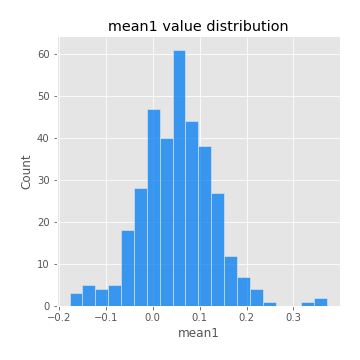
## Feature : mean2
- **Feature type** : continous
- **Missing** : 0.0%
- **Unique** : 347
- **Count** :347.0
- **Mean** :0.07103603242195619
- **Std** :0.08623606409014886
- **Min** :-0.21818165578778434
- **25%th Percentile** : 0.026930367692998565
- **50%th Percentile** : 0.07184066115911249
- **75%th Percentile** : 0.12135497775125212
- **Max** :0.37616608147096464

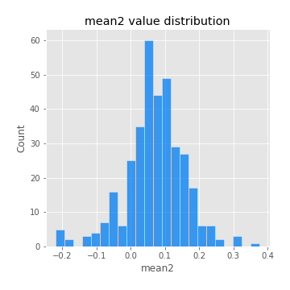
## Feature : sd1
- **Feature type** : continous
- **Missing** : 0.0%
- **Unique** : 347
- **Count** :347.0
- **Mean** :1.8676361170121352
- **Std** :0.6305403921002359
- **Min** :0.7470080772831957
- **25%th Percentile** : 1.6755231874636776
- **50%th Percentile** : 1.805504348229157
- **75%th Percentile** : 1.8938360640598118
- **Max** :6.495661311240861

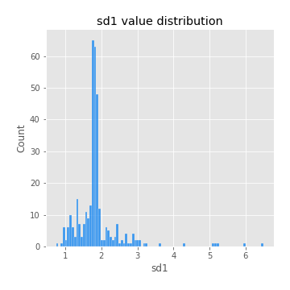
## Feature : sd2
- **Feature type** : continous
- **Missing** : 0.0%
- **Unique** : 347
- **Count** :347.0
- **Mean** :1.7505872831695344
- **Std** :0.5785349333534874
- **Min** :0.8455946193085045
- **25%th Percentile** : 1.5769451067121885
- **50%th Percentile** : 1.6398866296793282
- **75%th Percentile** : 1.7265978424023452
- **Max** :5.042707010333888

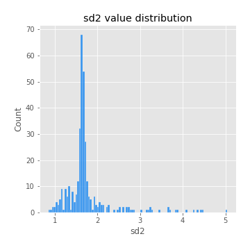
## Feature : skewness1
- **Feature type** : continous
- **Missing** : 0.0%
- **Unique** : 347
- **Count** :347.0
- **Mean** :-0.08323837588519582
- **Std** :0.6063479862361127
- **Min** :-3.530116233761814
- **25%th Percentile** : -0.15248505778207597
- **50%th Percentile** : -0.025160925651465063
- **75%th Percentile** : 0.08835497240947582
- **Max** :2.5845963767725557

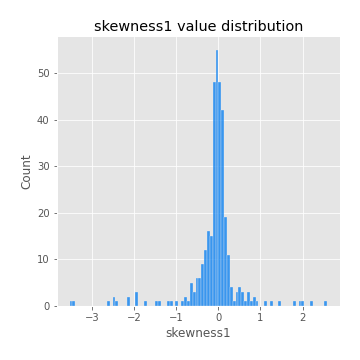
## Feature : skewness2
- **Feature type** : continous
- **Missing** : 0.0%
- **Unique** : 347
- **Count** :347.0
- **Mean** :-0.1546990031793633
- **Std** :0.8112787497125108
- **Min** :-8.801502855292393
- **25%th Percentile** : -0.21153761877069263
- **50%th Percentile** : -0.03202773057833783
- **75%th Percentile** : 0.09609246336951346
- **Max** :2.2606839051517187

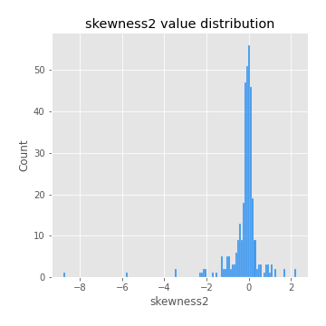
## Feature : kurtosis1
- **Feature type** : continous
- **Missing** : 0.0%
- **Unique** : 347
- **Count** :347.0
- **Mean** :3.1331700316708933
- **Std** :5.985156597109556
- **Min** :-0.44080147616400067
- **25%th Percentile** : -0.0373301266270718
- **50%th Percentile** : 0.4878120727559834
- **75%th Percentile** : 3.6269952348430596
- **Max** :46.07507808162177

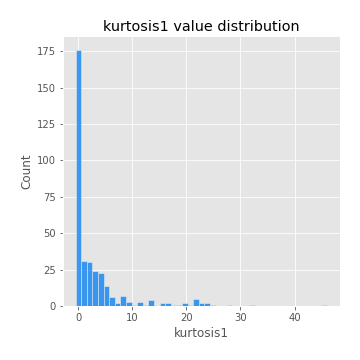
## Feature : kurtosis2
- **Feature type** : continous
- **Missing** : 0.0%
- **Unique** : 347
- **Count** :347.0
- **Mean** :3.696015283455228
- **Std** :10.2814653492543
- **Min** :-0.4264876765526471
- **25%th Percentile** : -0.014783164325854248
- **50%th Percentile** : 0.4230038910006657
- **75%th Percentile** : 3.910854938310223
- **Max** :143.10871011533666

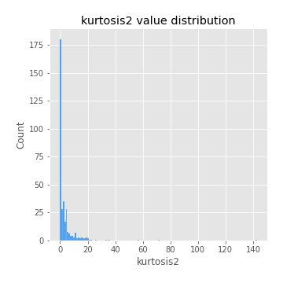
## Feature : return_autocorrelation_1_lag1
- **Feature type** : continous
- **Missing** : 0.0%
- **Unique** : 347
- **Count** :347.0
- **Mean** :-0.011660320666028743
- **Std** :0.057326810905372734
- **Min** :-0.2135576224968752
- **25%th Percentile** : -0.04033742497098729
- **50%th Percentile** : -0.004452624207810848
- **75%th Percentile** : 0.025137062050259798
- **Max** :0.10556057684359459

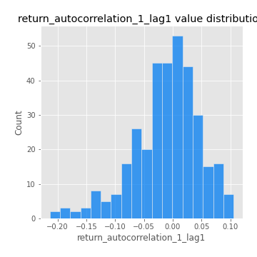
## Feature : return_autocorrelation_1_lag2
- **Feature type** : continous
- **Missing** : 0.0%
- **Unique** : 347
- **Count** :347.0
- **Mean** :-0.005345790557531438
- **Std** :0.05014786069405881
- **Min** :-0.12172858720259
- **25%th Percentile** : -0.03758480969436911
- **50%th Percentile** : -0.003600229066753549
- **75%th Percentile** : 0.02841656057114367
- **Max** :0.1561488228015672

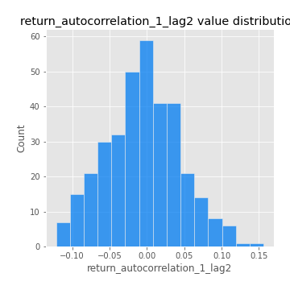
## Feature : return_autocorrelation_1_lag3
- **Feature type** : continous
- **Missing** : 0.0%
- **Unique** : 347
- **Count** :347.0
- **Mean** :-0.003281256429987487
- **Std** :0.046517311040527
- **Min** :-0.15806635192103805
- **25%th Percentile** : -0.03154434187949909
- **50%th Percentile** : -0.001342510234996689
- **75%th Percentile** : 0.02933476911183846
- **Max** :0.12487206866597295

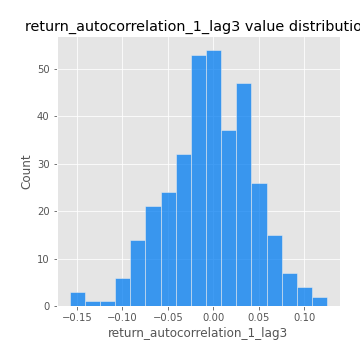
## Feature : return_autocorrelation_2_lag1
- **Feature type** : continous
- **Missing** : 0.0%
- **Unique** : 347
- **Count** :347.0
- **Mean** :-0.005365058966593419
- **Std** :0.059439962895049665
- **Min** :-0.25075531010123286
- **25%th Percentile** : -0.037725663752592384
- **50%th Percentile** : -0.004580481152468063
- **75%th Percentile** : 0.03290806841336308
- **Max** :0.31863413537898483

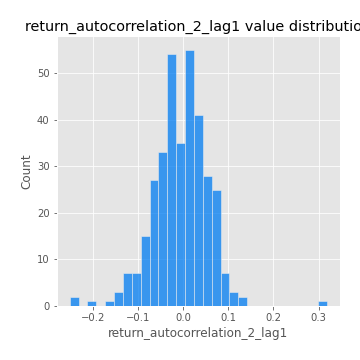
## Feature : return_autocorrelation_2_lag2
- **Feature type** : continous
- **Missing** : 0.0%
- **Unique** : 347
- **Count** :347.0
- **Mean** :-0.0007832072253673243
- **Std** :0.05047582371742887
- **Min** :-0.1495113937562178
- **25%th Percentile** : -0.03395971903746155
- **50%th Percentile** : -0.002877985698907284
- **75%th Percentile** : 0.0324178867173998
- **Max** :0.20974504043791217

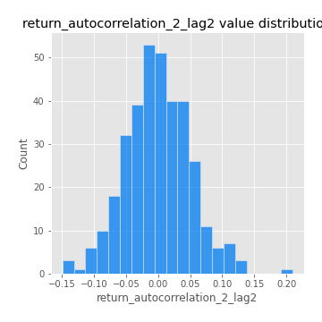
## Feature : return_autocorrelation_2_lag3
- **Feature type** : continous
- **Missing** : 0.0%
- **Unique** : 347
- **Count** :347.0
- **Mean** :0.0006462881942989062
- **Std** :0.049286027515910734
- **Min** :-0.14200107169559698
- **25%th Percentile** : -0.0305576542352181
- **50%th Percentile** : 0.0013383833880703017
- **75%th Percentile** : 0.03493644548032722
- **Max** :0.1419999376914021

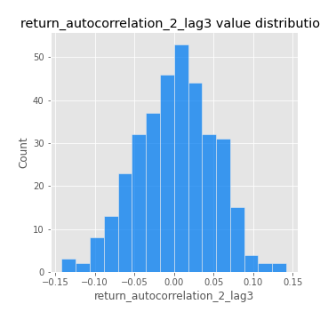
## Feature : return_correlation_ts1_lag_0
- **Feature type** : continous
- **Missing** : 0.0%
- **Unique** : 347
- **Count** :347.0
- **Mean** :0.3206760623635336
- **Std** :0.10928931014246285
- **Min** :0.005136598099876001
- **25%th Percentile** : 0.2661992456092357
- **50%th Percentile** : 0.31385646376774967
- **75%th Percentile** : 0.3584457686602741
- **Max** :0.7028422087350163

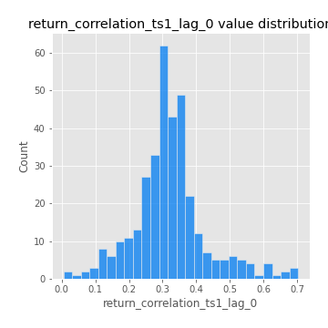
## Feature : return_correlation_ts1_lag_1
- **Feature type** : continous
- **Missing** : 0.0%
- **Unique** : 347
- **Count** :347.0
- **Mean** :-0.007164419192914259
- **Std** :0.052784289343047526
- **Min** :-0.16985510949917193
- **25%th Percentile** : -0.04034756437951903
- **50%th Percentile** : -0.0035739274741425505
- **75%th Percentile** : 0.029116479272398493
- **Max** :0.12458136445787829

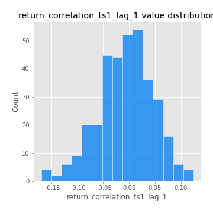
## Feature : return_correlation_ts1_lag_2
- **Feature type** : continous
- **Missing** : 0.0%
- **Unique** : 347
- **Count** :347.0
- **Mean** :0.0005971145586650254
- **Std** :0.0487667175992273
- **Min** :-0.21653581047581763
- **25%th Percentile** : -0.0328807842679725
- **50%th Percentile** : -0.0009681797294642787
- **75%th Percentile** : 0.03773963612999533
- **Max** :0.12404233908893231

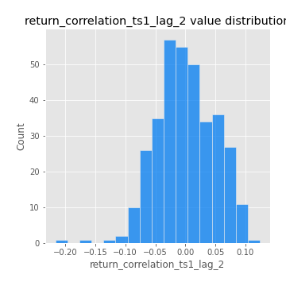
## Feature : return_correlation_ts1_lag_3
- **Feature type** : continous
- **Missing** : 0.0%
- **Unique** : 347
- **Count** :347.0
- **Mean** :0.001635871893435811
- **Std** :0.048597370623806715
- **Min** :-0.1270218498974763
- **25%th Percentile** : -0.029953413194295196
- **50%th Percentile** : 0.005212926349726644
- **75%th Percentile** : 0.03274805664805513
- **Max** :0.1422809271770942

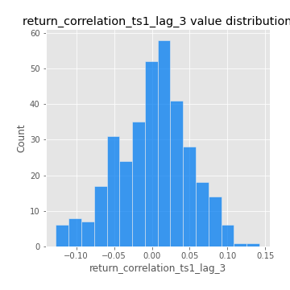
## Feature : return_correlation_ts2_lag_1
- **Feature type** : continous
- **Missing** : 0.0%
- **Unique** : 347
- **Count** :347.0
- **Mean** :-0.0015892343653875025
- **Std** :0.051036119199608425
- **Min** :-0.2081139431093261
- **25%th Percentile** : -0.03390449544313271
- **50%th Percentile** : -0.0035559175368680964
- **75%th Percentile** : 0.029702022962781086
- **Max** :0.17208763791364762

## Feature : return_correlation_ts2_lag_2
- **Feature type** : continous
- **Missing** : 0.0%
- **Unique** : 347
- **Count** :347.0
- **Mean** :0.0022661121380288048
- **Std** :0.05249126776825043
- **Min** :-0.23751835475804678
- **25%th Percentile** : -0.03155338092667228
- **50%th Percentile** : -0.00016553792162788547
- **75%th Percentile** : 0.03789326647357938
- **Max** :0.20772887392904255

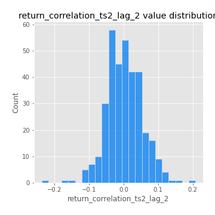
## Feature : return_correlation_ts2_lag_3
- **Feature type** : continous
- **Missing** : 0.0%
- **Unique** : 347
- **Count** :347.0
- **Mean** :-0.0014727152543743645
- **Std** :0.05037115979082107
- **Min** :-0.17564076057312866
- **25%th Percentile** : -0.03026320910547463
- **50%th Percentile** : -0.003758338955498523
- **75%th Percentile** : 0.03231311857297015
- **Max** :0.13128380114518473

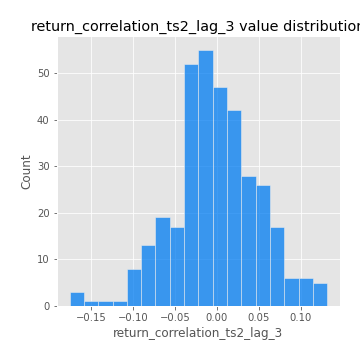
## Feature : sqreturn_autocorrelation_ts1_lag1
- **Feature type** : continous
- **Missing** : 0.0%
- **Unique** : 347
- **Count** :347.0
- **Mean** :0.04401509573560264
- **Std** :0.0868494878200017
- **Min** :-0.11102397284366698
- **25%th Percentile** : -0.01187124475786077
- **50%th Percentile** : 0.023933711305340343
- **75%th Percentile** : 0.08027513866456878
- **Max** :0.4439086285737898

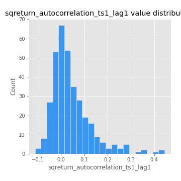
## Feature : sqreturn_autocorrelation_ts1_lag2
- **Feature type** : continous
- **Missing** : 0.0%
- **Unique** : 347
- **Count** :347.0
- **Mean** :0.03797730478246394
- **Std** :0.08893274177739258
- **Min** :-0.1117045288780293
- **25%th Percentile** : -0.01517452046915917
- **50%th Percentile** : 0.012328520959644686
- **75%th Percentile** : 0.06287505926873135
- **Max** :0.540735851444759

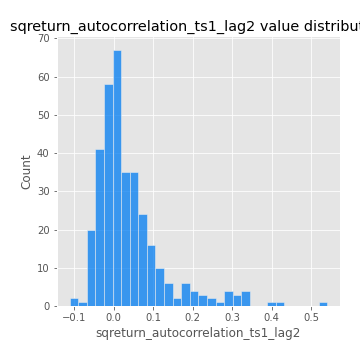
## Feature : sqreturn_autocorrelation_ts1_lag3
- **Feature type** : continous
- **Missing** : 0.0%
- **Unique** : 347
- **Count** :347.0
- **Mean** :0.032252629213918894
- **Std** :0.07578439687595127
- **Min** :-0.11277315938089061
- **25%th Percentile** : -0.012928310361249674
- **50%th Percentile** : 0.012714942481885533
- **75%th Percentile** : 0.05404309598059742
- **Max** :0.3457940197475473

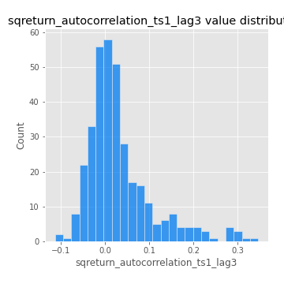
## Feature : sqreturn_autocorrelation_ts2_lag1
- **Feature type** : continous
- **Missing** : 0.0%
- **Unique** : 347
- **Count** :347.0
- **Mean** :0.04807725224462824
- **Std** :0.08376894472459727
- **Min** :-0.09626620152660544
- **25%th Percentile** : -0.009284455451925126
- **50%th Percentile** : 0.028799284522873014
- **75%th Percentile** : 0.0742046900877477
- **Max** :0.3965571120415088

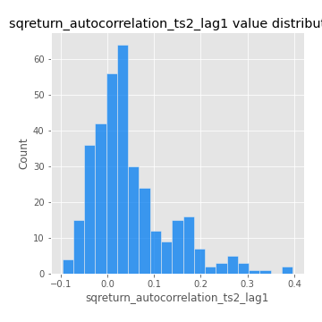
## Feature : sqreturn_autocorrelation_ts2_lag2
- **Feature type** : continous
- **Missing** : 0.0%
- **Unique** : 347
- **Count** :347.0
- **Mean** :0.04067063403631644
- **Std** :0.08800115347435952
- **Min** :-0.09049376274255927
- **25%th Percentile** : -0.010763802267495959
- **50%th Percentile** : 0.014510637338784608
- **75%th Percentile** : 0.07139210707459295
- **Max** :0.5373432415582473

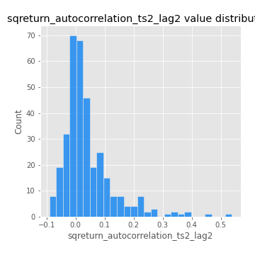
## Feature : sqreturn_autocorrelation_ts2_lag3
- **Feature type** : continous
- **Missing** : 0.0%
- **Unique** : 347
- **Count** :347.0
- **Mean** :0.030941649852381178
- **Std** :0.07153462337042103
- **Min** :-0.12007188739846258
- **25%th Percentile** : -0.01320526871968376
- **50%th Percentile** : 0.015722053432433037
- **75%th Percentile** : 0.059169984401776315
- **Max** :0.31225727797735664

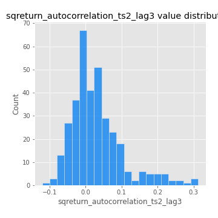
## Feature : sqreturn_correlation_ts1_lag_0
- **Feature type** : continous
- **Missing** : 0.0%
- **Unique** : 347
- **Count** :347.0
- **Mean** :0.3206760623635336
- **Std** :0.10928931014246285
- **Min** :0.005136598099876001
- **25%th Percentile** : 0.2661992456092357
- **50%th Percentile** : 0.31385646376774967
- **75%th Percentile** : 0.3584457686602741
- **Max** :0.7028422087350163

## Feature : sqreturn_correlation_ts1_lag_1
- **Feature type** : continous
- **Missing** : 0.0%
- **Unique** : 347
- **Count** :347.0
- **Mean** :-0.007164419192914259
- **Std** :0.052784289343047526
- **Min** :-0.16985510949917193
- **25%th Percentile** : -0.04034756437951903
- **50%th Percentile** : -0.0035739274741425505
- **75%th Percentile** : 0.029116479272398493
- **Max** :0.12458136445787829

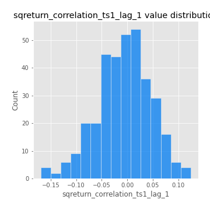
## Feature : sqreturn_correlation_ts1_lag_2
- **Feature type** : continous
- **Missing** : 0.0%
- **Unique** : 347
- **Count** :347.0
- **Mean** :0.0005971145586650254
- **Std** :0.0487667175992273
- **Min** :-0.21653581047581763
- **25%th Percentile** : -0.0328807842679725
- **50%th Percentile** : -0.0009681797294642787
- **75%th Percentile** : 0.03773963612999533
- **Max** :0.12404233908893231

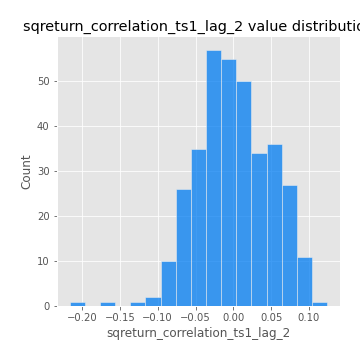
## Feature : sqreturn_correlation_ts1_lag_3
- **Feature type** : continous
- **Missing** : 0.0%
- **Unique** : 347
- **Count** :347.0
- **Mean** :0.001635871893435811
- **Std** :0.048597370623806715
- **Min** :-0.1270218498974763
- **25%th Percentile** : -0.029953413194295196
- **50%th Percentile** : 0.005212926349726644
- **75%th Percentile** : 0.03274805664805513
- **Max** :0.1422809271770942

## Feature : sqreturn_correlation_ts2_lag_1
- **Feature type** : continous
- **Missing** : 0.0%
- **Unique** : 347
- **Count** :347.0
- **Mean** :-0.0015892343653875025
- **Std** :0.051036119199608425
- **Min** :-0.2081139431093261
- **25%th Percentile** : -0.03390449544313271
- **50%th Percentile** : -0.0035559175368680964
- **75%th Percentile** : 0.029702022962781086
- **Max** :0.17208763791364762

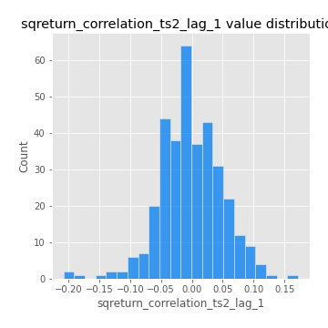
## Feature : sqreturn_correlation_ts2_lag_2
- **Feature type** : continous
- **Missing** : 0.0%
- **Unique** : 347
- **Count** :347.0
- **Mean** :0.0022661121380288048
- **Std** :0.05249126776825043
- **Min** :-0.23751835475804678
- **25%th Percentile** : -0.03155338092667228
- **50%th Percentile** : -0.00016553792162788547
- **75%th Percentile** : 0.03789326647357938
- **Max** :0.20772887392904255

## Feature : sqreturn_correlation_ts2_lag_3
- **Feature type** : continous
- **Missing** : 0.0%
- **Unique** : 347
- **Count** :347.0
- **Mean** :-0.0014727152543743645
- **Std** :0.05037115979082107
- **Min** :-0.17564076057312866
- **25%th Percentile** : -0.03026320910547463
- **50%th Percentile** : -0.003758338955498523
- **75%th Percentile** : 0.03231311857297015
- **Max** :0.13128380114518473

## Feature : price2_granger_cause_price1
- **Feature type** : continous
- **Missing** : 0.0%
- **Unique** : 347
- **Count** :347.0
- **Mean** :0.2886972346638295
- **Std** :0.2923890116345235
- **Min** :4.238494961143106e-09
- **25%th Percentile** : 0.026476323402624687
- **50%th Percentile** : 0.18090406948616836
- **75%th Percentile** : 0.5169576024150823
- **Max** :0.9963734884774231

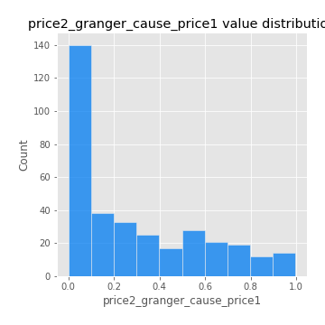
## Feature : price1_granger_cause_price2
- **Feature type** : continous
- **Missing** : 0.0%
- **Unique** : 347
- **Count** :347.0
- **Mean** :0.29534654205037386
- **Std** :0.28042233804996664
- **Min** :1.062713855756749e-06
- **25%th Percentile** : 0.04081877149046513
- **50%th Percentile** : 0.2204277899151977
- **75%th Percentile** : 0.4792548917760698
- **Max** :0.9951398266867577

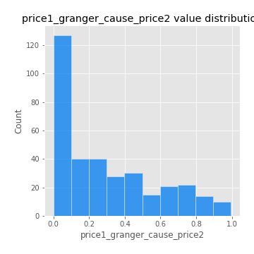

[<< Go back](../README.md)
