# Summary of 3_Linear

[<< Go back](../README.md)

## Logistic Regression (Linear)
- **n_jobs**: -1
- **explain_level**: 2

## Validation
 - **validation_type**: split
 - **train_ratio**: 0.75
 - **shuffle**: True
 - **stratify**: True

## Optimized metric
accuracy

## Training time

17.3 seconds

## Metric details
|           |    score |   threshold |
|:----------|---------:|------------:|
| logloss   | 0.206529 | nan         |
| auc       | 1        | nan         |
| f1        | 1        |   0.788921  |
| accuracy  | 1        |   0.788921  |
| precision | 1        |   0.788921  |
| recall    | 1        |   2.601e-13 |
| mcc       | 1        |   0.788921  |

## Confusion matrix (at threshold=0.788921)
|                      |   Predicted as real |   Predicted as simulated |
|:---------------------|--------------------:|-------------------------:|
| Labeled as real      |                  43 |                        0 |
| Labeled as simulated |                   0 |                       44 |

## Learning curves
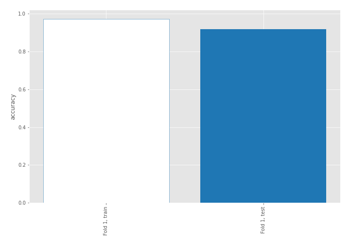

## Coefficients
| feature                           |   Learner_1 |
|:----------------------------------|------------:|
| sd1                               |   0.546356  |
| skewness2                         |   0.491666  |
| return_autocorrelation_2_lag2     |   0.457396  |
| return_correlation_ts2_lag_1      |   0.335878  |
| sqreturn_correlation_ts2_lag_1    |   0.335878  |
| return_autocorrelation_2_lag1     |   0.316611  |
| return_autocorrelation_2_lag3     |   0.311526  |
| sqreturn_correlation_ts1_lag_2    |   0.297465  |
| return_correlation_ts1_lag_2      |   0.297465  |
| return_autocorrelation_1_lag2     |   0.263476  |
| return_correlation_ts1_lag_1      |   0.244789  |
| sqreturn_correlation_ts1_lag_1    |   0.244789  |
| sqreturn_correlation_ts1_lag_3    |   0.241186  |
| return_correlation_ts1_lag_3      |   0.241186  |
| return_autocorrelation_1_lag3     |   0.197279  |
| mean2                             |   0.195502  |
| sqreturn_correlation_ts2_lag_2    |   0.192892  |
| return_correlation_ts2_lag_2      |   0.192892  |
| sqreturn_correlation_ts2_lag_3    |   0.145426  |
| return_correlation_ts2_lag_3      |   0.145426  |
| skewness1                         |   0.0853271 |
| return_autocorrelation_1_lag1     |   0.0725741 |
| mean1                             |  -0.175222  |
| sqreturn_correlation_ts1_lag_0    |  -0.320268  |
| return_correlation_ts1_lag_0      |  -0.320268  |
| price1_granger_cause_price2       |  -0.327799  |
| sd2                               |  -0.547736  |
| sqreturn_autocorrelation_ts2_lag3 |  -0.770434  |
| price2_granger_cause_price1       |  -0.772453  |
| sqreturn_autocorrelation_ts2_lag2 |  -0.832715  |
| sqreturn_autocorrelation_ts1_lag3 |  -0.868288  |
| intercept                         |  -1.07399   |
| sqreturn_autocorrelation_ts1_lag2 |  -1.12981   |
| sqreturn_autocorrelation_ts1_lag1 |  -1.22313   |
| sqreturn_autocorrelation_ts2_lag1 |  -1.26455   |
| kurtosis2                         |  -3.55299   |
| kurtosis1                         |  -4.39711   |

## Permutation-based Importance
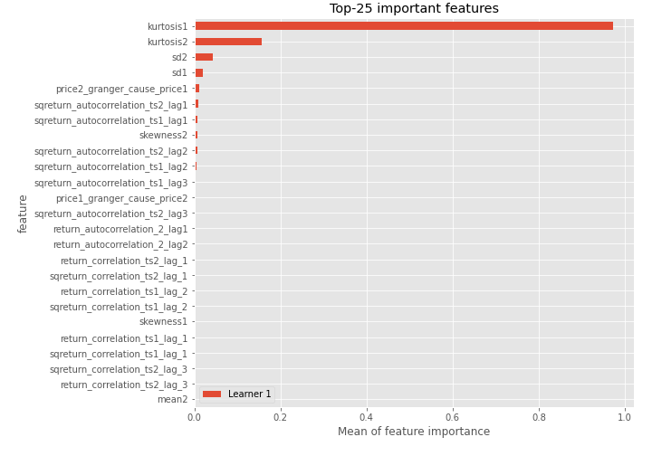
## Confusion Matrix

## Normalized Confusion Matrix

## ROC Curve

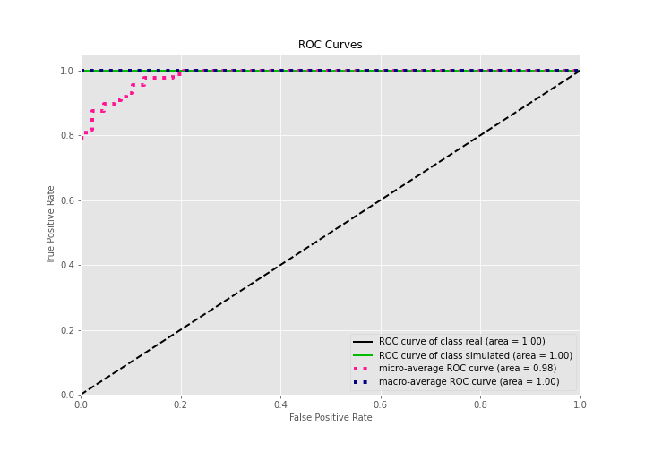

## Kolmogorov-Smirnov Statistic

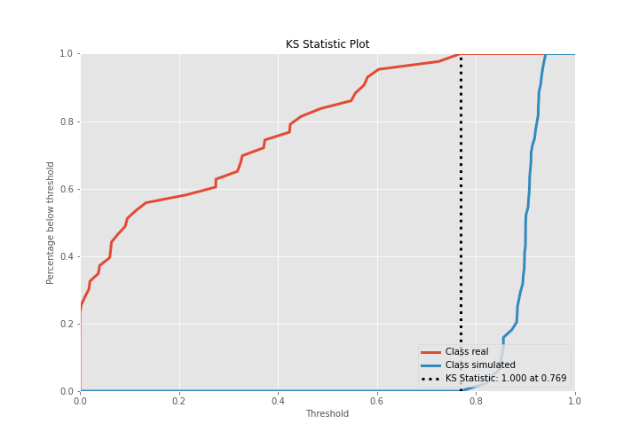

## Precision-Recall Curve

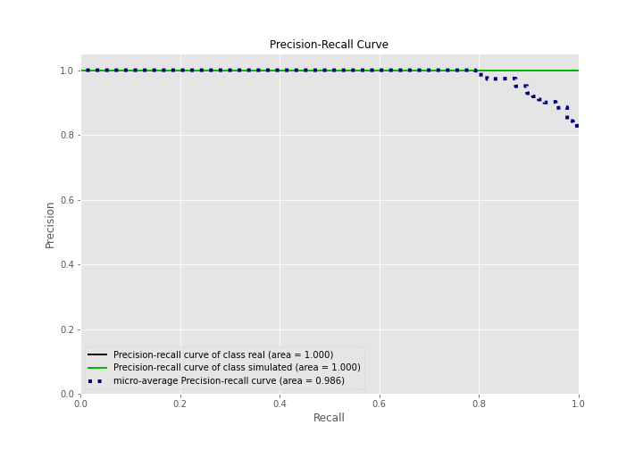

## Calibration Curve

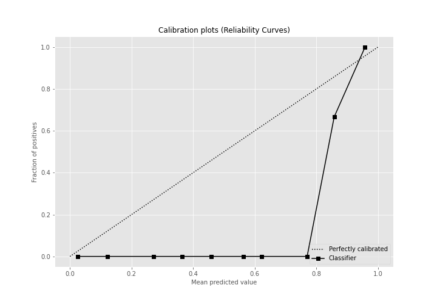

## Cumulative Gains Curve

## Lift Curve

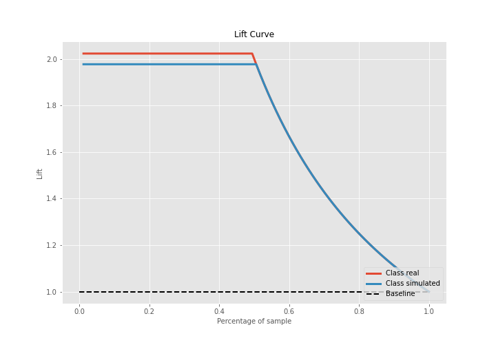

## SHAP Importance
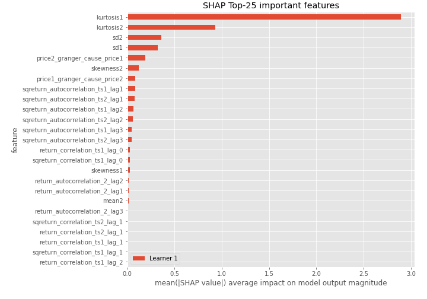

## SHAP Dependence plots

### Dependence (Fold 1)
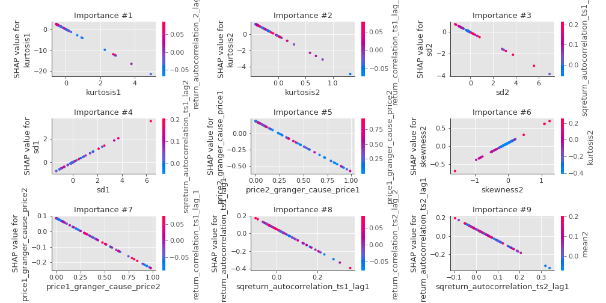

## SHAP Decision plots

### Top-10 Worst decisions for class 0 (Fold 1)
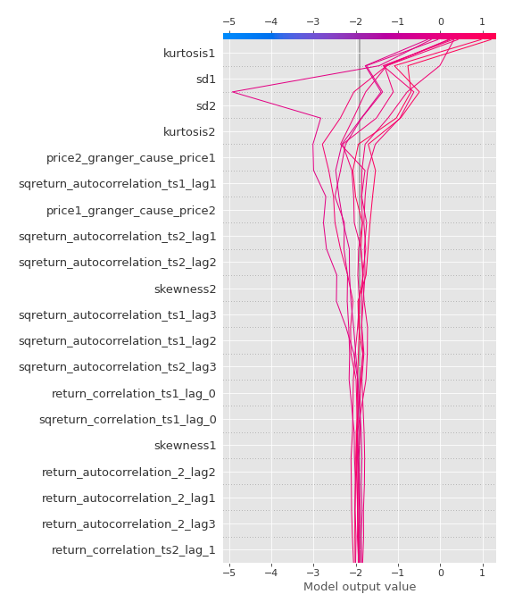
### Top-10 Best decisions for class 0 (Fold 1)
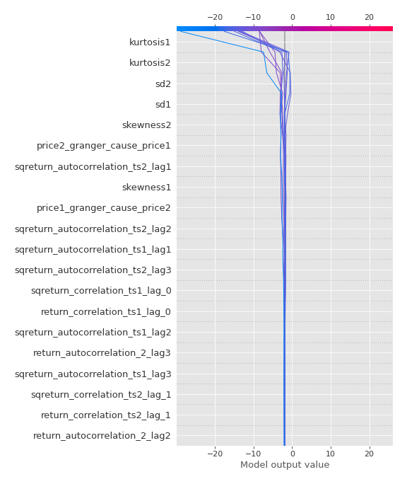
### Top-10 Worst decisions for class 1 (Fold 1)
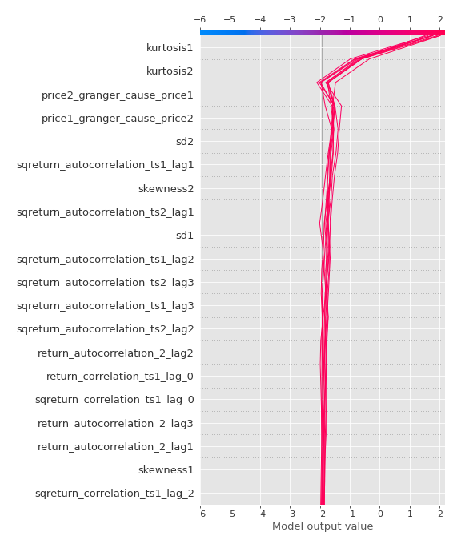
### Top-10 Best decisions for class 1 (Fold 1)
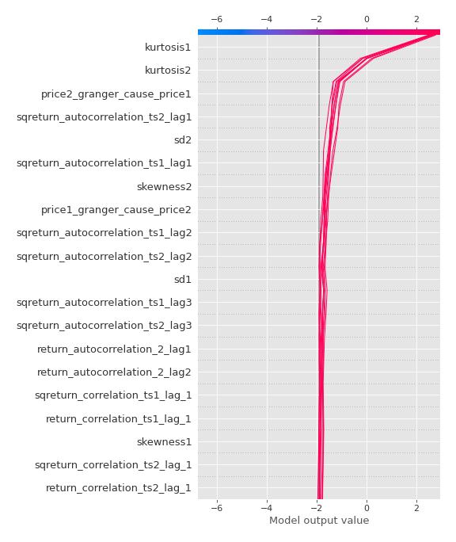

[<< Go back](../README.md)
