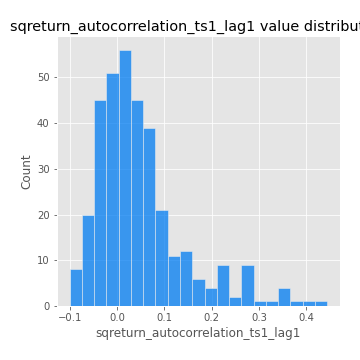

# Exploratory Data Analysis

[<< Go back](../README.md)
## Feature : target
- **Feature type** : categorical
- **Missing** : 0.0%
- **Unique** : 2
- **Count** :347
- **Unique** :2
- **Top** :simulated
- **Freq** :177

## Feature : mean1
- **Feature type** : continous
- **Missing** : 0.0%
- **Unique** : 347
- **Count** :347.0
- **Mean** :0.05338079357409427
- **Std** :0.07978117720225751
- **Min** :-0.22632637961920957
- **25%th Percentile** : 0.009669123077223674
- **50%th Percentile** : 0.0569880516617246
- **75%th Percentile** : 0.09875691384364572
- **Max** :0.37175100008111034

## Feature : mean2
- **Feature type** : continous
- **Missing** : 0.0%
- **Unique** : 347
- **Count** :347.0
- **Mean** :0.07512570951962463
- **Std** :0.09061997655518518
- **Min** :-0.24205418062825398
- **25%th Percentile** : 0.02830935746661195
- **50%th Percentile** : 0.0734064753321931
- **75%th Percentile** : 0.12380728199090647
- **Max** :0.45728711466568145

## Feature : sd1
- **Feature type** : continous
- **Missing** : 0.0%
- **Unique** : 347
- **Count** :347.0
- **Mean** :1.8888339498039395
- **Std** :0.7537046505230517
- **Min** :0.7470080772831957
- **25%th Percentile** : 1.692445798678224
- **50%th Percentile** : 1.811503293376971
- **75%th Percentile** : 1.892029719193687
- **Max** :9.236766377527575

## Feature : sd2
- **Feature type** : continous
- **Missing** : 0.0%
- **Unique** : 347
- **Count** :347.0
- **Mean** :1.8077676264531517
- **Std** :0.7693501157419208
- **Min** :0.8455946193085045
- **25%th Percentile** : 1.5622941826350005
- **50%th Percentile** : 1.6523908137809578
- **75%th Percentile** : 1.7362388388148877
- **Max** :6.737618636746393

## Feature : skewness1
- **Feature type** : continous
- **Missing** : 0.0%
- **Unique** : 347
- **Count** :347.0
- **Mean** :-0.11986933591574085
- **Std** :0.6010260680864724
- **Min** :-3.530116233761814
- **25%th Percentile** : -0.18869212852426775
- **50%th Percentile** : -0.03113407179717138
- **75%th Percentile** : 0.06490804336873465
- **Max** :2.5845963767725557

## Feature : skewness2
- **Feature type** : continous
- **Missing** : 0.0%
- **Unique** : 347
- **Count** :347.0
- **Mean** :-0.1887360639832965
- **Std** :0.8056428012197608
- **Min** :-8.801502855292393
- **25%th Percentile** : -0.2461753916191839
- **50%th Percentile** : -0.050942046919702666
- **75%th Percentile** : 0.07612605429982106
- **Max** :1.9492855042693131

## Feature : kurtosis1
- **Feature type** : continous
- **Missing** : 0.0%
- **Unique** : 347
- **Count** :347.0
- **Mean** :3.286497169165578
- **Std** :6.575102612281195
- **Min** :-0.41881689150985135
- **25%th Percentile** : -0.045152675576369594
- **50%th Percentile** : 0.4491335611227698
- **75%th Percentile** : 3.493977699762969
- **Max** :46.07507808162177

## Feature : kurtosis2
- **Feature type** : continous
- **Missing** : 0.0%
- **Unique** : 347
- **Count** :347.0
- **Mean** :3.907579428190944
- **Std** :10.479907190722434
- **Min** :-0.40268271347650497
- **25%th Percentile** : -0.04163857784834879
- **50%th Percentile** : 0.44646299498786
- **75%th Percentile** : 4.254571123998912
- **Max** :143.10871011533666

## Feature : return_autocorrelation_1_lag1
- **Feature type** : continous
- **Missing** : 0.0%
- **Unique** : 347
- **Count** :347.0
- **Mean** :-0.008728393871562934
- **Std** :0.055358924911698984
- **Min** :-0.2135576224968752
- **25%th Percentile** : -0.03837386927936938
- **50%th Percentile** : -0.002408523395769901
- **75%th Percentile** : 0.025536282252998754
- **Max** :0.12810656890648087

## Feature : return_autocorrelation_1_lag2
- **Feature type** : continous
- **Missing** : 0.0%
- **Unique** : 347
- **Count** :347.0
- **Mean** :-0.003159069056737279
- **Std** :0.048661880694782875
- **Min** :-0.13309283796645122
- **25%th Percentile** : -0.03589930318154413
- **50%th Percentile** : -0.0017027045477439788
- **75%th Percentile** : 0.02663529733984976
- **Max** :0.1561488228015672

## Feature : return_autocorrelation_1_lag3
- **Feature type** : continous
- **Missing** : 0.0%
- **Unique** : 347
- **Count** :347.0
- **Mean** :-0.0022410818100510117
- **Std** :0.05165442068057175
- **Min** :-0.1940836867390813
- **25%th Percentile** : -0.03438604403720664
- **50%th Percentile** : -0.0005637401913804838
- **75%th Percentile** : 0.03049501008335303
- **Max** :0.17805869530681923

## Feature : return_autocorrelation_2_lag1
- **Feature type** : continous
- **Missing** : 0.0%
- **Unique** : 347
- **Count** :347.0
- **Mean** :-0.007031215227031963
- **Std** :0.059436066564785145
- **Min** :-0.24590087874039124
- **25%th Percentile** : -0.036850615155007926
- **50%th Percentile** : -0.0025649549898627377
- **75%th Percentile** : 0.0294374234528955
- **Max** :0.31863413537898483

## Feature : return_autocorrelation_2_lag2
- **Feature type** : continous
- **Missing** : 0.0%
- **Unique** : 347
- **Count** :347.0
- **Mean** :0.0031992916004088597
- **Std** :0.054864171071641155
- **Min** :-0.15323211089747296
- **25%th Percentile** : -0.03285404127998094
- **50%th Percentile** : -0.0027966151135674602
- **75%th Percentile** : 0.03609394926900171
- **Max** :0.20974504043791217

## Feature : return_autocorrelation_2_lag3
- **Feature type** : continous
- **Missing** : 0.0%
- **Unique** : 347
- **Count** :347.0
- **Mean** :-0.0030627602121843446
- **Std** :0.04807209822610486
- **Min** :-0.1344316177078651
- **25%th Percentile** : -0.035657328507901626
- **50%th Percentile** : -0.0030402901158027964
- **75%th Percentile** : 0.028879562485940077
- **Max** :0.14263085268750858

## Feature : return_correlation_ts1_lag_0
- **Feature type** : continous
- **Missing** : 0.0%
- **Unique** : 347
- **Count** :347.0
- **Mean** :0.3146175472726634
- **Std** :0.10932846595008763
- **Min** :-0.027089510445801036
- **25%th Percentile** : 0.26701931458584316
- **50%th Percentile** : 0.3092787680960147
- **75%th Percentile** : 0.35594117634179423
- **Max** :0.7041861626832071

## Feature : return_correlation_ts1_lag_1
- **Feature type** : continous
- **Missing** : 0.0%
- **Unique** : 347
- **Count** :347.0
- **Mean** :-0.004818839744224215
- **Std** :0.05262184542028054
- **Min** :-0.16985510949917193
- **25%th Percentile** : -0.03864943227370138
- **50%th Percentile** : -0.0008503638884417273
- **75%th Percentile** : 0.033301947395541695
- **Max** :0.15499424718508623

## Feature : return_correlation_ts1_lag_2
- **Feature type** : continous
- **Missing** : 0.0%
- **Unique** : 347
- **Count** :347.0
- **Mean** :0.0023863955507198048
- **Std** :0.04737884788599358
- **Min** :-0.21653581047581763
- **25%th Percentile** : -0.028144532737169898
- **50%th Percentile** : 0.003560418057912727
- **75%th Percentile** : 0.03511248430020914
- **Max** :0.1435124509217932

## Feature : return_correlation_ts1_lag_3
- **Feature type** : continous
- **Missing** : 0.0%
- **Unique** : 347
- **Count** :347.0
- **Mean** :0.0009621493610575081
- **Std** :0.05074822543637081
- **Min** :-0.1388335968190574
- **25%th Percentile** : -0.032788871618090146
- **50%th Percentile** : 0.0008307061797940517
- **75%th Percentile** : 0.039992581156637064
- **Max** :0.1636773216468148

## Feature : return_correlation_ts2_lag_1
- **Feature type** : continous
- **Missing** : 0.0%
- **Unique** : 347
- **Count** :347.0
- **Mean** :-0.004931127805835242
- **Std** :0.05242372282697673
- **Min** :-0.2081139431093261
- **25%th Percentile** : -0.03471744466792329
- **50%th Percentile** : -0.004404520286697243
- **75%th Percentile** : 0.027131374365800855
- **Max** :0.17208763791364762

## Feature : return_correlation_ts2_lag_2
- **Feature type** : continous
- **Missing** : 0.0%
- **Unique** : 347
- **Count** :347.0
- **Mean** :0.0028290098616908952
- **Std** :0.04731361475310066
- **Min** :-0.15299951737180204
- **25%th Percentile** : -0.030873220942053036
- **50%th Percentile** : 0.0031353414704733433
- **75%th Percentile** : 0.029977549214808746
- **Max** :0.20772887392904255

## Feature : return_correlation_ts2_lag_3
- **Feature type** : continous
- **Missing** : 0.0%
- **Unique** : 347
- **Count** :347.0
- **Mean** :-0.0026350150115935804
- **Std** :0.054821554147795284
- **Min** :-0.17564076057312866
- **25%th Percentile** : -0.036634049705928824
- **50%th Percentile** : -0.004915417980234741
- **75%th Percentile** : 0.03697737612837853
- **Max** :0.15326293894344636

## Feature : sqreturn_autocorrelation_ts1_lag1
- **Feature type** : continous
- **Missing** : 0.0%
- **Unique** : 347
- **Count** :347.0
- **Mean** :0.04783864759943636
- **Std** :0.09367298989830161
- **Min** :-0.10050675836434192
- **25%th Percentile** : -0.013318741540559044
- **50%th Percentile** : 0.02646910530292259
- **75%th Percentile** : 0.07972914354521661
- **Max** :0.4439086285737898

## Feature : sqreturn_autocorrelation_ts1_lag2
- **Feature type** : continous
- **Missing** : 0.0%
- **Unique** : 347
- **Count** :347.0
- **Mean** :0.04705346775834281
- **Std** :0.09400555948240098
- **Min** :-0.10510892755091962
- **25%th Percentile** : -0.010493572828800665
- **50%th Percentile** : 0.027946328415985825
- **75%th Percentile** : 0.07403466231387101
- **Max** :0.540735851444759

## Feature : sqreturn_autocorrelation_ts1_lag3
- **Feature type** : continous
- **Missing** : 0.0%
- **Unique** : 347
- **Count** :347.0
- **Mean** :0.0371937777860142
- **Std** :0.08189397593721856
- **Min** :-0.09182688515055507
- **25%th Percentile** : -0.015416176238520499
- **50%th Percentile** : 0.019447561091645436
- **75%th Percentile** : 0.0650771883585865
- **Max** :0.44755937369538146

## Feature : sqreturn_autocorrelation_ts2_lag1
- **Feature type** : continous
- **Missing** : 0.0%
- **Unique** : 347
- **Count** :347.0
- **Mean** :0.044059295534505945
- **Std** :0.08732860183092586
- **Min** :-0.11536355061442836
- **25%th Percentile** : -0.012562427052851
- **50%th Percentile** : 0.025309572446303982
- **75%th Percentile** : 0.07529640747182689
- **Max** :0.4190090519891419

## Feature : sqreturn_autocorrelation_ts2_lag2
- **Feature type** : continous
- **Missing** : 0.0%
- **Unique** : 347
- **Count** :347.0
- **Mean** :0.033683410108794276
- **Std** :0.08728205648792711
- **Min** :-0.11391779892390129
- **25%th Percentile** : -0.013740291642686874
- **50%th Percentile** : 0.014313888743333801
- **75%th Percentile** : 0.055557428487475774
- **Max** :0.45676817892778204

## Feature : sqreturn_autocorrelation_ts2_lag3
- **Feature type** : continous
- **Missing** : 0.0%
- **Unique** : 347
- **Count** :347.0
- **Mean** :0.02716924282743685
- **Std** :0.06918792182814024
- **Min** :-0.1101741630254659
- **25%th Percentile** : -0.016327641823734022
- **50%th Percentile** : 0.015600659260481023
- **75%th Percentile** : 0.05484364537656327
- **Max** :0.31225727797735664

## Feature : sqreturn_correlation_ts1_lag_0
- **Feature type** : continous
- **Missing** : 0.0%
- **Unique** : 347
- **Count** :347.0
- **Mean** :0.3146175472726634
- **Std** :0.10932846595008763
- **Min** :-0.027089510445801036
- **25%th Percentile** : 0.26701931458584316
- **50%th Percentile** : 0.3092787680960147
- **75%th Percentile** : 0.35594117634179423
- **Max** :0.7041861626832071

## Feature : sqreturn_correlation_ts1_lag_1
- **Feature type** : continous
- **Missing** : 0.0%
- **Unique** : 347
- **Count** :347.0
- **Mean** :-0.004818839744224215
- **Std** :0.05262184542028054
- **Min** :-0.16985510949917193
- **25%th Percentile** : -0.03864943227370138
- **50%th Percentile** : -0.0008503638884417273
- **75%th Percentile** : 0.033301947395541695
- **Max** :0.15499424718508623

## Feature : sqreturn_correlation_ts1_lag_2
- **Feature type** : continous
- **Missing** : 0.0%
- **Unique** : 347
- **Count** :347.0
- **Mean** :0.0023863955507198048
- **Std** :0.04737884788599358
- **Min** :-0.21653581047581763
- **25%th Percentile** : -0.028144532737169898
- **50%th Percentile** : 0.003560418057912727
- **75%th Percentile** : 0.03511248430020914
- **Max** :0.1435124509217932

## Feature : sqreturn_correlation_ts1_lag_3
- **Feature type** : continous
- **Missing** : 0.0%
- **Unique** : 347
- **Count** :347.0
- **Mean** :0.0009621493610575081
- **Std** :0.05074822543637081
- **Min** :-0.1388335968190574
- **25%th Percentile** : -0.032788871618090146
- **50%th Percentile** : 0.0008307061797940517
- **75%th Percentile** : 0.039992581156637064
- **Max** :0.1636773216468148

## Feature : sqreturn_correlation_ts2_lag_1
- **Feature type** : continous
- **Missing** : 0.0%
- **Unique** : 347
- **Count** :347.0
- **Mean** :-0.004931127805835242
- **Std** :0.05242372282697673
- **Min** :-0.2081139431093261
- **25%th Percentile** : -0.03471744466792329
- **50%th Percentile** : -0.004404520286697243
- **75%th Percentile** : 0.027131374365800855
- **Max** :0.17208763791364762

## Feature : sqreturn_correlation_ts2_lag_2
- **Feature type** : continous
- **Missing** : 0.0%
- **Unique** : 347
- **Count** :347.0
- **Mean** :0.0028290098616908952
- **Std** :0.04731361475310066
- **Min** :-0.15299951737180204
- **25%th Percentile** : -0.030873220942053036
- **50%th Percentile** : 0.0031353414704733433
- **75%th Percentile** : 0.029977549214808746
- **Max** :0.20772887392904255

## Feature : sqreturn_correlation_ts2_lag_3
- **Feature type** : continous
- **Missing** : 0.0%
- **Unique** : 347
- **Count** :347.0
- **Mean** :-0.0026350150115935804
- **Std** :0.054821554147795284
- **Min** :-0.17564076057312866
- **25%th Percentile** : -0.036634049705928824
- **50%th Percentile** : -0.004915417980234741
- **75%th Percentile** : 0.03697737612837853
- **Max** :0.15326293894344636

## Feature : price2_granger_cause_price1
- **Feature type** : continous
- **Missing** : 0.0%
- **Unique** : 347
- **Count** :347.0
- **Mean** :0.27544037106270874
- **Std** :0.27980843075272505
- **Min** :7.838739192364625e-06
- **25%th Percentile** : 0.0265148219955087
- **50%th Percentile** : 0.17743565343192882
- **75%th Percentile** : 0.4461809950542513
- **Max** :0.9885712803689185

## Feature : price1_granger_cause_price2
- **Feature type** : continous
- **Missing** : 0.0%
- **Unique** : 347
- **Count** :347.0
- **Mean** :0.3109678633510694
- **Std** :0.2948319415612092
- **Min** :8.812233938530377e-07
- **25%th Percentile** : 0.04249788346155954
- **50%th Percentile** : 0.24048241416760002
- **75%th Percentile** : 0.5489071645482232
- **Max** :0.9997420828609191

[<< Go back](../README.md)
