# Summary of 3_Linear

[<< Go back](../README.md)

## Logistic Regression (Linear)
- **n_jobs**: -1
- **explain_level**: 2

## Validation
 - **validation_type**: split
 - **train_ratio**: 0.75
 - **shuffle**: True
 - **stratify**: True

## Optimized metric
accuracy

## Training time

23.6 seconds

## Metric details
|           |    score |     threshold |
|:----------|---------:|--------------:|
| logloss   | 0.190412 | nan           |
| auc       | 1        | nan           |
| f1        | 0.988764 |   0.734407    |
| accuracy  | 0.988506 |   0.734407    |
| precision | 1        |   0.914053    |
| recall    | 1        |   6.00589e-08 |
| mcc       | 0.977273 |   0.813806    |

## Confusion matrix (at threshold=0.734407)
|                      |   Predicted as real |   Predicted as simulated |
|:---------------------|--------------------:|-------------------------:|
| Labeled as real      |                  42 |                        1 |
| Labeled as simulated |                   0 |                       44 |

## Learning curves
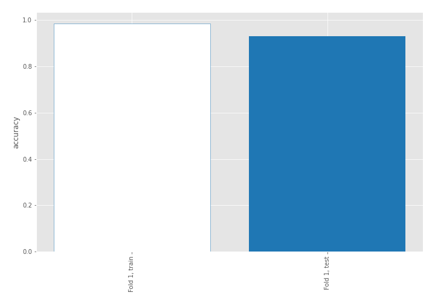

## Coefficients
| feature                           |   Learner_1 |
|:----------------------------------|------------:|
| skewness2                         |   0.894873  |
| return_autocorrelation_1_lag1     |   0.473503  |
| return_autocorrelation_2_lag1     |   0.437118  |
| return_autocorrelation_2_lag3     |   0.417133  |
| return_autocorrelation_2_lag2     |   0.40037   |
| sqreturn_correlation_ts2_lag_1    |   0.37883   |
| return_correlation_ts2_lag_1      |   0.37883   |
| return_correlation_ts1_lag_1      |   0.323247  |
| sqreturn_correlation_ts1_lag_1    |   0.323247  |
| sqreturn_correlation_ts2_lag_3    |   0.298234  |
| return_correlation_ts2_lag_3      |   0.298234  |
| sd1                               |   0.23368   |
| sqreturn_correlation_ts2_lag_2    |   0.215778  |
| return_correlation_ts2_lag_2      |   0.215778  |
| sqreturn_correlation_ts1_lag_3    |   0.202965  |
| return_correlation_ts1_lag_3      |   0.202965  |
| return_autocorrelation_1_lag2     |   0.194487  |
| sqreturn_correlation_ts1_lag_2    |   0.147638  |
| return_correlation_ts1_lag_2      |   0.147638  |
| return_autocorrelation_1_lag3     |   0.144572  |
| skewness1                         |   0.0899375 |
| mean2                             |   0.0806474 |
| mean1                             |   0.0249157 |
| sd2                               |  -0.297473  |
| return_correlation_ts1_lag_0      |  -0.361815  |
| sqreturn_correlation_ts1_lag_0    |  -0.361815  |
| price1_granger_cause_price2       |  -0.539339  |
| price2_granger_cause_price1       |  -0.583073  |
| sqreturn_autocorrelation_ts1_lag3 |  -0.633361  |
| sqreturn_autocorrelation_ts2_lag3 |  -0.784352  |
| intercept                         |  -0.876035  |
| sqreturn_autocorrelation_ts2_lag2 |  -0.908623  |
| sqreturn_autocorrelation_ts2_lag1 |  -0.931044  |
| sqreturn_autocorrelation_ts1_lag1 |  -0.990251  |
| sqreturn_autocorrelation_ts1_lag2 |  -1.13723   |
| kurtosis2                         |  -3.28691   |
| kurtosis1                         |  -4.24992   |

## Permutation-based Importance
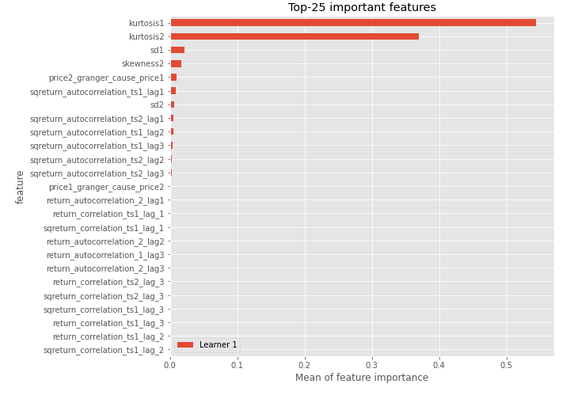
## Confusion Matrix

## Normalized Confusion Matrix

## ROC Curve

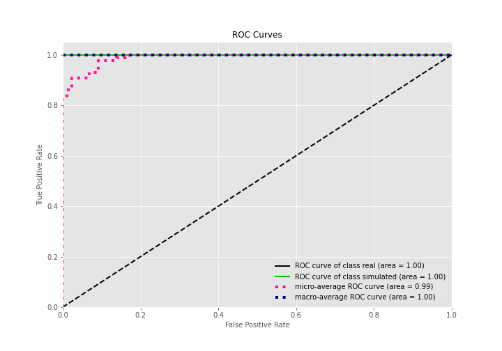

## Kolmogorov-Smirnov Statistic

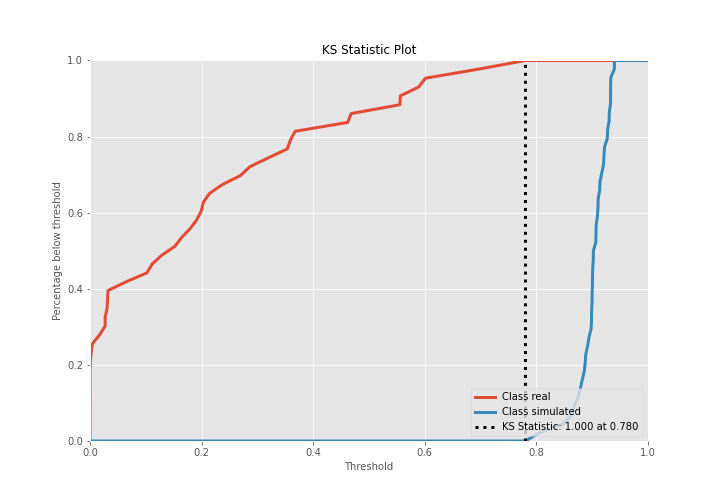

## Precision-Recall Curve

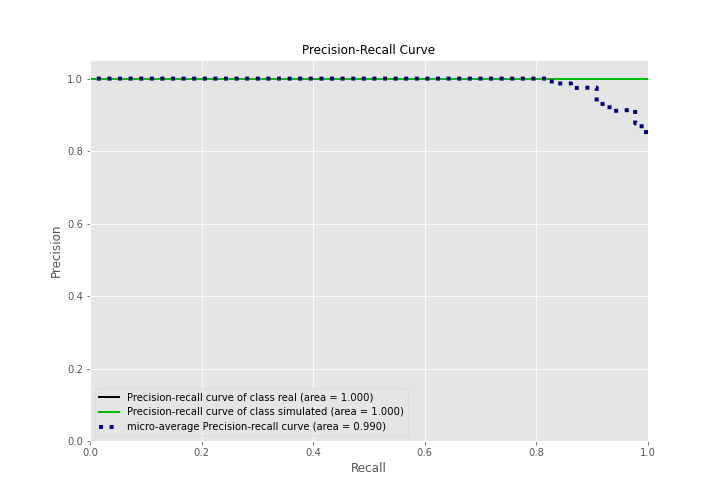

## Calibration Curve

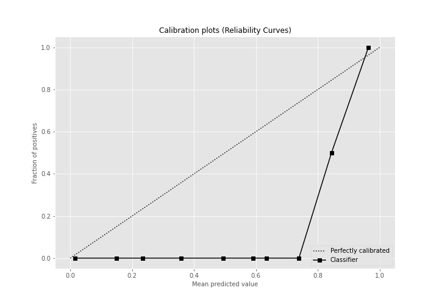

## Cumulative Gains Curve

## Lift Curve

## SHAP Importance
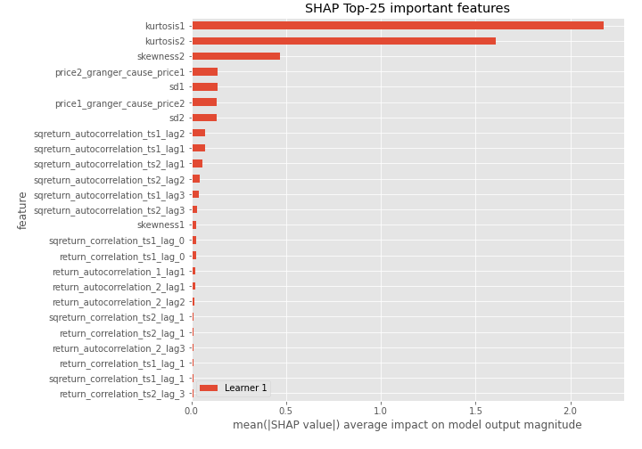

## SHAP Dependence plots

### Dependence (Fold 1)
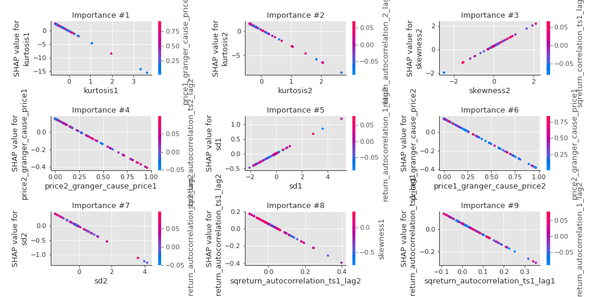

## SHAP Decision plots

### Top-10 Worst decisions for class 0 (Fold 1)
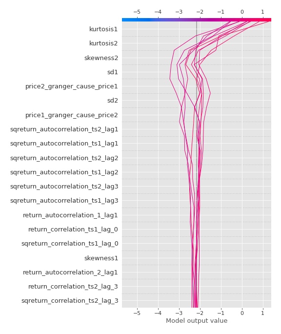
### Top-10 Best decisions for class 0 (Fold 1)
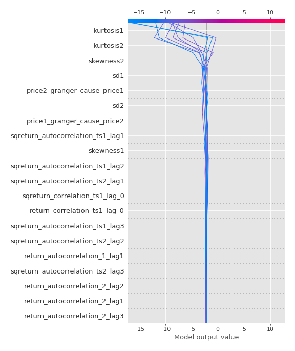
### Top-10 Worst decisions for class 1 (Fold 1)
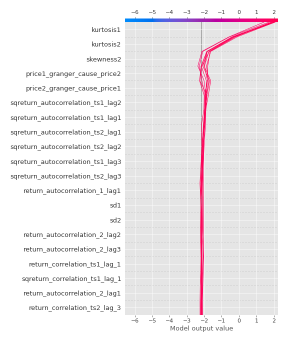
### Top-10 Best decisions for class 1 (Fold 1)
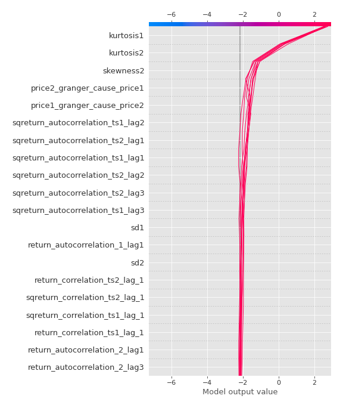

[<< Go back](../README.md)
