# Exploratory Data Analysis

[<< Go back](../README.md)
## Feature : target
- **Feature type** : categorical
- **Missing** : 0.0%
- **Unique** : 2
- **Count** :347
- **Unique** :2
- **Top** :simulated
- **Freq** :176

## Feature : mean1
- **Feature type** : continous
- **Missing** : 0.0%
- **Unique** : 347
- **Count** :347.0
- **Mean** :0.05654319338263816
- **Std** :0.07878326868415729
- **Min** :-0.17686457077756634
- **25%th Percentile** : 0.010981340570848624
- **50%th Percentile** : 0.0568732209979489
- **75%th Percentile** : 0.09423105350155042
- **Max** :0.3612366374600757

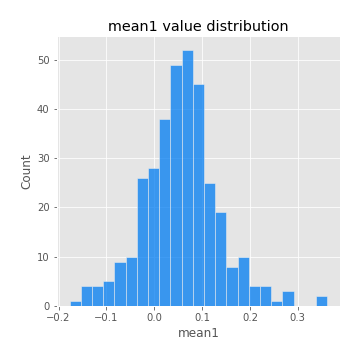
## Feature : mean2
- **Feature type** : continous
- **Missing** : 0.0%
- **Unique** : 347
- **Count** :347.0
- **Mean** :0.07777931957827934
- **Std** :0.09105308352633583
- **Min** :-0.24205418062825398
- **25%th Percentile** : 0.022247841151599716
- **50%th Percentile** : 0.07456865732181736
- **75%th Percentile** : 0.13181352233457386
- **Max** :0.4386302218782166

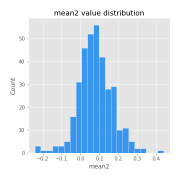
## Feature : sd1
- **Feature type** : continous
- **Missing** : 0.0%
- **Unique** : 347
- **Count** :347.0
- **Mean** :1.83272179378201
- **Std** :0.5395106381890422
- **Min** :0.7620831696941981
- **25%th Percentile** : 1.6766172865267361
- **50%th Percentile** : 1.7985009359446271
- **75%th Percentile** : 1.8990158380407443
- **Max** :5.996244884956102

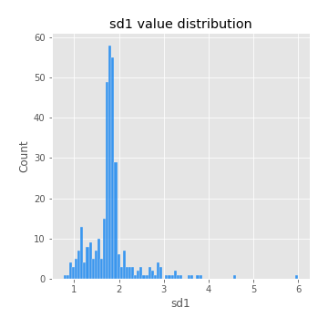
## Feature : sd2
- **Feature type** : continous
- **Missing** : 0.0%
- **Unique** : 347
- **Count** :347.0
- **Mean** :1.7514460031339412
- **Std** :0.6130328775940795
- **Min** :0.8455946193085045
- **25%th Percentile** : 1.5759860347641412
- **50%th Percentile** : 1.6466151866522885
- **75%th Percentile** : 1.7107445630415707
- **Max** :5.762808157208253

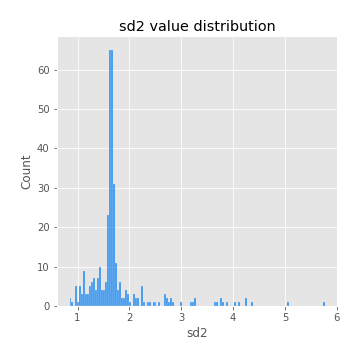
## Feature : skewness1
- **Feature type** : continous
- **Missing** : 0.0%
- **Unique** : 347
- **Count** :347.0
- **Mean** :-0.0777393404234345
- **Std** :0.559621356892023
- **Min** :-3.530116233761814
- **25%th Percentile** : -0.16283499249219668
- **50%th Percentile** : -0.021613525460274712
- **75%th Percentile** : 0.09111847909296375
- **Max** :2.5845963767725557

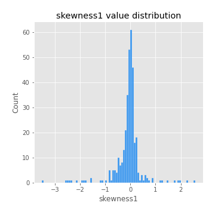
## Feature : skewness2
- **Feature type** : continous
- **Missing** : 0.0%
- **Unique** : 347
- **Count** :347.0
- **Mean** :-0.17971811230375115
- **Std** :0.7906567504877473
- **Min** :-8.801502855292393
- **25%th Percentile** : -0.2452968390621972
- **50%th Percentile** : -0.048132718759502584
- **75%th Percentile** : 0.08359503782693764
- **Max** :2.123597625075353

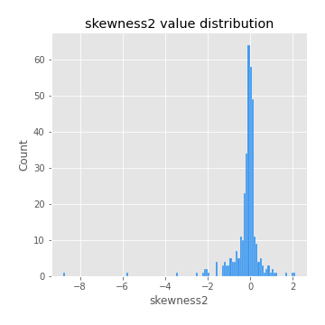
## Feature : kurtosis1
- **Feature type** : continous
- **Missing** : 0.0%
- **Unique** : 347
- **Count** :347.0
- **Mean** :2.8971113107949664
- **Std** :5.365276648216636
- **Min** :-0.4135269359281146
- **25%th Percentile** : -0.024708208567811862
- **50%th Percentile** : 0.37426209320334847
- **75%th Percentile** : 3.5326987255989466
- **Max** :31.614652972751188

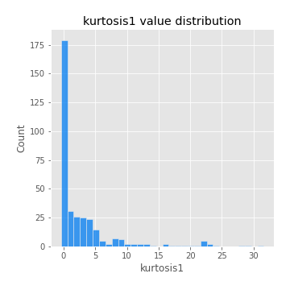
## Feature : kurtosis2
- **Feature type** : continous
- **Missing** : 0.0%
- **Unique** : 347
- **Count** :347.0
- **Mean** :3.8308201073584764
- **Std** :10.09286936658762
- **Min** :-0.4253167139354641
- **25%th Percentile** : -0.02476064818219248
- **50%th Percentile** : 0.5144739084691214
- **75%th Percentile** : 4.3612884611668505
- **Max** :143.10871011533666

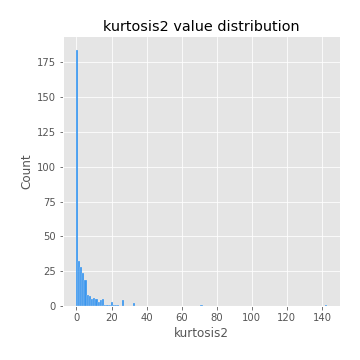
## Feature : return_autocorrelation_1_lag1
- **Feature type** : continous
- **Missing** : 0.0%
- **Unique** : 347
- **Count** :347.0
- **Mean** :-0.010097582373041435
- **Std** :0.05937079032775752
- **Min** :-0.2135576224968752
- **25%th Percentile** : -0.042123653914628356
- **50%th Percentile** : -0.004456277573547255
- **75%th Percentile** : 0.030293295236586373
- **Max** :0.12810656890648087

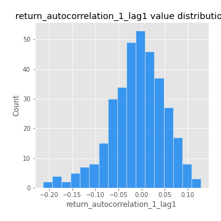
## Feature : return_autocorrelation_1_lag2
- **Feature type** : continous
- **Missing** : 0.0%
- **Unique** : 347
- **Count** :347.0
- **Mean** :-0.0031129406933213637
- **Std** :0.048701550152100294
- **Min** :-0.13309283796645122
- **25%th Percentile** : -0.03685253365418047
- **50%th Percentile** : -0.0020086732029893175
- **75%th Percentile** : 0.028804292819975163
- **Max** :0.1561488228015672

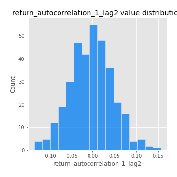
## Feature : return_autocorrelation_1_lag3
- **Feature type** : continous
- **Missing** : 0.0%
- **Unique** : 347
- **Count** :347.0
- **Mean** :-0.002178177370560461
- **Std** :0.05315310031006165
- **Min** :-0.15806635192103805
- **25%th Percentile** : -0.03618712744686049
- **50%th Percentile** : -0.0006017800023255181
- **75%th Percentile** : 0.03490223916190549
- **Max** :0.11921841598278729

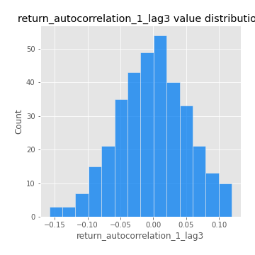
## Feature : return_autocorrelation_2_lag1
- **Feature type** : continous
- **Missing** : 0.0%
- **Unique** : 347
- **Count** :347.0
- **Mean** :-0.006985538356477542
- **Std** :0.060917852517910556
- **Min** :-0.25075531010123286
- **25%th Percentile** : -0.036789196866023624
- **50%th Percentile** : -0.004160370948502648
- **75%th Percentile** : 0.02999205939138166
- **Max** :0.31863413537898483

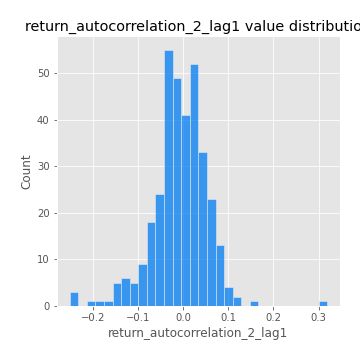
## Feature : return_autocorrelation_2_lag2
- **Feature type** : continous
- **Missing** : 0.0%
- **Unique** : 347
- **Count** :347.0
- **Mean** :0.0019881691839903366
- **Std** :0.05074000827123012
- **Min** :-0.15323211089747296
- **25%th Percentile** : -0.031672075662021654
- **50%th Percentile** : 0.0018785238113544211
- **75%th Percentile** : 0.03675547744139804
- **Max** :0.20974504043791217

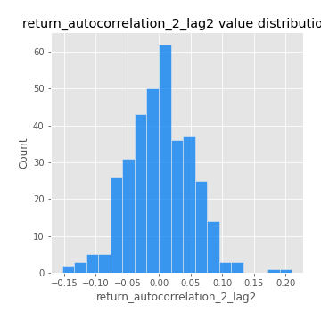
## Feature : return_autocorrelation_2_lag3
- **Feature type** : continous
- **Missing** : 0.0%
- **Unique** : 347
- **Count** :347.0
- **Mean** :0.0007336032223136855
- **Std** :0.04883212334366099
- **Min** :-0.14200107169559698
- **25%th Percentile** : -0.029022022514111744
- **50%th Percentile** : 0.0017596597404038068
- **75%th Percentile** : 0.03245353712083904
- **Max** :0.1419999376914021

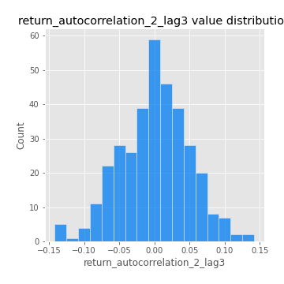
## Feature : return_correlation_ts1_lag_0
- **Feature type** : continous
- **Missing** : 0.0%
- **Unique** : 347
- **Count** :347.0
- **Mean** :0.3147435312564047
- **Std** :0.10386337784805125
- **Min** :-0.027089510445801036
- **25%th Percentile** : 0.26701931458584316
- **50%th Percentile** : 0.3135474290904865
- **75%th Percentile** : 0.35585230517356925
- **Max** :0.7041861626832071

## Feature : return_correlation_ts1_lag_1
- **Feature type** : continous
- **Missing** : 0.0%
- **Unique** : 347
- **Count** :347.0
- **Mean** :-0.005754828434637947
- **Std** :0.05041475884736539
- **Min** :-0.16985510949917193
- **25%th Percentile** : -0.03654108513036382
- **50%th Percentile** : -0.0007510302744104748
- **75%th Percentile** : 0.026134052470303794
- **Max** :0.11819480385322509

## Feature : return_correlation_ts1_lag_2
- **Feature type** : continous
- **Missing** : 0.0%
- **Unique** : 347
- **Count** :347.0
- **Mean** :0.0051192784937130545
- **Std** :0.048963482433682294
- **Min** :-0.21653581047581763
- **25%th Percentile** : -0.02408249986388295
- **50%th Percentile** : 0.006742380112964843
- **75%th Percentile** : 0.03992123671612736
- **Max** :0.10974458143841866

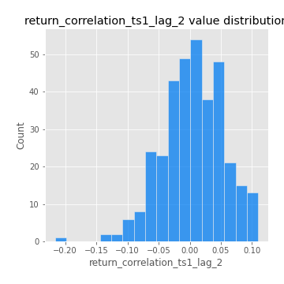
## Feature : return_correlation_ts1_lag_3
- **Feature type** : continous
- **Missing** : 0.0%
- **Unique** : 347
- **Count** :347.0
- **Mean** :0.0008020338866772108
- **Std** :0.05018528068821004
- **Min** :-0.1270218498974763
- **25%th Percentile** : -0.032875082678532445
- **50%th Percentile** : 0.0014003458802558063
- **75%th Percentile** : 0.035797845830359123
- **Max** :0.1636773216468148

## Feature : return_correlation_ts2_lag_1
- **Feature type** : continous
- **Missing** : 0.0%
- **Unique** : 347
- **Count** :347.0
- **Mean** :-0.004980214618828795
- **Std** :0.05422559617187874
- **Min** :-0.2081139431093261
- **25%th Percentile** : -0.03557312520973435
- **50%th Percentile** : -0.004876884790633577
- **75%th Percentile** : 0.0305457968575909
- **Max** :0.12152804908769879

## Feature : return_correlation_ts2_lag_2
- **Feature type** : continous
- **Missing** : 0.0%
- **Unique** : 347
- **Count** :347.0
- **Mean** :0.0017339193814807463
- **Std** :0.05105632972465633
- **Min** :-0.23751835475804678
- **25%th Percentile** : -0.03154676193130162
- **50%th Percentile** : 0.0022438124761268723
- **75%th Percentile** : 0.03638124581750277
- **Max** :0.20772887392904255

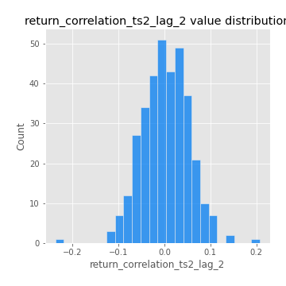
## Feature : return_correlation_ts2_lag_3
- **Feature type** : continous
- **Missing** : 0.0%
- **Unique** : 347
- **Count** :347.0
- **Mean** :0.001690389136322635
- **Std** :0.05211588513773734
- **Min** :-0.17564076057312866
- **25%th Percentile** : -0.02983906055385134
- **50%th Percentile** : 0.0024049782412846215
- **75%th Percentile** : 0.03994584815968098
- **Max** :0.13128380114518473

## Feature : sqreturn_autocorrelation_ts1_lag1
- **Feature type** : continous
- **Missing** : 0.0%
- **Unique** : 347
- **Count** :347.0
- **Mean** :0.048748579133994205
- **Std** :0.09103061116408202
- **Min** :-0.1028623331173941
- **25%th Percentile** : -0.009321851534874047
- **50%th Percentile** : 0.027526459453190984
- **75%th Percentile** : 0.08591334130031542
- **Max** :0.49414293176447355

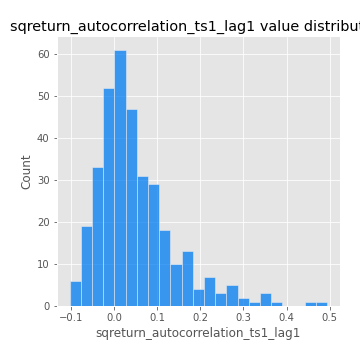
## Feature : sqreturn_autocorrelation_ts1_lag2
- **Feature type** : continous
- **Missing** : 0.0%
- **Unique** : 347
- **Count** :347.0
- **Mean** :0.03744406742274096
- **Std** :0.09185860253239309
- **Min** :-0.11190259221304623
- **25%th Percentile** : -0.017270265286748028
- **50%th Percentile** : 0.014380362303649271
- **75%th Percentile** : 0.06510527068071117
- **Max** :0.540735851444759

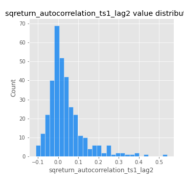
## Feature : sqreturn_autocorrelation_ts1_lag3
- **Feature type** : continous
- **Missing** : 0.0%
- **Unique** : 347
- **Count** :347.0
- **Mean** :0.02951492530451174
- **Std** :0.07492637388617994
- **Min** :-0.09732521226640135
- **25%th Percentile** : -0.01612170413343205
- **50%th Percentile** : 0.011710548254852042
- **75%th Percentile** : 0.056644392632660565
- **Max** :0.3457940197475473

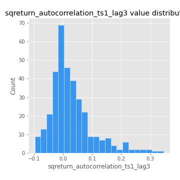
## Feature : sqreturn_autocorrelation_ts2_lag1
- **Feature type** : continous
- **Missing** : 0.0%
- **Unique** : 347
- **Count** :347.0
- **Mean** :0.046098550682400916
- **Std** :0.08669939117452984
- **Min** :-0.11600047310130973
- **25%th Percentile** : -0.009147322921963024
- **50%th Percentile** : 0.028799284522873014
- **75%th Percentile** : 0.07395600250557574
- **Max** :0.510085647437958

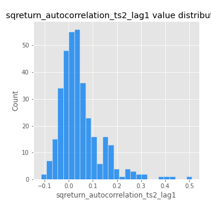
## Feature : sqreturn_autocorrelation_ts2_lag2
- **Feature type** : continous
- **Missing** : 0.0%
- **Unique** : 347
- **Count** :347.0
- **Mean** :0.03801966677780664
- **Std** :0.08302938322477924
- **Min** :-0.09012784924872942
- **25%th Percentile** : -0.00880553370575036
- **50%th Percentile** : 0.017860930090171083
- **75%th Percentile** : 0.052287374995058734
- **Max** :0.5373432415582473

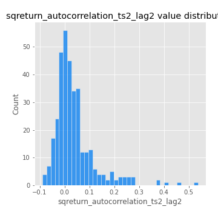
## Feature : sqreturn_autocorrelation_ts2_lag3
- **Feature type** : continous
- **Missing** : 0.0%
- **Unique** : 347
- **Count** :347.0
- **Mean** :0.026968642807569183
- **Std** :0.06776925888843803
- **Min** :-0.09929430924809846
- **25%th Percentile** : -0.015350170694696644
- **50%th Percentile** : 0.015795395949154748
- **75%th Percentile** : 0.05340470271117237
- **Max** :0.31225727797735664

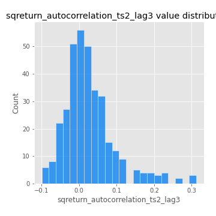
## Feature : sqreturn_correlation_ts1_lag_0
- **Feature type** : continous
- **Missing** : 0.0%
- **Unique** : 347
- **Count** :347.0
- **Mean** :0.3147435312564047
- **Std** :0.10386337784805125
- **Min** :-0.027089510445801036
- **25%th Percentile** : 0.26701931458584316
- **50%th Percentile** : 0.3135474290904865
- **75%th Percentile** : 0.35585230517356925
- **Max** :0.7041861626832071

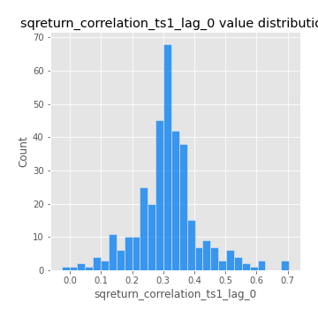
## Feature : sqreturn_correlation_ts1_lag_1
- **Feature type** : continous
- **Missing** : 0.0%
- **Unique** : 347
- **Count** :347.0
- **Mean** :-0.005754828434637947
- **Std** :0.05041475884736539
- **Min** :-0.16985510949917193
- **25%th Percentile** : -0.03654108513036382
- **50%th Percentile** : -0.0007510302744104748
- **75%th Percentile** : 0.026134052470303794
- **Max** :0.11819480385322509

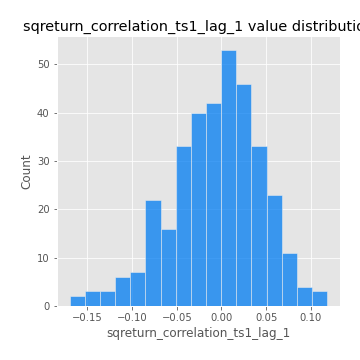
## Feature : sqreturn_correlation_ts1_lag_2
- **Feature type** : continous
- **Missing** : 0.0%
- **Unique** : 347
- **Count** :347.0
- **Mean** :0.0051192784937130545
- **Std** :0.048963482433682294
- **Min** :-0.21653581047581763
- **25%th Percentile** : -0.02408249986388295
- **50%th Percentile** : 0.006742380112964843
- **75%th Percentile** : 0.03992123671612736
- **Max** :0.10974458143841866

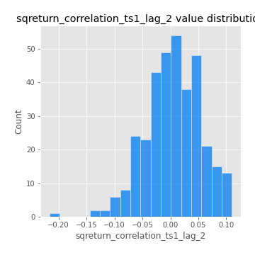
## Feature : sqreturn_correlation_ts1_lag_3
- **Feature type** : continous
- **Missing** : 0.0%
- **Unique** : 347
- **Count** :347.0
- **Mean** :0.0008020338866772108
- **Std** :0.05018528068821004
- **Min** :-0.1270218498974763
- **25%th Percentile** : -0.032875082678532445
- **50%th Percentile** : 0.0014003458802558063
- **75%th Percentile** : 0.035797845830359123
- **Max** :0.1636773216468148

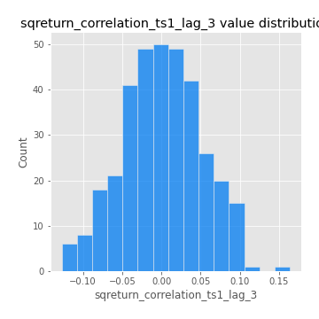
## Feature : sqreturn_correlation_ts2_lag_1
- **Feature type** : continous
- **Missing** : 0.0%
- **Unique** : 347
- **Count** :347.0
- **Mean** :-0.004980214618828795
- **Std** :0.05422559617187874
- **Min** :-0.2081139431093261
- **25%th Percentile** : -0.03557312520973435
- **50%th Percentile** : -0.004876884790633577
- **75%th Percentile** : 0.0305457968575909
- **Max** :0.12152804908769879

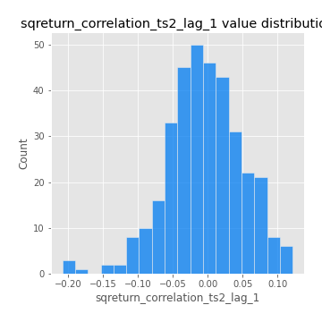
## Feature : sqreturn_correlation_ts2_lag_2
- **Feature type** : continous
- **Missing** : 0.0%
- **Unique** : 347
- **Count** :347.0
- **Mean** :0.0017339193814807463
- **Std** :0.05105632972465633
- **Min** :-0.23751835475804678
- **25%th Percentile** : -0.03154676193130162
- **50%th Percentile** : 0.0022438124761268723
- **75%th Percentile** : 0.03638124581750277
- **Max** :0.20772887392904255

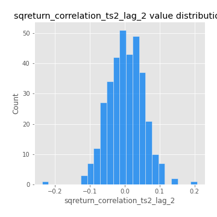
## Feature : sqreturn_correlation_ts2_lag_3
- **Feature type** : continous
- **Missing** : 0.0%
- **Unique** : 347
- **Count** :347.0
- **Mean** :0.001690389136322635
- **Std** :0.05211588513773734
- **Min** :-0.17564076057312866
- **25%th Percentile** : -0.02983906055385134
- **50%th Percentile** : 0.0024049782412846215
- **75%th Percentile** : 0.03994584815968098
- **Max** :0.13128380114518473

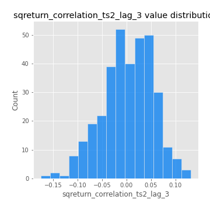
## Feature : price2_granger_cause_price1
- **Feature type** : continous
- **Missing** : 0.0%
- **Unique** : 347
- **Count** :347.0
- **Mean** :0.27570661655948747
- **Std** :0.28328257634760556
- **Min** :1.1245162782480237e-07
- **25%th Percentile** : 0.025002491637192106
- **50%th Percentile** : 0.17256746072654225
- **75%th Percentile** : 0.4468047985815805
- **Max** :0.9885712803689185

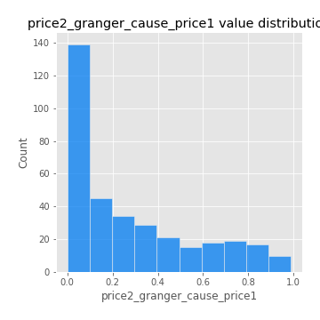
## Feature : price1_granger_cause_price2
- **Feature type** : continous
- **Missing** : 0.0%
- **Unique** : 347
- **Count** :347.0
- **Mean** :0.30923140893462925
- **Std** :0.2889030331236701
- **Min** :1.939122411787695e-06
- **25%th Percentile** : 0.0408142061734232
- **50%th Percentile** : 0.23037613057020018
- **75%th Percentile** : 0.5182695154615974
- **Max** :0.9992205756703506

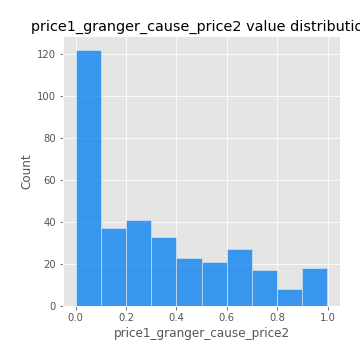

[<< Go back](../README.md)
