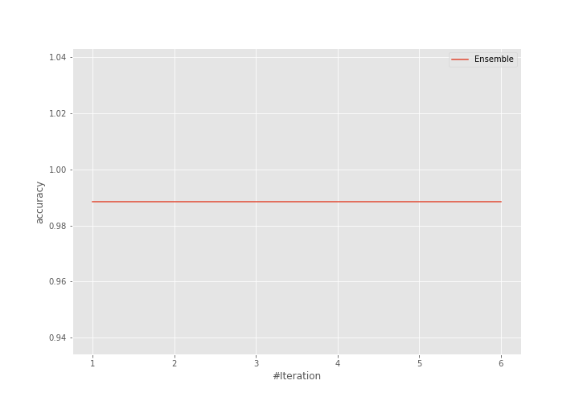

# Summary of Ensemble

[<< Go back](../README.md)

## Ensemble structure
| Model                   |   Weight |
|:------------------------|---------:|
| 5_Default_NeuralNetwork |        1 |

## Metric details
|           |     score |    threshold |
|:----------|----------:|-------------:|
| logloss   | 0.0887264 | nan          |
| auc       | 1         | nan          |
| f1        | 0.988764  |   0.505683   |
| accuracy  | 0.988506  |   0.505683   |
| precision | 1         |   0.906224   |
| recall    | 1         |   1.9726e-11 |
| mcc       | 0.977261  |   0.505683   |

## Confusion matrix (at threshold=0.505683)
|                      |   Predicted as real |   Predicted as simulated |
|:---------------------|--------------------:|-------------------------:|
| Labeled as real      |                  42 |                        1 |
| Labeled as simulated |                   0 |                       44 |

## Learning curves

## Confusion Matrix

## Normalized Confusion Matrix

## ROC Curve

## Kolmogorov-Smirnov Statistic

## Precision-Recall Curve

## Calibration Curve

## Cumulative Gains Curve

## Lift Curve

[<< Go back](../README.md)
