# Summary of 3_Linear

[<< Go back](../README.md)

## Logistic Regression (Linear)
- **n_jobs**: -1
- **explain_level**: 2

## Validation
 - **validation_type**: split
 - **train_ratio**: 0.75
 - **shuffle**: True
 - **stratify**: True

## Optimized metric
accuracy

## Training time

21.3 seconds

## Metric details
|           |    score |   threshold |
|:----------|---------:|------------:|
| logloss   | 0.163879 | nan         |
| auc       | 1        | nan         |
| f1        | 0.988764 |   0.588757  |
| accuracy  | 0.988506 |   0.588757  |
| precision | 1        |   0.890905  |
| recall    | 1        |   5.497e-12 |
| mcc       | 0.977261 |   0.588757  |

## Confusion matrix (at threshold=0.588757)
|                      |   Predicted as real |   Predicted as simulated |
|:---------------------|--------------------:|-------------------------:|
| Labeled as real      |                  42 |                        1 |
| Labeled as simulated |                   0 |                       44 |

## Learning curves
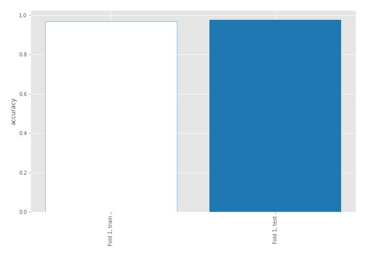

## Coefficients
| feature                           |   Learner_1 |
|:----------------------------------|------------:|
| return_autocorrelation_2_lag1     |  0.629369   |
| return_autocorrelation_2_lag2     |  0.488644   |
| skewness2                         |  0.46695    |
| return_autocorrelation_1_lag3     |  0.343108   |
| return_autocorrelation_2_lag3     |  0.333889   |
| sd1                               |  0.322811   |
| return_correlation_ts2_lag_1      |  0.314178   |
| sqreturn_correlation_ts2_lag_1    |  0.314178   |
| return_correlation_ts1_lag_1      |  0.285952   |
| sqreturn_correlation_ts1_lag_1    |  0.285952   |
| mean2                             |  0.283087   |
| sqreturn_correlation_ts2_lag_3    |  0.265733   |
| return_correlation_ts2_lag_3      |  0.265733   |
| return_autocorrelation_1_lag2     |  0.25174    |
| sqreturn_correlation_ts2_lag_2    |  0.234063   |
| return_correlation_ts2_lag_2      |  0.234063   |
| skewness1                         |  0.227851   |
| return_correlation_ts1_lag_2      |  0.211842   |
| sqreturn_correlation_ts1_lag_2    |  0.211842   |
| sqreturn_correlation_ts1_lag_3    |  0.164574   |
| return_correlation_ts1_lag_3      |  0.164574   |
| mean1                             |  0.0625468  |
| return_autocorrelation_1_lag1     |  0.00959413 |
| sqreturn_correlation_ts1_lag_0    | -0.0632461  |
| return_correlation_ts1_lag_0      | -0.0632461  |
| price1_granger_cause_price2       | -0.299141   |
| sd2                               | -0.495068   |
| sqreturn_autocorrelation_ts2_lag3 | -0.616503   |
| sqreturn_autocorrelation_ts1_lag3 | -0.768186   |
| price2_granger_cause_price1       | -0.825016   |
| sqreturn_autocorrelation_ts1_lag2 | -0.873443   |
| sqreturn_autocorrelation_ts2_lag2 | -1.04347    |
| sqreturn_autocorrelation_ts1_lag1 | -1.20486    |
| intercept                         | -1.25208    |
| sqreturn_autocorrelation_ts2_lag1 | -1.36247    |
| kurtosis2                         | -3.51568    |
| kurtosis1                         | -4.35305    |

## Permutation-based Importance
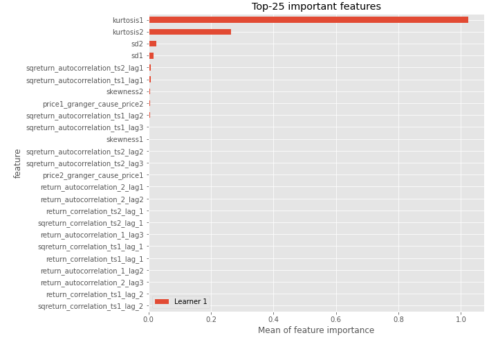
## Confusion Matrix

## Normalized Confusion Matrix

## ROC Curve

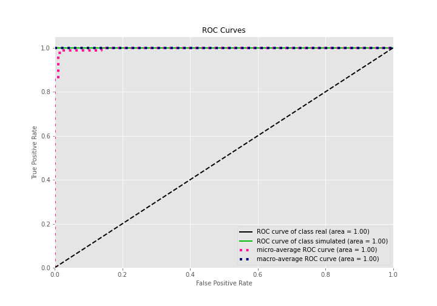

## Kolmogorov-Smirnov Statistic

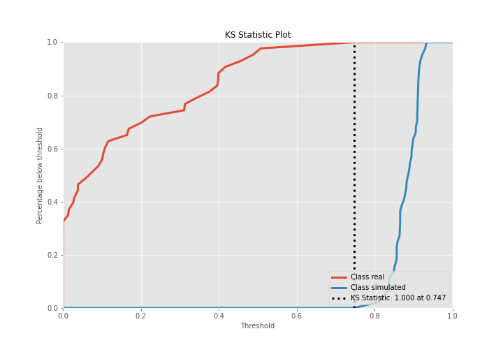

## Precision-Recall Curve

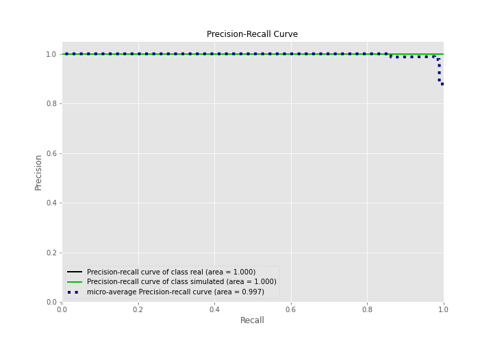

## Calibration Curve

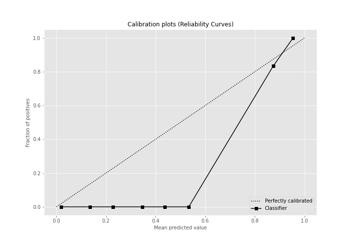

## Cumulative Gains Curve

## Lift Curve

## SHAP Importance
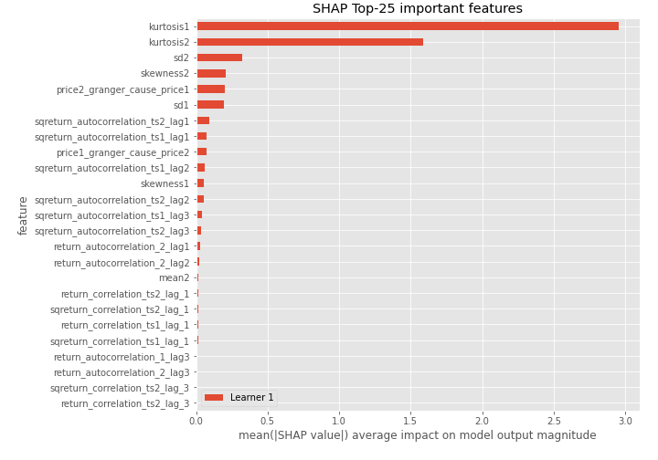

## SHAP Dependence plots

### Dependence (Fold 1)
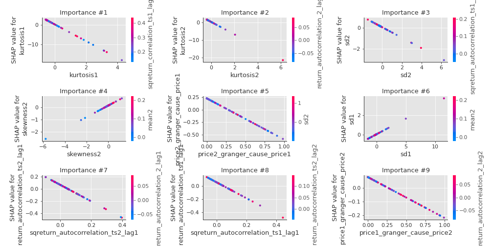

## SHAP Decision plots

### Top-10 Worst decisions for class 0 (Fold 1)
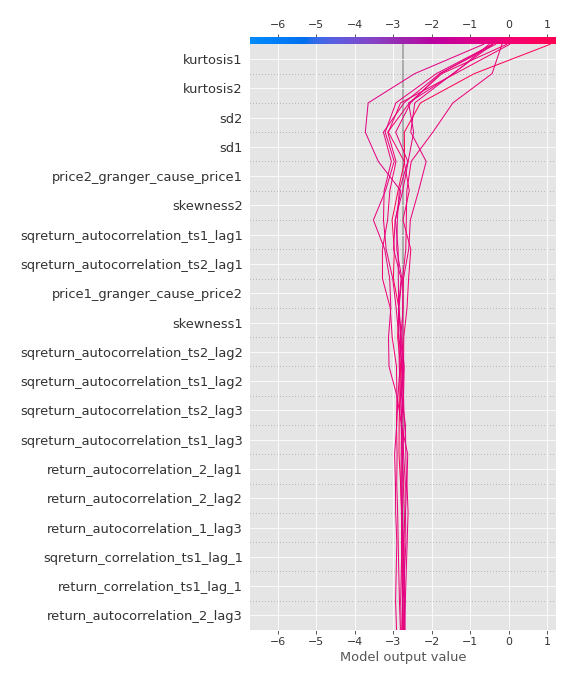
### Top-10 Best decisions for class 0 (Fold 1)
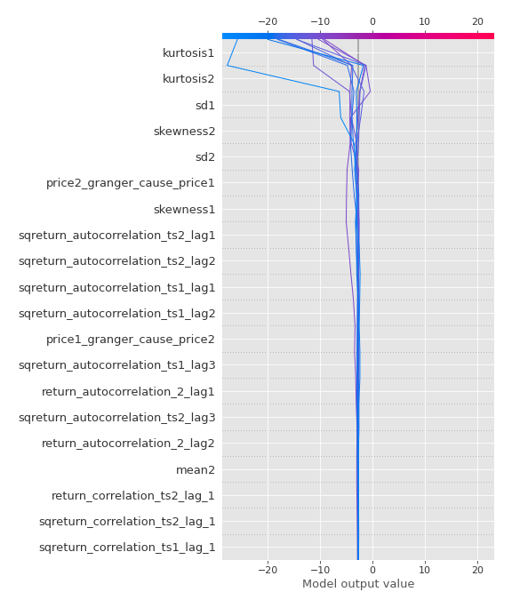
### Top-10 Worst decisions for class 1 (Fold 1)
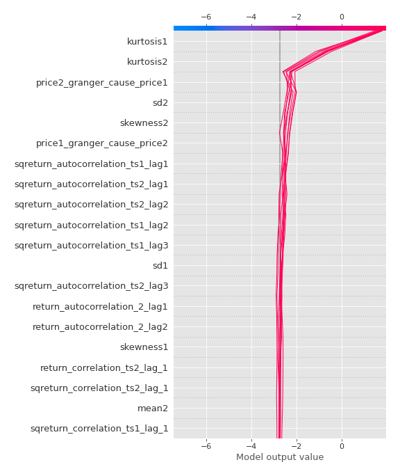
### Top-10 Best decisions for class 1 (Fold 1)
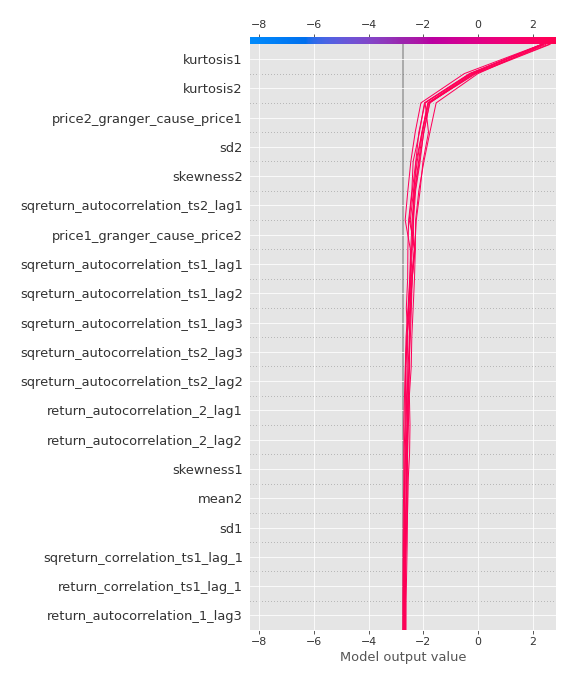

[<< Go back](../README.md)
