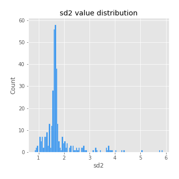
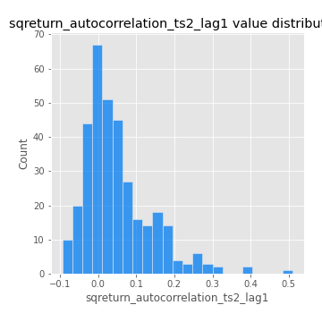
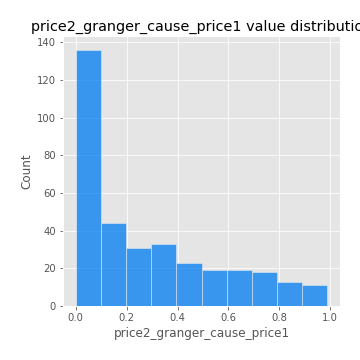

# Exploratory Data Analysis

[<< Go back](../README.md)
## Feature : target
- **Feature type** : categorical
- **Missing** : 0.0%
- **Unique** : 2
- **Count** :347
- **Unique** :2
- **Top** :simulated
- **Freq** :174

## Feature : mean1
- **Feature type** : continous
- **Missing** : 0.0%
- **Unique** : 347
- **Count** :347.0
- **Mean** :0.05808810020800912
- **Std** :0.08702515193281153
- **Min** :-0.22632637961920957
- **25%th Percentile** : 0.007611556343234243
- **50%th Percentile** : 0.05809868114753089
- **75%th Percentile** : 0.1114661461617223
- **Max** :0.37175100008111034

## Feature : mean2
- **Feature type** : continous
- **Missing** : 0.0%
- **Unique** : 347
- **Count** :347.0
- **Mean** :0.08046635991874203
- **Std** :0.0906346854303653
- **Min** :-0.24205418062825398
- **25%th Percentile** : 0.0357623585146717
- **50%th Percentile** : 0.07684634718570357
- **75%th Percentile** : 0.12549351733836756
- **Max** :0.40776113190891855

## Feature : sd1
- **Feature type** : continous
- **Missing** : 0.0%
- **Unique** : 347
- **Count** :347.0
- **Mean** :1.8805018149028891
- **Std** :0.736371995083481
- **Min** :0.7470080772831957
- **25%th Percentile** : 1.668744803883524
- **50%th Percentile** : 1.8122209286670226
- **75%th Percentile** : 1.904514010846004
- **Max** :9.236766377527575

## Feature : sd2
- **Feature type** : continous
- **Missing** : 0.0%
- **Unique** : 347
- **Count** :347.0
- **Mean** :1.7871579357264458
- **Std** :0.658748705213316
- **Min** :0.8455946193085045
- **25%th Percentile** : 1.5657672531347644
- **50%th Percentile** : 1.6442927335472703
- **75%th Percentile** : 1.7299339379974974
- **Max** :5.872800253666788

## Feature : skewness1
- **Feature type** : continous
- **Missing** : 0.0%
- **Unique** : 347
- **Count** :347.0
- **Mean** :-0.054453028013350335
- **Std** :0.5803295975327136
- **Min** :-3.453087436558107
- **25%th Percentile** : -0.15092019497234993
- **50%th Percentile** : -0.005763383793409964
- **75%th Percentile** : 0.11163914763112905
- **Max** :2.5845963767725557

## Feature : skewness2
- **Feature type** : continous
- **Missing** : 0.0%
- **Unique** : 347
- **Count** :347.0
- **Mean** :-0.17500185127157272
- **Std** :0.8119676916579548
- **Min** :-8.801502855292393
- **25%th Percentile** : -0.2476038621805744
- **50%th Percentile** : -0.05590126204694035
- **75%th Percentile** : 0.07185040215717095
- **Max** :2.2606839051517187

## Feature : kurtosis1
- **Feature type** : continous
- **Missing** : 0.0%
- **Unique** : 347
- **Count** :347.0
- **Mean** :3.1131384488113247
- **Std** :6.108557383774931
- **Min** :-0.576092603427377
- **25%th Percentile** : -0.009375198787183736
- **50%th Percentile** : 0.5315420754249733
- **75%th Percentile** : 3.601784904080982
- **Max** :46.07507808162177

## Feature : kurtosis2
- **Feature type** : continous
- **Missing** : 0.0%
- **Unique** : 347
- **Count** :347.0
- **Mean** :3.8127887639267044
- **Std** :10.368681247902531
- **Min** :-0.4483210157889519
- **25%th Percentile** : -0.02624409425911267
- **50%th Percentile** : 0.5567163202427889
- **75%th Percentile** : 4.042224598652708
- **Max** :143.10871011533666

## Feature : return_autocorrelation_1_lag1
- **Feature type** : continous
- **Missing** : 0.0%
- **Unique** : 347
- **Count** :347.0
- **Mean** :-0.008459311956652714
- **Std** :0.05629649017456966
- **Min** :-0.2135576224968752
- **25%th Percentile** : -0.03987518388281227
- **50%th Percentile** : 0.00026849331040681106
- **75%th Percentile** : 0.026543616423064742
- **Max** :0.12824390137358013

## Feature : return_autocorrelation_1_lag2
- **Feature type** : continous
- **Missing** : 0.0%
- **Unique** : 347
- **Count** :347.0
- **Mean** :-0.005659771709212088
- **Std** :0.04892652978047924
- **Min** :-0.13309283796645122
- **25%th Percentile** : -0.03523165856525805
- **50%th Percentile** : -0.005075948507283003
- **75%th Percentile** : 0.025314583793011956
- **Max** :0.1561488228015672

## Feature : return_autocorrelation_1_lag3
- **Feature type** : continous
- **Missing** : 0.0%
- **Unique** : 347
- **Count** :347.0
- **Mean** :-0.0006883076450399909
- **Std** :0.050668302533359466
- **Min** :-0.15806635192103805
- **25%th Percentile** : -0.03243271238885632
- **50%th Percentile** : -0.0020418658918720557
- **75%th Percentile** : 0.03314661418485093
- **Max** :0.13167086114088408

## Feature : return_autocorrelation_2_lag1
- **Feature type** : continous
- **Missing** : 0.0%
- **Unique** : 347
- **Count** :347.0
- **Mean** :-0.0033611231186632565
- **Std** :0.061702703745525826
- **Min** :-0.25075531010123286
- **25%th Percentile** : -0.03673885538763179
- **50%th Percentile** : -0.0006758947211536489
- **75%th Percentile** : 0.03464378467004942
- **Max** :0.31863413537898483

## Feature : return_autocorrelation_2_lag2
- **Feature type** : continous
- **Missing** : 0.0%
- **Unique** : 347
- **Count** :347.0
- **Mean** :0.001828110910733287
- **Std** :0.05188021852214622
- **Min** :-0.1495113937562178
- **25%th Percentile** : -0.03229903147758964
- **50%th Percentile** : 0.0011189489907057837
- **75%th Percentile** : 0.03420630830258494
- **Max** :0.20974504043791217

## Feature : return_autocorrelation_2_lag3
- **Feature type** : continous
- **Missing** : 0.0%
- **Unique** : 347
- **Count** :347.0
- **Mean** :0.0008119269179661128
- **Std** :0.04885912968249308
- **Min** :-0.14200107169559698
- **25%th Percentile** : -0.02875165345712903
- **50%th Percentile** : 0.0005952313275880577
- **75%th Percentile** : 0.03466721268320268
- **Max** :0.1419999376914021

## Feature : return_correlation_ts1_lag_0
- **Feature type** : continous
- **Missing** : 0.0%
- **Unique** : 347
- **Count** :347.0
- **Mean** :0.3141711895287765
- **Std** :0.1099068835560422
- **Min** :-0.027089510445801036
- **25%th Percentile** : 0.2648691857515417
- **50%th Percentile** : 0.3089823207932509
- **75%th Percentile** : 0.3586071684590687
- **Max** :0.7041861626832071

## Feature : return_correlation_ts1_lag_1
- **Feature type** : continous
- **Missing** : 0.0%
- **Unique** : 347
- **Count** :347.0
- **Mean** :-0.004995338427612292
- **Std** :0.05181581197339419
- **Min** :-0.16985510949917193
- **25%th Percentile** : -0.03752822531210838
- **50%th Percentile** : -0.00023500887514937182
- **75%th Percentile** : 0.03016400947199987
- **Max** :0.15499424718508623

## Feature : return_correlation_ts1_lag_2
- **Feature type** : continous
- **Missing** : 0.0%
- **Unique** : 347
- **Count** :347.0
- **Mean** :0.0020559022381538097
- **Std** :0.04752381462342334
- **Min** :-0.21653581047581763
- **25%th Percentile** : -0.030285046931801785
- **50%th Percentile** : 0.0017440570037897262
- **75%th Percentile** : 0.03660093480637297
- **Max** :0.11773670927402306

## Feature : return_correlation_ts1_lag_3
- **Feature type** : continous
- **Missing** : 0.0%
- **Unique** : 347
- **Count** :347.0
- **Mean** :0.0016473345270054654
- **Std** :0.05103283433860377
- **Min** :-0.14992380895736965
- **25%th Percentile** : -0.03228309462823492
- **50%th Percentile** : 0.003436997673449451
- **75%th Percentile** : 0.0366867381120403
- **Max** :0.1422809271770942

## Feature : return_correlation_ts2_lag_1
- **Feature type** : continous
- **Missing** : 0.0%
- **Unique** : 347
- **Count** :347.0
- **Mean** :-0.0008193230151326306
- **Std** :0.05113454920211746
- **Min** :-0.2081139431093261
- **25%th Percentile** : -0.0347148706357646
- **50%th Percentile** : 0.0013038793097563401
- **75%th Percentile** : 0.03384339303489178
- **Max** :0.17208763791364762

## Feature : return_correlation_ts2_lag_2
- **Feature type** : continous
- **Missing** : 0.0%
- **Unique** : 347
- **Count** :347.0
- **Mean** :0.004015132599813791
- **Std** :0.050547369932106075
- **Min** :-0.23751835475804678
- **25%th Percentile** : -0.028127506257502943
- **50%th Percentile** : 0.0011270485359307467
- **75%th Percentile** : 0.033798580303238374
- **Max** :0.20772887392904255

## Feature : return_correlation_ts2_lag_3
- **Feature type** : continous
- **Missing** : 0.0%
- **Unique** : 347
- **Count** :347.0
- **Mean** :0.002551092653462282
- **Std** :0.05026474702748561
- **Min** :-0.17564076057312866
- **25%th Percentile** : -0.025472334596236032
- **50%th Percentile** : 0.0005156439438987019
- **75%th Percentile** : 0.036235417994445435
- **Max** :0.13128380114518473

## Feature : sqreturn_autocorrelation_ts1_lag1
- **Feature type** : continous
- **Missing** : 0.0%
- **Unique** : 347
- **Count** :347.0
- **Mean** :0.04566971756339802
- **Std** :0.09001348206145633
- **Min** :-0.09459450385119841
- **25%th Percentile** : -0.010743223086432819
- **50%th Percentile** : 0.02646910530292259
- **75%th Percentile** : 0.08155881368267934
- **Max** :0.49414293176447355

## Feature : sqreturn_autocorrelation_ts1_lag2
- **Feature type** : continous
- **Missing** : 0.0%
- **Unique** : 347
- **Count** :347.0
- **Mean** :0.03960377678475824
- **Std** :0.08816340380109651
- **Min** :-0.10801170629666863
- **25%th Percentile** : -0.013349876073715787
- **50%th Percentile** : 0.01650324336784801
- **75%th Percentile** : 0.06582435110285932
- **Max** :0.540735851444759

## Feature : sqreturn_autocorrelation_ts1_lag3
- **Feature type** : continous
- **Missing** : 0.0%
- **Unique** : 347
- **Count** :347.0
- **Mean** :0.03645774024838268
- **Std** :0.07531518500299537
- **Min** :-0.10698523063219223
- **25%th Percentile** : -0.010449308462134543
- **50%th Percentile** : 0.017685231737527524
- **75%th Percentile** : 0.06480080908302432
- **Max** :0.3457940197475473

## Feature : sqreturn_autocorrelation_ts2_lag1
- **Feature type** : continous
- **Missing** : 0.0%
- **Unique** : 347
- **Count** :347.0
- **Mean** :0.048770271169593905
- **Std** :0.08908533896664832
- **Min** :-0.09360537052414358
- **25%th Percentile** : -0.009971950110939865
- **50%th Percentile** : 0.025645286123905056
- **75%th Percentile** : 0.08504377399737009
- **Max** :0.510085647437958

## Feature : sqreturn_autocorrelation_ts2_lag2
- **Feature type** : continous
- **Missing** : 0.0%
- **Unique** : 347
- **Count** :347.0
- **Mean** :0.03652682293843653
- **Std** :0.08614538619518723
- **Min** :-0.11400365985632663
- **25%th Percentile** : -0.01557451110730698
- **50%th Percentile** : 0.017783740767332964
- **75%th Percentile** : 0.05761291822576731
- **Max** :0.5373432415582473

## Feature : sqreturn_autocorrelation_ts2_lag3
- **Feature type** : continous
- **Missing** : 0.0%
- **Unique** : 347
- **Count** :347.0
- **Mean** :0.025812101158013957
- **Std** :0.06968952531319073
- **Min** :-0.11825173777489954
- **25%th Percentile** : -0.019259758254523314
- **50%th Percentile** : 0.014975618852394013
- **75%th Percentile** : 0.056169568717469635
- **Max** :0.31225727797735664

## Feature : sqreturn_correlation_ts1_lag_0
- **Feature type** : continous
- **Missing** : 0.0%
- **Unique** : 347
- **Count** :347.0
- **Mean** :0.3141711895287765
- **Std** :0.1099068835560422
- **Min** :-0.027089510445801036
- **25%th Percentile** : 0.2648691857515417
- **50%th Percentile** : 0.3089823207932509
- **75%th Percentile** : 0.3586071684590687
- **Max** :0.7041861626832071

## Feature : sqreturn_correlation_ts1_lag_1
- **Feature type** : continous
- **Missing** : 0.0%
- **Unique** : 347
- **Count** :347.0
- **Mean** :-0.004995338427612292
- **Std** :0.05181581197339419
- **Min** :-0.16985510949917193
- **25%th Percentile** : -0.03752822531210838
- **50%th Percentile** : -0.00023500887514937182
- **75%th Percentile** : 0.03016400947199987
- **Max** :0.15499424718508623

## Feature : sqreturn_correlation_ts1_lag_2
- **Feature type** : continous
- **Missing** : 0.0%
- **Unique** : 347
- **Count** :347.0
- **Mean** :0.0020559022381538097
- **Std** :0.04752381462342334
- **Min** :-0.21653581047581763
- **25%th Percentile** : -0.030285046931801785
- **50%th Percentile** : 0.0017440570037897262
- **75%th Percentile** : 0.03660093480637297
- **Max** :0.11773670927402306

## Feature : sqreturn_correlation_ts1_lag_3
- **Feature type** : continous
- **Missing** : 0.0%
- **Unique** : 347
- **Count** :347.0
- **Mean** :0.0016473345270054654
- **Std** :0.05103283433860377
- **Min** :-0.14992380895736965
- **25%th Percentile** : -0.03228309462823492
- **50%th Percentile** : 0.003436997673449451
- **75%th Percentile** : 0.0366867381120403
- **Max** :0.1422809271770942

## Feature : sqreturn_correlation_ts2_lag_1
- **Feature type** : continous
- **Missing** : 0.0%
- **Unique** : 347
- **Count** :347.0
- **Mean** :-0.0008193230151326306
- **Std** :0.05113454920211746
- **Min** :-0.2081139431093261
- **25%th Percentile** : -0.0347148706357646
- **50%th Percentile** : 0.0013038793097563401
- **75%th Percentile** : 0.03384339303489178
- **Max** :0.17208763791364762

## Feature : sqreturn_correlation_ts2_lag_2
- **Feature type** : continous
- **Missing** : 0.0%
- **Unique** : 347
- **Count** :347.0
- **Mean** :0.004015132599813791
- **Std** :0.050547369932106075
- **Min** :-0.23751835475804678
- **25%th Percentile** : -0.028127506257502943
- **50%th Percentile** : 0.0011270485359307467
- **75%th Percentile** : 0.033798580303238374
- **Max** :0.20772887392904255

## Feature : sqreturn_correlation_ts2_lag_3
- **Feature type** : continous
- **Missing** : 0.0%
- **Unique** : 347
- **Count** :347.0
- **Mean** :0.002551092653462282
- **Std** :0.05026474702748561
- **Min** :-0.17564076057312866
- **25%th Percentile** : -0.025472334596236032
- **50%th Percentile** : 0.0005156439438987019
- **75%th Percentile** : 0.036235417994445435
- **Max** :0.13128380114518473

## Feature : price2_granger_cause_price1
- **Feature type** : continous
- **Missing** : 0.0%
- **Unique** : 347
- **Count** :347.0
- **Mean** :0.2789241640027561
- **Std** :0.27905653111453277
- **Min** :2.5387498018148383e-08
- **25%th Percentile** : 0.034940913720427694
- **50%th Percentile** : 0.17148550113759134
- **75%th Percentile** : 0.4749548215138412
- **Max** :0.9885712803689185

## Feature : price1_granger_cause_price2
- **Feature type** : continous
- **Missing** : 0.0%
- **Unique** : 347
- **Count** :347.0
- **Mean** :0.2971856105340477
- **Std** :0.2889488600624299
- **Min** :1.0434031741079152e-07
- **25%th Percentile** : 0.04056168747609527
- **50%th Percentile** : 0.22433366089041326
- **75%th Percentile** : 0.49204011190386476
- **Max** :0.9951398266867577

[<< Go back](../README.md)
