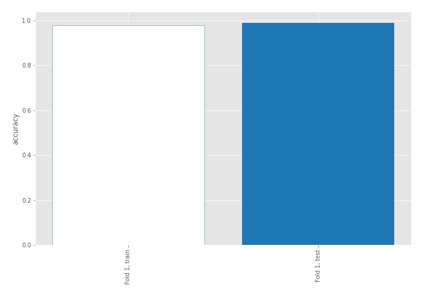
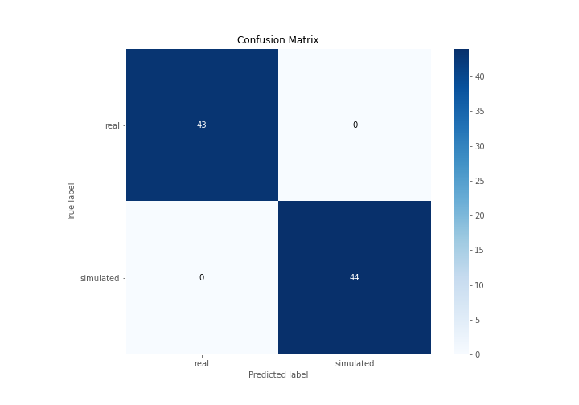

# Summary of 3_Linear

[<< Go back](../README.md)

## Logistic Regression (Linear)
- **n_jobs**: -1
- **explain_level**: 2

## Validation
 - **validation_type**: split
 - **train_ratio**: 0.75
 - **shuffle**: True
 - **stratify**: True

## Optimized metric
accuracy

## Training time

22.3 seconds

## Metric details
|           |    score |     threshold |
|:----------|---------:|--------------:|
| logloss   | 0.111914 | nan           |
| auc       | 1        | nan           |
| f1        | 1        |   0.678832    |
| accuracy  | 1        |   0.678832    |
| precision | 1        |   0.89898     |
| recall    | 1        |   2.96198e-13 |
| mcc       | 1        |   0.678832    |

## Confusion matrix (at threshold=0.678832)
|                      |   Predicted as real |   Predicted as simulated |
|:---------------------|--------------------:|-------------------------:|
| Labeled as real      |                  43 |                        0 |
| Labeled as simulated |                   0 |                       44 |

## Learning curves

## Coefficients
| feature                           |   Learner_1 |
|:----------------------------------|------------:|
| skewness2                         |  0.896427   |
| sd1                               |  0.379033   |
| return_autocorrelation_2_lag1     |  0.318521   |
| mean2                             |  0.296826   |
| sqreturn_correlation_ts2_lag_3    |  0.258116   |
| return_correlation_ts2_lag_3      |  0.258116   |
| return_correlation_ts2_lag_1      |  0.253271   |
| sqreturn_correlation_ts2_lag_1    |  0.253271   |
| return_autocorrelation_1_lag2     |  0.228748   |
| sqreturn_correlation_ts1_lag_2    |  0.203475   |
| return_correlation_ts1_lag_2      |  0.203475   |
| return_autocorrelation_2_lag3     |  0.18156    |
| sqreturn_correlation_ts1_lag_3    |  0.176081   |
| return_correlation_ts1_lag_3      |  0.176081   |
| sqreturn_correlation_ts2_lag_2    |  0.157844   |
| return_correlation_ts2_lag_2      |  0.157844   |
| skewness1                         |  0.109282   |
| sqreturn_correlation_ts1_lag_1    |  0.105531   |
| return_correlation_ts1_lag_1      |  0.105531   |
| return_autocorrelation_2_lag2     |  0.0951819  |
| return_autocorrelation_1_lag1     |  0.0608882  |
| return_autocorrelation_1_lag3     |  0.00869004 |
| mean1                             | -0.0584549  |
| price1_granger_cause_price2       | -0.148294   |
| sqreturn_correlation_ts1_lag_0    | -0.178908   |
| return_correlation_ts1_lag_0      | -0.178908   |
| sd2                               | -0.531004   |
| price2_granger_cause_price1       | -0.562198   |
| sqreturn_autocorrelation_ts2_lag3 | -0.562922   |
| sqreturn_autocorrelation_ts1_lag3 | -0.897855   |
| sqreturn_autocorrelation_ts2_lag2 | -0.914625   |
| sqreturn_autocorrelation_ts2_lag1 | -1.04259    |
| sqreturn_autocorrelation_ts1_lag1 | -1.16219    |
| sqreturn_autocorrelation_ts1_lag2 | -1.24227    |
| intercept                         | -1.28574    |
| kurtosis2                         | -3.52556    |
| kurtosis1                         | -4.29565    |

## Permutation-based Importance

## Confusion Matrix

## Normalized Confusion Matrix

## ROC Curve

## Kolmogorov-Smirnov Statistic

## Precision-Recall Curve

## Calibration Curve

## Cumulative Gains Curve

## Lift Curve

## SHAP Importance

## SHAP Dependence plots

### Dependence (Fold 1)

## SHAP Decision plots

### Top-10 Worst decisions for class 0 (Fold 1)

### Top-10 Best decisions for class 0 (Fold 1)

### Top-10 Worst decisions for class 1 (Fold 1)

### Top-10 Best decisions for class 1 (Fold 1)

[<< Go back](../README.md)
