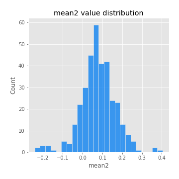

# Exploratory Data Analysis

[<< Go back](../README.md)
## Feature : target
- **Feature type** : categorical
- **Missing** : 0.0%
- **Unique** : 2
- **Count** :347
- **Unique** :2
- **Top** :simulated
- **Freq** :174

## Feature : mean1
- **Feature type** : continous
- **Missing** : 0.0%
- **Unique** : 347
- **Count** :347.0
- **Mean** :0.052738738151727506
- **Std** :0.08030770493380195
- **Min** :-0.22632637961920957
- **25%th Percentile** : 0.007913764480239496
- **50%th Percentile** : 0.05467434299603361
- **75%th Percentile** : 0.09643810421096681
- **Max** :0.37175100008111034

## Feature : mean2
- **Feature type** : continous
- **Missing** : 0.0%
- **Unique** : 347
- **Count** :347.0
- **Mean** :0.07675128191879754
- **Std** :0.08924159764698177
- **Min** :-0.24205418062825398
- **25%th Percentile** : 0.029415676085374532
- **50%th Percentile** : 0.07506387476831725
- **75%th Percentile** : 0.12656883242473305
- **Max** :0.4041914174922971

## Feature : sd1
- **Feature type** : continous
- **Missing** : 0.0%
- **Unique** : 347
- **Count** :347.0
- **Mean** :1.8795485523555306
- **Std** :0.7129326772518289
- **Min** :0.7470080772831957
- **25%th Percentile** : 1.6697139456449812
- **50%th Percentile** : 1.8171294214079499
- **75%th Percentile** : 1.8938113424912588
- **Max** :9.236766377527575

## Feature : sd2
- **Feature type** : continous
- **Missing** : 0.0%
- **Unique** : 347
- **Count** :347.0
- **Mean** :1.83092050811787
- **Std** :0.7446321841924831
- **Min** :0.8455946193085045
- **25%th Percentile** : 1.587184601408816
- **50%th Percentile** : 1.6582771216620473
- **75%th Percentile** : 1.7445326668875425
- **Max** :6.737618636746393

## Feature : skewness1
- **Feature type** : continous
- **Missing** : 0.0%
- **Unique** : 347
- **Count** :347.0
- **Mean** :-0.09722392667129677
- **Std** :0.5845247331047652
- **Min** :-3.530116233761814
- **25%th Percentile** : -0.17549661359901306
- **50%th Percentile** : -0.03164573404319891
- **75%th Percentile** : 0.07871359212730078
- **Max** :2.5845963767725557

## Feature : skewness2
- **Feature type** : continous
- **Missing** : 0.0%
- **Unique** : 347
- **Count** :347.0
- **Mean** :-0.17028929167183915
- **Std** :0.821682114338448
- **Min** :-8.801502855292393
- **25%th Percentile** : -0.2452968390621972
- **50%th Percentile** : -0.037262413141009185
- **75%th Percentile** : 0.08867655117651366
- **Max** :2.2606839051517187

## Feature : kurtosis1
- **Feature type** : continous
- **Missing** : 0.0%
- **Unique** : 347
- **Count** :347.0
- **Mean** :3.1623940669983424
- **Std** :5.9475776086017795
- **Min** :-0.4441985883626196
- **25%th Percentile** : -0.03626479172393404
- **50%th Percentile** : 0.597711328542331
- **75%th Percentile** : 3.6512465710229476
- **Max** :36.91113889081053

## Feature : kurtosis2
- **Feature type** : continous
- **Missing** : 0.0%
- **Unique** : 347
- **Count** :347.0
- **Mean** :3.929149337210078
- **Std** :10.141146916015991
- **Min** :-0.4282450864443694
- **25%th Percentile** : -0.019187603138650866
- **50%th Percentile** : 0.5423411051551259
- **75%th Percentile** : 4.466753057909188
- **Max** :143.10871011533666

## Feature : return_autocorrelation_1_lag1
- **Feature type** : continous
- **Missing** : 0.0%
- **Unique** : 347
- **Count** :347.0
- **Mean** :-0.01210671962843444
- **Std** :0.05738040165288034
- **Min** :-0.2135576224968752
- **25%th Percentile** : -0.041912758590259704
- **50%th Percentile** : -0.005416996756231156
- **75%th Percentile** : 0.02348791365341582
- **Max** :0.12810656890648087

## Feature : return_autocorrelation_1_lag2
- **Feature type** : continous
- **Missing** : 0.0%
- **Unique** : 347
- **Count** :347.0
- **Mean** :-0.006169502899878122
- **Std** :0.05252051260005625
- **Min** :-0.15100775328843874
- **25%th Percentile** : -0.039563323528704314
- **50%th Percentile** : -0.005583441304546397
- **75%th Percentile** : 0.028753828269639035
- **Max** :0.1561488228015672

## Feature : return_autocorrelation_1_lag3
- **Feature type** : continous
- **Missing** : 0.0%
- **Unique** : 347
- **Count** :347.0
- **Mean** :-0.002896162187032553
- **Std** :0.05476841593160036
- **Min** :-0.1940836867390813
- **25%th Percentile** : -0.037640094570652344
- **50%th Percentile** : -0.0005637401913804838
- **75%th Percentile** : 0.03254234401480386
- **Max** :0.17805869530681923

## Feature : return_autocorrelation_2_lag1
- **Feature type** : continous
- **Missing** : 0.0%
- **Unique** : 347
- **Count** :347.0
- **Mean** :-0.008231566786460533
- **Std** :0.06366891786554199
- **Min** :-0.25075531010123286
- **25%th Percentile** : -0.039789993759542536
- **50%th Percentile** : -0.006000458316533536
- **75%th Percentile** : 0.03075026543237209
- **Max** :0.31863413537898483

## Feature : return_autocorrelation_2_lag2
- **Feature type** : continous
- **Missing** : 0.0%
- **Unique** : 347
- **Count** :347.0
- **Mean** :-0.0014841409642172205
- **Std** :0.05038764847331878
- **Min** :-0.15323211089747296
- **25%th Percentile** : -0.03394075168599482
- **50%th Percentile** : -0.00328573313449535
- **75%th Percentile** : 0.03170241119767553
- **Max** :0.20974504043791217

## Feature : return_autocorrelation_2_lag3
- **Feature type** : continous
- **Missing** : 0.0%
- **Unique** : 347
- **Count** :347.0
- **Mean** :-0.006131387691229185
- **Std** :0.04937404816249103
- **Min** :-0.14200107169559698
- **25%th Percentile** : -0.03871484412220823
- **50%th Percentile** : -0.006774807973739861
- **75%th Percentile** : 0.024590075264087033
- **Max** :0.14642641056319763

## Feature : return_correlation_ts1_lag_0
- **Feature type** : continous
- **Missing** : 0.0%
- **Unique** : 347
- **Count** :347.0
- **Mean** :0.31821465035176977
- **Std** :0.1096334838928499
- **Min** :0.005136598099876001
- **25%th Percentile** : 0.2631707900803213
- **50%th Percentile** : 0.31508260166090857
- **75%th Percentile** : 0.3610450744322966
- **Max** :0.7041861626832071

## Feature : return_correlation_ts1_lag_1
- **Feature type** : continous
- **Missing** : 0.0%
- **Unique** : 347
- **Count** :347.0
- **Mean** :-0.005292352308714905
- **Std** :0.052988327092437296
- **Min** :-0.16985510949917193
- **25%th Percentile** : -0.0373714996610054
- **50%th Percentile** : -0.005609884494599018
- **75%th Percentile** : 0.030257216979595356
- **Max** :0.15499424718508623

## Feature : return_correlation_ts1_lag_2
- **Feature type** : continous
- **Missing** : 0.0%
- **Unique** : 347
- **Count** :347.0
- **Mean** :0.00036046063231430557
- **Std** :0.0492581642398173
- **Min** :-0.21653581047581763
- **25%th Percentile** : -0.03175523893056423
- **50%th Percentile** : -0.0007858635389180041
- **75%th Percentile** : 0.03609032259922375
- **Max** :0.12689676156467672

## Feature : return_correlation_ts1_lag_3
- **Feature type** : continous
- **Missing** : 0.0%
- **Unique** : 347
- **Count** :347.0
- **Mean** :-0.0008961965089347714
- **Std** :0.0543898424587893
- **Min** :-0.13749361265866153
- **25%th Percentile** : -0.03836883068060514
- **50%th Percentile** : 0.0005085061733351187
- **75%th Percentile** : 0.03469478792891598
- **Max** :0.1636773216468148

## Feature : return_correlation_ts2_lag_1
- **Feature type** : continous
- **Missing** : 0.0%
- **Unique** : 347
- **Count** :347.0
- **Mean** :-0.006931864707168069
- **Std** :0.05369479796930886
- **Min** :-0.20093919236581337
- **25%th Percentile** : -0.04253187065327611
- **50%th Percentile** : -0.008007985770351306
- **75%th Percentile** : 0.026985729013629806
- **Max** :0.17208763791364762

## Feature : return_correlation_ts2_lag_2
- **Feature type** : continous
- **Missing** : 0.0%
- **Unique** : 347
- **Count** :347.0
- **Mean** :0.000498484169690297
- **Std** :0.04943633603674826
- **Min** :-0.23751835475804678
- **25%th Percentile** : -0.032354688191133726
- **50%th Percentile** : 0.0011270485359307467
- **75%th Percentile** : 0.02897868763201731
- **Max** :0.20772887392904255

## Feature : return_correlation_ts2_lag_3
- **Feature type** : continous
- **Missing** : 0.0%
- **Unique** : 347
- **Count** :347.0
- **Mean** :-0.00272827816778149
- **Std** :0.05407833358633246
- **Min** :-0.17564076057312866
- **25%th Percentile** : -0.03352242896085751
- **50%th Percentile** : -0.00195398859043715
- **75%th Percentile** : 0.02815723857593993
- **Max** :0.13510836461118633

## Feature : sqreturn_autocorrelation_ts1_lag1
- **Feature type** : continous
- **Missing** : 0.0%
- **Unique** : 347
- **Count** :347.0
- **Mean** :0.05265449174135299
- **Std** :0.09495518091589321
- **Min** :-0.09555686210579878
- **25%th Percentile** : -0.009192219146454135
- **50%th Percentile** : 0.028796089537889404
- **75%th Percentile** : 0.08656006621399676
- **Max** :0.4439086285737898

## Feature : sqreturn_autocorrelation_ts1_lag2
- **Feature type** : continous
- **Missing** : 0.0%
- **Unique** : 347
- **Count** :347.0
- **Mean** :0.048684569636330194
- **Std** :0.09546647357237373
- **Min** :-0.0817130635278313
- **25%th Percentile** : -0.009356155876198827
- **50%th Percentile** : 0.020952023432590415
- **75%th Percentile** : 0.06707230317632061
- **Max** :0.540735851444759

## Feature : sqreturn_autocorrelation_ts1_lag3
- **Feature type** : continous
- **Missing** : 0.0%
- **Unique** : 347
- **Count** :347.0
- **Mean** :0.035025335008732436
- **Std** :0.08348974928159719
- **Min** :-0.09563783663261716
- **25%th Percentile** : -0.01554506559704542
- **50%th Percentile** : 0.014420917298850188
- **75%th Percentile** : 0.06302625843491666
- **Max** :0.44755937369538146

## Feature : sqreturn_autocorrelation_ts2_lag1
- **Feature type** : continous
- **Missing** : 0.0%
- **Unique** : 347
- **Count** :347.0
- **Mean** :0.042950121093073716
- **Std** :0.08509877525174944
- **Min** :-0.1462982543356487
- **25%th Percentile** : -0.012814290708295623
- **50%th Percentile** : 0.024001793134355548
- **75%th Percentile** : 0.07417599712304764
- **Max** :0.4190090519891419

## Feature : sqreturn_autocorrelation_ts2_lag2
- **Feature type** : continous
- **Missing** : 0.0%
- **Unique** : 347
- **Count** :347.0
- **Mean** :0.03835216654765512
- **Std** :0.09194436759525121
- **Min** :-0.11226866154530571
- **25%th Percentile** : -0.013299878982488259
- **50%th Percentile** : 0.015185213759964006
- **75%th Percentile** : 0.057033099923109336
- **Max** :0.5373432415582473

## Feature : sqreturn_autocorrelation_ts2_lag3
- **Feature type** : continous
- **Missing** : 0.0%
- **Unique** : 347
- **Count** :347.0
- **Mean** :0.028253487718717444
- **Std** :0.07045731122530409
- **Min** :-0.10475822827676172
- **25%th Percentile** : -0.014550139676297157
- **50%th Percentile** : 0.012681467172714681
- **75%th Percentile** : 0.05547639061377678
- **Max** :0.31225727797735664

## Feature : sqreturn_correlation_ts1_lag_0
- **Feature type** : continous
- **Missing** : 0.0%
- **Unique** : 347
- **Count** :347.0
- **Mean** :0.31821465035176977
- **Std** :0.1096334838928499
- **Min** :0.005136598099876001
- **25%th Percentile** : 0.2631707900803213
- **50%th Percentile** : 0.31508260166090857
- **75%th Percentile** : 0.3610450744322966
- **Max** :0.7041861626832071

## Feature : sqreturn_correlation_ts1_lag_1
- **Feature type** : continous
- **Missing** : 0.0%
- **Unique** : 347
- **Count** :347.0
- **Mean** :-0.005292352308714905
- **Std** :0.052988327092437296
- **Min** :-0.16985510949917193
- **25%th Percentile** : -0.0373714996610054
- **50%th Percentile** : -0.005609884494599018
- **75%th Percentile** : 0.030257216979595356
- **Max** :0.15499424718508623

## Feature : sqreturn_correlation_ts1_lag_2
- **Feature type** : continous
- **Missing** : 0.0%
- **Unique** : 347
- **Count** :347.0
- **Mean** :0.00036046063231430557
- **Std** :0.0492581642398173
- **Min** :-0.21653581047581763
- **25%th Percentile** : -0.03175523893056423
- **50%th Percentile** : -0.0007858635389180041
- **75%th Percentile** : 0.03609032259922375
- **Max** :0.12689676156467672

## Feature : sqreturn_correlation_ts1_lag_3
- **Feature type** : continous
- **Missing** : 0.0%
- **Unique** : 347
- **Count** :347.0
- **Mean** :-0.0008961965089347714
- **Std** :0.0543898424587893
- **Min** :-0.13749361265866153
- **25%th Percentile** : -0.03836883068060514
- **50%th Percentile** : 0.0005085061733351187
- **75%th Percentile** : 0.03469478792891598
- **Max** :0.1636773216468148

## Feature : sqreturn_correlation_ts2_lag_1
- **Feature type** : continous
- **Missing** : 0.0%
- **Unique** : 347
- **Count** :347.0
- **Mean** :-0.006931864707168069
- **Std** :0.05369479796930886
- **Min** :-0.20093919236581337
- **25%th Percentile** : -0.04253187065327611
- **50%th Percentile** : -0.008007985770351306
- **75%th Percentile** : 0.026985729013629806
- **Max** :0.17208763791364762

## Feature : sqreturn_correlation_ts2_lag_2
- **Feature type** : continous
- **Missing** : 0.0%
- **Unique** : 347
- **Count** :347.0
- **Mean** :0.000498484169690297
- **Std** :0.04943633603674826
- **Min** :-0.23751835475804678
- **25%th Percentile** : -0.032354688191133726
- **50%th Percentile** : 0.0011270485359307467
- **75%th Percentile** : 0.02897868763201731
- **Max** :0.20772887392904255

## Feature : sqreturn_correlation_ts2_lag_3
- **Feature type** : continous
- **Missing** : 0.0%
- **Unique** : 347
- **Count** :347.0
- **Mean** :-0.00272827816778149
- **Std** :0.05407833358633246
- **Min** :-0.17564076057312866
- **25%th Percentile** : -0.03352242896085751
- **50%th Percentile** : -0.00195398859043715
- **75%th Percentile** : 0.02815723857593993
- **Max** :0.13510836461118633

## Feature : price2_granger_cause_price1
- **Feature type** : continous
- **Missing** : 0.0%
- **Unique** : 347
- **Count** :347.0
- **Mean** :0.29352804102618396
- **Std** :0.29241515295473786
- **Min** :1.3408109872046157e-06
- **25%th Percentile** : 0.03802733356715873
- **50%th Percentile** : 0.17673287483011116
- **75%th Percentile** : 0.5075457461681316
- **Max** :0.9885712803689185

## Feature : price1_granger_cause_price2
- **Feature type** : continous
- **Missing** : 0.0%
- **Unique** : 347
- **Count** :347.0
- **Mean** :0.3057639371370666
- **Std** :0.28006567799084997
- **Min** :1.3515251418613501e-05
- **25%th Percentile** : 0.04756999247110737
- **50%th Percentile** : 0.22502588205619425
- **75%th Percentile** : 0.5259227978168103
- **Max** :0.9700993601532755

[<< Go back](../README.md)
