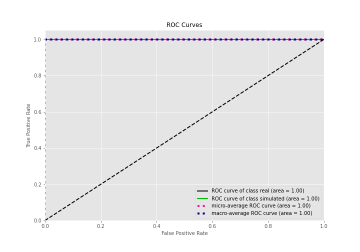

# Summary of 3_Linear

[<< Go back](../README.md)

## Logistic Regression (Linear)
- **n_jobs**: -1
- **explain_level**: 2

## Validation
 - **validation_type**: split
 - **train_ratio**: 0.75
 - **shuffle**: True
 - **stratify**: True

## Optimized metric
accuracy

## Training time

25.4 seconds

## Metric details
|           |    score |     threshold |
|:----------|---------:|--------------:|
| logloss   | 0.104689 | nan           |
| auc       | 1        | nan           |
| f1        | 1        |   0.619106    |
| accuracy  | 1        |   0.619106    |
| precision | 1        |   0.870637    |
| recall    | 1        |   2.76978e-12 |
| mcc       | 1        |   0.619106    |

## Confusion matrix (at threshold=0.619106)
|                      |   Predicted as real |   Predicted as simulated |
|:---------------------|--------------------:|-------------------------:|
| Labeled as real      |                  44 |                        0 |
| Labeled as simulated |                   0 |                       43 |

## Learning curves

## Coefficients
| feature                           |   Learner_1 |
|:----------------------------------|------------:|
| skewness2                         |  0.678926   |
| return_autocorrelation_2_lag1     |  0.503253   |
| skewness1                         |  0.474531   |
| sd1                               |  0.456798   |
| sqreturn_correlation_ts2_lag_1    |  0.445324   |
| return_correlation_ts2_lag_1      |  0.445324   |
| return_autocorrelation_2_lag3     |  0.398561   |
| return_correlation_ts1_lag_3      |  0.323521   |
| sqreturn_correlation_ts1_lag_3    |  0.323521   |
| return_correlation_ts1_lag_1      |  0.292748   |
| sqreturn_correlation_ts1_lag_1    |  0.292748   |
| return_autocorrelation_1_lag3     |  0.288087   |
| sqreturn_correlation_ts2_lag_3    |  0.27325    |
| return_correlation_ts2_lag_3      |  0.27325    |
| return_autocorrelation_2_lag2     |  0.244311   |
| mean2                             |  0.188064   |
| return_correlation_ts1_lag_2      |  0.153765   |
| sqreturn_correlation_ts1_lag_2    |  0.153765   |
| return_autocorrelation_1_lag2     |  0.106056   |
| return_autocorrelation_1_lag1     |  0.103236   |
| sqreturn_correlation_ts2_lag_2    |  0.00329108 |
| return_correlation_ts2_lag_2      |  0.00329108 |
| sqreturn_correlation_ts1_lag_0    | -0.053765   |
| return_correlation_ts1_lag_0      | -0.053765   |
| mean1                             | -0.0610375  |
| sd2                               | -0.301334   |
| price1_granger_cause_price2       | -0.376327   |
| price2_granger_cause_price1       | -0.742096   |
| sqreturn_autocorrelation_ts1_lag3 | -0.872797   |
| sqreturn_autocorrelation_ts2_lag3 | -0.879566   |
| sqreturn_autocorrelation_ts1_lag2 | -0.995952   |
| sqreturn_autocorrelation_ts2_lag2 | -1.08075    |
| sqreturn_autocorrelation_ts2_lag1 | -1.19662    |
| intercept                         | -1.20985    |
| sqreturn_autocorrelation_ts1_lag1 | -1.21665    |
| kurtosis2                         | -3.5485     |
| kurtosis1                         | -4.3576     |

## Permutation-based Importance

## Confusion Matrix

## Normalized Confusion Matrix

## ROC Curve

## Kolmogorov-Smirnov Statistic

## Precision-Recall Curve

## Calibration Curve

## Cumulative Gains Curve

## Lift Curve

## SHAP Importance

## SHAP Dependence plots

### Dependence (Fold 1)

## SHAP Decision plots

### Top-10 Worst decisions for class 0 (Fold 1)

### Top-10 Best decisions for class 0 (Fold 1)

### Top-10 Worst decisions for class 1 (Fold 1)

### Top-10 Best decisions for class 1 (Fold 1)

[<< Go back](../README.md)
