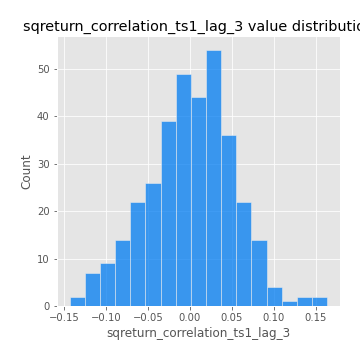

# Exploratory Data Analysis

[<< Go back](../README.md)
## Feature : target
- **Feature type** : categorical
- **Missing** : 0.0%
- **Unique** : 2
- **Count** :347
- **Unique** :2
- **Top** :real
- **Freq** :174

## Feature : mean1
- **Feature type** : continous
- **Missing** : 0.0%
- **Unique** : 347
- **Count** :347.0
- **Mean** :0.05433481530805269
- **Std** :0.07620148141550592
- **Min** :-0.22632637961920957
- **25%th Percentile** : 0.0043767046157509246
- **50%th Percentile** : 0.0568732209979489
- **75%th Percentile** : 0.1006379204973684
- **Max** :0.37175100008111034

## Feature : mean2
- **Feature type** : continous
- **Missing** : 0.0%
- **Unique** : 347
- **Count** :347.0
- **Mean** :0.0756723188095901
- **Std** :0.08692301472762953
- **Min** :-0.2144814672643959
- **25%th Percentile** : 0.022211182487952653
- **50%th Percentile** : 0.07085075175479368
- **75%th Percentile** : 0.12585494073167003
- **Max** :0.412491338502089

## Feature : sd1
- **Feature type** : continous
- **Missing** : 0.0%
- **Unique** : 347
- **Count** :347.0
- **Mean** :1.8706482353559406
- **Std** :0.7340664268599664
- **Min** :0.7470080772831957
- **25%th Percentile** : 1.6613148468316
- **50%th Percentile** : 1.81970334260458
- **75%th Percentile** : 1.8965336481727908
- **Max** :9.236766377527575

## Feature : sd2
- **Feature type** : continous
- **Missing** : 0.0%
- **Unique** : 347
- **Count** :347.0
- **Mean** :1.7299996696887099
- **Std** :0.6206569083115868
- **Min** :0.8455946193085045
- **25%th Percentile** : 1.5497728921098832
- **50%th Percentile** : 1.6391170916331144
- **75%th Percentile** : 1.7148173010774352
- **Max** :6.737618636746393

## Feature : skewness1
- **Feature type** : continous
- **Missing** : 0.0%
- **Unique** : 347
- **Count** :347.0
- **Mean** :-0.1190235279661763
- **Std** :0.5870055992602151
- **Min** :-3.530116233761814
- **25%th Percentile** : -0.19743289491673954
- **50%th Percentile** : -0.036359696275280386
- **75%th Percentile** : 0.06699586272642116
- **Max** :2.5845963767725557

## Feature : skewness2
- **Feature type** : continous
- **Missing** : 0.0%
- **Unique** : 347
- **Count** :347.0
- **Mean** :-0.1838170672471897
- **Std** :0.7389112286706869
- **Min** :-8.801502855292393
- **25%th Percentile** : -0.27170413512313696
- **50%th Percentile** : -0.053211442951941794
- **75%th Percentile** : 0.07243626889813612
- **Max** :2.2606839051517187

## Feature : kurtosis1
- **Feature type** : continous
- **Missing** : 0.0%
- **Unique** : 347
- **Count** :347.0
- **Mean** :3.308477536376295
- **Std** :6.264392234926038
- **Min** :-0.5060424805422783
- **25%th Percentile** : -0.03842069765597689
- **50%th Percentile** : 0.573557253115879
- **75%th Percentile** : 3.749242555655367
- **Max** :36.91113889081053

## Feature : kurtosis2
- **Feature type** : continous
- **Missing** : 0.0%
- **Unique** : 347
- **Count** :347.0
- **Mean** :3.6304576895900245
- **Std** :9.416500883005806
- **Min** :-0.5208077478564475
- **25%th Percentile** : -0.011825776858945591
- **50%th Percentile** : 0.5204647382987231
- **75%th Percentile** : 4.202853905029984
- **Max** :143.10871011533666

## Feature : return_autocorrelation_1_lag1
- **Feature type** : continous
- **Missing** : 0.0%
- **Unique** : 347
- **Count** :347.0
- **Mean** :-0.01518449531975839
- **Std** :0.0571471685700547
- **Min** :-0.20673896439036124
- **25%th Percentile** : -0.0512299737952725
- **50%th Percentile** : -0.013427859327021138
- **75%th Percentile** : 0.025973070899007772
- **Max** :0.134689682097951

## Feature : return_autocorrelation_1_lag2
- **Feature type** : continous
- **Missing** : 0.0%
- **Unique** : 347
- **Count** :347.0
- **Mean** :-0.0031082216120634294
- **Std** :0.04910006893002614
- **Min** :-0.12380667227031586
- **25%th Percentile** : -0.03244086255558261
- **50%th Percentile** : -0.004633789438267545
- **75%th Percentile** : 0.028299108558458304
- **Max** :0.1561488228015672

## Feature : return_autocorrelation_1_lag3
- **Feature type** : continous
- **Missing** : 0.0%
- **Unique** : 347
- **Count** :347.0
- **Mean** :-0.003853100651606493
- **Std** :0.051901273515833894
- **Min** :-0.1940836867390813
- **25%th Percentile** : -0.03605558845434664
- **50%th Percentile** : -0.0037399346828342773
- **75%th Percentile** : 0.03199405785872691
- **Max** :0.17805869530681923

## Feature : return_autocorrelation_2_lag1
- **Feature type** : continous
- **Missing** : 0.0%
- **Unique** : 347
- **Count** :347.0
- **Mean** :-0.011269695267207067
- **Std** :0.05663049400912679
- **Min** :-0.25075531010123286
- **25%th Percentile** : -0.03946183061839048
- **50%th Percentile** : -0.003668348596327112
- **75%th Percentile** : 0.029049491722170417
- **Max** :0.10089319646303013

## Feature : return_autocorrelation_2_lag2
- **Feature type** : continous
- **Missing** : 0.0%
- **Unique** : 347
- **Count** :347.0
- **Mean** :0.0033237961010385846
- **Std** :0.04929735983496471
- **Min** :-0.1495113937562178
- **25%th Percentile** : -0.03157731268115359
- **50%th Percentile** : 0.0018785238113544211
- **75%th Percentile** : 0.03505913750432843
- **Max** :0.1735398560230086

## Feature : return_autocorrelation_2_lag3
- **Feature type** : continous
- **Missing** : 0.0%
- **Unique** : 347
- **Count** :347.0
- **Mean** :-0.0037552447143859684
- **Std** :0.04972643450553842
- **Min** :-0.14200107169559698
- **25%th Percentile** : -0.033332547365927154
- **50%th Percentile** : -0.002509300582699086
- **75%th Percentile** : 0.03022379374104988
- **Max** :0.12489629575199976

## Feature : return_correlation_ts1_lag_0
- **Feature type** : continous
- **Missing** : 0.0%
- **Unique** : 347
- **Count** :347.0
- **Mean** :0.31304812704337504
- **Std** :0.10852239568341555
- **Min** :-0.027089510445801036
- **25%th Percentile** : 0.26261309616644135
- **50%th Percentile** : 0.31074030346883774
- **75%th Percentile** : 0.3579739901176796
- **Max** :0.7028422087350163

## Feature : return_correlation_ts1_lag_1
- **Feature type** : continous
- **Missing** : 0.0%
- **Unique** : 347
- **Count** :347.0
- **Mean** :-0.007087451971253837
- **Std** :0.05274209331798964
- **Min** :-0.1549695474991776
- **25%th Percentile** : -0.040254923301386206
- **50%th Percentile** : -0.0016033280195091437
- **75%th Percentile** : 0.03367854824362648
- **Max** :0.15499424718508623

## Feature : return_correlation_ts1_lag_2
- **Feature type** : continous
- **Missing** : 0.0%
- **Unique** : 347
- **Count** :347.0
- **Mean** :0.0029863859285754507
- **Std** :0.04767827988614523
- **Min** :-0.1246451147068724
- **25%th Percentile** : -0.03167470910415291
- **50%th Percentile** : 0.0004014202544376589
- **75%th Percentile** : 0.03653149962364305
- **Max** :0.12689229032706917

## Feature : return_correlation_ts1_lag_3
- **Feature type** : continous
- **Missing** : 0.0%
- **Unique** : 347
- **Count** :347.0
- **Mean** :0.0006071404127810878
- **Std** :0.051416847032688985
- **Min** :-0.1437249042601089
- **25%th Percentile** : -0.03141033612055062
- **50%th Percentile** : 0.0025752730331703435
- **75%th Percentile** : 0.03450664505736821
- **Max** :0.1636773216468148

## Feature : return_correlation_ts2_lag_1
- **Feature type** : continous
- **Missing** : 0.0%
- **Unique** : 347
- **Count** :347.0
- **Mean** :-0.004413840550570022
- **Std** :0.05058140521714239
- **Min** :-0.2081139431093261
- **25%th Percentile** : -0.03385794644662604
- **50%th Percentile** : -0.0031858225227619657
- **75%th Percentile** : 0.030233726334519248
- **Max** :0.11556235671885211

## Feature : return_correlation_ts2_lag_2
- **Feature type** : continous
- **Missing** : 0.0%
- **Unique** : 347
- **Count** :347.0
- **Mean** :0.0015316317088169458
- **Std** :0.051487050317393444
- **Min** :-0.23751835475804678
- **25%th Percentile** : -0.031994197521805046
- **50%th Percentile** : -0.00016553792162788547
- **75%th Percentile** : 0.035877280547695206
- **Max** :0.20772887392904255

## Feature : return_correlation_ts2_lag_3
- **Feature type** : continous
- **Missing** : 0.0%
- **Unique** : 347
- **Count** :347.0
- **Mean** :-0.0038673389397950275
- **Std** :0.05149707272090726
- **Min** :-0.17564076057312866
- **25%th Percentile** : -0.032515843432468314
- **50%th Percentile** : -0.004373852284171392
- **75%th Percentile** : 0.034756611344602326
- **Max** :0.13128380114518473

## Feature : sqreturn_autocorrelation_ts1_lag1
- **Feature type** : continous
- **Missing** : 0.0%
- **Unique** : 347
- **Count** :347.0
- **Mean** :0.04392790704301441
- **Std** :0.08873380513573835
- **Min** :-0.13856077016644824
- **25%th Percentile** : -0.01352590584016855
- **50%th Percentile** : 0.02459550803438465
- **75%th Percentile** : 0.07984953986941637
- **Max** :0.4439086285737898

## Feature : sqreturn_autocorrelation_ts1_lag2
- **Feature type** : continous
- **Missing** : 0.0%
- **Unique** : 347
- **Count** :347.0
- **Mean** :0.04005568550288975
- **Std** :0.09038260175782634
- **Min** :-0.10848375445382037
- **25%th Percentile** : -0.014617845368856314
- **50%th Percentile** : 0.01700152330734474
- **75%th Percentile** : 0.06420564692038422
- **Max** :0.4522162366773919

## Feature : sqreturn_autocorrelation_ts1_lag3
- **Feature type** : continous
- **Missing** : 0.0%
- **Unique** : 347
- **Count** :347.0
- **Mean** :0.03334252304386745
- **Std** :0.07751240084908577
- **Min** :-0.09489486354476602
- **25%th Percentile** : -0.015426554909184464
- **50%th Percentile** : 0.013397030037263162
- **75%th Percentile** : 0.060081807834000536
- **Max** :0.41030914918857014

## Feature : sqreturn_autocorrelation_ts2_lag1
- **Feature type** : continous
- **Missing** : 0.0%
- **Unique** : 347
- **Count** :347.0
- **Mean** :0.04642013333015524
- **Std** :0.08821412046219834
- **Min** :-0.09023990870229222
- **25%th Percentile** : -0.013519668800003357
- **50%th Percentile** : 0.02476483096697211
- **75%th Percentile** : 0.07476757053134339
- **Max** :0.510085647437958

## Feature : sqreturn_autocorrelation_ts2_lag2
- **Feature type** : continous
- **Missing** : 0.0%
- **Unique** : 347
- **Count** :347.0
- **Mean** :0.038024879387025465
- **Std** :0.08884681138152577
- **Min** :-0.13061568033316887
- **25%th Percentile** : -0.015237643221726861
- **50%th Percentile** : 0.014978211790049505
- **75%th Percentile** : 0.05499983335067876
- **Max** :0.45676817892778204

## Feature : sqreturn_autocorrelation_ts2_lag3
- **Feature type** : continous
- **Missing** : 0.0%
- **Unique** : 347
- **Count** :347.0
- **Mean** :0.027040370183480534
- **Std** :0.06894606291165283
- **Min** :-0.0976001173159907
- **25%th Percentile** : -0.016191094700385447
- **50%th Percentile** : 0.017589143014219565
- **75%th Percentile** : 0.049408355406461546
- **Max** :0.31225727797735664

## Feature : sqreturn_correlation_ts1_lag_0
- **Feature type** : continous
- **Missing** : 0.0%
- **Unique** : 347
- **Count** :347.0
- **Mean** :0.31304812704337504
- **Std** :0.10852239568341555
- **Min** :-0.027089510445801036
- **25%th Percentile** : 0.26261309616644135
- **50%th Percentile** : 0.31074030346883774
- **75%th Percentile** : 0.3579739901176796
- **Max** :0.7028422087350163

## Feature : sqreturn_correlation_ts1_lag_1
- **Feature type** : continous
- **Missing** : 0.0%
- **Unique** : 347
- **Count** :347.0
- **Mean** :-0.007087451971253837
- **Std** :0.05274209331798964
- **Min** :-0.1549695474991776
- **25%th Percentile** : -0.040254923301386206
- **50%th Percentile** : -0.0016033280195091437
- **75%th Percentile** : 0.03367854824362648
- **Max** :0.15499424718508623

## Feature : sqreturn_correlation_ts1_lag_2
- **Feature type** : continous
- **Missing** : 0.0%
- **Unique** : 347
- **Count** :347.0
- **Mean** :0.0029863859285754507
- **Std** :0.04767827988614523
- **Min** :-0.1246451147068724
- **25%th Percentile** : -0.03167470910415291
- **50%th Percentile** : 0.0004014202544376589
- **75%th Percentile** : 0.03653149962364305
- **Max** :0.12689229032706917

## Feature : sqreturn_correlation_ts1_lag_3
- **Feature type** : continous
- **Missing** : 0.0%
- **Unique** : 347
- **Count** :347.0
- **Mean** :0.0006071404127810878
- **Std** :0.051416847032688985
- **Min** :-0.1437249042601089
- **25%th Percentile** : -0.03141033612055062
- **50%th Percentile** : 0.0025752730331703435
- **75%th Percentile** : 0.03450664505736821
- **Max** :0.1636773216468148

## Feature : sqreturn_correlation_ts2_lag_1
- **Feature type** : continous
- **Missing** : 0.0%
- **Unique** : 347
- **Count** :347.0
- **Mean** :-0.004413840550570022
- **Std** :0.05058140521714239
- **Min** :-0.2081139431093261
- **25%th Percentile** : -0.03385794644662604
- **50%th Percentile** : -0.0031858225227619657
- **75%th Percentile** : 0.030233726334519248
- **Max** :0.11556235671885211

## Feature : sqreturn_correlation_ts2_lag_2
- **Feature type** : continous
- **Missing** : 0.0%
- **Unique** : 347
- **Count** :347.0
- **Mean** :0.0015316317088169458
- **Std** :0.051487050317393444
- **Min** :-0.23751835475804678
- **25%th Percentile** : -0.031994197521805046
- **50%th Percentile** : -0.00016553792162788547
- **75%th Percentile** : 0.035877280547695206
- **Max** :0.20772887392904255

## Feature : sqreturn_correlation_ts2_lag_3
- **Feature type** : continous
- **Missing** : 0.0%
- **Unique** : 347
- **Count** :347.0
- **Mean** :-0.0038673389397950275
- **Std** :0.05149707272090726
- **Min** :-0.17564076057312866
- **25%th Percentile** : -0.032515843432468314
- **50%th Percentile** : -0.004373852284171392
- **75%th Percentile** : 0.034756611344602326
- **Max** :0.13128380114518473

## Feature : price2_granger_cause_price1
- **Feature type** : continous
- **Missing** : 0.0%
- **Unique** : 347
- **Count** :347.0
- **Mean** :0.28587161229876323
- **Std** :0.2895358295293779
- **Min** :3.609180966891836e-06
- **25%th Percentile** : 0.026476323402624687
- **50%th Percentile** : 0.18091047216088443
- **75%th Percentile** : 0.4820530218459814
- **Max** :0.9903648308186808

## Feature : price1_granger_cause_price2
- **Feature type** : continous
- **Missing** : 0.0%
- **Unique** : 347
- **Count** :347.0
- **Mean** :0.2713004827196713
- **Std** :0.2720942714879675
- **Min** :7.660832524441539e-06
- **25%th Percentile** : 0.04210672439113696
- **50%th Percentile** : 0.17963047977069246
- **75%th Percentile** : 0.42207186423987336
- **Max** :0.9891906979271993

[<< Go back](../README.md)
