# Exploratory Data Analysis

[<< Go back](../README.md)
## Feature : target
- **Feature type** : categorical
- **Missing** : 0.0%
- **Unique** : 2
- **Count** :347
- **Unique** :2
- **Top** :simulated
- **Freq** :174

## Feature : mean1
- **Feature type** : continous
- **Missing** : 0.0%
- **Unique** : 347
- **Count** :347.0
- **Mean** :0.061012658557596335
- **Std** :0.08118322124744322
- **Min** :-0.22632637961920957
- **25%th Percentile** : 0.010061242238882495
- **50%th Percentile** : 0.05809868114753089
- **75%th Percentile** : 0.10460759015796645
- **Max** :0.37175100008111034

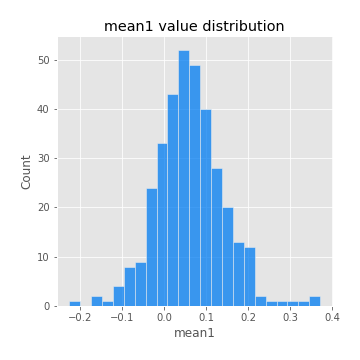
## Feature : mean2
- **Feature type** : continous
- **Missing** : 0.0%
- **Unique** : 347
- **Count** :347.0
- **Mean** :0.0791310439942127
- **Std** :0.09127243884890407
- **Min** :-0.24205418062825398
- **25%th Percentile** : 0.02799817156677405
- **50%th Percentile** : 0.07656279035059031
- **75%th Percentile** : 0.13486681771495435
- **Max** :0.37616608147096464

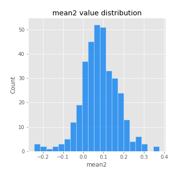
## Feature : sd1
- **Feature type** : continous
- **Missing** : 0.0%
- **Unique** : 347
- **Count** :347.0
- **Mean** :1.88428998595047
- **Std** :0.7254789253550691
- **Min** :0.7470080772831957
- **25%th Percentile** : 1.6850232224344688
- **50%th Percentile** : 1.8206922720049197
- **75%th Percentile** : 1.8991277250027352
- **Max** :9.236766377527575

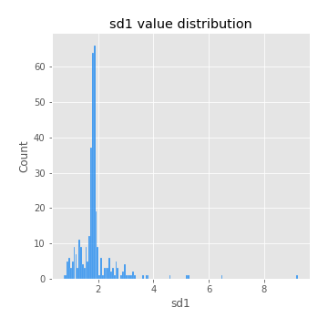
## Feature : sd2
- **Feature type** : continous
- **Missing** : 0.0%
- **Unique** : 347
- **Count** :347.0
- **Mean** :1.810886284394279
- **Std** :0.7617036057765743
- **Min** :0.8592887433004143
- **25%th Percentile** : 1.5788220107768574
- **50%th Percentile** : 1.6490440333787648
- **75%th Percentile** : 1.7232382791360337
- **Max** :6.737618636746393

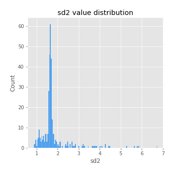
## Feature : skewness1
- **Feature type** : continous
- **Missing** : 0.0%
- **Unique** : 347
- **Count** :347.0
- **Mean** :-0.08293487458105227
- **Std** :0.578380695910181
- **Min** :-3.530116233761814
- **25%th Percentile** : -0.20359102940577822
- **50%th Percentile** : -0.03164573404319891
- **75%th Percentile** : 0.11272942114157247
- **Max** :2.5845963767725557

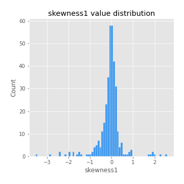
## Feature : skewness2
- **Feature type** : continous
- **Missing** : 0.0%
- **Unique** : 347
- **Count** :347.0
- **Mean** :-0.16695101896620348
- **Std** :0.7986849739776963
- **Min** :-8.801502855292393
- **25%th Percentile** : -0.23746393825467937
- **50%th Percentile** : -0.06236555296826478
- **75%th Percentile** : 0.076701994126119
- **Max** :2.2606839051517187

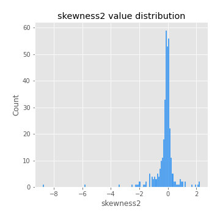
## Feature : kurtosis1
- **Feature type** : continous
- **Missing** : 0.0%
- **Unique** : 347
- **Count** :347.0
- **Mean** :3.087558323283788
- **Std** :5.8264082832795925
- **Min** :-0.4248976149877701
- **25%th Percentile** : -0.03804187331524056
- **50%th Percentile** : 0.49320897931213725
- **75%th Percentile** : 3.8405863563633806
- **Max** :36.91113889081053

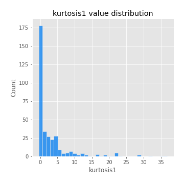
## Feature : kurtosis2
- **Feature type** : continous
- **Missing** : 0.0%
- **Unique** : 347
- **Count** :347.0
- **Mean** :3.68152984939267
- **Std** :9.94195488943304
- **Min** :-0.4628102022651066
- **25%th Percentile** : -0.020587260623562198
- **50%th Percentile** : 0.5523194968750311
- **75%th Percentile** : 4.1488807640792835
- **Max** :143.10871011533666

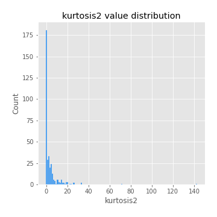
## Feature : return_autocorrelation_1_lag1
- **Feature type** : continous
- **Missing** : 0.0%
- **Unique** : 347
- **Count** :347.0
- **Mean** :-0.010021170246549284
- **Std** :0.05774991742134397
- **Min** :-0.20673896439036124
- **25%th Percentile** : -0.045830162680878264
- **50%th Percentile** : -0.0033178128509680433
- **75%th Percentile** : 0.02683136489394177
- **Max** :0.1253959753011446

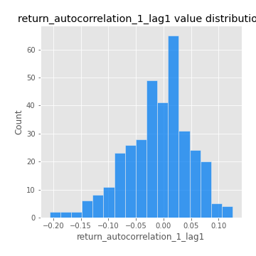
## Feature : return_autocorrelation_1_lag2
- **Feature type** : continous
- **Missing** : 0.0%
- **Unique** : 347
- **Count** :347.0
- **Mean** :-0.004438868592258798
- **Std** :0.05136194244860137
- **Min** :-0.13309283796645122
- **25%th Percentile** : -0.03781857002244096
- **50%th Percentile** : -0.004613866201947514
- **75%th Percentile** : 0.02629191730357689
- **Max** :0.1561488228015672

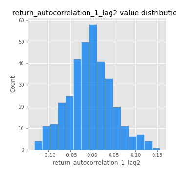
## Feature : return_autocorrelation_1_lag3
- **Feature type** : continous
- **Missing** : 0.0%
- **Unique** : 347
- **Count** :347.0
- **Mean** :-0.0005253865618312043
- **Std** :0.050143318710828104
- **Min** :-0.1940836867390813
- **25%th Percentile** : -0.031656704110728864
- **50%th Percentile** : -5.8491525384037856e-05
- **75%th Percentile** : 0.033704253289181973
- **Max** :0.17805869530681923

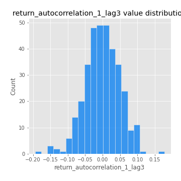
## Feature : return_autocorrelation_2_lag1
- **Feature type** : continous
- **Missing** : 0.0%
- **Unique** : 347
- **Count** :347.0
- **Mean** :-0.009698310651260676
- **Std** :0.06296018637032809
- **Min** :-0.25075531010123286
- **25%th Percentile** : -0.04210238109629555
- **50%th Percentile** : -0.0021750312434390476
- **75%th Percentile** : 0.028763637770262883
- **Max** :0.31863413537898483

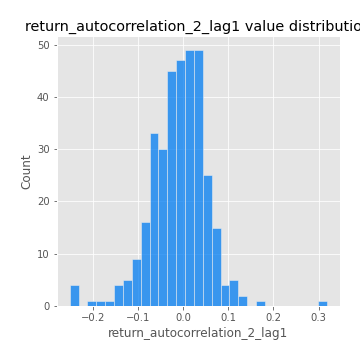
## Feature : return_autocorrelation_2_lag2
- **Feature type** : continous
- **Missing** : 0.0%
- **Unique** : 347
- **Count** :347.0
- **Mean** :-0.0008413842183496834
- **Std** :0.052332654530832634
- **Min** :-0.15323211089747296
- **25%th Percentile** : -0.03387350733546614
- **50%th Percentile** : -0.004081427935014871
- **75%th Percentile** : 0.033012184304693076
- **Max** :0.20974504043791217

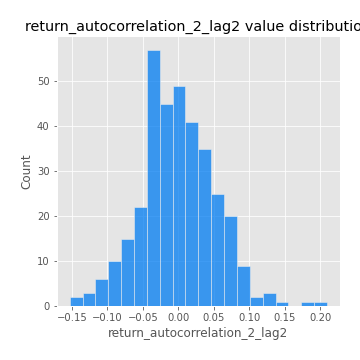
## Feature : return_autocorrelation_2_lag3
- **Feature type** : continous
- **Missing** : 0.0%
- **Unique** : 347
- **Count** :347.0
- **Mean** :-0.0009795208542298537
- **Std** :0.04964006059251463
- **Min** :-0.14200107169559698
- **25%th Percentile** : -0.031126906104854815
- **50%th Percentile** : 0.0006309100522843928
- **75%th Percentile** : 0.031873844145388186
- **Max** :0.1419999376914021

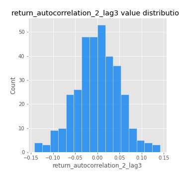
## Feature : return_correlation_ts1_lag_0
- **Feature type** : continous
- **Missing** : 0.0%
- **Unique** : 347
- **Count** :347.0
- **Mean** :0.31578395004151016
- **Std** :0.10740982495648768
- **Min** :0.005136598099876001
- **25%th Percentile** : 0.266247248665264
- **50%th Percentile** : 0.3132459459793502
- **75%th Percentile** : 0.36282703795486293
- **Max** :0.7041861626832071

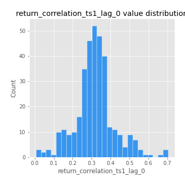
## Feature : return_correlation_ts1_lag_1
- **Feature type** : continous
- **Missing** : 0.0%
- **Unique** : 347
- **Count** :347.0
- **Mean** :-0.004791924233361246
- **Std** :0.04922725767452878
- **Min** :-0.1506680294614535
- **25%th Percentile** : -0.03478225084562163
- **50%th Percentile** : 0.00036059030370543037
- **75%th Percentile** : 0.029189480462206784
- **Max** :0.15499424718508623

## Feature : return_correlation_ts1_lag_2
- **Feature type** : continous
- **Missing** : 0.0%
- **Unique** : 347
- **Count** :347.0
- **Mean** :-0.0007904968351809768
- **Std** :0.04840345290465715
- **Min** :-0.12739166472055655
- **25%th Percentile** : -0.03511488352856916
- **50%th Percentile** : -0.00018333386598916331
- **75%th Percentile** : 0.03581162774927429
- **Max** :0.11767929145605416

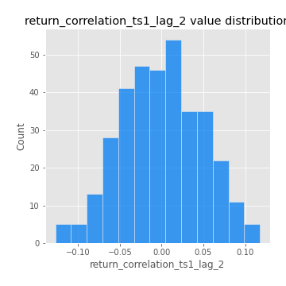
## Feature : return_correlation_ts1_lag_3
- **Feature type** : continous
- **Missing** : 0.0%
- **Unique** : 347
- **Count** :347.0
- **Mean** :0.00043959730710519784
- **Std** :0.051389382255327375
- **Min** :-0.1270218498974763
- **25%th Percentile** : -0.03349073331821487
- **50%th Percentile** : 0.0016071904805195047
- **75%th Percentile** : 0.03228138412588559
- **Max** :0.1636773216468148

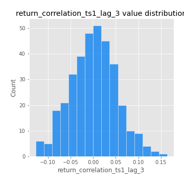
## Feature : return_correlation_ts2_lag_1
- **Feature type** : continous
- **Missing** : 0.0%
- **Unique** : 347
- **Count** :347.0
- **Mean** :-0.006085645209810678
- **Std** :0.055537091860120076
- **Min** :-0.2081139431093261
- **25%th Percentile** : -0.03956966489933885
- **50%th Percentile** : -0.007516448632107929
- **75%th Percentile** : 0.030945245289511467
- **Max** :0.17208763791364762

## Feature : return_correlation_ts2_lag_2
- **Feature type** : continous
- **Missing** : 0.0%
- **Unique** : 347
- **Count** :347.0
- **Mean** :0.002248565575545227
- **Std** :0.04974976335123152
- **Min** :-0.15299951737180204
- **25%th Percentile** : -0.03278690350571123
- **50%th Percentile** : 0.0026979248538658252
- **75%th Percentile** : 0.03077117867772776
- **Max** :0.20772887392904255

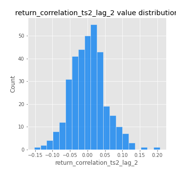
## Feature : return_correlation_ts2_lag_3
- **Feature type** : continous
- **Missing** : 0.0%
- **Unique** : 347
- **Count** :347.0
- **Mean** :0.0010066061034572202
- **Std** :0.04971323699640119
- **Min** :-0.17564076057312866
- **25%th Percentile** : -0.030359292420931223
- **50%th Percentile** : 0.0026276545265496607
- **75%th Percentile** : 0.0369253753301959
- **Max** :0.12502781355851633

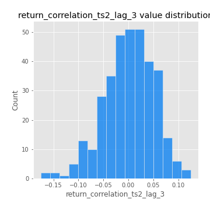
## Feature : sqreturn_autocorrelation_ts1_lag1
- **Feature type** : continous
- **Missing** : 0.0%
- **Unique** : 347
- **Count** :347.0
- **Mean** :0.05463898095274271
- **Std** :0.09190439146847974
- **Min** :-0.09263047336935933
- **25%th Percentile** : -0.005390896731989916
- **50%th Percentile** : 0.033253249311279855
- **75%th Percentile** : 0.08681205294854746
- **Max** :0.49414293176447355

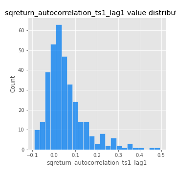
## Feature : sqreturn_autocorrelation_ts1_lag2
- **Feature type** : continous
- **Missing** : 0.0%
- **Unique** : 347
- **Count** :347.0
- **Mean** :0.04341229778594639
- **Std** :0.09589187765100364
- **Min** :-0.11604671685917876
- **25%th Percentile** : -0.012494308094115695
- **50%th Percentile** : 0.020910460694983084
- **75%th Percentile** : 0.06973540568241879
- **Max** :0.540735851444759

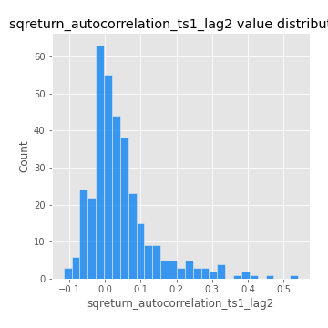
## Feature : sqreturn_autocorrelation_ts1_lag3
- **Feature type** : continous
- **Missing** : 0.0%
- **Unique** : 347
- **Count** :347.0
- **Mean** :0.03342873311832144
- **Std** :0.08395712081295152
- **Min** :-0.11682855387007783
- **25%th Percentile** : -0.017925585263600077
- **50%th Percentile** : 0.014269743043924777
- **75%th Percentile** : 0.06302625843491666
- **Max** :0.44755937369538146

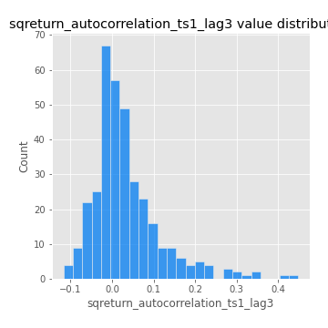
## Feature : sqreturn_autocorrelation_ts2_lag1
- **Feature type** : continous
- **Missing** : 0.0%
- **Unique** : 347
- **Count** :347.0
- **Mean** :0.04788175594417047
- **Std** :0.09207974282078729
- **Min** :-0.1005646011807571
- **25%th Percentile** : -0.01201156891912961
- **50%th Percentile** : 0.02776672827928713
- **75%th Percentile** : 0.07673656701728544
- **Max** :0.510085647437958

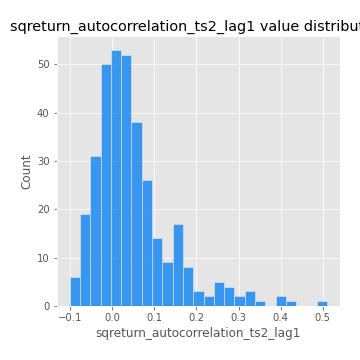
## Feature : sqreturn_autocorrelation_ts2_lag2
- **Feature type** : continous
- **Missing** : 0.0%
- **Unique** : 347
- **Count** :347.0
- **Mean** :0.039426357019708855
- **Std** :0.09289954330858277
- **Min** :-0.15229347305340338
- **25%th Percentile** : -0.013822549302815616
- **50%th Percentile** : 0.01574233289516576
- **75%th Percentile** : 0.06308970692155311
- **Max** :0.5373432415582473

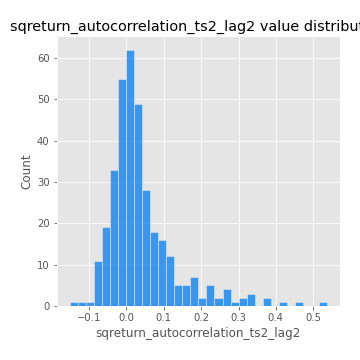
## Feature : sqreturn_autocorrelation_ts2_lag3
- **Feature type** : continous
- **Missing** : 0.0%
- **Unique** : 347
- **Count** :347.0
- **Mean** :0.0266210504947594
- **Std** :0.07162229855478267
- **Min** :-0.11487910643879187
- **25%th Percentile** : -0.02065204143979494
- **50%th Percentile** : 0.01302202124751213
- **75%th Percentile** : 0.055507596243577054
- **Max** :0.31225727797735664

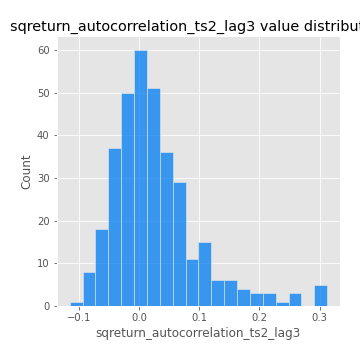
## Feature : sqreturn_correlation_ts1_lag_0
- **Feature type** : continous
- **Missing** : 0.0%
- **Unique** : 347
- **Count** :347.0
- **Mean** :0.31578395004151016
- **Std** :0.10740982495648768
- **Min** :0.005136598099876001
- **25%th Percentile** : 0.266247248665264
- **50%th Percentile** : 0.3132459459793502
- **75%th Percentile** : 0.36282703795486293
- **Max** :0.7041861626832071

## Feature : sqreturn_correlation_ts1_lag_1
- **Feature type** : continous
- **Missing** : 0.0%
- **Unique** : 347
- **Count** :347.0
- **Mean** :-0.004791924233361246
- **Std** :0.04922725767452878
- **Min** :-0.1506680294614535
- **25%th Percentile** : -0.03478225084562163
- **50%th Percentile** : 0.00036059030370543037
- **75%th Percentile** : 0.029189480462206784
- **Max** :0.15499424718508623

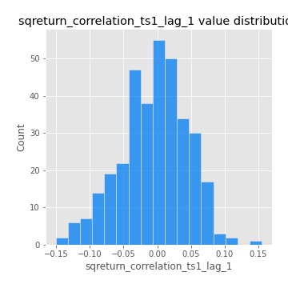
## Feature : sqreturn_correlation_ts1_lag_2
- **Feature type** : continous
- **Missing** : 0.0%
- **Unique** : 347
- **Count** :347.0
- **Mean** :-0.0007904968351809768
- **Std** :0.04840345290465715
- **Min** :-0.12739166472055655
- **25%th Percentile** : -0.03511488352856916
- **50%th Percentile** : -0.00018333386598916331
- **75%th Percentile** : 0.03581162774927429
- **Max** :0.11767929145605416

## Feature : sqreturn_correlation_ts1_lag_3
- **Feature type** : continous
- **Missing** : 0.0%
- **Unique** : 347
- **Count** :347.0
- **Mean** :0.00043959730710519784
- **Std** :0.051389382255327375
- **Min** :-0.1270218498974763
- **25%th Percentile** : -0.03349073331821487
- **50%th Percentile** : 0.0016071904805195047
- **75%th Percentile** : 0.03228138412588559
- **Max** :0.1636773216468148

## Feature : sqreturn_correlation_ts2_lag_1
- **Feature type** : continous
- **Missing** : 0.0%
- **Unique** : 347
- **Count** :347.0
- **Mean** :-0.006085645209810678
- **Std** :0.055537091860120076
- **Min** :-0.2081139431093261
- **25%th Percentile** : -0.03956966489933885
- **50%th Percentile** : -0.007516448632107929
- **75%th Percentile** : 0.030945245289511467
- **Max** :0.17208763791364762

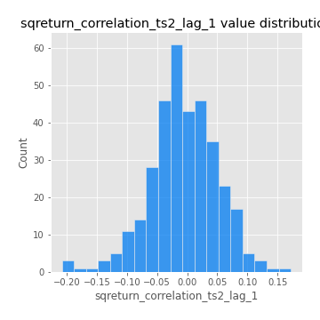
## Feature : sqreturn_correlation_ts2_lag_2
- **Feature type** : continous
- **Missing** : 0.0%
- **Unique** : 347
- **Count** :347.0
- **Mean** :0.002248565575545227
- **Std** :0.04974976335123152
- **Min** :-0.15299951737180204
- **25%th Percentile** : -0.03278690350571123
- **50%th Percentile** : 0.0026979248538658252
- **75%th Percentile** : 0.03077117867772776
- **Max** :0.20772887392904255

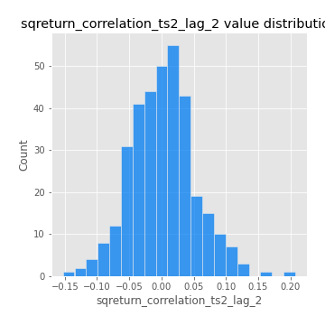
## Feature : sqreturn_correlation_ts2_lag_3
- **Feature type** : continous
- **Missing** : 0.0%
- **Unique** : 347
- **Count** :347.0
- **Mean** :0.0010066061034572202
- **Std** :0.04971323699640119
- **Min** :-0.17564076057312866
- **25%th Percentile** : -0.030359292420931223
- **50%th Percentile** : 0.0026276545265496607
- **75%th Percentile** : 0.0369253753301959
- **Max** :0.12502781355851633

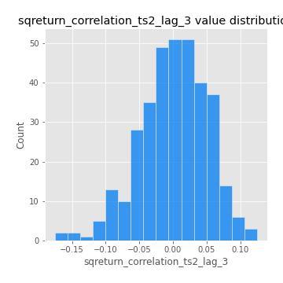
## Feature : price2_granger_cause_price1
- **Feature type** : continous
- **Missing** : 0.0%
- **Unique** : 347
- **Count** :347.0
- **Mean** :0.2947644777618876
- **Std** :0.2969658343566748
- **Min** :2.3388764225225617e-05
- **25%th Percentile** : 0.026476323402624687
- **50%th Percentile** : 0.20429829401138339
- **75%th Percentile** : 0.48809558966018957
- **Max** :0.9967955138664525

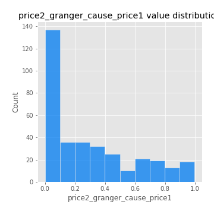
## Feature : price1_granger_cause_price2
- **Feature type** : continous
- **Missing** : 0.0%
- **Unique** : 347
- **Count** :347.0
- **Mean** :0.29765162525288796
- **Std** :0.2829311272061716
- **Min** :1.6323133315620793e-05
- **25%th Percentile** : 0.043594264352500314
- **50%th Percentile** : 0.21053483971394732
- **75%th Percentile** : 0.5120430390942463
- **Max** :0.9951398266867577

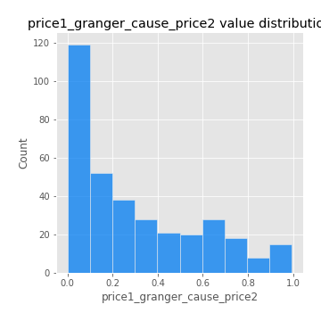

[<< Go back](../README.md)
