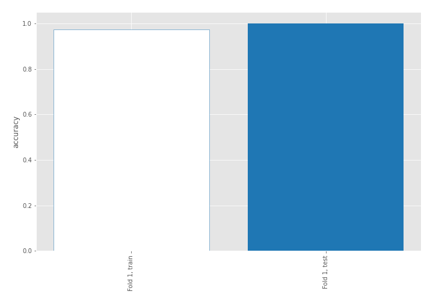
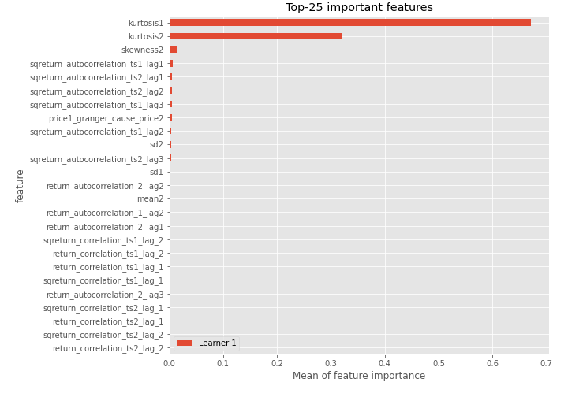
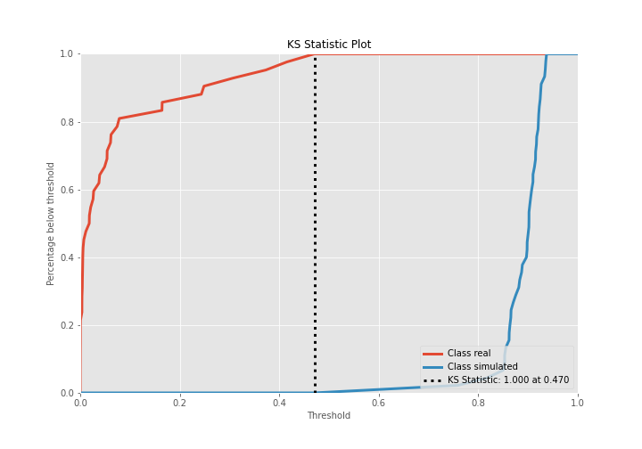
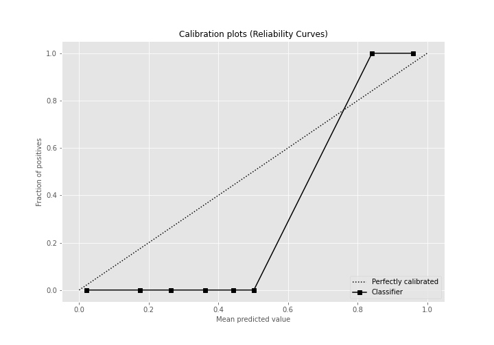
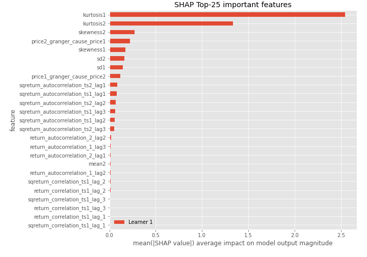
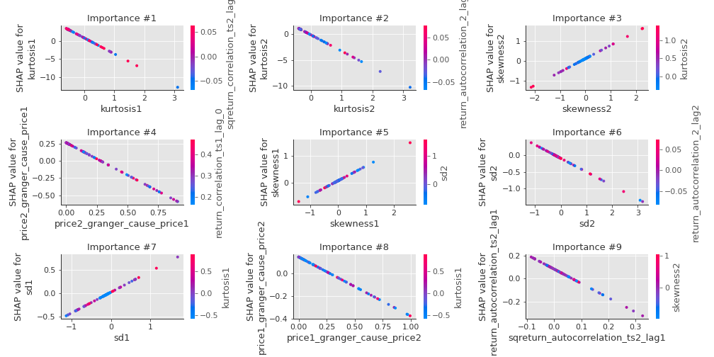
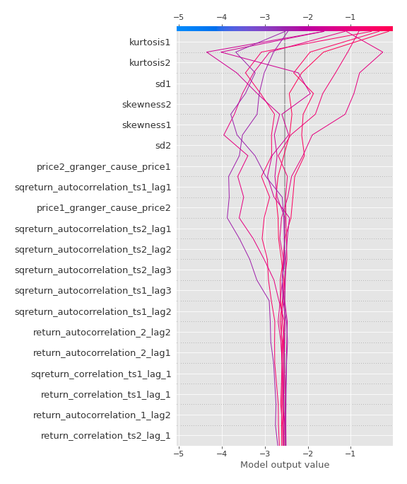
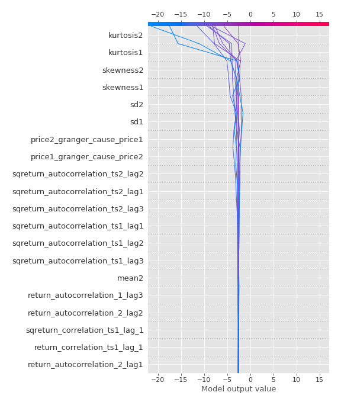
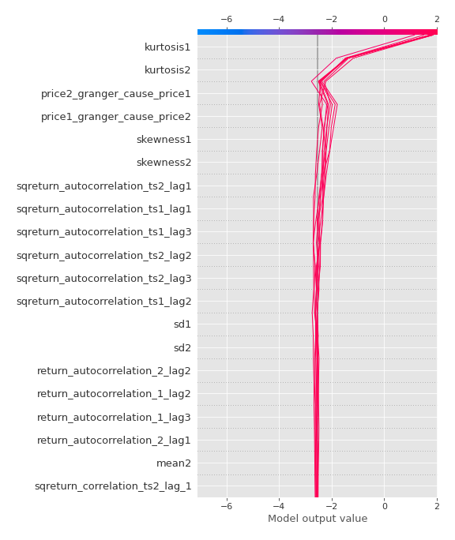
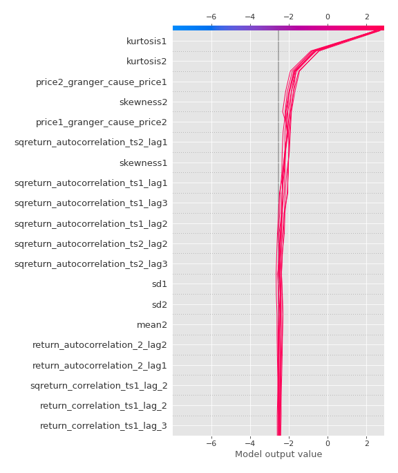

# Summary of 3_Linear

[<< Go back](../README.md)

## Logistic Regression (Linear)
- **n_jobs**: -1
- **explain_level**: 2

## Validation
 - **validation_type**: split
 - **train_ratio**: 0.75
 - **shuffle**: True
 - **stratify**: True

## Optimized metric
accuracy

## Training time

31.3 seconds

## Metric details
|           |    score |     threshold |
|:----------|---------:|--------------:|
| logloss   | 0.100311 | nan           |
| auc       | 1        | nan           |
| f1        | 1        |   0.58302     |
| accuracy  | 1        |   0.58302     |
| precision | 1        |   0.893165    |
| recall    | 1        |   4.43717e-10 |
| mcc       | 1        |   0.58302     |

## Confusion matrix (at threshold=0.58302)
|                      |   Predicted as real |   Predicted as simulated |
|:---------------------|--------------------:|-------------------------:|
| Labeled as real      |                  42 |                        0 |
| Labeled as simulated |                   0 |                       45 |

## Learning curves

## Coefficients
| feature                           |   Learner_1 |
|:----------------------------------|------------:|
| skewness2                         |   0.677167  |
| skewness1                         |   0.548065  |
| return_autocorrelation_2_lag2     |   0.462046  |
| sd1                               |   0.441229  |
| return_autocorrelation_1_lag3     |   0.404548  |
| return_autocorrelation_1_lag2     |   0.370536  |
| return_autocorrelation_2_lag1     |   0.323772  |
| sqreturn_correlation_ts1_lag_2    |   0.321855  |
| return_correlation_ts1_lag_2      |   0.321855  |
| return_correlation_ts1_lag_1      |   0.271443  |
| sqreturn_correlation_ts1_lag_1    |   0.271443  |
| return_correlation_ts2_lag_1      |   0.265633  |
| sqreturn_correlation_ts2_lag_1    |   0.265633  |
| sqreturn_correlation_ts2_lag_3    |   0.239572  |
| return_correlation_ts2_lag_3      |   0.239572  |
| sqreturn_correlation_ts1_lag_3    |   0.228948  |
| return_correlation_ts1_lag_3      |   0.228948  |
| return_autocorrelation_2_lag3     |   0.207798  |
| mean2                             |   0.205964  |
| sqreturn_correlation_ts2_lag_2    |   0.102759  |
| return_correlation_ts2_lag_2      |   0.102759  |
| return_autocorrelation_1_lag1     |   0.0919757 |
| mean1                             |  -0.0863897 |
| sqreturn_correlation_ts1_lag_0    |  -0.123334  |
| return_correlation_ts1_lag_0      |  -0.123334  |
| sd2                               |  -0.4126    |
| price1_granger_cause_price2       |  -0.524668  |
| sqreturn_autocorrelation_ts2_lag3 |  -0.878121  |
| sqreturn_autocorrelation_ts1_lag2 |  -0.911838  |
| price2_granger_cause_price1       |  -0.937625  |
| intercept                         |  -0.957226  |
| sqreturn_autocorrelation_ts1_lag3 |  -1.11109   |
| sqreturn_autocorrelation_ts2_lag2 |  -1.22545   |
| sqreturn_autocorrelation_ts2_lag1 |  -1.24085   |
| sqreturn_autocorrelation_ts1_lag1 |  -1.28356   |
| kurtosis2                         |  -3.17477   |
| kurtosis1                         |  -4.36482   |

## Permutation-based Importance

## Confusion Matrix

## Normalized Confusion Matrix

## ROC Curve

## Kolmogorov-Smirnov Statistic

## Precision-Recall Curve

## Calibration Curve

## Cumulative Gains Curve

## Lift Curve

## SHAP Importance

## SHAP Dependence plots

### Dependence (Fold 1)

## SHAP Decision plots

### Top-10 Worst decisions for class 0 (Fold 1)

### Top-10 Best decisions for class 0 (Fold 1)

### Top-10 Worst decisions for class 1 (Fold 1)

### Top-10 Best decisions for class 1 (Fold 1)

[<< Go back](../README.md)
