# Exploratory Data Analysis

[<< Go back](../README.md)
## Feature : target
- **Feature type** : categorical
- **Missing** : 0.0%
- **Unique** : 2
- **Count** :347
- **Unique** :2
- **Top** :simulated
- **Freq** :178

## Feature : mean1
- **Feature type** : continous
- **Missing** : 0.0%
- **Unique** : 347
- **Count** :347.0
- **Mean** :0.05149644509915604
- **Std** :0.08718495535515221
- **Min** :-0.22632637961920957
- **25%th Percentile** : 0.006931247869280231
- **50%th Percentile** : 0.05183660511222285
- **75%th Percentile** : 0.09938538488672057
- **Max** :0.37175100008111034

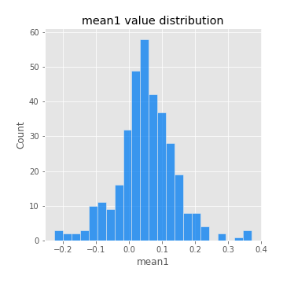
## Feature : mean2
- **Feature type** : continous
- **Missing** : 0.0%
- **Unique** : 347
- **Count** :347.0
- **Mean** :0.0757336153003463
- **Std** :0.08899920205424419
- **Min** :-0.21818165578778434
- **25%th Percentile** : 0.024988938961345707
- **50%th Percentile** : 0.07637190842461924
- **75%th Percentile** : 0.12245231846341972
- **Max** :0.46389098846459037

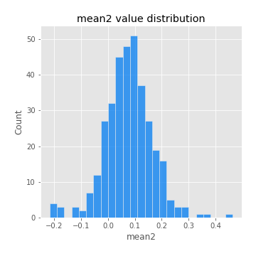
## Feature : sd1
- **Feature type** : continous
- **Missing** : 0.0%
- **Unique** : 347
- **Count** :347.0
- **Mean** :1.8909646321060192
- **Std** :0.7831823672696188
- **Min** :0.7470080772831957
- **25%th Percentile** : 1.6550956419156755
- **50%th Percentile** : 1.8038019541439831
- **75%th Percentile** : 1.8761184922912655
- **Max** :9.236766377527575

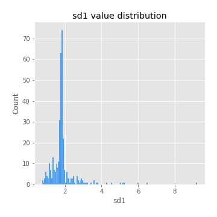
## Feature : sd2
- **Feature type** : continous
- **Missing** : 0.0%
- **Unique** : 347
- **Count** :347.0
- **Mean** :1.7602027908208626
- **Std** :0.5871893054172946
- **Min** :0.8455946193085045
- **25%th Percentile** : 1.5675383956002231
- **50%th Percentile** : 1.6476893176394256
- **75%th Percentile** : 1.7173038640163394
- **Max** :5.042707010333888

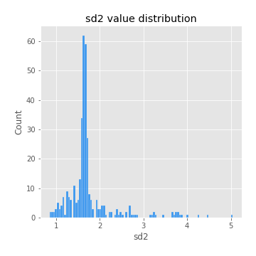
## Feature : skewness1
- **Feature type** : continous
- **Missing** : 0.0%
- **Unique** : 347
- **Count** :347.0
- **Mean** :-0.050122321271335105
- **Std** :0.5622013896478479
- **Min** :-2.817259764925239
- **25%th Percentile** : -0.14911740615377597
- **50%th Percentile** : -0.007876769947503177
- **75%th Percentile** : 0.10230213684580586
- **Max** :2.5845963767725557

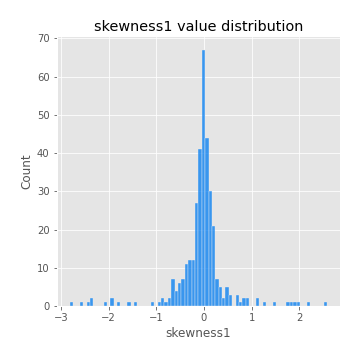
## Feature : skewness2
- **Feature type** : continous
- **Missing** : 0.0%
- **Unique** : 347
- **Count** :347.0
- **Mean** :-0.13612904703539472
- **Std** :0.7368431265047092
- **Min** :-8.801502855292393
- **25%th Percentile** : -0.20971508834102875
- **50%th Percentile** : -0.04603036511363605
- **75%th Percentile** : 0.0901549253506751
- **Max** :2.2606839051517187

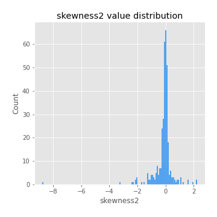
## Feature : kurtosis1
- **Feature type** : continous
- **Missing** : 0.0%
- **Unique** : 347
- **Count** :347.0
- **Mean** :3.064267265281532
- **Std** :5.663511307179347
- **Min** :-0.5024398990298105
- **25%th Percentile** : -0.06101387753535037
- **50%th Percentile** : 0.4387478650804737
- **75%th Percentile** : 3.746268461128576
- **Max** :36.91113889081053

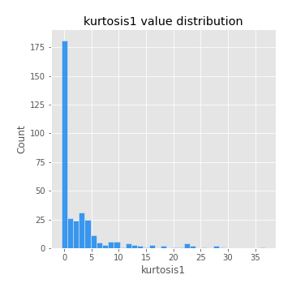
## Feature : kurtosis2
- **Feature type** : continous
- **Missing** : 0.0%
- **Unique** : 347
- **Count** :347.0
- **Mean** :3.5480911820624086
- **Std** :9.350268389285652
- **Min** :-0.47480808825465415
- **25%th Percentile** : -0.040191442511834596
- **50%th Percentile** : 0.4173352778770272
- **75%th Percentile** : 4.109234780795159
- **Max** :143.10871011533666

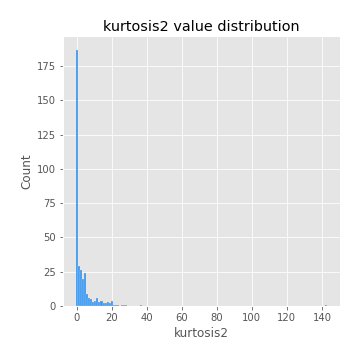
## Feature : return_autocorrelation_1_lag1
- **Feature type** : continous
- **Missing** : 0.0%
- **Unique** : 347
- **Count** :347.0
- **Mean** :-0.009476122525675692
- **Std** :0.05842417611188079
- **Min** :-0.2135576224968752
- **25%th Percentile** : -0.03987518388281227
- **50%th Percentile** : -0.0006045314896276447
- **75%th Percentile** : 0.0294091285869273
- **Max** :0.14005173406641694

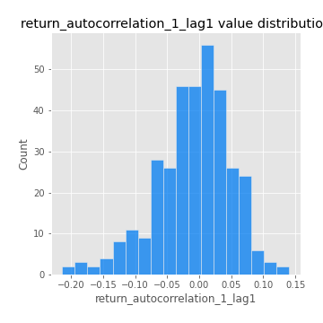
## Feature : return_autocorrelation_1_lag2
- **Feature type** : continous
- **Missing** : 0.0%
- **Unique** : 347
- **Count** :347.0
- **Mean** :-0.004097778178307198
- **Std** :0.050428665879809556
- **Min** :-0.12172858720259
- **25%th Percentile** : -0.03589930318154413
- **50%th Percentile** : -0.0012341336204821686
- **75%th Percentile** : 0.027848283582673085
- **Max** :0.1561488228015672

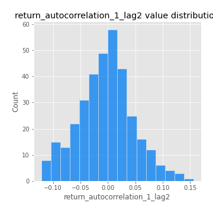
## Feature : return_autocorrelation_1_lag3
- **Feature type** : continous
- **Missing** : 0.0%
- **Unique** : 347
- **Count** :347.0
- **Mean** :-0.002555937068170462
- **Std** :0.05038186264090515
- **Min** :-0.1940836867390813
- **25%th Percentile** : -0.036237726798773504
- **50%th Percentile** : -0.00017942748212601523
- **75%th Percentile** : 0.032320859749407835
- **Max** :0.13366269518901985

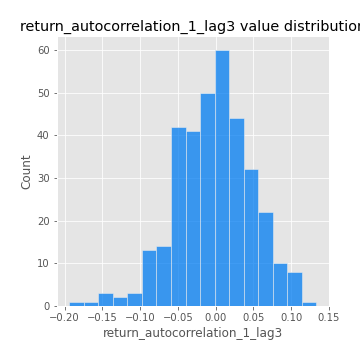
## Feature : return_autocorrelation_2_lag1
- **Feature type** : continous
- **Missing** : 0.0%
- **Unique** : 347
- **Count** :347.0
- **Mean** :-0.009337952601139914
- **Std** :0.056992480952969646
- **Min** :-0.25075531010123286
- **25%th Percentile** : -0.04305968028118701
- **50%th Percentile** : -0.004580481152468063
- **75%th Percentile** : 0.031024331849990608
- **Max** :0.12235403572864123

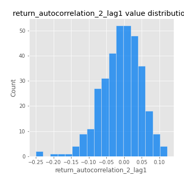
## Feature : return_autocorrelation_2_lag2
- **Feature type** : continous
- **Missing** : 0.0%
- **Unique** : 347
- **Count** :347.0
- **Mean** :0.000516716316877333
- **Std** :0.05042319863981531
- **Min** :-0.15323211089747296
- **25%th Percentile** : -0.03216868603682885
- **50%th Percentile** : -0.0019786601520114383
- **75%th Percentile** : 0.03379684066327783
- **Max** :0.1735398560230086

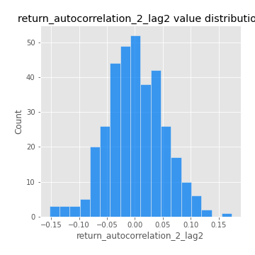
## Feature : return_autocorrelation_2_lag3
- **Feature type** : continous
- **Missing** : 0.0%
- **Unique** : 347
- **Count** :347.0
- **Mean** :-0.0014515378440443248
- **Std** :0.0491240252391156
- **Min** :-0.14200107169559698
- **25%th Percentile** : -0.03521991531229999
- **50%th Percentile** : -0.0021444689493975524
- **75%th Percentile** : 0.033145237159679486
- **Max** :0.1419999376914021

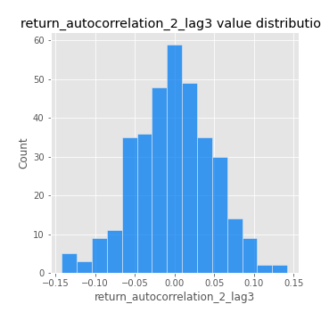
## Feature : return_correlation_ts1_lag_0
- **Feature type** : continous
- **Missing** : 0.0%
- **Unique** : 347
- **Count** :347.0
- **Mean** :0.3126743097811154
- **Std** :0.10420095787435882
- **Min** :-0.027089510445801036
- **25%th Percentile** : 0.2655189332900493
- **50%th Percentile** : 0.3099764110582443
- **75%th Percentile** : 0.3514553387651324
- **Max** :0.7041861626832071

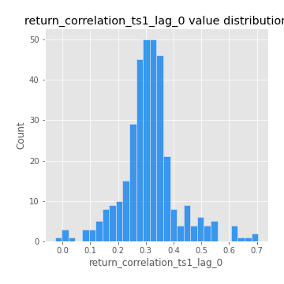
## Feature : return_correlation_ts1_lag_1
- **Feature type** : continous
- **Missing** : 0.0%
- **Unique** : 347
- **Count** :347.0
- **Mean** :-0.005119622906695839
- **Std** :0.051689884090580646
- **Min** :-0.16985510949917193
- **25%th Percentile** : -0.036327346154041165
- **50%th Percentile** : 0.0008555593415918072
- **75%th Percentile** : 0.03033303423020588
- **Max** :0.1625587890585431

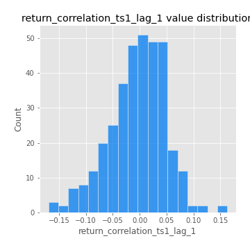
## Feature : return_correlation_ts1_lag_2
- **Feature type** : continous
- **Missing** : 0.0%
- **Unique** : 347
- **Count** :347.0
- **Mean** :0.0029211324110815385
- **Std** :0.04966602080442457
- **Min** :-0.21653581047581763
- **25%th Percentile** : -0.027417147976754763
- **50%th Percentile** : 0.004599138487013788
- **75%th Percentile** : 0.036764567760058535
- **Max** :0.16430371900157578

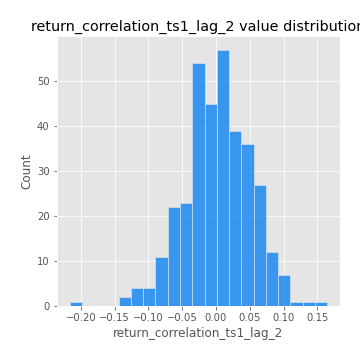
## Feature : return_correlation_ts1_lag_3
- **Feature type** : continous
- **Missing** : 0.0%
- **Unique** : 347
- **Count** :347.0
- **Mean** :0.0017718766801984114
- **Std** :0.05176423864437898
- **Min** :-0.13230827921270563
- **25%th Percentile** : -0.028865990887032105
- **50%th Percentile** : 0.0024125601463771684
- **75%th Percentile** : 0.034676380893724074
- **Max** :0.1636773216468148

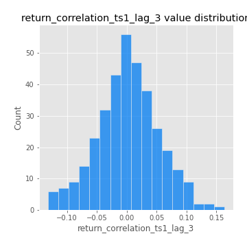
## Feature : return_correlation_ts2_lag_1
- **Feature type** : continous
- **Missing** : 0.0%
- **Unique** : 347
- **Count** :347.0
- **Mean** :-0.0013886094211237733
- **Std** :0.050211731808022984
- **Min** :-0.2081139431093261
- **25%th Percentile** : -0.033637674269088425
- **50%th Percentile** : -0.0009359502363514092
- **75%th Percentile** : 0.030120814985624328
- **Max** :0.17208763791364762

## Feature : return_correlation_ts2_lag_2
- **Feature type** : continous
- **Missing** : 0.0%
- **Unique** : 347
- **Count** :347.0
- **Mean** :0.0021360179766941123
- **Std** :0.052076073033761994
- **Min** :-0.23751835475804678
- **25%th Percentile** : -0.03200355352028679
- **50%th Percentile** : 0.0015402831887021905
- **75%th Percentile** : 0.03955927479865544
- **Max** :0.20772887392904255

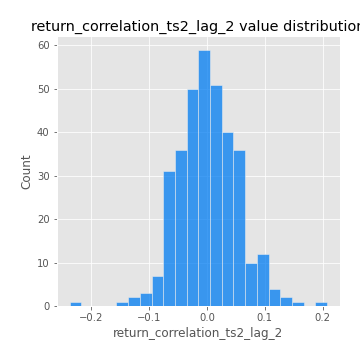
## Feature : return_correlation_ts2_lag_3
- **Feature type** : continous
- **Missing** : 0.0%
- **Unique** : 347
- **Count** :347.0
- **Mean** :0.0008699949940937261
- **Std** :0.05001844903280916
- **Min** :-0.17564076057312866
- **25%th Percentile** : -0.024985497290029312
- **50%th Percentile** : -0.0006673542034418449
- **75%th Percentile** : 0.03524223807396305
- **Max** :0.13128380114518473

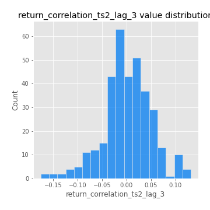
## Feature : sqreturn_autocorrelation_ts1_lag1
- **Feature type** : continous
- **Missing** : 0.0%
- **Unique** : 347
- **Count** :347.0
- **Mean** :0.04964783916380045
- **Std** :0.09339848181986304
- **Min** :-0.11239362231776688
- **25%th Percentile** : -0.012460206991026457
- **50%th Percentile** : 0.028796089537889404
- **75%th Percentile** : 0.08091354498234957
- **Max** :0.4439086285737898

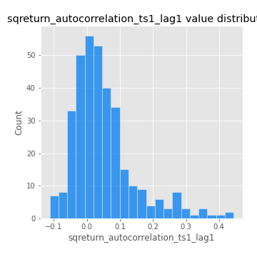
## Feature : sqreturn_autocorrelation_ts1_lag2
- **Feature type** : continous
- **Missing** : 0.0%
- **Unique** : 347
- **Count** :347.0
- **Mean** :0.04008017571965889
- **Std** :0.08474088582474625
- **Min** :-0.1123966551716543
- **25%th Percentile** : -0.012181873588795338
- **50%th Percentile** : 0.019026525573813947
- **75%th Percentile** : 0.06361456226840105
- **Max** :0.42719220751700526

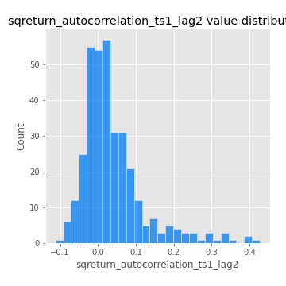
## Feature : sqreturn_autocorrelation_ts1_lag3
- **Feature type** : continous
- **Missing** : 0.0%
- **Unique** : 347
- **Count** :347.0
- **Mean** :0.03007369593451344
- **Std** :0.08012697151195546
- **Min** :-0.14632172265612803
- **25%th Percentile** : -0.017759637467904942
- **50%th Percentile** : 0.011741480115463825
- **75%th Percentile** : 0.05608811939756421
- **Max** :0.34857575772959026

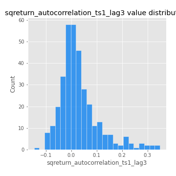
## Feature : sqreturn_autocorrelation_ts2_lag1
- **Feature type** : continous
- **Missing** : 0.0%
- **Unique** : 347
- **Count** :347.0
- **Mean** :0.04539300897949166
- **Std** :0.0822335414284423
- **Min** :-0.08520586663750691
- **25%th Percentile** : -0.00968481347080037
- **50%th Percentile** : 0.026903371386187883
- **75%th Percentile** : 0.07614865691011957
- **Max** :0.4190090519891419

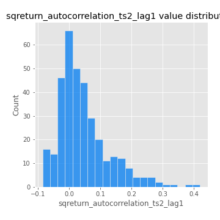
## Feature : sqreturn_autocorrelation_ts2_lag2
- **Feature type** : continous
- **Missing** : 0.0%
- **Unique** : 347
- **Count** :347.0
- **Mean** :0.03363771321114629
- **Std** :0.09090738676076254
- **Min** :-0.11473819399679597
- **25%th Percentile** : -0.01688969917973175
- **50%th Percentile** : 0.013521171434194906
- **75%th Percentile** : 0.05484248990564751
- **Max** :0.5373432415582473

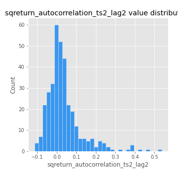
## Feature : sqreturn_autocorrelation_ts2_lag3
- **Feature type** : continous
- **Missing** : 0.0%
- **Unique** : 347
- **Count** :347.0
- **Mean** :0.025918014334873007
- **Std** :0.07380401493672513
- **Min** :-0.1160446999291218
- **25%th Percentile** : -0.01874221185928447
- **50%th Percentile** : 0.013695556704473578
- **75%th Percentile** : 0.05079158527863926
- **Max** :0.31225727797735664

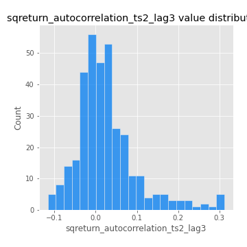
## Feature : sqreturn_correlation_ts1_lag_0
- **Feature type** : continous
- **Missing** : 0.0%
- **Unique** : 347
- **Count** :347.0
- **Mean** :0.3126743097811154
- **Std** :0.10420095787435882
- **Min** :-0.027089510445801036
- **25%th Percentile** : 0.2655189332900493
- **50%th Percentile** : 0.3099764110582443
- **75%th Percentile** : 0.3514553387651324
- **Max** :0.7041861626832071

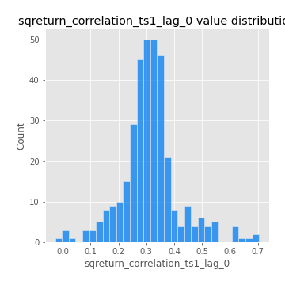
## Feature : sqreturn_correlation_ts1_lag_1
- **Feature type** : continous
- **Missing** : 0.0%
- **Unique** : 347
- **Count** :347.0
- **Mean** :-0.005119622906695839
- **Std** :0.051689884090580646
- **Min** :-0.16985510949917193
- **25%th Percentile** : -0.036327346154041165
- **50%th Percentile** : 0.0008555593415918072
- **75%th Percentile** : 0.03033303423020588
- **Max** :0.1625587890585431

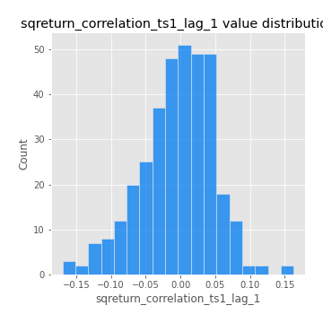
## Feature : sqreturn_correlation_ts1_lag_2
- **Feature type** : continous
- **Missing** : 0.0%
- **Unique** : 347
- **Count** :347.0
- **Mean** :0.0029211324110815385
- **Std** :0.04966602080442457
- **Min** :-0.21653581047581763
- **25%th Percentile** : -0.027417147976754763
- **50%th Percentile** : 0.004599138487013788
- **75%th Percentile** : 0.036764567760058535
- **Max** :0.16430371900157578

## Feature : sqreturn_correlation_ts1_lag_3
- **Feature type** : continous
- **Missing** : 0.0%
- **Unique** : 347
- **Count** :347.0
- **Mean** :0.0017718766801984114
- **Std** :0.05176423864437898
- **Min** :-0.13230827921270563
- **25%th Percentile** : -0.028865990887032105
- **50%th Percentile** : 0.0024125601463771684
- **75%th Percentile** : 0.034676380893724074
- **Max** :0.1636773216468148

## Feature : sqreturn_correlation_ts2_lag_1
- **Feature type** : continous
- **Missing** : 0.0%
- **Unique** : 347
- **Count** :347.0
- **Mean** :-0.0013886094211237733
- **Std** :0.050211731808022984
- **Min** :-0.2081139431093261
- **25%th Percentile** : -0.033637674269088425
- **50%th Percentile** : -0.0009359502363514092
- **75%th Percentile** : 0.030120814985624328
- **Max** :0.17208763791364762

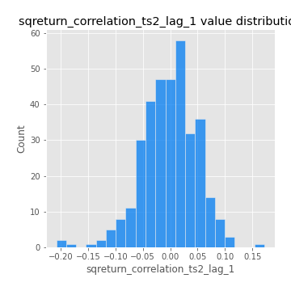
## Feature : sqreturn_correlation_ts2_lag_2
- **Feature type** : continous
- **Missing** : 0.0%
- **Unique** : 347
- **Count** :347.0
- **Mean** :0.0021360179766941123
- **Std** :0.052076073033761994
- **Min** :-0.23751835475804678
- **25%th Percentile** : -0.03200355352028679
- **50%th Percentile** : 0.0015402831887021905
- **75%th Percentile** : 0.03955927479865544
- **Max** :0.20772887392904255

## Feature : sqreturn_correlation_ts2_lag_3
- **Feature type** : continous
- **Missing** : 0.0%
- **Unique** : 347
- **Count** :347.0
- **Mean** :0.0008699949940937261
- **Std** :0.05001844903280916
- **Min** :-0.17564076057312866
- **25%th Percentile** : -0.024985497290029312
- **50%th Percentile** : -0.0006673542034418449
- **75%th Percentile** : 0.03524223807396305
- **Max** :0.13128380114518473

## Feature : price2_granger_cause_price1
- **Feature type** : continous
- **Missing** : 0.0%
- **Unique** : 347
- **Count** :347.0
- **Mean** :0.26213700145902524
- **Std** :0.2781877050983353
- **Min** :5.753126386307542e-07
- **25%th Percentile** : 0.022439660857497733
- **50%th Percentile** : 0.15906885886789413
- **75%th Percentile** : 0.4510756373480035
- **Max** :0.9853666024514321

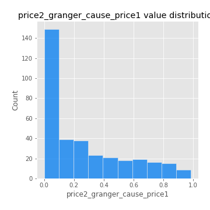
## Feature : price1_granger_cause_price2
- **Feature type** : continous
- **Missing** : 0.0%
- **Unique** : 347
- **Count** :347.0
- **Mean** :0.2817136032508893
- **Std** :0.2834909514950441
- **Min** :2.3290785897656225e-06
- **25%th Percentile** : 0.035421725186301045
- **50%th Percentile** : 0.17963047977069246
- **75%th Percentile** : 0.45729358612745963
- **Max** :0.9951398266867577

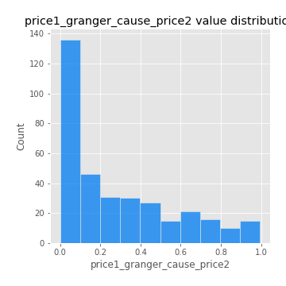

[<< Go back](../README.md)
