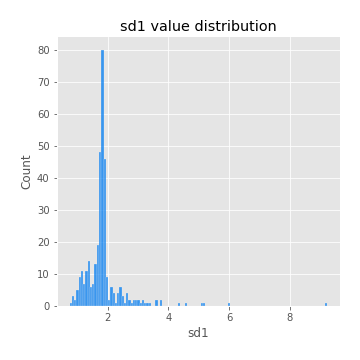
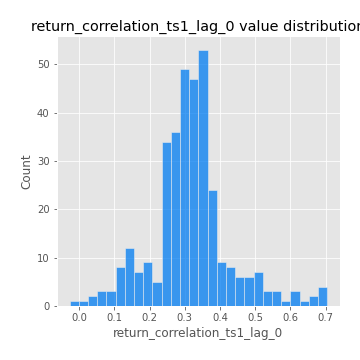
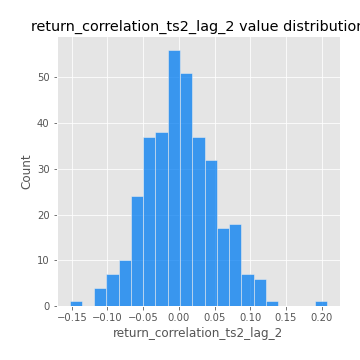

# Exploratory Data Analysis

[<< Go back](../README.md)
## Feature : target
- **Feature type** : categorical
- **Missing** : 0.0%
- **Unique** : 2
- **Count** :347
- **Unique** :2
- **Top** :real
- **Freq** :183

## Feature : mean1
- **Feature type** : continous
- **Missing** : 0.0%
- **Unique** : 347
- **Count** :347.0
- **Mean** :0.05060135421605841
- **Std** :0.08355558150110849
- **Min** :-0.24159235932043924
- **25%th Percentile** : 0.0013426647055598696
- **50%th Percentile** : 0.05349491921336605
- **75%th Percentile** : 0.10087956522964306
- **Max** :0.3612366374600757

## Feature : mean2
- **Feature type** : continous
- **Missing** : 0.0%
- **Unique** : 347
- **Count** :347.0
- **Mean** :0.07098916749340697
- **Std** :0.09176411315219031
- **Min** :-0.24205418062825398
- **25%th Percentile** : 0.03115250417934054
- **50%th Percentile** : 0.0715248530808161
- **75%th Percentile** : 0.11691357182623721
- **Max** :0.4847183666095968

## Feature : sd1
- **Feature type** : continous
- **Missing** : 0.0%
- **Unique** : 347
- **Count** :347.0
- **Mean** :1.8719806775161802
- **Std** :0.7258471088524592
- **Min** :0.7470080772831957
- **25%th Percentile** : 1.6271228751864786
- **50%th Percentile** : 1.8066690807394987
- **75%th Percentile** : 1.889259169636714
- **Max** :9.236766377527575

## Feature : sd2
- **Feature type** : continous
- **Missing** : 0.0%
- **Unique** : 347
- **Count** :347.0
- **Mean** :1.7803081431964451
- **Std** :0.6731687847218701
- **Min** :0.8592887433004143
- **25%th Percentile** : 1.56013045809072
- **50%th Percentile** : 1.6488057076882154
- **75%th Percentile** : 1.7291233482798976
- **Max** :5.762808157208253

## Feature : skewness1
- **Feature type** : continous
- **Missing** : 0.0%
- **Unique** : 347
- **Count** :347.0
- **Mean** :-0.1352029202459008
- **Std** :0.6209121662047296
- **Min** :-3.530116233761814
- **25%th Percentile** : -0.225531498427947
- **50%th Percentile** : -0.045692617502527205
- **75%th Percentile** : 0.08869655852018787
- **Max** :2.5845963767725557

## Feature : skewness2
- **Feature type** : continous
- **Missing** : 0.0%
- **Unique** : 347
- **Count** :347.0
- **Mean** :-0.17275020012906553
- **Std** :0.8377322419304951
- **Min** :-8.801502855292393
- **25%th Percentile** : -0.24205995684983467
- **50%th Percentile** : -0.04557130453677808
- **75%th Percentile** : 0.09763189134842437
- **Max** :2.2606839051517187

## Feature : kurtosis1
- **Feature type** : continous
- **Missing** : 0.0%
- **Unique** : 347
- **Count** :347.0
- **Mean** :3.4972715984511926
- **Std** :6.391234093839621
- **Min** :-0.5497619230716784
- **25%th Percentile** : 0.010353721715853581
- **50%th Percentile** : 1.036885937644493
- **75%th Percentile** : 3.991611060155577
- **Max** :46.07507808162177

## Feature : kurtosis2
- **Feature type** : continous
- **Missing** : 0.0%
- **Unique** : 347
- **Count** :347.0
- **Mean** :4.249231699281636
- **Std** :10.663821621043185
- **Min** :-0.4722609356691523
- **25%th Percentile** : 0.026712922855906207
- **50%th Percentile** : 1.0180535884625033
- **75%th Percentile** : 4.393039424201936
- **Max** :143.10871011533666

## Feature : return_autocorrelation_1_lag1
- **Feature type** : continous
- **Missing** : 0.0%
- **Unique** : 347
- **Count** :347.0
- **Mean** :-0.011676205072049814
- **Std** :0.056161051187282686
- **Min** :-0.2135576224968752
- **25%th Percentile** : -0.040842286577119025
- **50%th Percentile** : -0.006433314077818421
- **75%th Percentile** : 0.02613665786212651
- **Max** :0.12810656890648087

## Feature : return_autocorrelation_1_lag2
- **Feature type** : continous
- **Missing** : 0.0%
- **Unique** : 347
- **Count** :347.0
- **Mean** :-0.006179880630657069
- **Std** :0.05063744536951825
- **Min** :-0.13309283796645122
- **25%th Percentile** : -0.03733367077534049
- **50%th Percentile** : -0.006407172740631561
- **75%th Percentile** : 0.02362175893575134
- **Max** :0.1561488228015672

## Feature : return_autocorrelation_1_lag3
- **Feature type** : continous
- **Missing** : 0.0%
- **Unique** : 347
- **Count** :347.0
- **Mean** :-0.0008442253850363259
- **Std** :0.05338129521903114
- **Min** :-0.1940836867390813
- **25%th Percentile** : -0.03618712744686049
- **50%th Percentile** : 0.0015895832787856364
- **75%th Percentile** : 0.03428101312988571
- **Max** :0.17805869530681923

## Feature : return_autocorrelation_2_lag1
- **Feature type** : continous
- **Missing** : 0.0%
- **Unique** : 347
- **Count** :347.0
- **Mean** :-0.0066201791911963265
- **Std** :0.06199797347981081
- **Min** :-0.24590087874039124
- **25%th Percentile** : -0.037725663752592384
- **50%th Percentile** : -0.0007897084346200915
- **75%th Percentile** : 0.031494373749331055
- **Max** :0.31863413537898483

## Feature : return_autocorrelation_2_lag2
- **Feature type** : continous
- **Missing** : 0.0%
- **Unique** : 347
- **Count** :347.0
- **Mean** :0.0006728517374724577
- **Std** :0.04980558170723515
- **Min** :-0.13300063901033632
- **25%th Percentile** : -0.03261751079502832
- **50%th Percentile** : -0.004081427935014871
- **75%th Percentile** : 0.03303661220099163
- **Max** :0.20974504043791217

## Feature : return_autocorrelation_2_lag3
- **Feature type** : continous
- **Missing** : 0.0%
- **Unique** : 347
- **Count** :347.0
- **Mean** :-0.001702323188894763
- **Std** :0.050951638290331246
- **Min** :-0.15444637904555267
- **25%th Percentile** : -0.03365582764133753
- **50%th Percentile** : -0.0007954854322127135
- **75%th Percentile** : 0.030885566372194112
- **Max** :0.12489629575199976

## Feature : return_correlation_ts1_lag_0
- **Feature type** : continous
- **Missing** : 0.0%
- **Unique** : 347
- **Count** :347.0
- **Mean** :0.3165294965740028
- **Std** :0.11273006002857588
- **Min** :-0.027089510445801036
- **25%th Percentile** : 0.26156082494290916
- **50%th Percentile** : 0.31263094706202
- **75%th Percentile** : 0.3558358266844718
- **Max** :0.7041861626832071

## Feature : return_correlation_ts1_lag_1
- **Feature type** : continous
- **Missing** : 0.0%
- **Unique** : 347
- **Count** :347.0
- **Mean** :-0.0047253425568206334
- **Std** :0.053165114247834176
- **Min** :-0.16985510949917193
- **25%th Percentile** : -0.03700624144304594
- **50%th Percentile** : 0.0017861552929612902
- **75%th Percentile** : 0.03248844669551399
- **Max** :0.15499424718508623

## Feature : return_correlation_ts1_lag_2
- **Feature type** : continous
- **Missing** : 0.0%
- **Unique** : 347
- **Count** :347.0
- **Mean** :-0.0032448017416027786
- **Std** :0.05089111510851479
- **Min** :-0.21653581047581763
- **25%th Percentile** : -0.033574816754409376
- **50%th Percentile** : -0.001327334361081286
- **75%th Percentile** : 0.02910719961256624
- **Max** :0.146287409025898

## Feature : return_correlation_ts1_lag_3
- **Feature type** : continous
- **Missing** : 0.0%
- **Unique** : 347
- **Count** :347.0
- **Mean** :-0.0013452512471713903
- **Std** :0.0519071779665952
- **Min** :-0.13648984649878423
- **25%th Percentile** : -0.036021467265678196
- **50%th Percentile** : -0.0029836932076806677
- **75%th Percentile** : 0.03248285408811577
- **Max** :0.1636773216468148

## Feature : return_correlation_ts2_lag_1
- **Feature type** : continous
- **Missing** : 0.0%
- **Unique** : 347
- **Count** :347.0
- **Mean** :-0.0033932663066163003
- **Std** :0.0511178781306967
- **Min** :-0.20093919236581337
- **25%th Percentile** : -0.03518531850625221
- **50%th Percentile** : -0.000826169937067775
- **75%th Percentile** : 0.028991086583196927
- **Max** :0.11556235671885211

## Feature : return_correlation_ts2_lag_2
- **Feature type** : continous
- **Missing** : 0.0%
- **Unique** : 347
- **Count** :347.0
- **Mean** :0.0022470589504556995
- **Std** :0.049112837472815384
- **Min** :-0.15299951737180204
- **25%th Percentile** : -0.031207810417336355
- **50%th Percentile** : 0.00017685560311833616
- **75%th Percentile** : 0.03100129784425973
- **Max** :0.20772887392904255

## Feature : return_correlation_ts2_lag_3
- **Feature type** : continous
- **Missing** : 0.0%
- **Unique** : 347
- **Count** :347.0
- **Mean** :0.0006381763235767881
- **Std** :0.05308214584972118
- **Min** :-0.17564076057312866
- **25%th Percentile** : -0.02960403306521383
- **50%th Percentile** : -0.0005937702077310013
- **75%th Percentile** : 0.04113821012779244
- **Max** :0.13128380114518473

## Feature : sqreturn_autocorrelation_ts1_lag1
- **Feature type** : continous
- **Missing** : 0.0%
- **Unique** : 347
- **Count** :347.0
- **Mean** :0.05180283821672285
- **Std** :0.09316846634983722
- **Min** :-0.10918484464727926
- **25%th Percentile** : -0.008118988130197142
- **50%th Percentile** : 0.030879358705504813
- **75%th Percentile** : 0.08626020282751887
- **Max** :0.4439086285737898

## Feature : sqreturn_autocorrelation_ts1_lag2
- **Feature type** : continous
- **Missing** : 0.0%
- **Unique** : 347
- **Count** :347.0
- **Mean** :0.03894670641794282
- **Std** :0.09504392579432062
- **Min** :-0.11896211837475426
- **25%th Percentile** : -0.01556179018182163
- **50%th Percentile** : 0.014032852735465399
- **75%th Percentile** : 0.06420564692038422
- **Max** :0.540735851444759

## Feature : sqreturn_autocorrelation_ts1_lag3
- **Feature type** : continous
- **Missing** : 0.0%
- **Unique** : 347
- **Count** :347.0
- **Mean** :0.032414134131924136
- **Std** :0.08209564382376554
- **Min** :-0.09541149248149791
- **25%th Percentile** : -0.017805799497711716
- **50%th Percentile** : 0.012680766069520899
- **75%th Percentile** : 0.05627501674996659
- **Max** :0.44755937369538146

## Feature : sqreturn_autocorrelation_ts2_lag1
- **Feature type** : continous
- **Missing** : 0.0%
- **Unique** : 347
- **Count** :347.0
- **Mean** :0.04892025711164223
- **Std** :0.08789901767090665
- **Min** :-0.08765128163613468
- **25%th Percentile** : -0.007677754936171458
- **50%th Percentile** : 0.031192427314539892
- **75%th Percentile** : 0.08499203295254493
- **Max** :0.510085647437958

## Feature : sqreturn_autocorrelation_ts2_lag2
- **Feature type** : continous
- **Missing** : 0.0%
- **Unique** : 347
- **Count** :347.0
- **Mean** :0.03853751007525152
- **Std** :0.09201714495544443
- **Min** :-0.13467348553393482
- **25%th Percentile** : -0.014270679996454658
- **50%th Percentile** : 0.013799543922851924
- **75%th Percentile** : 0.0699033668991818
- **Max** :0.5373432415582473

## Feature : sqreturn_autocorrelation_ts2_lag3
- **Feature type** : continous
- **Missing** : 0.0%
- **Unique** : 347
- **Count** :347.0
- **Mean** :0.028329532797090034
- **Std** :0.07009647181143598
- **Min** :-0.09780792824459425
- **25%th Percentile** : -0.015698098587169824
- **50%th Percentile** : 0.017737380896666093
- **75%th Percentile** : 0.05593250133510555
- **Max** :0.31225727797735664

## Feature : sqreturn_correlation_ts1_lag_0
- **Feature type** : continous
- **Missing** : 0.0%
- **Unique** : 347
- **Count** :347.0
- **Mean** :0.3165294965740028
- **Std** :0.11273006002857588
- **Min** :-0.027089510445801036
- **25%th Percentile** : 0.26156082494290916
- **50%th Percentile** : 0.31263094706202
- **75%th Percentile** : 0.3558358266844718
- **Max** :0.7041861626832071

## Feature : sqreturn_correlation_ts1_lag_1
- **Feature type** : continous
- **Missing** : 0.0%
- **Unique** : 347
- **Count** :347.0
- **Mean** :-0.0047253425568206334
- **Std** :0.053165114247834176
- **Min** :-0.16985510949917193
- **25%th Percentile** : -0.03700624144304594
- **50%th Percentile** : 0.0017861552929612902
- **75%th Percentile** : 0.03248844669551399
- **Max** :0.15499424718508623

## Feature : sqreturn_correlation_ts1_lag_2
- **Feature type** : continous
- **Missing** : 0.0%
- **Unique** : 347
- **Count** :347.0
- **Mean** :-0.0032448017416027786
- **Std** :0.05089111510851479
- **Min** :-0.21653581047581763
- **25%th Percentile** : -0.033574816754409376
- **50%th Percentile** : -0.001327334361081286
- **75%th Percentile** : 0.02910719961256624
- **Max** :0.146287409025898

## Feature : sqreturn_correlation_ts1_lag_3
- **Feature type** : continous
- **Missing** : 0.0%
- **Unique** : 347
- **Count** :347.0
- **Mean** :-0.0013452512471713903
- **Std** :0.0519071779665952
- **Min** :-0.13648984649878423
- **25%th Percentile** : -0.036021467265678196
- **50%th Percentile** : -0.0029836932076806677
- **75%th Percentile** : 0.03248285408811577
- **Max** :0.1636773216468148

## Feature : sqreturn_correlation_ts2_lag_1
- **Feature type** : continous
- **Missing** : 0.0%
- **Unique** : 347
- **Count** :347.0
- **Mean** :-0.0033932663066163003
- **Std** :0.0511178781306967
- **Min** :-0.20093919236581337
- **25%th Percentile** : -0.03518531850625221
- **50%th Percentile** : -0.000826169937067775
- **75%th Percentile** : 0.028991086583196927
- **Max** :0.11556235671885211

## Feature : sqreturn_correlation_ts2_lag_2
- **Feature type** : continous
- **Missing** : 0.0%
- **Unique** : 347
- **Count** :347.0
- **Mean** :0.0022470589504556995
- **Std** :0.049112837472815384
- **Min** :-0.15299951737180204
- **25%th Percentile** : -0.031207810417336355
- **50%th Percentile** : 0.00017685560311833616
- **75%th Percentile** : 0.03100129784425973
- **Max** :0.20772887392904255

## Feature : sqreturn_correlation_ts2_lag_3
- **Feature type** : continous
- **Missing** : 0.0%
- **Unique** : 347
- **Count** :347.0
- **Mean** :0.0006381763235767881
- **Std** :0.05308214584972118
- **Min** :-0.17564076057312866
- **25%th Percentile** : -0.02960403306521383
- **50%th Percentile** : -0.0005937702077310013
- **75%th Percentile** : 0.04113821012779244
- **Max** :0.13128380114518473

## Feature : price2_granger_cause_price1
- **Feature type** : continous
- **Missing** : 0.0%
- **Unique** : 347
- **Count** :347.0
- **Mean** :0.3030367576299461
- **Std** :0.3026862451198416
- **Min** :1.7807495468635906e-06
- **25%th Percentile** : 0.02586862427089575
- **50%th Percentile** : 0.20368417081248466
- **75%th Percentile** : 0.5324619654356222
- **Max** :0.9944593712356221

## Feature : price1_granger_cause_price2
- **Feature type** : continous
- **Missing** : 0.0%
- **Unique** : 347
- **Count** :347.0
- **Mean** :0.2917631264922079
- **Std** :0.2808926318569911
- **Min** :6.911521699411281e-06
- **25%th Percentile** : 0.04202080483556045
- **50%th Percentile** : 0.20430773058579663
- **75%th Percentile** : 0.48152313474404773
- **Max** :0.9951398266867577

[<< Go back](../README.md)
