# Summary of 3_Linear

[<< Go back](../README.md)

## Logistic Regression (Linear)
- **n_jobs**: -1
- **explain_level**: 2

## Validation
 - **validation_type**: split
 - **train_ratio**: 0.75
 - **shuffle**: True
 - **stratify**: True

## Optimized metric
accuracy

## Training time

40.7 seconds

## Metric details
|           |    score |     threshold |
|:----------|---------:|--------------:|
| logloss   | 0.139824 | nan           |
| auc       | 1        | nan           |
| f1        | 0.988764 |   0.69651     |
| accuracy  | 0.988506 |   0.69651     |
| precision | 1        |   0.927398    |
| recall    | 1        |   1.05558e-14 |
| mcc       | 0.977273 |   0.821314    |

## Confusion matrix (at threshold=0.69651)
|                      |   Predicted as real |   Predicted as simulated |
|:---------------------|--------------------:|-------------------------:|
| Labeled as real      |                  42 |                        1 |
| Labeled as simulated |                   0 |                       44 |

## Learning curves
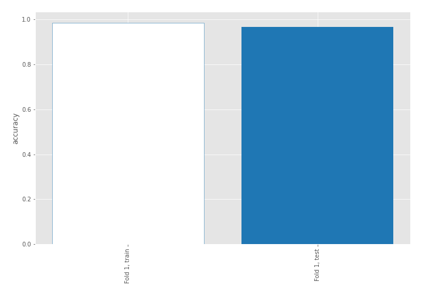

## Coefficients
| feature                           |   Learner_1 |
|:----------------------------------|------------:|
| skewness2                         |  0.87633    |
| skewness1                         |  0.456497   |
| return_autocorrelation_2_lag1     |  0.334688   |
| sqreturn_correlation_ts2_lag_3    |  0.322642   |
| return_correlation_ts2_lag_3      |  0.322642   |
| sd1                               |  0.312727   |
| sqreturn_correlation_ts1_lag_2    |  0.278257   |
| return_correlation_ts1_lag_2      |  0.278257   |
| mean2                             |  0.212668   |
| sqreturn_correlation_ts1_lag_1    |  0.207064   |
| return_correlation_ts1_lag_1      |  0.207064   |
| sqreturn_correlation_ts2_lag_1    |  0.184189   |
| return_correlation_ts2_lag_1      |  0.184189   |
| return_autocorrelation_2_lag3     |  0.179092   |
| return_autocorrelation_1_lag2     |  0.159097   |
| return_autocorrelation_2_lag2     |  0.143515   |
| sqreturn_correlation_ts1_lag_3    |  0.0955362  |
| return_correlation_ts1_lag_3      |  0.0955362  |
| return_correlation_ts2_lag_2      |  0.0681033  |
| sqreturn_correlation_ts2_lag_2    |  0.0681033  |
| return_autocorrelation_1_lag3     |  0.0583276  |
| return_autocorrelation_1_lag1     | -0.00776868 |
| mean1                             | -0.0908354  |
| return_correlation_ts1_lag_0      | -0.143406   |
| sqreturn_correlation_ts1_lag_0    | -0.143406   |
| sd2                               | -0.351583   |
| price1_granger_cause_price2       | -0.51346    |
| sqreturn_autocorrelation_ts2_lag3 | -0.523968   |
| price2_granger_cause_price1       | -0.610297   |
| sqreturn_autocorrelation_ts1_lag3 | -0.839863   |
| sqreturn_autocorrelation_ts1_lag1 | -0.990829   |
| sqreturn_autocorrelation_ts1_lag2 | -1.02784    |
| sqreturn_autocorrelation_ts2_lag2 | -1.07711    |
| sqreturn_autocorrelation_ts2_lag1 | -1.1487     |
| intercept                         | -1.15868    |
| kurtosis2                         | -3.51295    |
| kurtosis1                         | -4.13694    |

## Permutation-based Importance
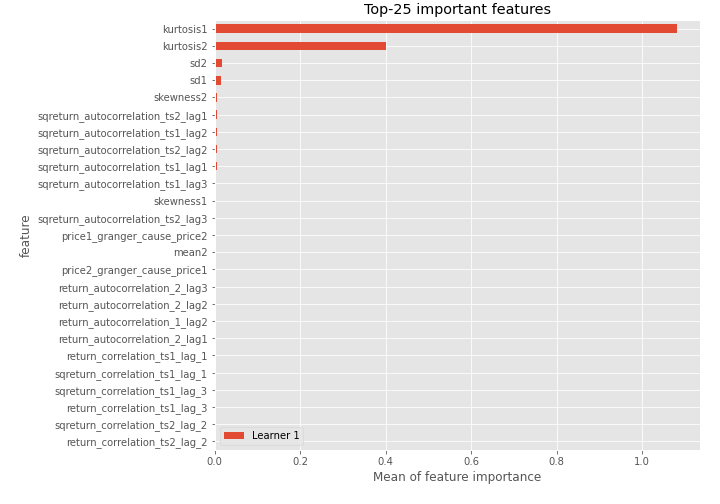
## Confusion Matrix

## Normalized Confusion Matrix

## ROC Curve

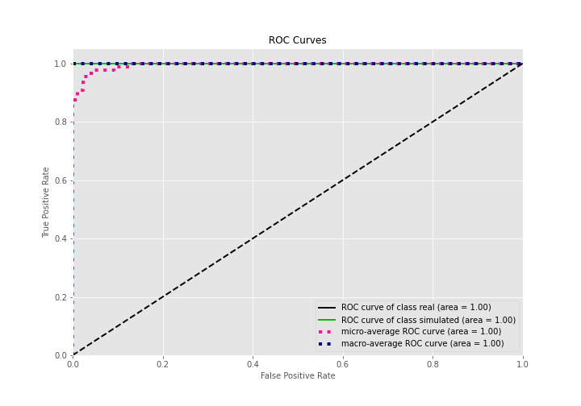

## Kolmogorov-Smirnov Statistic

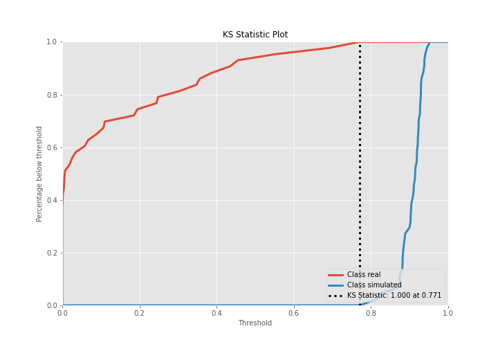

## Precision-Recall Curve

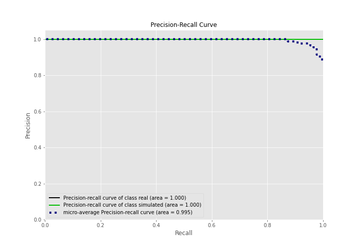

## Calibration Curve

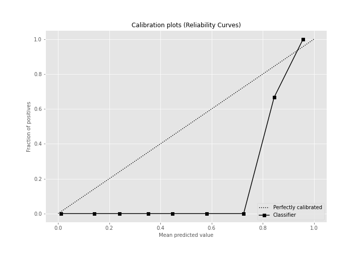

## Cumulative Gains Curve

## Lift Curve

## SHAP Importance
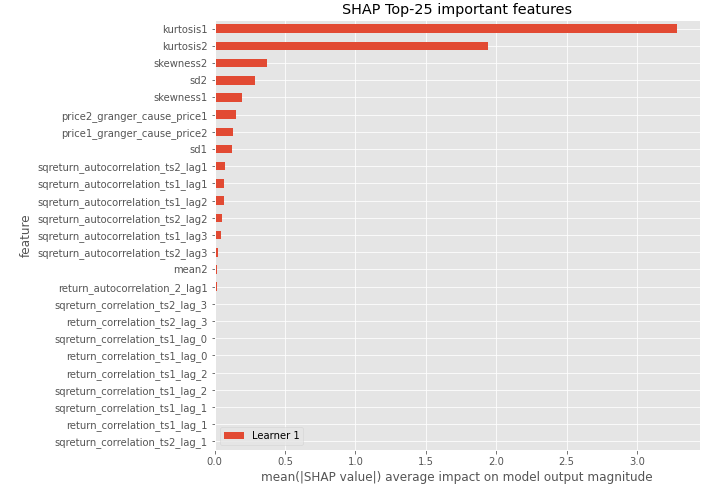

## SHAP Dependence plots

### Dependence (Fold 1)
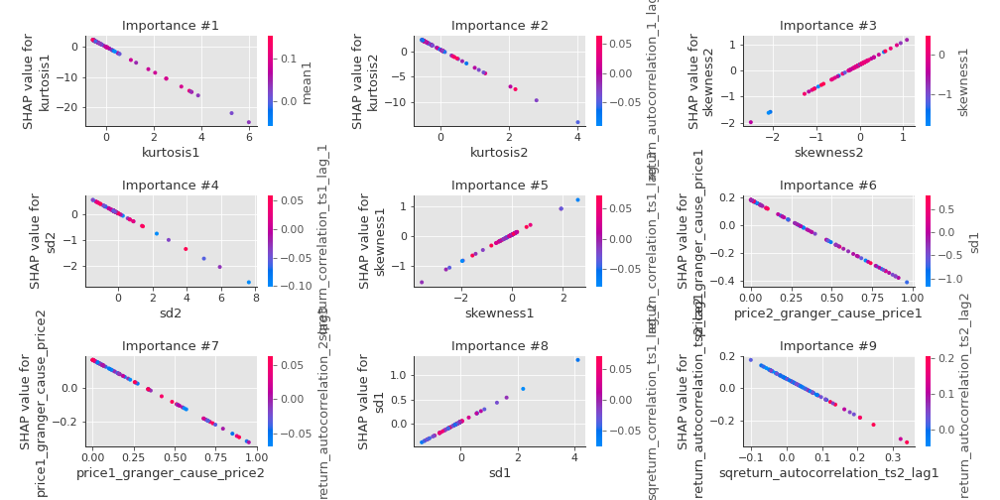

## SHAP Decision plots

### Top-10 Worst decisions for class 0 (Fold 1)
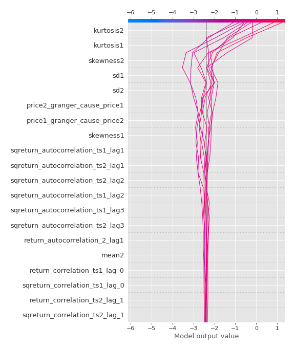
### Top-10 Best decisions for class 0 (Fold 1)
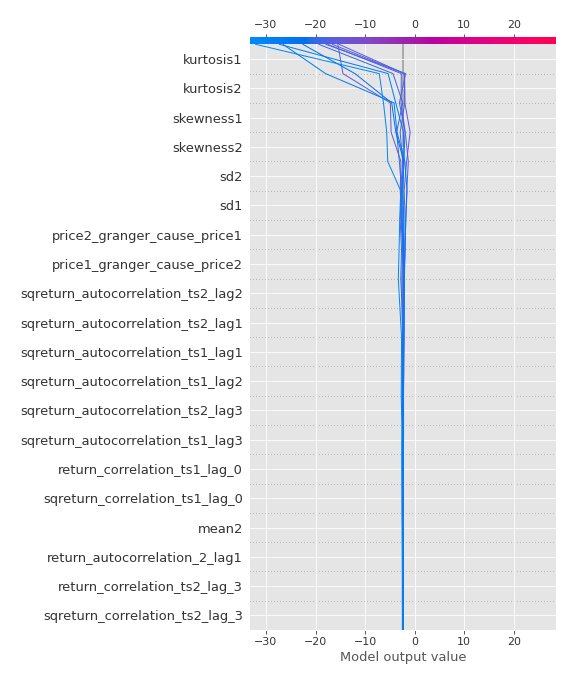
### Top-10 Worst decisions for class 1 (Fold 1)
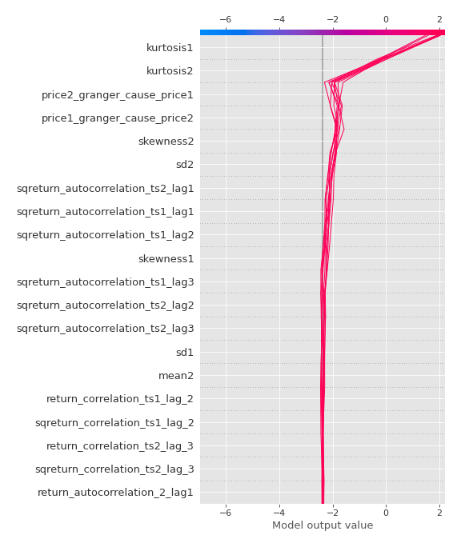
### Top-10 Best decisions for class 1 (Fold 1)
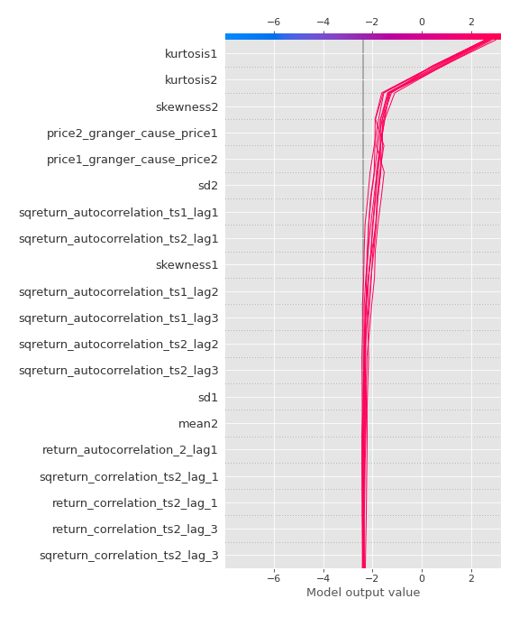

[<< Go back](../README.md)
