# Exploratory Data Analysis

[<< Go back](../README.md)
## Feature : target
- **Feature type** : categorical
- **Missing** : 0.0%
- **Unique** : 2
- **Count** :347
- **Unique** :2
- **Top** :simulated
- **Freq** :177

## Feature : mean1
- **Feature type** : continous
- **Missing** : 0.0%
- **Unique** : 347
- **Count** :347.0
- **Mean** :0.051069794325795274
- **Std** :0.07946301446997726
- **Min** :-0.22632637961920957
- **25%th Percentile** : 0.00700023395337762
- **50%th Percentile** : 0.05493119099752536
- **75%th Percentile** : 0.09552716163800162
- **Max** :0.37175100008111034

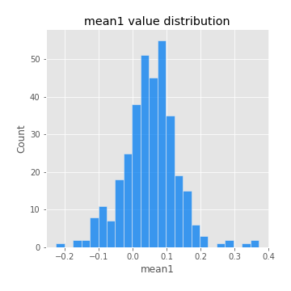
## Feature : mean2
- **Feature type** : continous
- **Missing** : 0.0%
- **Unique** : 347
- **Count** :347.0
- **Mean** :0.0782305656553797
- **Std** :0.0910807199507879
- **Min** :-0.2144814672643959
- **25%th Percentile** : 0.02858942041381355
- **50%th Percentile** : 0.07560207566623522
- **75%th Percentile** : 0.13001234999824668
- **Max** :0.37616608147096464

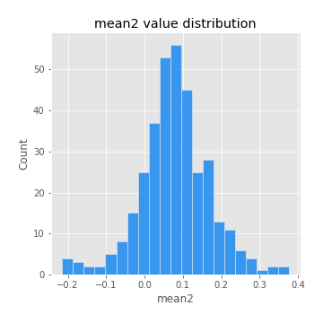
## Feature : sd1
- **Feature type** : continous
- **Missing** : 0.0%
- **Unique** : 347
- **Count** :347.0
- **Mean** :1.8702620016177744
- **Std** :0.7267031941812612
- **Min** :0.8382061051466024
- **25%th Percentile** : 1.6613148468316
- **50%th Percentile** : 1.813814289169925
- **75%th Percentile** : 1.8773875887358578
- **Max** :9.236766377527575

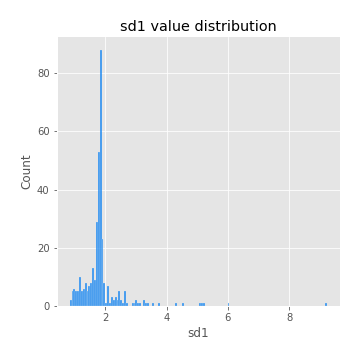
## Feature : sd2
- **Feature type** : continous
- **Missing** : 0.0%
- **Unique** : 347
- **Count** :347.0
- **Mean** :1.8108487695494282
- **Std** :0.7265020618053967
- **Min** :0.8455946193085045
- **25%th Percentile** : 1.5792216942958515
- **50%th Percentile** : 1.6527125967607605
- **75%th Percentile** : 1.7358595906841185
- **Max** :6.737618636746393

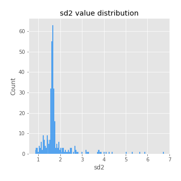
## Feature : skewness1
- **Feature type** : continous
- **Missing** : 0.0%
- **Unique** : 347
- **Count** :347.0
- **Mean** :-0.11861780772141894
- **Std** :0.5798971441660262
- **Min** :-3.530116233761814
- **25%th Percentile** : -0.19549452009139742
- **50%th Percentile** : -0.021559255307171912
- **75%th Percentile** : 0.09035875532146678
- **Max** :2.5845963767725557

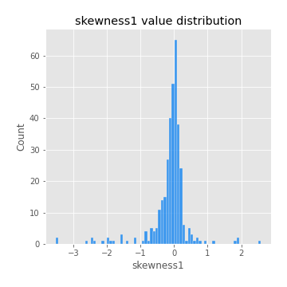
## Feature : skewness2
- **Feature type** : continous
- **Missing** : 0.0%
- **Unique** : 347
- **Count** :347.0
- **Mean** :-0.14813117815304355
- **Std** :0.7095922634163042
- **Min** :-5.778144124281153
- **25%th Percentile** : -0.2295395588854385
- **50%th Percentile** : -0.04094971028153852
- **75%th Percentile** : 0.07559570754358765
- **Max** :2.2606839051517187

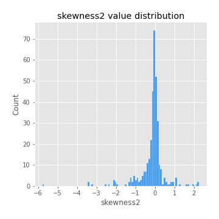
## Feature : kurtosis1
- **Feature type** : continous
- **Missing** : 0.0%
- **Unique** : 347
- **Count** :347.0
- **Mean** :3.0756106836109915
- **Std** :6.032409766761164
- **Min** :-0.4876739786094433
- **25%th Percentile** : -0.0029131844361141024
- **50%th Percentile** : 0.41590622445208814
- **75%th Percentile** : 3.4722373045745223
- **Max** :46.07507808162177

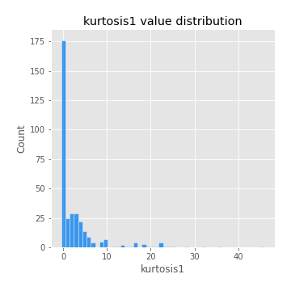
## Feature : kurtosis2
- **Feature type** : continous
- **Missing** : 0.0%
- **Unique** : 347
- **Count** :347.0
- **Mean** :3.774745513154123
- **Std** :7.611968968033527
- **Min** :-0.49121697080649795
- **25%th Percentile** : -0.04328066591820101
- **50%th Percentile** : 0.5605721164277155
- **75%th Percentile** : 4.45777438765429
- **Max** :71.39844769176813

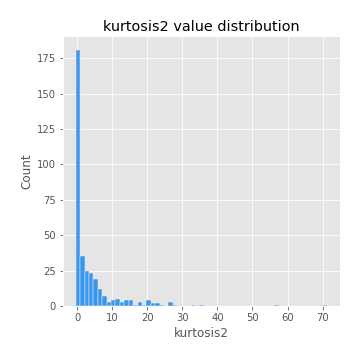
## Feature : return_autocorrelation_1_lag1
- **Feature type** : continous
- **Missing** : 0.0%
- **Unique** : 347
- **Count** :347.0
- **Mean** :-0.011826766782415309
- **Std** :0.05729624437445553
- **Min** :-0.2135576224968752
- **25%th Percentile** : -0.03953974327266144
- **50%th Percentile** : -0.007905682211225748
- **75%th Percentile** : 0.025115571544792784
- **Max** :0.12810656890648087

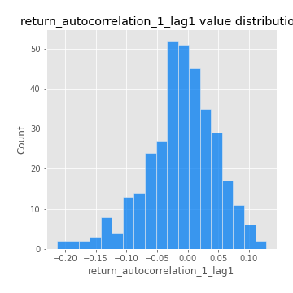
## Feature : return_autocorrelation_1_lag2
- **Feature type** : continous
- **Missing** : 0.0%
- **Unique** : 347
- **Count** :347.0
- **Mean** :-0.006919244404750039
- **Std** :0.047766797387978954
- **Min** :-0.13138927979465564
- **25%th Percentile** : -0.03733367077534049
- **50%th Percentile** : -0.0089962175538008
- **75%th Percentile** : 0.023946547773345053
- **Max** :0.1413776072679595

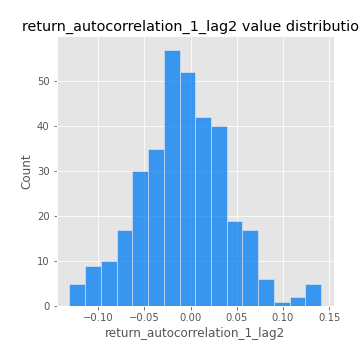
## Feature : return_autocorrelation_1_lag3
- **Feature type** : continous
- **Missing** : 0.0%
- **Unique** : 347
- **Count** :347.0
- **Mean** :3.7082994088638495e-05
- **Std** :0.04973496427249523
- **Min** :-0.1940836867390813
- **25%th Percentile** : -0.029773709138589337
- **50%th Percentile** : -0.00038564435691356786
- **75%th Percentile** : 0.030632108701112347
- **Max** :0.17805869530681923

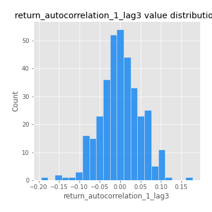
## Feature : return_autocorrelation_2_lag1
- **Feature type** : continous
- **Missing** : 0.0%
- **Unique** : 347
- **Count** :347.0
- **Mean** :-0.00672143334242453
- **Std** :0.06354834910860324
- **Min** :-0.24590087874039124
- **25%th Percentile** : -0.03889857972669965
- **50%th Percentile** : -0.005203239601871359
- **75%th Percentile** : 0.03133204805306825
- **Max** :0.31863413537898483

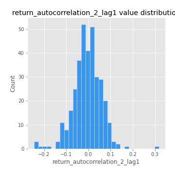
## Feature : return_autocorrelation_2_lag2
- **Feature type** : continous
- **Missing** : 0.0%
- **Unique** : 347
- **Count** :347.0
- **Mean** :-0.004155037188669745
- **Std** :0.0516140162383481
- **Min** :-0.15323211089747296
- **25%th Percentile** : -0.040038435239269976
- **50%th Percentile** : -0.005957388944154117
- **75%th Percentile** : 0.028666889471372706
- **Max** :0.20974504043791217

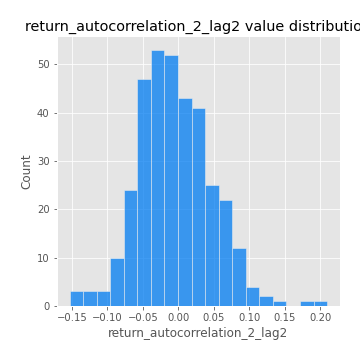
## Feature : return_autocorrelation_2_lag3
- **Feature type** : continous
- **Missing** : 0.0%
- **Unique** : 347
- **Count** :347.0
- **Mean** :-0.00031924181352853566
- **Std** :0.050373065271497805
- **Min** :-0.14200107169559698
- **25%th Percentile** : -0.03551342527045641
- **50%th Percentile** : -0.00028954731996032893
- **75%th Percentile** : 0.031231652260968024
- **Max** :0.1419999376914021

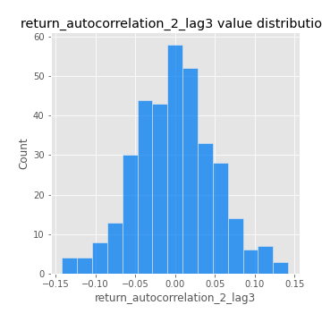
## Feature : return_correlation_ts1_lag_0
- **Feature type** : continous
- **Missing** : 0.0%
- **Unique** : 347
- **Count** :347.0
- **Mean** :0.3086451824051342
- **Std** :0.1057825521470314
- **Min** :-0.027089510445801036
- **25%th Percentile** : 0.255423573558636
- **50%th Percentile** : 0.3094059637898837
- **75%th Percentile** : 0.3570695321402913
- **Max** :0.7041861626832071

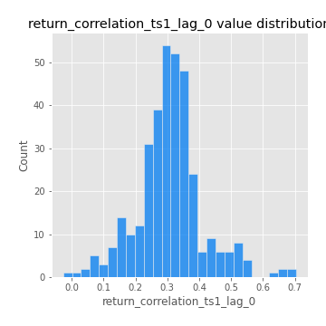
## Feature : return_correlation_ts1_lag_1
- **Feature type** : continous
- **Missing** : 0.0%
- **Unique** : 347
- **Count** :347.0
- **Mean** :-0.004312440212803084
- **Std** :0.04934455267026482
- **Min** :-0.16985510949917193
- **25%th Percentile** : -0.03780614157487445
- **50%th Percentile** : -2.377646402126443e-05
- **75%th Percentile** : 0.031210815774307087
- **Max** :0.15499424718508623

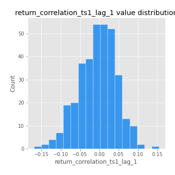
## Feature : return_correlation_ts1_lag_2
- **Feature type** : continous
- **Missing** : 0.0%
- **Unique** : 347
- **Count** :347.0
- **Mean** :-0.004120071638098501
- **Std** :0.047793613856489094
- **Min** :-0.21653581047581763
- **25%th Percentile** : -0.0343939137422415
- **50%th Percentile** : -0.005763642384111221
- **75%th Percentile** : 0.0264847405844747
- **Max** :0.10916944041387708

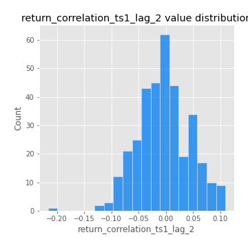
## Feature : return_correlation_ts1_lag_3
- **Feature type** : continous
- **Missing** : 0.0%
- **Unique** : 347
- **Count** :347.0
- **Mean** :0.004887210130767695
- **Std** :0.0488617462816213
- **Min** :-0.12306593817498207
- **25%th Percentile** : -0.026112638349944206
- **50%th Percentile** : 0.002651825677982096
- **75%th Percentile** : 0.03833627522683172
- **Max** :0.1636773216468148

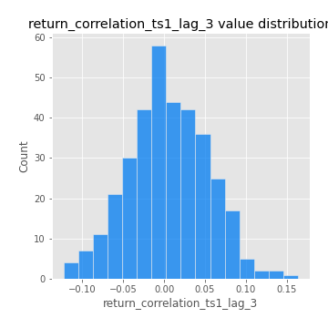
## Feature : return_correlation_ts2_lag_1
- **Feature type** : continous
- **Missing** : 0.0%
- **Unique** : 347
- **Count** :347.0
- **Mean** :-0.004367464293882261
- **Std** :0.05292164978328894
- **Min** :-0.2081139431093261
- **25%th Percentile** : -0.0362792396585823
- **50%th Percentile** : -0.005222273104363277
- **75%th Percentile** : 0.028109079955922052
- **Max** :0.13835607134083608

## Feature : return_correlation_ts2_lag_2
- **Feature type** : continous
- **Missing** : 0.0%
- **Unique** : 347
- **Count** :347.0
- **Mean** :-0.00030727051084925955
- **Std** :0.04949964454012494
- **Min** :-0.23751835475804678
- **25%th Percentile** : -0.028998143347242232
- **50%th Percentile** : 9.025297869481931e-05
- **75%th Percentile** : 0.030048886468140645
- **Max** :0.15388933426238696

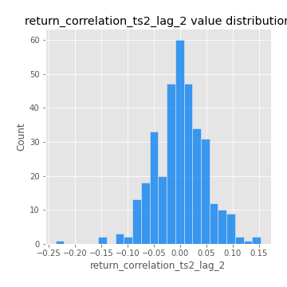
## Feature : return_correlation_ts2_lag_3
- **Feature type** : continous
- **Missing** : 0.0%
- **Unique** : 347
- **Count** :347.0
- **Mean** :0.005093252259904356
- **Std** :0.047177655348401924
- **Min** :-0.15490495486968472
- **25%th Percentile** : -0.024180235854871224
- **50%th Percentile** : 0.006812876015558425
- **75%th Percentile** : 0.03695222342548561
- **Max** :0.13128380114518473

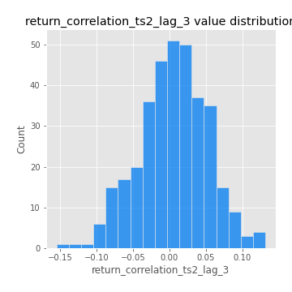
## Feature : sqreturn_autocorrelation_ts1_lag1
- **Feature type** : continous
- **Missing** : 0.0%
- **Unique** : 347
- **Count** :347.0
- **Mean** :0.051313526945305096
- **Std** :0.09419596070856728
- **Min** :-0.11045585479559837
- **25%th Percentile** : -0.010094163816290504
- **50%th Percentile** : 0.027669307176337657
- **75%th Percentile** : 0.08574582676669582
- **Max** :0.49414293176447355

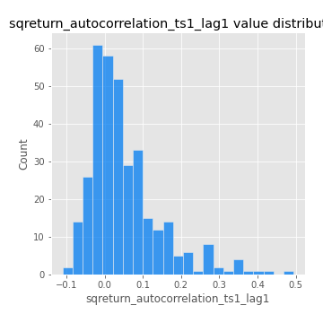
## Feature : sqreturn_autocorrelation_ts1_lag2
- **Feature type** : continous
- **Missing** : 0.0%
- **Unique** : 347
- **Count** :347.0
- **Mean** :0.040445068821081814
- **Std** :0.09425314937081061
- **Min** :-0.12152591539000296
- **25%th Percentile** : -0.016144008601711526
- **50%th Percentile** : 0.01860914526031394
- **75%th Percentile** : 0.06664839168202533
- **Max** :0.540735851444759

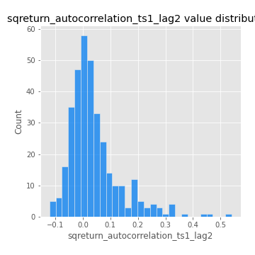
## Feature : sqreturn_autocorrelation_ts1_lag3
- **Feature type** : continous
- **Missing** : 0.0%
- **Unique** : 347
- **Count** :347.0
- **Mean** :0.03400661957505407
- **Std** :0.08304914433693
- **Min** :-0.11159578708584107
- **25%th Percentile** : -0.016331960081763235
- **50%th Percentile** : 0.015055193737716006
- **75%th Percentile** : 0.056209056365684365
- **Max** :0.44755937369538146

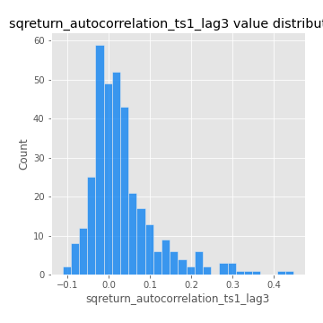
## Feature : sqreturn_autocorrelation_ts2_lag1
- **Feature type** : continous
- **Missing** : 0.0%
- **Unique** : 347
- **Count** :347.0
- **Mean** :0.04742627759489762
- **Std** :0.08900768225391627
- **Min** :-0.10100737816430358
- **25%th Percentile** : -0.008948274000141844
- **50%th Percentile** : 0.02909396323342689
- **75%th Percentile** : 0.07585419650506672
- **Max** :0.510085647437958

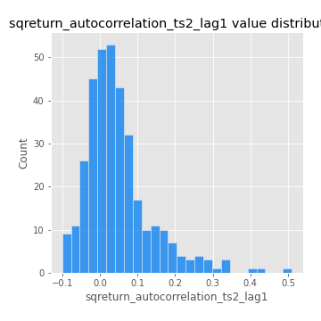
## Feature : sqreturn_autocorrelation_ts2_lag2
- **Feature type** : continous
- **Missing** : 0.0%
- **Unique** : 347
- **Count** :347.0
- **Mean** :0.03412052040264478
- **Std** :0.08768611120858254
- **Min** :-0.10561355089781183
- **25%th Percentile** : -0.015113911061815014
- **50%th Percentile** : 0.00978309395110894
- **75%th Percentile** : 0.05100778608716561
- **Max** :0.5373432415582473

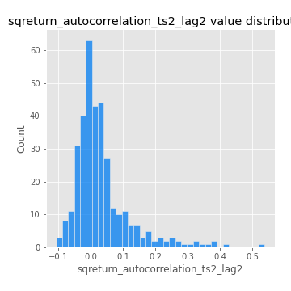
## Feature : sqreturn_autocorrelation_ts2_lag3
- **Feature type** : continous
- **Missing** : 0.0%
- **Unique** : 347
- **Count** :347.0
- **Mean** :0.026235699340179188
- **Std** :0.06706441841662877
- **Min** :-0.10519666190459899
- **25%th Percentile** : -0.012412831632424483
- **50%th Percentile** : 0.012739058364687366
- **75%th Percentile** : 0.048193981927983284
- **Max** :0.30256115637327263

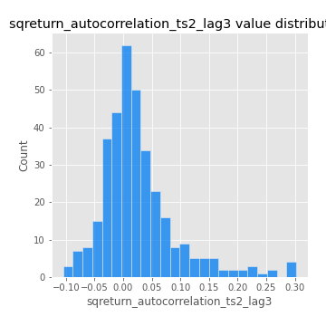
## Feature : sqreturn_correlation_ts1_lag_0
- **Feature type** : continous
- **Missing** : 0.0%
- **Unique** : 347
- **Count** :347.0
- **Mean** :0.3086451824051342
- **Std** :0.1057825521470314
- **Min** :-0.027089510445801036
- **25%th Percentile** : 0.255423573558636
- **50%th Percentile** : 0.3094059637898837
- **75%th Percentile** : 0.3570695321402913
- **Max** :0.7041861626832071

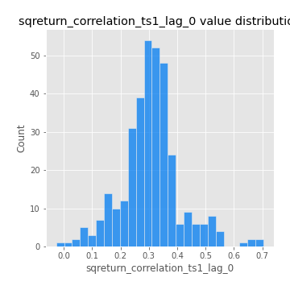
## Feature : sqreturn_correlation_ts1_lag_1
- **Feature type** : continous
- **Missing** : 0.0%
- **Unique** : 347
- **Count** :347.0
- **Mean** :-0.004312440212803084
- **Std** :0.04934455267026482
- **Min** :-0.16985510949917193
- **25%th Percentile** : -0.03780614157487445
- **50%th Percentile** : -2.377646402126443e-05
- **75%th Percentile** : 0.031210815774307087
- **Max** :0.15499424718508623

## Feature : sqreturn_correlation_ts1_lag_2
- **Feature type** : continous
- **Missing** : 0.0%
- **Unique** : 347
- **Count** :347.0
- **Mean** :-0.004120071638098501
- **Std** :0.047793613856489094
- **Min** :-0.21653581047581763
- **25%th Percentile** : -0.0343939137422415
- **50%th Percentile** : -0.005763642384111221
- **75%th Percentile** : 0.0264847405844747
- **Max** :0.10916944041387708

## Feature : sqreturn_correlation_ts1_lag_3
- **Feature type** : continous
- **Missing** : 0.0%
- **Unique** : 347
- **Count** :347.0
- **Mean** :0.004887210130767695
- **Std** :0.0488617462816213
- **Min** :-0.12306593817498207
- **25%th Percentile** : -0.026112638349944206
- **50%th Percentile** : 0.002651825677982096
- **75%th Percentile** : 0.03833627522683172
- **Max** :0.1636773216468148

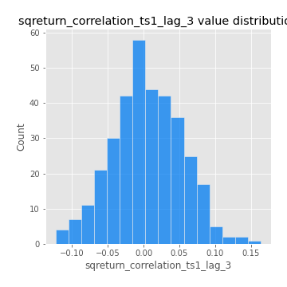
## Feature : sqreturn_correlation_ts2_lag_1
- **Feature type** : continous
- **Missing** : 0.0%
- **Unique** : 347
- **Count** :347.0
- **Mean** :-0.004367464293882261
- **Std** :0.05292164978328894
- **Min** :-0.2081139431093261
- **25%th Percentile** : -0.0362792396585823
- **50%th Percentile** : -0.005222273104363277
- **75%th Percentile** : 0.028109079955922052
- **Max** :0.13835607134083608

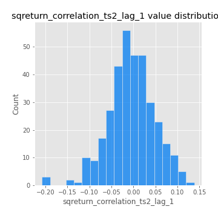
## Feature : sqreturn_correlation_ts2_lag_2
- **Feature type** : continous
- **Missing** : 0.0%
- **Unique** : 347
- **Count** :347.0
- **Mean** :-0.00030727051084925955
- **Std** :0.04949964454012494
- **Min** :-0.23751835475804678
- **25%th Percentile** : -0.028998143347242232
- **50%th Percentile** : 9.025297869481931e-05
- **75%th Percentile** : 0.030048886468140645
- **Max** :0.15388933426238696

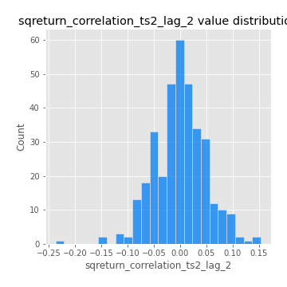
## Feature : sqreturn_correlation_ts2_lag_3
- **Feature type** : continous
- **Missing** : 0.0%
- **Unique** : 347
- **Count** :347.0
- **Mean** :0.005093252259904356
- **Std** :0.047177655348401924
- **Min** :-0.15490495486968472
- **25%th Percentile** : -0.024180235854871224
- **50%th Percentile** : 0.006812876015558425
- **75%th Percentile** : 0.03695222342548561
- **Max** :0.13128380114518473

## Feature : price2_granger_cause_price1
- **Feature type** : continous
- **Missing** : 0.0%
- **Unique** : 347
- **Count** :347.0
- **Mean** :0.3000975422368301
- **Std** :0.2926167995156093
- **Min** :4.558327243054726e-07
- **25%th Percentile** : 0.03796338430248121
- **50%th Percentile** : 0.2102911294332598
- **75%th Percentile** : 0.5240375197574145
- **Max** :0.9885712803689185

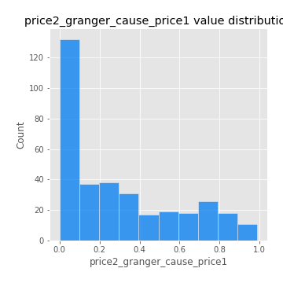
## Feature : price1_granger_cause_price2
- **Feature type** : continous
- **Missing** : 0.0%
- **Unique** : 347
- **Count** :347.0
- **Mean** :0.2829921608049591
- **Std** :0.2775308732402557
- **Min** :3.0219484447647793e-07
- **25%th Percentile** : 0.038537299776540704
- **50%th Percentile** : 0.18738668364740413
- **75%th Percentile** : 0.47050977416640244
- **Max** :0.9757906681614602

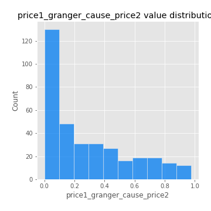

[<< Go back](../README.md)
