# Summary of 3_Linear

[<< Go back](../README.md)

## Logistic Regression (Linear)
- **n_jobs**: -1
- **explain_level**: 2

## Validation
 - **validation_type**: split
 - **train_ratio**: 0.75
 - **shuffle**: True
 - **stratify**: True

## Optimized metric
accuracy

## Training time

56.5 seconds

## Metric details
|           |    score |     threshold |
|:----------|---------:|--------------:|
| logloss   | 0.115042 | nan           |
| auc       | 1        | nan           |
| f1        | 1        |   0.605003    |
| accuracy  | 1        |   0.605003    |
| precision | 1        |   0.605003    |
| recall    | 1        |   6.57886e-09 |
| mcc       | 1        |   0.605003    |

## Confusion matrix (at threshold=0.605003)
|                      |   Predicted as real |   Predicted as simulated |
|:---------------------|--------------------:|-------------------------:|
| Labeled as real      |                  43 |                        0 |
| Labeled as simulated |                   0 |                       44 |

## Learning curves
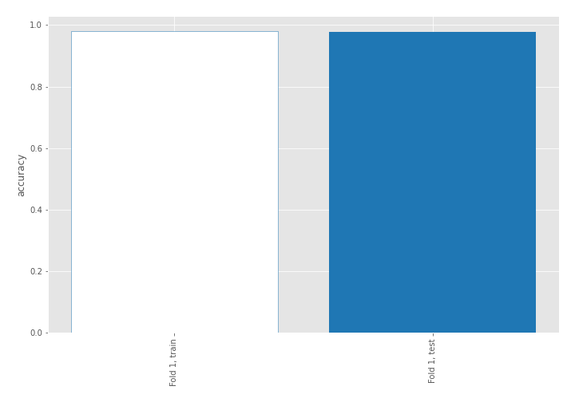

## Coefficients
| feature                           |   Learner_1 |
|:----------------------------------|------------:|
| skewness2                         |  0.748993   |
| return_autocorrelation_2_lag2     |  0.424404   |
| sqreturn_correlation_ts1_lag_2    |  0.378865   |
| return_correlation_ts1_lag_2      |  0.378865   |
| return_correlation_ts2_lag_1      |  0.369108   |
| sqreturn_correlation_ts2_lag_1    |  0.369108   |
| return_autocorrelation_2_lag3     |  0.341114   |
| sd1                               |  0.338059   |
| return_autocorrelation_2_lag1     |  0.297955   |
| return_correlation_ts2_lag_3      |  0.291579   |
| sqreturn_correlation_ts2_lag_3    |  0.291579   |
| return_autocorrelation_1_lag2     |  0.282985   |
| return_correlation_ts1_lag_1      |  0.276503   |
| sqreturn_correlation_ts1_lag_1    |  0.276503   |
| return_autocorrelation_1_lag3     |  0.272221   |
| return_autocorrelation_1_lag1     |  0.229438   |
| sqreturn_correlation_ts2_lag_2    |  0.198106   |
| return_correlation_ts2_lag_2      |  0.198106   |
| mean2                             |  0.163811   |
| sqreturn_correlation_ts1_lag_3    |  0.153078   |
| return_correlation_ts1_lag_3      |  0.153078   |
| skewness1                         |  0.043753   |
| mean1                             |  0.00631289 |
| price1_granger_cause_price2       | -0.0487806  |
| sqreturn_correlation_ts1_lag_0    | -0.255606   |
| return_correlation_ts1_lag_0      | -0.255606   |
| sd2                               | -0.381347   |
| price2_granger_cause_price1       | -0.705567   |
| sqreturn_autocorrelation_ts2_lag3 | -0.797212   |
| sqreturn_autocorrelation_ts2_lag2 | -0.832039   |
| sqreturn_autocorrelation_ts1_lag3 | -0.886523   |
| sqreturn_autocorrelation_ts2_lag1 | -0.909114   |
| sqreturn_autocorrelation_ts1_lag1 | -0.969143   |
| sqreturn_autocorrelation_ts1_lag2 | -0.977729   |
| intercept                         | -1.57181    |
| kurtosis2                         | -3.75099    |
| kurtosis1                         | -3.78107    |

## Permutation-based Importance
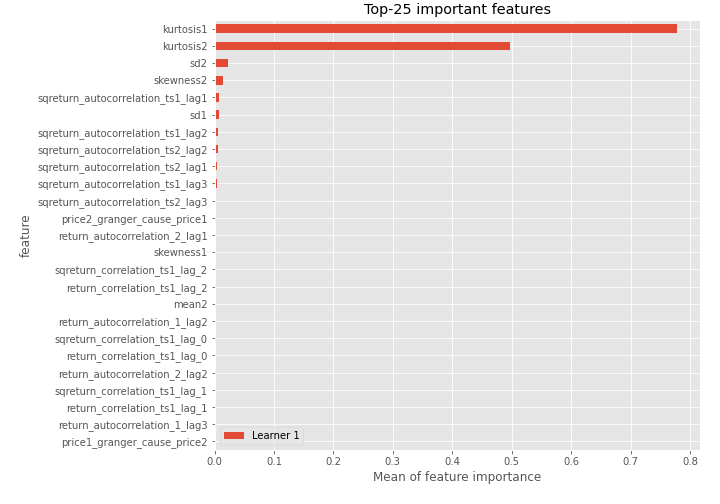
## Confusion Matrix

## Normalized Confusion Matrix

## ROC Curve

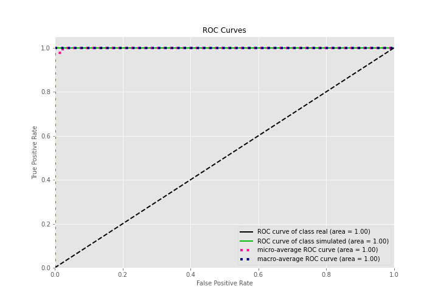

## Kolmogorov-Smirnov Statistic

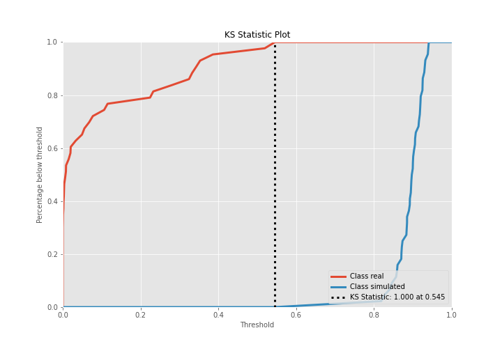

## Precision-Recall Curve

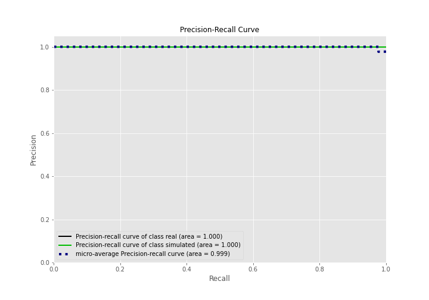

## Calibration Curve

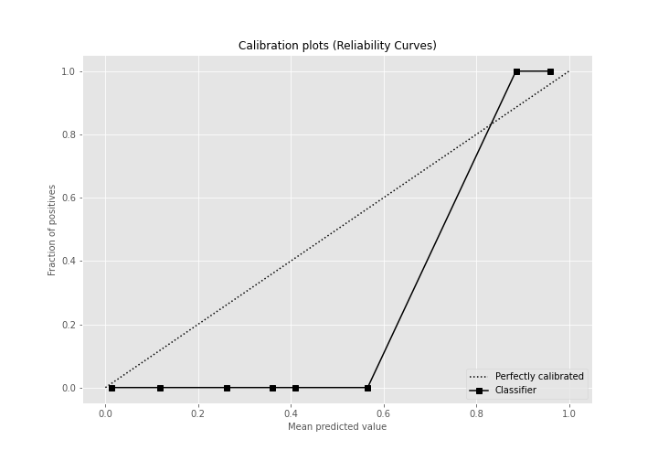

## Cumulative Gains Curve

## Lift Curve

## SHAP Importance
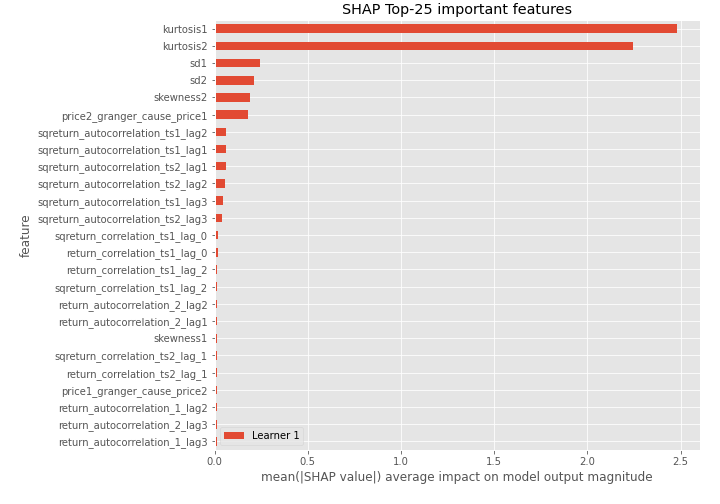

## SHAP Dependence plots

### Dependence (Fold 1)
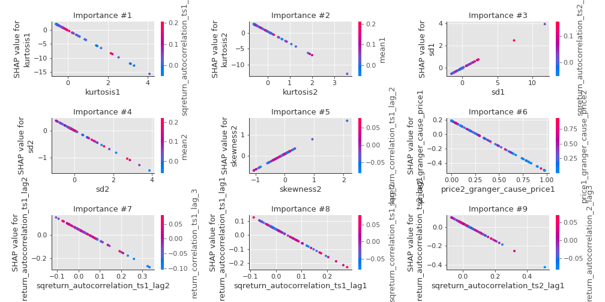

## SHAP Decision plots

### Top-10 Worst decisions for class 0 (Fold 1)
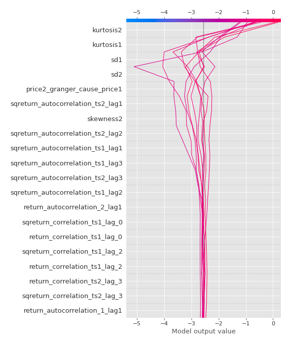
### Top-10 Best decisions for class 0 (Fold 1)
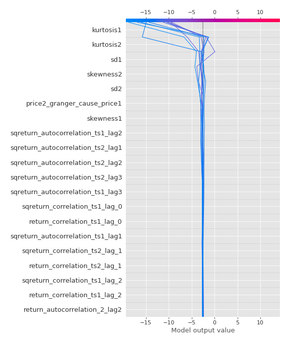
### Top-10 Worst decisions for class 1 (Fold 1)
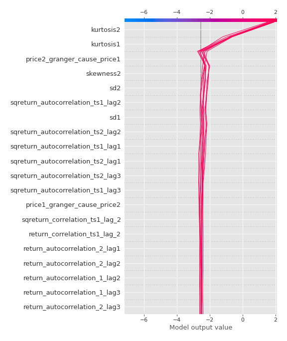
### Top-10 Best decisions for class 1 (Fold 1)
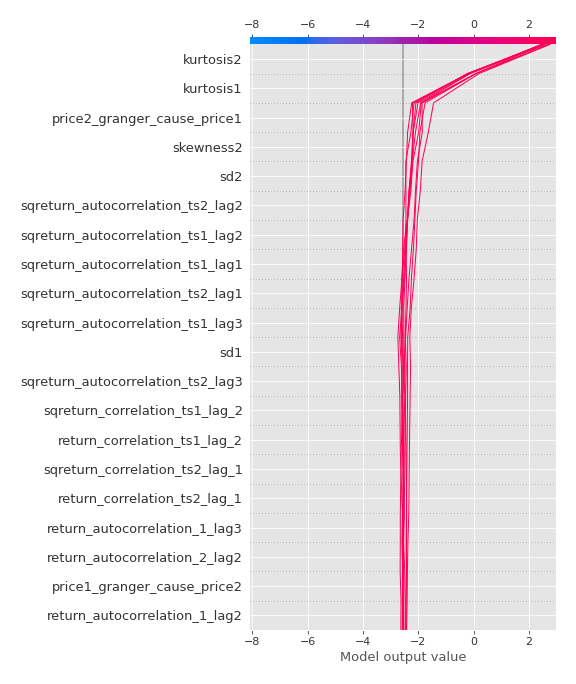

[<< Go back](../README.md)
