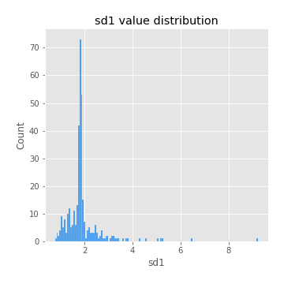
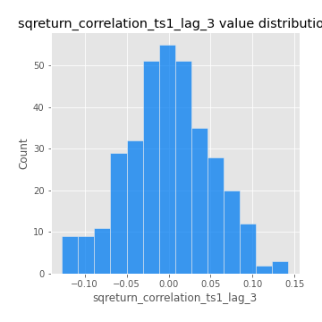

# Exploratory Data Analysis

[<< Go back](../README.md)
## Feature : target
- **Feature type** : categorical
- **Missing** : 0.0%
- **Unique** : 2
- **Count** :347
- **Unique** :2
- **Top** :simulated
- **Freq** :174

## Feature : mean1
- **Feature type** : continous
- **Missing** : 0.0%
- **Unique** : 347
- **Count** :347.0
- **Mean** :0.0569727226315464
- **Std** :0.083229025874908
- **Min** :-0.22632637961920957
- **25%th Percentile** : 0.007036072931823647
- **50%th Percentile** : 0.05769179659031443
- **75%th Percentile** : 0.10168524611751065
- **Max** :0.37175100008111034

## Feature : mean2
- **Feature type** : continous
- **Missing** : 0.0%
- **Unique** : 347
- **Count** :347.0
- **Mean** :0.07529380304136246
- **Std** :0.0878757601877619
- **Min** :-0.21818165578778434
- **25%th Percentile** : 0.029059616530494676
- **50%th Percentile** : 0.07216449289208837
- **75%th Percentile** : 0.12300027957246784
- **Max** :0.37616608147096464

## Feature : sd1
- **Feature type** : continous
- **Missing** : 0.0%
- **Unique** : 347
- **Count** :347.0
- **Mean** :1.8968285180416655
- **Std** :0.7548081922175366
- **Min** :0.7620831696941981
- **25%th Percentile** : 1.6703461105138246
- **50%th Percentile** : 1.8175407563508645
- **75%th Percentile** : 1.894341968187812
- **Max** :9.236766377527575

## Feature : sd2
- **Feature type** : continous
- **Missing** : 0.0%
- **Unique** : 347
- **Count** :347.0
- **Mean** :1.787007489355215
- **Std** :0.6789560550349182
- **Min** :0.8592887433004143
- **25%th Percentile** : 1.5552586366627663
- **50%th Percentile** : 1.6402200958187756
- **75%th Percentile** : 1.7254330103870414
- **Max** :6.737618636746393

## Feature : skewness1
- **Feature type** : continous
- **Missing** : 0.0%
- **Unique** : 347
- **Count** :347.0
- **Mean** :-0.0778686039108952
- **Std** :0.6096503970303483
- **Min** :-3.530116233761814
- **25%th Percentile** : -0.16716871204678335
- **50%th Percentile** : -0.012942784891766717
- **75%th Percentile** : 0.10314715724355182
- **Max** :2.5845963767725557

## Feature : skewness2
- **Feature type** : continous
- **Missing** : 0.0%
- **Unique** : 347
- **Count** :347.0
- **Mean** :-0.11670901050396644
- **Std** :0.5880157241748434
- **Min** :-3.436088288137694
- **25%th Percentile** : -0.24413157929344093
- **50%th Percentile** : -0.037441754793916045
- **75%th Percentile** : 0.09354721165112534
- **Max** :2.2606839051517187

## Feature : kurtosis1
- **Feature type** : continous
- **Missing** : 0.0%
- **Unique** : 347
- **Count** :347.0
- **Mean** :3.239309253315821
- **Std** :6.119035973674799
- **Min** :-0.46529391198217374
- **25%th Percentile** : -0.04149014572308585
- **50%th Percentile** : 0.503100826566087
- **75%th Percentile** : 3.691025264972352
- **Max** :36.91113889081053

## Feature : kurtosis2
- **Feature type** : continous
- **Missing** : 0.0%
- **Unique** : 347
- **Count** :347.0
- **Mean** :3.316917269070963
- **Std** :5.946922543935518
- **Min** :-0.4689143738362138
- **25%th Percentile** : -0.027574688014695425
- **50%th Percentile** : 0.5537438718411387
- **75%th Percentile** : 4.1488807640792835
- **Max** :36.023880269969645

## Feature : return_autocorrelation_1_lag1
- **Feature type** : continous
- **Missing** : 0.0%
- **Unique** : 347
- **Count** :347.0
- **Mean** :-0.010732592698051237
- **Std** :0.05747569597090292
- **Min** :-0.2135576224968752
- **25%th Percentile** : -0.038325378038138014
- **50%th Percentile** : -0.00840262091286905
- **75%th Percentile** : 0.025417565536385522
- **Max** :0.12810656890648087

## Feature : return_autocorrelation_1_lag2
- **Feature type** : continous
- **Missing** : 0.0%
- **Unique** : 347
- **Count** :347.0
- **Mean** :-0.00734464443857762
- **Std** :0.04972616057400227
- **Min** :-0.12172858720259
- **25%th Percentile** : -0.036886484975282505
- **50%th Percentile** : -0.008904684973079516
- **75%th Percentile** : 0.025010742224594235
- **Max** :0.1561488228015672

## Feature : return_autocorrelation_1_lag3
- **Feature type** : continous
- **Missing** : 0.0%
- **Unique** : 347
- **Count** :347.0
- **Mean** :-0.0018762783216064985
- **Std** :0.052063733581086076
- **Min** :-0.1940836867390813
- **25%th Percentile** : -0.036462240599925796
- **50%th Percentile** : 0.0006563999413021698
- **75%th Percentile** : 0.03271038647523086
- **Max** :0.17805869530681923

## Feature : return_autocorrelation_2_lag1
- **Feature type** : continous
- **Missing** : 0.0%
- **Unique** : 347
- **Count** :347.0
- **Mean** :-0.0077196631218236335
- **Std** :0.05917548835929316
- **Min** :-0.25075531010123286
- **25%th Percentile** : -0.039372985693656305
- **50%th Percentile** : -0.005203239601871359
- **75%th Percentile** : 0.027547365041694877
- **Max** :0.16349871797309318

## Feature : return_autocorrelation_2_lag2
- **Feature type** : continous
- **Missing** : 0.0%
- **Unique** : 347
- **Count** :347.0
- **Mean** :-0.001659284907978247
- **Std** :0.05110101443968556
- **Min** :-0.15323211089747296
- **25%th Percentile** : -0.03543828687909549
- **50%th Percentile** : -0.0023152258955129014
- **75%th Percentile** : 0.0336522353838984
- **Max** :0.1735398560230086

## Feature : return_autocorrelation_2_lag3
- **Feature type** : continous
- **Missing** : 0.0%
- **Unique** : 347
- **Count** :347.0
- **Mean** :-0.0018512431824769654
- **Std** :0.0468880702918359
- **Min** :-0.14200107169559698
- **25%th Percentile** : -0.028985630805753962
- **50%th Percentile** : 0.0024655299716868358
- **75%th Percentile** : 0.032145785171653105
- **Max** :0.12103978207043897

## Feature : return_correlation_ts1_lag_0
- **Feature type** : continous
- **Missing** : 0.0%
- **Unique** : 347
- **Count** :347.0
- **Mean** :0.31556564230619777
- **Std** :0.11302176148653964
- **Min** :-0.027089510445801036
- **25%th Percentile** : 0.26057819139198923
- **50%th Percentile** : 0.3108357099901593
- **75%th Percentile** : 0.3586019819996573
- **Max** :0.7041861626832071

## Feature : return_correlation_ts1_lag_1
- **Feature type** : continous
- **Missing** : 0.0%
- **Unique** : 347
- **Count** :347.0
- **Mean** :-0.007905041317429083
- **Std** :0.05042903483454904
- **Min** :-0.16985510949917193
- **25%th Percentile** : -0.03884371450054926
- **50%th Percentile** : -0.006110310235637936
- **75%th Percentile** : 0.025642367038730594
- **Max** :0.15499424718508623

## Feature : return_correlation_ts1_lag_2
- **Feature type** : continous
- **Missing** : 0.0%
- **Unique** : 347
- **Count** :347.0
- **Mean** :0.0008658701754666169
- **Std** :0.04832949635452192
- **Min** :-0.21653581047581763
- **25%th Percentile** : -0.03204168144512519
- **50%th Percentile** : -0.0014534736287393124
- **75%th Percentile** : 0.036327875509533446
- **Max** :0.11613565957205704

## Feature : return_correlation_ts1_lag_3
- **Feature type** : continous
- **Missing** : 0.0%
- **Unique** : 347
- **Count** :347.0
- **Mean** :7.737923074527325e-05
- **Std** :0.05092184031762297
- **Min** :-0.1270218498974763
- **25%th Percentile** : -0.03312911319463009
- **50%th Percentile** : -0.0006391770445159521
- **75%th Percentile** : 0.03530500711515347
- **Max** :0.1422809271770942

## Feature : return_correlation_ts2_lag_1
- **Feature type** : continous
- **Missing** : 0.0%
- **Unique** : 347
- **Count** :347.0
- **Mean** :-0.003667381142600883
- **Std** :0.05216699752132591
- **Min** :-0.19671969155495325
- **25%th Percentile** : -0.038482386594382384
- **50%th Percentile** : -0.004304923129939924
- **75%th Percentile** : 0.03435176474149671
- **Max** :0.13559744701968726

## Feature : return_correlation_ts2_lag_2
- **Feature type** : continous
- **Missing** : 0.0%
- **Unique** : 347
- **Count** :347.0
- **Mean** :-0.0010010714974464394
- **Std** :0.049223284675995856
- **Min** :-0.23751835475804678
- **25%th Percentile** : -0.030968599077067595
- **50%th Percentile** : -0.001491947937295078
- **75%th Percentile** : 0.023788015351801098
- **Max** :0.20772887392904255

## Feature : return_correlation_ts2_lag_3
- **Feature type** : continous
- **Missing** : 0.0%
- **Unique** : 347
- **Count** :347.0
- **Mean** :-0.0027124561397169396
- **Std** :0.051240141175431075
- **Min** :-0.17564076057312866
- **25%th Percentile** : -0.030983856177913584
- **50%th Percentile** : -0.004986246002480758
- **75%th Percentile** : 0.033155552672702246
- **Max** :0.12581714413438927

## Feature : sqreturn_autocorrelation_ts1_lag1
- **Feature type** : continous
- **Missing** : 0.0%
- **Unique** : 347
- **Count** :347.0
- **Mean** :0.0515866199152287
- **Std** :0.09409640493833422
- **Min** :-0.0915675124621423
- **25%th Percentile** : -0.009482725905417403
- **50%th Percentile** : 0.024678693963194928
- **75%th Percentile** : 0.08734031096560474
- **Max** :0.4439086285737898

## Feature : sqreturn_autocorrelation_ts1_lag2
- **Feature type** : continous
- **Missing** : 0.0%
- **Unique** : 347
- **Count** :347.0
- **Mean** :0.04447157986135899
- **Std** :0.09705910150935522
- **Min** :-0.10520585155495306
- **25%th Percentile** : -0.013227554551415263
- **50%th Percentile** : 0.01626135840334948
- **75%th Percentile** : 0.07038118959680979
- **Max** :0.540735851444759

## Feature : sqreturn_autocorrelation_ts1_lag3
- **Feature type** : continous
- **Missing** : 0.0%
- **Unique** : 347
- **Count** :347.0
- **Mean** :0.03400096188246262
- **Std** :0.08423719492457665
- **Min** :-0.0985144223930585
- **25%th Percentile** : -0.020081534319530928
- **50%th Percentile** : 0.012716738137160684
- **75%th Percentile** : 0.06333799669581507
- **Max** :0.44755937369538146

## Feature : sqreturn_autocorrelation_ts2_lag1
- **Feature type** : continous
- **Missing** : 0.0%
- **Unique** : 347
- **Count** :347.0
- **Mean** :0.04830521164083904
- **Std** :0.08395031231449238
- **Min** :-0.11153792210710689
- **25%th Percentile** : -0.007947947344855133
- **50%th Percentile** : 0.02982522024063108
- **75%th Percentile** : 0.07747150368946581
- **Max** :0.510085647437958

## Feature : sqreturn_autocorrelation_ts2_lag2
- **Feature type** : continous
- **Missing** : 0.0%
- **Unique** : 347
- **Count** :347.0
- **Mean** :0.042046548210672684
- **Std** :0.08787115784520556
- **Min** :-0.10720023490398624
- **25%th Percentile** : -0.009449417080249704
- **50%th Percentile** : 0.021893676130848926
- **75%th Percentile** : 0.06185879633635393
- **Max** :0.5373432415582473

## Feature : sqreturn_autocorrelation_ts2_lag3
- **Feature type** : continous
- **Missing** : 0.0%
- **Unique** : 347
- **Count** :347.0
- **Mean** :0.027545588115552883
- **Std** :0.0683588995207068
- **Min** :-0.0819215369717384
- **25%th Percentile** : -0.01665139403970104
- **50%th Percentile** : 0.010674848682306184
- **75%th Percentile** : 0.05072551628207648
- **Max** :0.31225727797735664

## Feature : sqreturn_correlation_ts1_lag_0
- **Feature type** : continous
- **Missing** : 0.0%
- **Unique** : 347
- **Count** :347.0
- **Mean** :0.31556564230619777
- **Std** :0.11302176148653964
- **Min** :-0.027089510445801036
- **25%th Percentile** : 0.26057819139198923
- **50%th Percentile** : 0.3108357099901593
- **75%th Percentile** : 0.3586019819996573
- **Max** :0.7041861626832071

## Feature : sqreturn_correlation_ts1_lag_1
- **Feature type** : continous
- **Missing** : 0.0%
- **Unique** : 347
- **Count** :347.0
- **Mean** :-0.007905041317429083
- **Std** :0.05042903483454904
- **Min** :-0.16985510949917193
- **25%th Percentile** : -0.03884371450054926
- **50%th Percentile** : -0.006110310235637936
- **75%th Percentile** : 0.025642367038730594
- **Max** :0.15499424718508623

## Feature : sqreturn_correlation_ts1_lag_2
- **Feature type** : continous
- **Missing** : 0.0%
- **Unique** : 347
- **Count** :347.0
- **Mean** :0.0008658701754666169
- **Std** :0.04832949635452192
- **Min** :-0.21653581047581763
- **25%th Percentile** : -0.03204168144512519
- **50%th Percentile** : -0.0014534736287393124
- **75%th Percentile** : 0.036327875509533446
- **Max** :0.11613565957205704

## Feature : sqreturn_correlation_ts1_lag_3
- **Feature type** : continous
- **Missing** : 0.0%
- **Unique** : 347
- **Count** :347.0
- **Mean** :7.737923074527325e-05
- **Std** :0.05092184031762297
- **Min** :-0.1270218498974763
- **25%th Percentile** : -0.03312911319463009
- **50%th Percentile** : -0.0006391770445159521
- **75%th Percentile** : 0.03530500711515347
- **Max** :0.1422809271770942

## Feature : sqreturn_correlation_ts2_lag_1
- **Feature type** : continous
- **Missing** : 0.0%
- **Unique** : 347
- **Count** :347.0
- **Mean** :-0.003667381142600883
- **Std** :0.05216699752132591
- **Min** :-0.19671969155495325
- **25%th Percentile** : -0.038482386594382384
- **50%th Percentile** : -0.004304923129939924
- **75%th Percentile** : 0.03435176474149671
- **Max** :0.13559744701968726

## Feature : sqreturn_correlation_ts2_lag_2
- **Feature type** : continous
- **Missing** : 0.0%
- **Unique** : 347
- **Count** :347.0
- **Mean** :-0.0010010714974464394
- **Std** :0.049223284675995856
- **Min** :-0.23751835475804678
- **25%th Percentile** : -0.030968599077067595
- **50%th Percentile** : -0.001491947937295078
- **75%th Percentile** : 0.023788015351801098
- **Max** :0.20772887392904255

## Feature : sqreturn_correlation_ts2_lag_3
- **Feature type** : continous
- **Missing** : 0.0%
- **Unique** : 347
- **Count** :347.0
- **Mean** :-0.0027124561397169396
- **Std** :0.051240141175431075
- **Min** :-0.17564076057312866
- **25%th Percentile** : -0.030983856177913584
- **50%th Percentile** : -0.004986246002480758
- **75%th Percentile** : 0.033155552672702246
- **Max** :0.12581714413438927

## Feature : price2_granger_cause_price1
- **Feature type** : continous
- **Missing** : 0.0%
- **Unique** : 347
- **Count** :347.0
- **Mean** :0.305529123535175
- **Std** :0.30479717258833017
- **Min** :5.8925997665741106e-08
- **25%th Percentile** : 0.0430119465858312
- **50%th Percentile** : 0.1978107142142312
- **75%th Percentile** : 0.523840242225535
- **Max** :0.9885712803689185

## Feature : price1_granger_cause_price2
- **Feature type** : continous
- **Missing** : 0.0%
- **Unique** : 347
- **Count** :347.0
- **Mean** :0.29269399639945726
- **Std** :0.2857656740183674
- **Min** :2.0884513496892294e-05
- **25%th Percentile** : 0.04078590581177104
- **50%th Percentile** : 0.2050962711887762
- **75%th Percentile** : 0.5180972080197646
- **Max** :0.9934094725186675

[<< Go back](../README.md)
