# Summary of 3_Linear

[<< Go back](../README.md)

## Logistic Regression (Linear)
- **n_jobs**: -1
- **explain_level**: 2

## Validation
 - **validation_type**: split
 - **train_ratio**: 0.75
 - **shuffle**: True
 - **stratify**: True

## Optimized metric
accuracy

## Training time

5.3 seconds

## Metric details
|           |    score |     threshold |
|:----------|---------:|--------------:|
| logloss   | 0.172827 | nan           |
| auc       | 1        | nan           |
| f1        | 0.988235 |   0.827362    |
| accuracy  | 0.988506 |   0.827362    |
| precision | 1        |   0.902993    |
| recall    | 1        |   7.25357e-09 |
| mcc       | 0.977261 |   0.827362    |

## Confusion matrix (at threshold=0.827362)
|                      |   Predicted as real |   Predicted as simulated |
|:---------------------|--------------------:|-------------------------:|
| Labeled as real      |                  44 |                        0 |
| Labeled as simulated |                   1 |                       42 |

## Learning curves
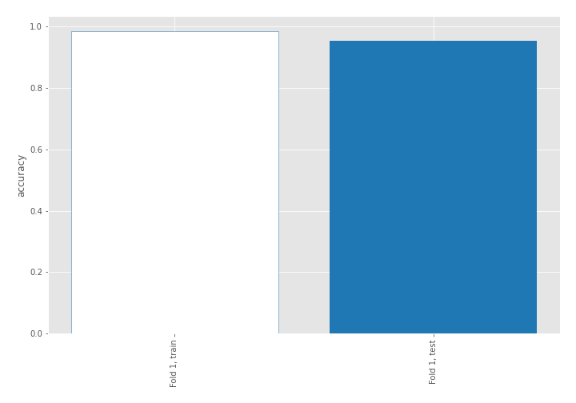

## Coefficients
| feature                           |   Learner_1 |
|:----------------------------------|------------:|
| skewness2                         |  0.644114   |
| sqreturn_correlation_ts1_lag_1    |  0.391172   |
| return_correlation_ts1_lag_1      |  0.391172   |
| return_autocorrelation_2_lag3     |  0.357857   |
| return_autocorrelation_2_lag1     |  0.35697    |
| mean2                             |  0.319651   |
| return_autocorrelation_1_lag2     |  0.308996   |
| return_correlation_ts2_lag_3      |  0.30848    |
| sqreturn_correlation_ts2_lag_3    |  0.30848    |
| return_autocorrelation_1_lag3     |  0.28482    |
| sd1                               |  0.273696   |
| return_correlation_ts1_lag_3      |  0.26574    |
| sqreturn_correlation_ts1_lag_3    |  0.26574    |
| sqreturn_correlation_ts1_lag_2    |  0.252973   |
| return_correlation_ts1_lag_2      |  0.252973   |
| return_autocorrelation_1_lag1     |  0.229322   |
| sqreturn_correlation_ts2_lag_1    |  0.210269   |
| return_correlation_ts2_lag_1      |  0.210269   |
| return_autocorrelation_2_lag2     |  0.188049   |
| sqreturn_correlation_ts2_lag_2    |  0.0636548  |
| return_correlation_ts2_lag_2      |  0.0636548  |
| skewness1                         | -0.00972773 |
| sqreturn_correlation_ts1_lag_0    | -0.0651688  |
| return_correlation_ts1_lag_0      | -0.0651688  |
| mean1                             | -0.157881   |
| price1_granger_cause_price2       | -0.234453   |
| sd2                               | -0.311587   |
| price2_granger_cause_price1       | -0.79927    |
| sqreturn_autocorrelation_ts2_lag3 | -0.899361   |
| sqreturn_autocorrelation_ts1_lag3 | -0.941645   |
| sqreturn_autocorrelation_ts1_lag2 | -1.02503    |
| sqreturn_autocorrelation_ts2_lag2 | -1.22658    |
| intercept                         | -1.26159    |
| sqreturn_autocorrelation_ts2_lag1 | -1.3281     |
| sqreturn_autocorrelation_ts1_lag1 | -1.3355     |
| kurtosis2                         | -3.177      |
| kurtosis1                         | -4.44212    |

## Permutation-based Importance
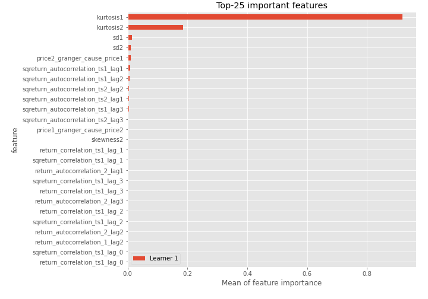
## Confusion Matrix

## Normalized Confusion Matrix

## ROC Curve

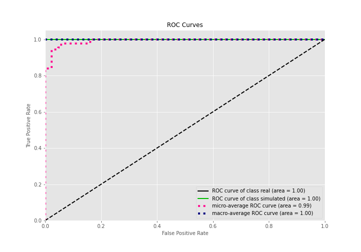

## Kolmogorov-Smirnov Statistic

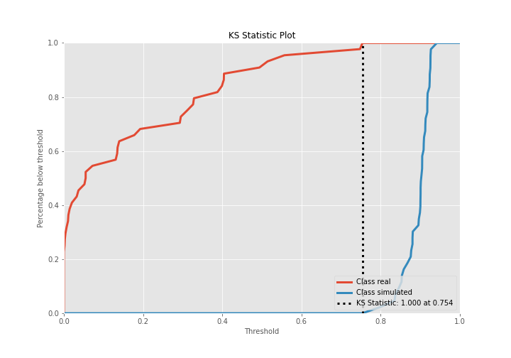

## Precision-Recall Curve

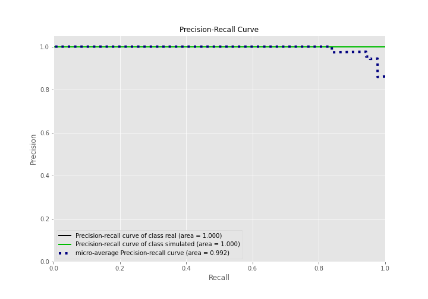

## Calibration Curve

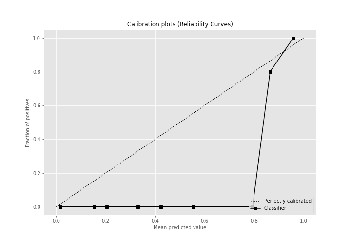

## Cumulative Gains Curve

## Lift Curve

## SHAP Importance
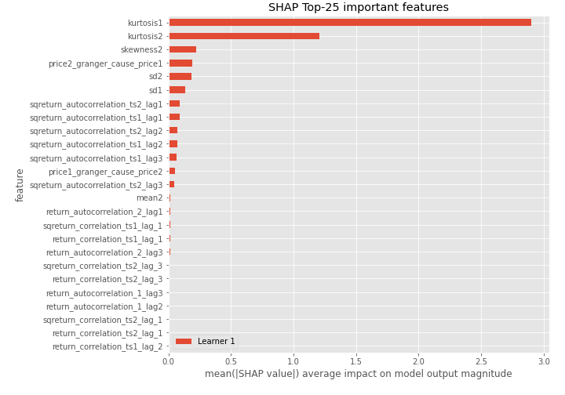

## SHAP Dependence plots

### Dependence (Fold 1)
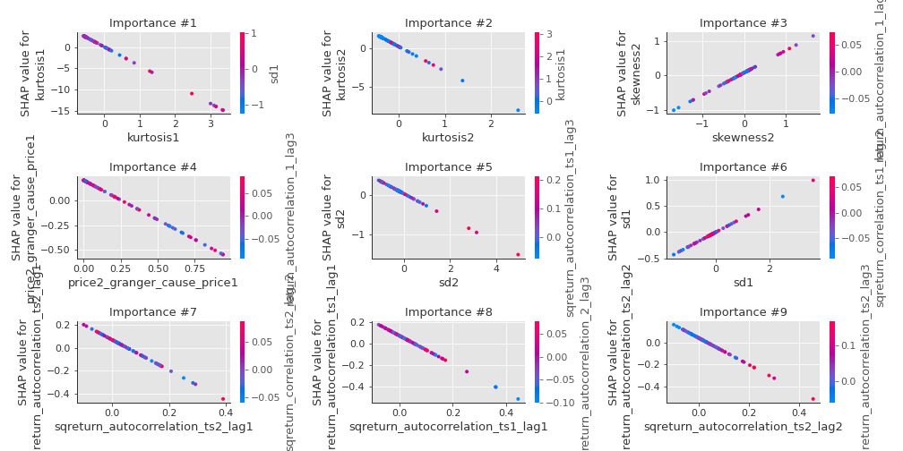

## SHAP Decision plots

### Top-10 Worst decisions for class 0 (Fold 1)
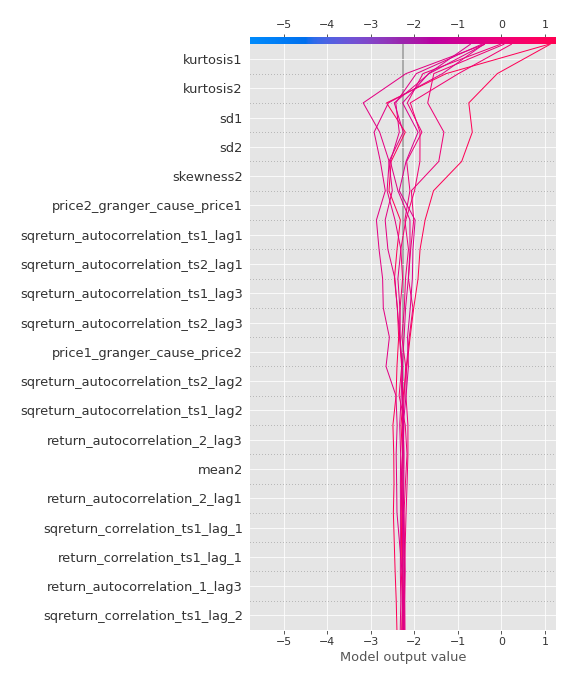
### Top-10 Best decisions for class 0 (Fold 1)
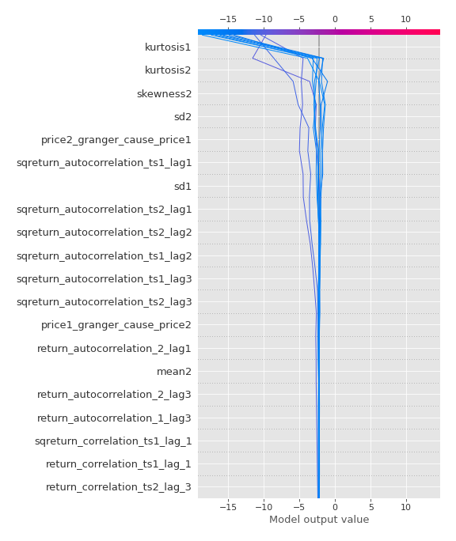
### Top-10 Worst decisions for class 1 (Fold 1)
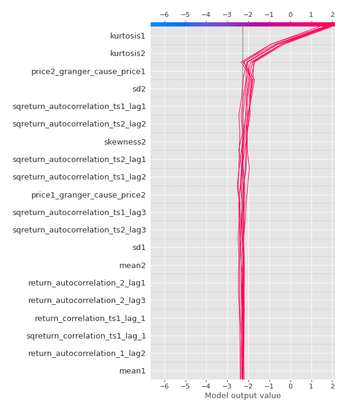
### Top-10 Best decisions for class 1 (Fold 1)
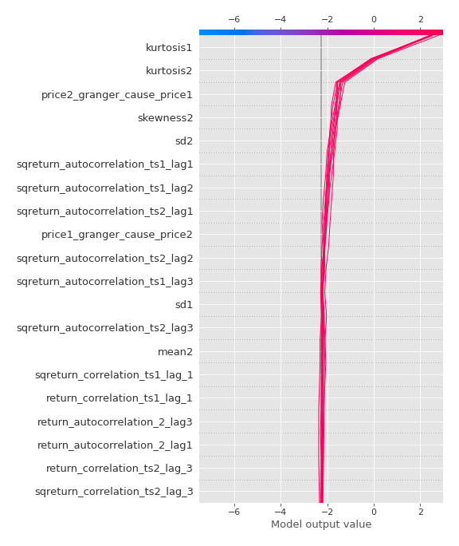

[<< Go back](../README.md)
