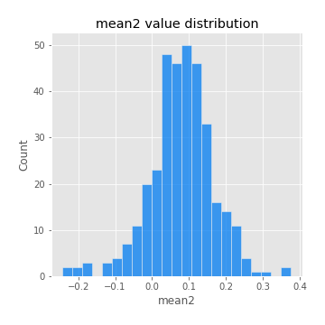

# Exploratory Data Analysis

[<< Go back](../README.md)
## Feature : target
- **Feature type** : categorical
- **Missing** : 0.0%
- **Unique** : 2
- **Count** :347
- **Unique** :2
- **Top** :real
- **Freq** :175

## Feature : mean1
- **Feature type** : continous
- **Missing** : 0.0%
- **Unique** : 347
- **Count** :347.0
- **Mean** :0.053838038937937725
- **Std** :0.08319854041417041
- **Min** :-0.22632637961920957
- **25%th Percentile** : 0.004322609893633398
- **50%th Percentile** : 0.05773430157760862
- **75%th Percentile** : 0.09812681201582375
- **Max** :0.3612366374600757

## Feature : mean2
- **Feature type** : continous
- **Missing** : 0.0%
- **Unique** : 347
- **Count** :347.0
- **Mean** :0.07892338530799711
- **Std** :0.08788271660433221
- **Min** :-0.24205418062825398
- **25%th Percentile** : 0.03330728593505998
- **50%th Percentile** : 0.08324032048859273
- **75%th Percentile** : 0.13011696278311968
- **Max** :0.37616608147096464

## Feature : sd1
- **Feature type** : continous
- **Missing** : 0.0%
- **Unique** : 347
- **Count** :347.0
- **Mean** :1.8773187874876633
- **Std** :0.6926043752264053
- **Min** :0.7620831696941981
- **25%th Percentile** : 1.6902017658202082
- **50%th Percentile** : 1.8083016164686496
- **75%th Percentile** : 1.8913010737710754
- **Max** :9.236766377527575

## Feature : sd2
- **Feature type** : continous
- **Missing** : 0.0%
- **Unique** : 347
- **Count** :347.0
- **Mean** :1.7882693004773693
- **Std** :0.6765982843306719
- **Min** :0.8967691504919791
- **25%th Percentile** : 1.5744276304471017
- **50%th Percentile** : 1.6521260533157647
- **75%th Percentile** : 1.735567348572099
- **Max** :5.872800253666788

## Feature : skewness1
- **Feature type** : continous
- **Missing** : 0.0%
- **Unique** : 347
- **Count** :347.0
- **Mean** :-0.10832331308473497
- **Std** :0.590613846238927
- **Min** :-3.530116233761814
- **25%th Percentile** : -0.2023386768293991
- **50%th Percentile** : -0.047020696898165806
- **75%th Percentile** : 0.08494849905448215
- **Max** :1.989411030028313

## Feature : skewness2
- **Feature type** : continous
- **Missing** : 0.0%
- **Unique** : 347
- **Count** :347.0
- **Mean** :-0.14245251798888045
- **Std** :0.7995045355031369
- **Min** :-8.801502855292393
- **25%th Percentile** : -0.23204672254394254
- **50%th Percentile** : -0.03202773057833783
- **75%th Percentile** : 0.10523698459018518
- **Max** :2.2606839051517187

## Feature : kurtosis1
- **Feature type** : continous
- **Missing** : 0.0%
- **Unique** : 347
- **Count** :347.0
- **Mean** :3.1874100332558504
- **Std** :6.033421003803179
- **Min** :-0.4704399457835189
- **25%th Percentile** : -0.02909774367383333
- **50%th Percentile** : 0.6819093157517129
- **75%th Percentile** : 3.691025264972352
- **Max** :46.07507808162177

## Feature : kurtosis2
- **Feature type** : continous
- **Missing** : 0.0%
- **Unique** : 347
- **Count** :347.0
- **Mean** :3.854666706133388
- **Std** :10.035693052625621
- **Min** :-0.5543578287376718
- **25%th Percentile** : -0.004608293910448369
- **50%th Percentile** : 0.5936617182652233
- **75%th Percentile** : 4.087838595779396
- **Max** :143.10871011533666

## Feature : return_autocorrelation_1_lag1
- **Feature type** : continous
- **Missing** : 0.0%
- **Unique** : 347
- **Count** :347.0
- **Mean** :-0.00962765909290646
- **Std** :0.05518272512695751
- **Min** :-0.20673896439036124
- **25%th Percentile** : -0.03835184525699262
- **50%th Percentile** : -0.004456277573547255
- **75%th Percentile** : 0.02600774454753483
- **Max** :0.12810656890648087

## Feature : return_autocorrelation_1_lag2
- **Feature type** : continous
- **Missing** : 0.0%
- **Unique** : 347
- **Count** :347.0
- **Mean** :-0.00029844858751959253
- **Std** :0.04981520339791504
- **Min** :-0.13309283796645122
- **25%th Percentile** : -0.033206717412408826
- **50%th Percentile** : -0.0005711566725760009
- **75%th Percentile** : 0.0290680553956214
- **Max** :0.1561488228015672

## Feature : return_autocorrelation_1_lag3
- **Feature type** : continous
- **Missing** : 0.0%
- **Unique** : 347
- **Count** :347.0
- **Mean** :0.00046778581699519575
- **Std** :0.05026511369173364
- **Min** :-0.15806635192103805
- **25%th Percentile** : -0.029702160682520646
- **50%th Percentile** : 0.00010684383579549596
- **75%th Percentile** : 0.03617485350948038
- **Max** :0.17805869530681923

## Feature : return_autocorrelation_2_lag1
- **Feature type** : continous
- **Missing** : 0.0%
- **Unique** : 347
- **Count** :347.0
- **Mean** :-0.008080433038867622
- **Std** :0.0582299762857542
- **Min** :-0.25075531010123286
- **25%th Percentile** : -0.03983163825441843
- **50%th Percentile** : -0.004665707020043753
- **75%th Percentile** : 0.02766502338759845
- **Max** :0.12235403572864123

## Feature : return_autocorrelation_2_lag2
- **Feature type** : continous
- **Missing** : 0.0%
- **Unique** : 347
- **Count** :347.0
- **Mean** :-0.0026726970473464145
- **Std** :0.04963344160317907
- **Min** :-0.15323211089747296
- **25%th Percentile** : -0.03793804260279382
- **50%th Percentile** : -0.005125569759925858
- **75%th Percentile** : 0.030912776979014435
- **Max** :0.14734721826682337

## Feature : return_autocorrelation_2_lag3
- **Feature type** : continous
- **Missing** : 0.0%
- **Unique** : 347
- **Count** :347.0
- **Mean** :-0.004413257624585046
- **Std** :0.05032115833496996
- **Min** :-0.14200107169559698
- **25%th Percentile** : -0.04109458397828411
- **50%th Percentile** : -0.001992969453947655
- **75%th Percentile** : 0.034317040000776775
- **Max** :0.15715999285549348

## Feature : return_correlation_ts1_lag_0
- **Feature type** : continous
- **Missing** : 0.0%
- **Unique** : 347
- **Count** :347.0
- **Mean** :0.31452369314906115
- **Std** :0.10531867119343054
- **Min** :-0.027089510445801036
- **25%th Percentile** : 0.25982385642923966
- **50%th Percentile** : 0.3125854314282076
- **75%th Percentile** : 0.35759941908242965
- **Max** :0.7041861626832071

## Feature : return_correlation_ts1_lag_1
- **Feature type** : continous
- **Missing** : 0.0%
- **Unique** : 347
- **Count** :347.0
- **Mean** :-0.004238144359995288
- **Std** :0.05298552319157402
- **Min** :-0.15776193292681923
- **25%th Percentile** : -0.0386284471531482
- **50%th Percentile** : 0.00036059030370543037
- **75%th Percentile** : 0.029332211207703365
- **Max** :0.15499424718508623

## Feature : return_correlation_ts1_lag_2
- **Feature type** : continous
- **Missing** : 0.0%
- **Unique** : 347
- **Count** :347.0
- **Mean** :0.003373488405874376
- **Std** :0.047467095653803595
- **Min** :-0.12864410180561703
- **25%th Percentile** : -0.0289529779041148
- **50%th Percentile** : 0.0023180978747456495
- **75%th Percentile** : 0.03773963612999533
- **Max** :0.13796052292228947

## Feature : return_correlation_ts1_lag_3
- **Feature type** : continous
- **Missing** : 0.0%
- **Unique** : 347
- **Count** :347.0
- **Mean** :0.0031782567768200193
- **Std** :0.05149721184295798
- **Min** :-0.1332339351319086
- **25%th Percentile** : -0.02788484333958402
- **50%th Percentile** : 0.005720270974500778
- **75%th Percentile** : 0.03552053211752648
- **Max** :0.1636773216468148

## Feature : return_correlation_ts2_lag_1
- **Feature type** : continous
- **Missing** : 0.0%
- **Unique** : 347
- **Count** :347.0
- **Mean** :-0.0035854272785661853
- **Std** :0.05529568334423838
- **Min** :-0.2081139431093261
- **25%th Percentile** : -0.03372974248496835
- **50%th Percentile** : -0.0033906540814499808
- **75%th Percentile** : 0.03429761242143514
- **Max** :0.17208763791364762

## Feature : return_correlation_ts2_lag_2
- **Feature type** : continous
- **Missing** : 0.0%
- **Unique** : 347
- **Count** :347.0
- **Mean** :0.003751032978635523
- **Std** :0.04793723424292761
- **Min** :-0.15299951737180204
- **25%th Percentile** : -0.028127506257502943
- **50%th Percentile** : 0.0014742423623168583
- **75%th Percentile** : 0.03330949004400589
- **Max** :0.20772887392904255

## Feature : return_correlation_ts2_lag_3
- **Feature type** : continous
- **Missing** : 0.0%
- **Unique** : 347
- **Count** :347.0
- **Mean** :0.000249309849719563
- **Std** :0.051107587126272266
- **Min** :-0.17564076057312866
- **25%th Percentile** : -0.028882087899069743
- **50%th Percentile** : 0.0014058850722927837
- **75%th Percentile** : 0.03727663979837938
- **Max** :0.1386717050830905

## Feature : sqreturn_autocorrelation_ts1_lag1
- **Feature type** : continous
- **Missing** : 0.0%
- **Unique** : 347
- **Count** :347.0
- **Mean** :0.05230025741478898
- **Std** :0.09567650245022202
- **Min** :-0.10778169554097468
- **25%th Percentile** : -0.010748698108670617
- **50%th Percentile** : 0.031410194101034926
- **75%th Percentile** : 0.08648390299540591
- **Max** :0.49414293176447355

## Feature : sqreturn_autocorrelation_ts1_lag2
- **Feature type** : continous
- **Missing** : 0.0%
- **Unique** : 347
- **Count** :347.0
- **Mean** :0.043688847047321976
- **Std** :0.08799231788229986
- **Min** :-0.1304711503073484
- **25%th Percentile** : -0.010531898683610968
- **50%th Percentile** : 0.0225786173494984
- **75%th Percentile** : 0.07278989106114352
- **Max** :0.4522162366773919

## Feature : sqreturn_autocorrelation_ts1_lag3
- **Feature type** : continous
- **Missing** : 0.0%
- **Unique** : 347
- **Count** :347.0
- **Mean** :0.030331556509922055
- **Std** :0.0787261766379176
- **Min** :-0.09443514164898333
- **25%th Percentile** : -0.01716020127100913
- **50%th Percentile** : 0.010191725541604238
- **75%th Percentile** : 0.05742600832193391
- **Max** :0.41030914918857014

## Feature : sqreturn_autocorrelation_ts2_lag1
- **Feature type** : continous
- **Missing** : 0.0%
- **Unique** : 347
- **Count** :347.0
- **Mean** :0.04979538077554405
- **Std** :0.08868814693183771
- **Min** :-0.1005953050243889
- **25%th Percentile** : -0.006374064003232033
- **50%th Percentile** : 0.02982522024063108
- **75%th Percentile** : 0.08432500946327709
- **Max** :0.510085647437958

## Feature : sqreturn_autocorrelation_ts2_lag2
- **Feature type** : continous
- **Missing** : 0.0%
- **Unique** : 347
- **Count** :347.0
- **Mean** :0.03768620110580378
- **Std** :0.08441382506802912
- **Min** :-0.09912168566854691
- **25%th Percentile** : -0.01094914508601159
- **50%th Percentile** : 0.015009649875009542
- **75%th Percentile** : 0.06039578261430312
- **Max** :0.45676817892778204

## Feature : sqreturn_autocorrelation_ts2_lag3
- **Feature type** : continous
- **Missing** : 0.0%
- **Unique** : 347
- **Count** :347.0
- **Mean** :0.026267759033791423
- **Std** :0.06895822189823823
- **Min** :-0.11791124649957539
- **25%th Percentile** : -0.01559533829067309
- **50%th Percentile** : 0.010183227334158442
- **75%th Percentile** : 0.05112646090395759
- **Max** :0.31225727797735664

## Feature : sqreturn_correlation_ts1_lag_0
- **Feature type** : continous
- **Missing** : 0.0%
- **Unique** : 347
- **Count** :347.0
- **Mean** :0.31452369314906115
- **Std** :0.10531867119343054
- **Min** :-0.027089510445801036
- **25%th Percentile** : 0.25982385642923966
- **50%th Percentile** : 0.3125854314282076
- **75%th Percentile** : 0.35759941908242965
- **Max** :0.7041861626832071

## Feature : sqreturn_correlation_ts1_lag_1
- **Feature type** : continous
- **Missing** : 0.0%
- **Unique** : 347
- **Count** :347.0
- **Mean** :-0.004238144359995288
- **Std** :0.05298552319157402
- **Min** :-0.15776193292681923
- **25%th Percentile** : -0.0386284471531482
- **50%th Percentile** : 0.00036059030370543037
- **75%th Percentile** : 0.029332211207703365
- **Max** :0.15499424718508623

## Feature : sqreturn_correlation_ts1_lag_2
- **Feature type** : continous
- **Missing** : 0.0%
- **Unique** : 347
- **Count** :347.0
- **Mean** :0.003373488405874376
- **Std** :0.047467095653803595
- **Min** :-0.12864410180561703
- **25%th Percentile** : -0.0289529779041148
- **50%th Percentile** : 0.0023180978747456495
- **75%th Percentile** : 0.03773963612999533
- **Max** :0.13796052292228947

## Feature : sqreturn_correlation_ts1_lag_3
- **Feature type** : continous
- **Missing** : 0.0%
- **Unique** : 347
- **Count** :347.0
- **Mean** :0.0031782567768200193
- **Std** :0.05149721184295798
- **Min** :-0.1332339351319086
- **25%th Percentile** : -0.02788484333958402
- **50%th Percentile** : 0.005720270974500778
- **75%th Percentile** : 0.03552053211752648
- **Max** :0.1636773216468148

## Feature : sqreturn_correlation_ts2_lag_1
- **Feature type** : continous
- **Missing** : 0.0%
- **Unique** : 347
- **Count** :347.0
- **Mean** :-0.0035854272785661853
- **Std** :0.05529568334423838
- **Min** :-0.2081139431093261
- **25%th Percentile** : -0.03372974248496835
- **50%th Percentile** : -0.0033906540814499808
- **75%th Percentile** : 0.03429761242143514
- **Max** :0.17208763791364762

## Feature : sqreturn_correlation_ts2_lag_2
- **Feature type** : continous
- **Missing** : 0.0%
- **Unique** : 347
- **Count** :347.0
- **Mean** :0.003751032978635523
- **Std** :0.04793723424292761
- **Min** :-0.15299951737180204
- **25%th Percentile** : -0.028127506257502943
- **50%th Percentile** : 0.0014742423623168583
- **75%th Percentile** : 0.03330949004400589
- **Max** :0.20772887392904255

## Feature : sqreturn_correlation_ts2_lag_3
- **Feature type** : continous
- **Missing** : 0.0%
- **Unique** : 347
- **Count** :347.0
- **Mean** :0.000249309849719563
- **Std** :0.051107587126272266
- **Min** :-0.17564076057312866
- **25%th Percentile** : -0.028882087899069743
- **50%th Percentile** : 0.0014058850722927837
- **75%th Percentile** : 0.03727663979837938
- **Max** :0.1386717050830905

## Feature : price2_granger_cause_price1
- **Feature type** : continous
- **Missing** : 0.0%
- **Unique** : 347
- **Count** :347.0
- **Mean** :0.2664330245935963
- **Std** :0.28743809678831245
- **Min** :4.56836226748629e-07
- **25%th Percentile** : 0.02337294942373482
- **50%th Percentile** : 0.1434306386479573
- **75%th Percentile** : 0.4427488328085725
- **Max** :0.9885712803689185

## Feature : price1_granger_cause_price2
- **Feature type** : continous
- **Missing** : 0.0%
- **Unique** : 347
- **Count** :347.0
- **Mean** :0.3073380527119097
- **Std** :0.29169475694954694
- **Min** :5.437008061939812e-07
- **25%th Percentile** : 0.038700294906929576
- **50%th Percentile** : 0.24048241416760002
- **75%th Percentile** : 0.5084994797472309
- **Max** :0.9951398266867577

[<< Go back](../README.md)
