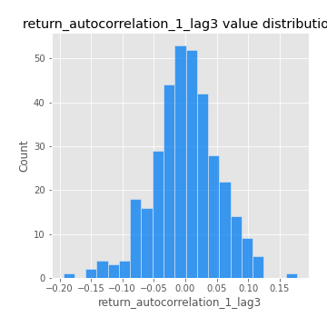

# Exploratory Data Analysis

[<< Go back](../README.md)
## Feature : target
- **Feature type** : categorical
- **Missing** : 0.0%
- **Unique** : 2
- **Count** :347
- **Unique** :2
- **Top** :real
- **Freq** :176

## Feature : mean1
- **Feature type** : continous
- **Missing** : 0.0%
- **Unique** : 347
- **Count** :347.0
- **Mean** :0.0483601051130855
- **Std** :0.0824186223770069
- **Min** :-0.22632637961920957
- **25%th Percentile** : -0.0004090875588857015
- **50%th Percentile** : 0.05024144164881986
- **75%th Percentile** : 0.09515486207486669
- **Max** :0.3612366374600757

## Feature : mean2
- **Feature type** : continous
- **Missing** : 0.0%
- **Unique** : 347
- **Count** :347.0
- **Mean** :0.07201739735086976
- **Std** :0.08550384342173221
- **Min** :-0.21818165578778434
- **25%th Percentile** : 0.028332227502859693
- **50%th Percentile** : 0.06916495926001903
- **75%th Percentile** : 0.12010197714526044
- **Max** :0.37616608147096464

## Feature : sd1
- **Feature type** : continous
- **Missing** : 0.0%
- **Unique** : 347
- **Count** :347.0
- **Mean** :1.888123959156098
- **Std** :0.7018303948965486
- **Min** :0.8382061051466024
- **25%th Percentile** : 1.674952288994973
- **50%th Percentile** : 1.8150015917616706
- **75%th Percentile** : 1.903871481610292
- **Max** :9.236766377527575

## Feature : sd2
- **Feature type** : continous
- **Missing** : 0.0%
- **Unique** : 347
- **Count** :347.0
- **Mean** :1.7998563295286711
- **Std** :0.7197521658969408
- **Min** :0.8592887433004143
- **25%th Percentile** : 1.5692612120011074
- **50%th Percentile** : 1.6462094302588874
- **75%th Percentile** : 1.733506384082875
- **Max** :6.737618636746393

## Feature : skewness1
- **Feature type** : continous
- **Missing** : 0.0%
- **Unique** : 347
- **Count** :347.0
- **Mean** :-0.08296839646866865
- **Std** :0.5970035556722999
- **Min** :-3.530116233761814
- **25%th Percentile** : -0.18518713580888665
- **50%th Percentile** : -0.03845359048263321
- **75%th Percentile** : 0.09313361689666441
- **Max** :2.5845963767725557

## Feature : skewness2
- **Feature type** : continous
- **Missing** : 0.0%
- **Unique** : 347
- **Count** :347.0
- **Mean** :-0.1846424164103351
- **Std** :0.7819340969381463
- **Min** :-8.801502855292393
- **25%th Percentile** : -0.24205995684983467
- **50%th Percentile** : -0.06264302136176682
- **75%th Percentile** : 0.07461204363164135
- **Max** :2.242019525651531

## Feature : kurtosis1
- **Feature type** : continous
- **Missing** : 0.0%
- **Unique** : 347
- **Count** :347.0
- **Mean** :3.3142002491962526
- **Std** :6.347040056885928
- **Min** :-0.446953460902594
- **25%th Percentile** : -0.005616427797404233
- **50%th Percentile** : 0.732314060684621
- **75%th Percentile** : 3.454449566137388
- **Max** :46.07507808162177

## Feature : kurtosis2
- **Feature type** : continous
- **Missing** : 0.0%
- **Unique** : 347
- **Count** :347.0
- **Mean** :3.873177375627996
- **Std** :10.519562414628755
- **Min** :-0.5764671667689161
- **25%th Percentile** : -0.036272348855771464
- **50%th Percentile** : 0.5701440141911895
- **75%th Percentile** : 4.102201922691857
- **Max** :143.10871011533666

## Feature : return_autocorrelation_1_lag1
- **Feature type** : continous
- **Missing** : 0.0%
- **Unique** : 347
- **Count** :347.0
- **Mean** :-0.011368715954041242
- **Std** :0.060265573758812085
- **Min** :-0.2135576224968752
- **25%th Percentile** : -0.04309857961330781
- **50%th Percentile** : -0.0038203955790839317
- **75%th Percentile** : 0.026944335006479206
- **Max** :0.12810656890648087

## Feature : return_autocorrelation_1_lag2
- **Feature type** : continous
- **Missing** : 0.0%
- **Unique** : 347
- **Count** :347.0
- **Mean** :-0.004148702074763115
- **Std** :0.05007040282319011
- **Min** :-0.13472437883680807
- **25%th Percentile** : -0.03601692891988477
- **50%th Percentile** : -0.00019422178934094543
- **75%th Percentile** : 0.026686387080863863
- **Max** :0.1561488228015672

## Feature : return_autocorrelation_1_lag3
- **Feature type** : continous
- **Missing** : 0.0%
- **Unique** : 347
- **Count** :347.0
- **Mean** :0.0008065753145756507
- **Std** :0.05252181282111288
- **Min** :-0.1940836867390813
- **25%th Percentile** : -0.029246652742898133
- **50%th Percentile** : 0.0004661836645243613
- **75%th Percentile** : 0.0332314214069962
- **Max** :0.17805869530681923

## Feature : return_autocorrelation_2_lag1
- **Feature type** : continous
- **Missing** : 0.0%
- **Unique** : 347
- **Count** :347.0
- **Mean** :-0.010190632286225338
- **Std** :0.05934686314136503
- **Min** :-0.24590087874039124
- **25%th Percentile** : -0.04146546520968829
- **50%th Percentile** : -0.005791445688795942
- **75%th Percentile** : 0.024738554661005628
- **Max** :0.31863413537898483

## Feature : return_autocorrelation_2_lag2
- **Feature type** : continous
- **Missing** : 0.0%
- **Unique** : 347
- **Count** :347.0
- **Mean** :-0.0005296389079324453
- **Std** :0.05124410061560828
- **Min** :-0.1495113937562178
- **25%th Percentile** : -0.03374194190490226
- **50%th Percentile** : -0.002292725591127946
- **75%th Percentile** : 0.032739218099575446
- **Max** :0.20974504043791217

## Feature : return_autocorrelation_2_lag3
- **Feature type** : continous
- **Missing** : 0.0%
- **Unique** : 347
- **Count** :347.0
- **Mean** :0.0008997136949179732
- **Std** :0.050041726916863365
- **Min** :-0.1439070989291614
- **25%th Percentile** : -0.02754170136989551
- **50%th Percentile** : 0.0009517648451347028
- **75%th Percentile** : 0.03579357033537839
- **Max** :0.1419999376914021

## Feature : return_correlation_ts1_lag_0
- **Feature type** : continous
- **Missing** : 0.0%
- **Unique** : 347
- **Count** :347.0
- **Mean** :0.31596924172811547
- **Std** :0.10674390445358865
- **Min** :-0.027089510445801036
- **25%th Percentile** : 0.258842065604155
- **50%th Percentile** : 0.31669406874411155
- **75%th Percentile** : 0.35761172857642365
- **Max** :0.7028422087350163

## Feature : return_correlation_ts1_lag_1
- **Feature type** : continous
- **Missing** : 0.0%
- **Unique** : 347
- **Count** :347.0
- **Mean** :-0.006632369206475667
- **Std** :0.053066555014565475
- **Min** :-0.16985510949917193
- **25%th Percentile** : -0.03614233149943449
- **50%th Percentile** : -0.0008886651221355343
- **75%th Percentile** : 0.025285796501547567
- **Max** :0.15499424718508623

## Feature : return_correlation_ts1_lag_2
- **Feature type** : continous
- **Missing** : 0.0%
- **Unique** : 347
- **Count** :347.0
- **Mean** :-0.0011015065979144264
- **Std** :0.04980662518478842
- **Min** :-0.21653581047581763
- **25%th Percentile** : -0.03199964574028682
- **50%th Percentile** : -0.0009681797294642787
- **75%th Percentile** : 0.031975965990888075
- **Max** :0.15193273922759545

## Feature : return_correlation_ts1_lag_3
- **Feature type** : continous
- **Missing** : 0.0%
- **Unique** : 347
- **Count** :347.0
- **Mean** :0.0019387625110935565
- **Std** :0.05161891299257204
- **Min** :-0.13150846037082004
- **25%th Percentile** : -0.03060391536441886
- **50%th Percentile** : 0.0011560696988276507
- **75%th Percentile** : 0.03292896889504364
- **Max** :0.19199264353988152

## Feature : return_correlation_ts2_lag_1
- **Feature type** : continous
- **Missing** : 0.0%
- **Unique** : 347
- **Count** :347.0
- **Mean** :-0.004613654296313012
- **Std** :0.05216024936697178
- **Min** :-0.2081139431093261
- **25%th Percentile** : -0.03228083818503716
- **50%th Percentile** : -0.004876884790633577
- **75%th Percentile** : 0.027462014569230503
- **Max** :0.11556235671885211

## Feature : return_correlation_ts2_lag_2
- **Feature type** : continous
- **Missing** : 0.0%
- **Unique** : 347
- **Count** :347.0
- **Mean** :-0.0008522186770515584
- **Std** :0.04965720310676138
- **Min** :-0.23751835475804678
- **25%th Percentile** : -0.031377071489451486
- **50%th Percentile** : -0.0027358749519114604
- **75%th Percentile** : 0.028421057910028365
- **Max** :0.20772887392904255

## Feature : return_correlation_ts2_lag_3
- **Feature type** : continous
- **Missing** : 0.0%
- **Unique** : 347
- **Count** :347.0
- **Mean** :-0.0008540928760643883
- **Std** :0.05227759078345703
- **Min** :-0.17564076057312866
- **25%th Percentile** : -0.031108724848784425
- **50%th Percentile** : 0.0005156439438987019
- **75%th Percentile** : 0.036300197254063554
- **Max** :0.12578577770423086

## Feature : sqreturn_autocorrelation_ts1_lag1
- **Feature type** : continous
- **Missing** : 0.0%
- **Unique** : 347
- **Count** :347.0
- **Mean** :0.05074689733578405
- **Std** :0.0909037822932315
- **Min** :-0.11983024655113995
- **25%th Percentile** : -0.012345496553186001
- **50%th Percentile** : 0.02826834367013215
- **75%th Percentile** : 0.08705595506681169
- **Max** :0.4439086285737898

## Feature : sqreturn_autocorrelation_ts1_lag2
- **Feature type** : continous
- **Missing** : 0.0%
- **Unique** : 347
- **Count** :347.0
- **Mean** :0.04473954938426279
- **Std** :0.09177720024481355
- **Min** :-0.0952786879151683
- **25%th Percentile** : -0.011272458229230202
- **50%th Percentile** : 0.01655937813090876
- **75%th Percentile** : 0.07052887586452873
- **Max** :0.4522162366773919

## Feature : sqreturn_autocorrelation_ts1_lag3
- **Feature type** : continous
- **Missing** : 0.0%
- **Unique** : 347
- **Count** :347.0
- **Mean** :0.03396765906358126
- **Std** :0.08414857143488272
- **Min** :-0.11323112805931747
- **25%th Percentile** : -0.017712721633715317
- **50%th Percentile** : 0.012593715022244586
- **75%th Percentile** : 0.06411415209195377
- **Max** :0.44755937369538146

## Feature : sqreturn_autocorrelation_ts2_lag1
- **Feature type** : continous
- **Missing** : 0.0%
- **Unique** : 347
- **Count** :347.0
- **Mean** :0.048030629597233684
- **Std** :0.08786726492018421
- **Min** :-0.11129820476792716
- **25%th Percentile** : -0.004093103573070142
- **50%th Percentile** : 0.028799284522873014
- **75%th Percentile** : 0.07395600250557574
- **Max** :0.4190090519891419

## Feature : sqreturn_autocorrelation_ts2_lag2
- **Feature type** : continous
- **Missing** : 0.0%
- **Unique** : 347
- **Count** :347.0
- **Mean** :0.03845566358610475
- **Std** :0.0905043166813715
- **Min** :-0.11023455580654992
- **25%th Percentile** : -0.012055093529453213
- **50%th Percentile** : 0.012728648183241015
- **75%th Percentile** : 0.06358236029117839
- **Max** :0.45676817892778204

## Feature : sqreturn_autocorrelation_ts2_lag3
- **Feature type** : continous
- **Missing** : 0.0%
- **Unique** : 347
- **Count** :347.0
- **Mean** :0.03298913005821079
- **Std** :0.07129629902336435
- **Min** :-0.10979768993261006
- **25%th Percentile** : -0.012693871274776867
- **50%th Percentile** : 0.017005247570335915
- **75%th Percentile** : 0.059169984401776315
- **Max** :0.31225727797735664

## Feature : sqreturn_correlation_ts1_lag_0
- **Feature type** : continous
- **Missing** : 0.0%
- **Unique** : 347
- **Count** :347.0
- **Mean** :0.31596924172811547
- **Std** :0.10674390445358865
- **Min** :-0.027089510445801036
- **25%th Percentile** : 0.258842065604155
- **50%th Percentile** : 0.31669406874411155
- **75%th Percentile** : 0.35761172857642365
- **Max** :0.7028422087350163

## Feature : sqreturn_correlation_ts1_lag_1
- **Feature type** : continous
- **Missing** : 0.0%
- **Unique** : 347
- **Count** :347.0
- **Mean** :-0.006632369206475667
- **Std** :0.053066555014565475
- **Min** :-0.16985510949917193
- **25%th Percentile** : -0.03614233149943449
- **50%th Percentile** : -0.0008886651221355343
- **75%th Percentile** : 0.025285796501547567
- **Max** :0.15499424718508623

## Feature : sqreturn_correlation_ts1_lag_2
- **Feature type** : continous
- **Missing** : 0.0%
- **Unique** : 347
- **Count** :347.0
- **Mean** :-0.0011015065979144264
- **Std** :0.04980662518478842
- **Min** :-0.21653581047581763
- **25%th Percentile** : -0.03199964574028682
- **50%th Percentile** : -0.0009681797294642787
- **75%th Percentile** : 0.031975965990888075
- **Max** :0.15193273922759545

## Feature : sqreturn_correlation_ts1_lag_3
- **Feature type** : continous
- **Missing** : 0.0%
- **Unique** : 347
- **Count** :347.0
- **Mean** :0.0019387625110935565
- **Std** :0.05161891299257204
- **Min** :-0.13150846037082004
- **25%th Percentile** : -0.03060391536441886
- **50%th Percentile** : 0.0011560696988276507
- **75%th Percentile** : 0.03292896889504364
- **Max** :0.19199264353988152

## Feature : sqreturn_correlation_ts2_lag_1
- **Feature type** : continous
- **Missing** : 0.0%
- **Unique** : 347
- **Count** :347.0
- **Mean** :-0.004613654296313012
- **Std** :0.05216024936697178
- **Min** :-0.2081139431093261
- **25%th Percentile** : -0.03228083818503716
- **50%th Percentile** : -0.004876884790633577
- **75%th Percentile** : 0.027462014569230503
- **Max** :0.11556235671885211

## Feature : sqreturn_correlation_ts2_lag_2
- **Feature type** : continous
- **Missing** : 0.0%
- **Unique** : 347
- **Count** :347.0
- **Mean** :-0.0008522186770515584
- **Std** :0.04965720310676138
- **Min** :-0.23751835475804678
- **25%th Percentile** : -0.031377071489451486
- **50%th Percentile** : -0.0027358749519114604
- **75%th Percentile** : 0.028421057910028365
- **Max** :0.20772887392904255

## Feature : sqreturn_correlation_ts2_lag_3
- **Feature type** : continous
- **Missing** : 0.0%
- **Unique** : 347
- **Count** :347.0
- **Mean** :-0.0008540928760643883
- **Std** :0.05227759078345703
- **Min** :-0.17564076057312866
- **25%th Percentile** : -0.031108724848784425
- **50%th Percentile** : 0.0005156439438987019
- **75%th Percentile** : 0.036300197254063554
- **Max** :0.12578577770423086

## Feature : price2_granger_cause_price1
- **Feature type** : continous
- **Missing** : 0.0%
- **Unique** : 347
- **Count** :347.0
- **Mean** :0.3249484083776978
- **Std** :0.30999141543214553
- **Min** :5.464248668490985e-07
- **25%th Percentile** : 0.04642954647217576
- **50%th Percentile** : 0.2369928032318464
- **75%th Percentile** : 0.5680113170934447
- **Max** :0.9971901087082952

## Feature : price1_granger_cause_price2
- **Feature type** : continous
- **Missing** : 0.0%
- **Unique** : 347
- **Count** :347.0
- **Mean** :0.3044689474799851
- **Std** :0.29318496996882787
- **Min** :5.130999647633644e-07
- **25%th Percentile** : 0.043311215077656964
- **50%th Percentile** : 0.20997105831646115
- **75%th Percentile** : 0.551663344574275
- **Max** :0.9994037662710054

[<< Go back](../README.md)
