# Summary of 3_Linear

[<< Go back](../README.md)

## Logistic Regression (Linear)
- **n_jobs**: -1
- **explain_level**: 2

## Validation
 - **validation_type**: split
 - **train_ratio**: 0.75
 - **shuffle**: True
 - **stratify**: True

## Optimized metric
accuracy

## Training time

53.4 seconds

## Metric details
|           |    score |     threshold |
|:----------|---------:|--------------:|
| logloss   | 0.175324 | nan           |
| auc       | 0.997886 | nan           |
| f1        | 0.977778 |   0.707172    |
| accuracy  | 0.977011 |   0.707172    |
| precision | 1        |   0.90833     |
| recall    | 1        |   1.02015e-11 |
| mcc       | 0.955004 |   0.707172    |

## Confusion matrix (at threshold=0.707172)
|                      |   Predicted as real |   Predicted as simulated |
|:---------------------|--------------------:|-------------------------:|
| Labeled as real      |                  41 |                        2 |
| Labeled as simulated |                   0 |                       44 |

## Learning curves
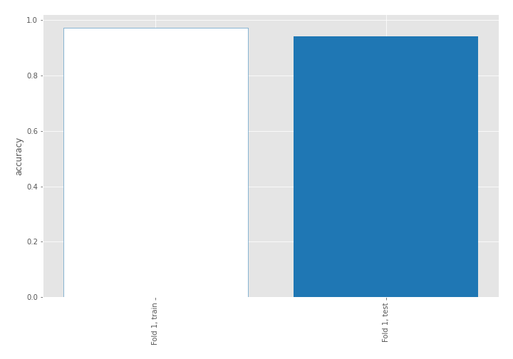

## Coefficients
| feature                           |   Learner_1 |
|:----------------------------------|------------:|
| skewness2                         |  0.667904   |
| sd1                               |  0.55811    |
| skewness1                         |  0.513709   |
| return_autocorrelation_2_lag1     |  0.341337   |
| mean2                             |  0.283225   |
| return_autocorrelation_1_lag1     |  0.281303   |
| return_correlation_ts2_lag_1      |  0.273379   |
| sqreturn_correlation_ts2_lag_1    |  0.273379   |
| return_autocorrelation_2_lag2     |  0.233066   |
| return_autocorrelation_1_lag3     |  0.221038   |
| sqreturn_correlation_ts1_lag_1    |  0.216718   |
| return_correlation_ts1_lag_1      |  0.216718   |
| return_autocorrelation_2_lag3     |  0.196063   |
| return_autocorrelation_1_lag2     |  0.15937    |
| return_correlation_ts2_lag_3      |  0.11497    |
| sqreturn_correlation_ts2_lag_3    |  0.11497    |
| sqreturn_correlation_ts1_lag_3    |  0.110904   |
| return_correlation_ts1_lag_3      |  0.110904   |
| sqreturn_correlation_ts1_lag_2    |  0.109562   |
| return_correlation_ts1_lag_2      |  0.109562   |
| price1_granger_cause_price2       | -0.00817106 |
| return_correlation_ts2_lag_2      | -0.0283262  |
| sqreturn_correlation_ts2_lag_2    | -0.0283262  |
| mean1                             | -0.0984981  |
| sqreturn_correlation_ts1_lag_0    | -0.303963   |
| return_correlation_ts1_lag_0      | -0.303963   |
| sd2                               | -0.709879   |
| sqreturn_autocorrelation_ts2_lag3 | -0.765536   |
| price2_granger_cause_price1       | -0.902245   |
| sqreturn_autocorrelation_ts1_lag1 | -0.989597   |
| sqreturn_autocorrelation_ts2_lag2 | -0.996984   |
| sqreturn_autocorrelation_ts1_lag3 | -1.0317     |
| sqreturn_autocorrelation_ts1_lag2 | -1.15503    |
| intercept                         | -1.15512    |
| sqreturn_autocorrelation_ts2_lag1 | -1.28245    |
| kurtosis2                         | -3.07497    |
| kurtosis1                         | -4.43274    |

## Permutation-based Importance
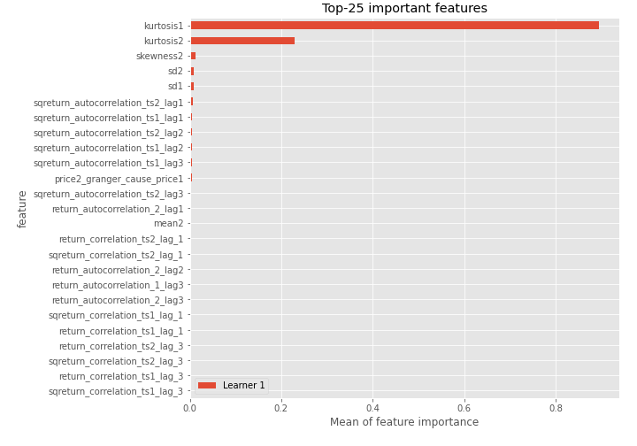
## Confusion Matrix

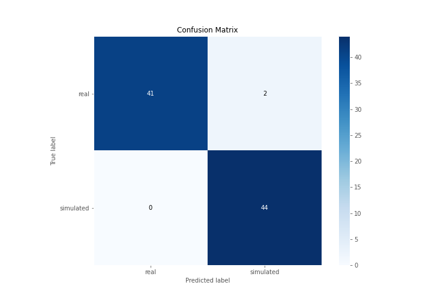

## Normalized Confusion Matrix

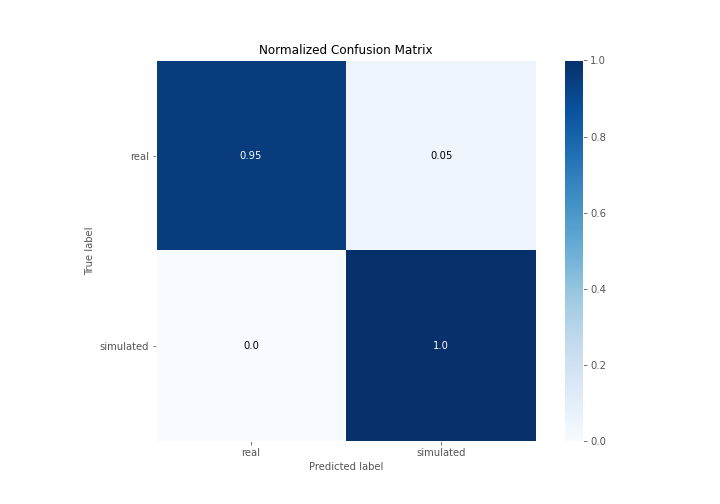

## ROC Curve

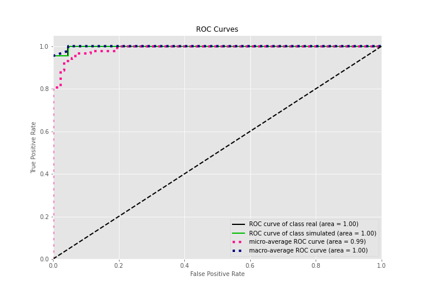

## Kolmogorov-Smirnov Statistic

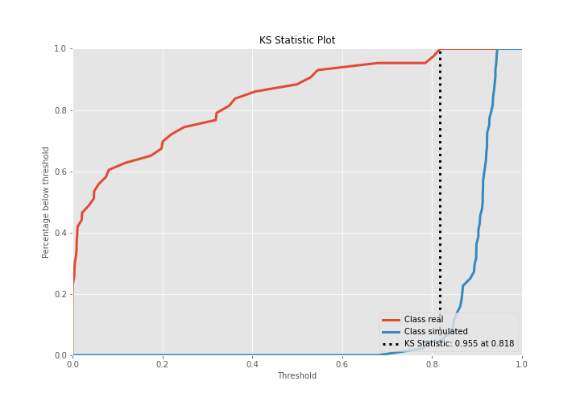

## Precision-Recall Curve

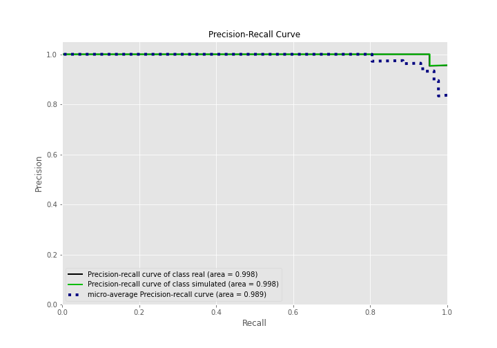

## Calibration Curve

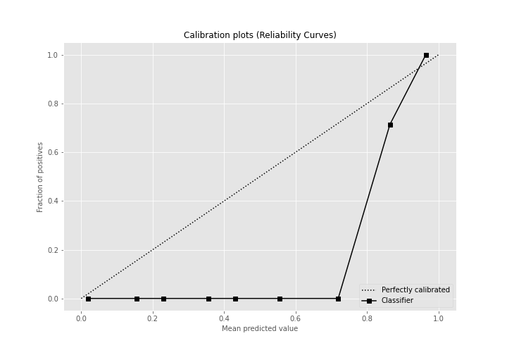

## Cumulative Gains Curve

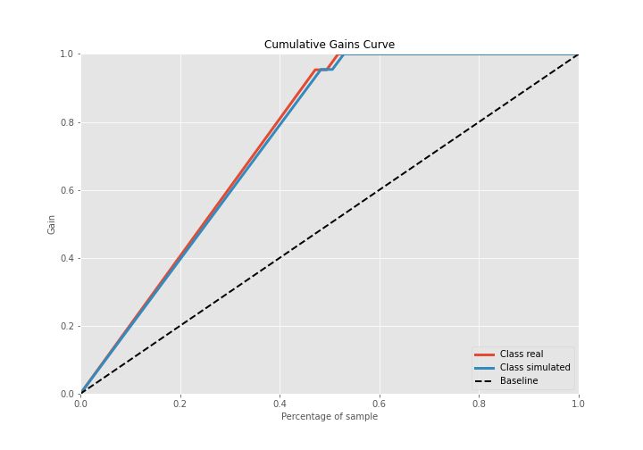

## Lift Curve

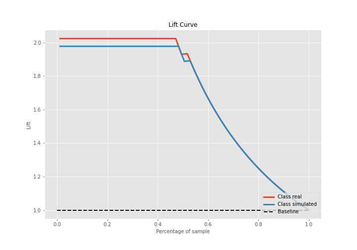

## SHAP Importance
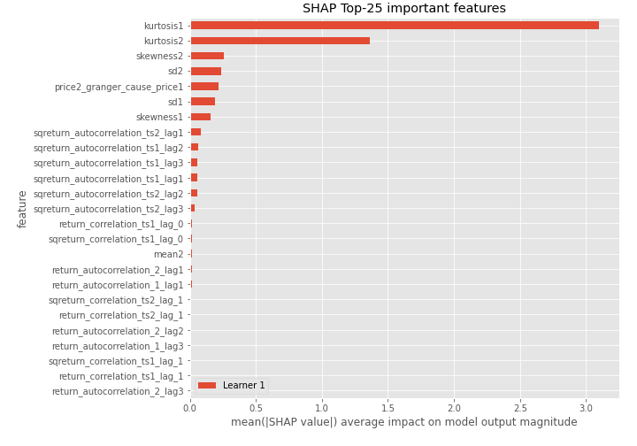

## SHAP Dependence plots

### Dependence (Fold 1)
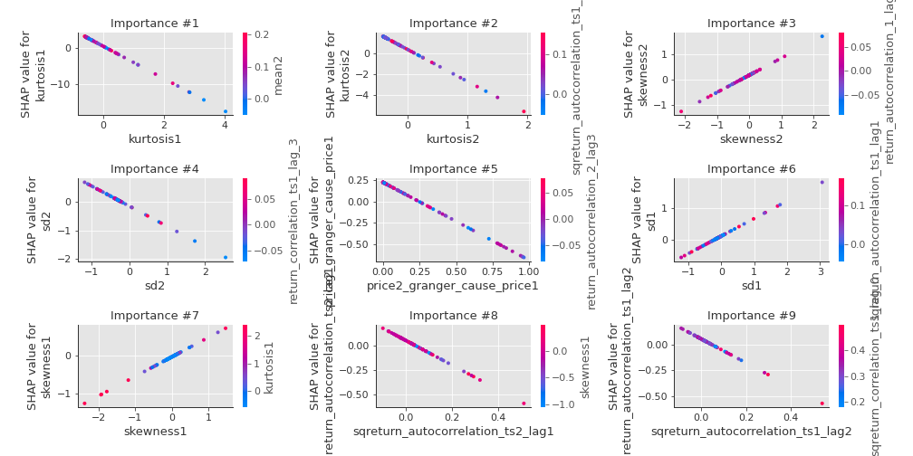

## SHAP Decision plots

### Top-10 Worst decisions for class 0 (Fold 1)
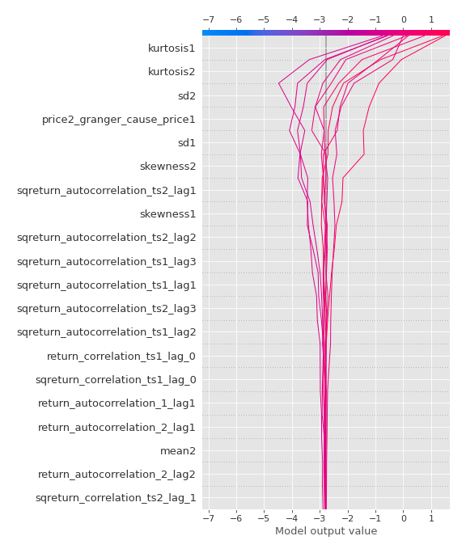
### Top-10 Best decisions for class 0 (Fold 1)
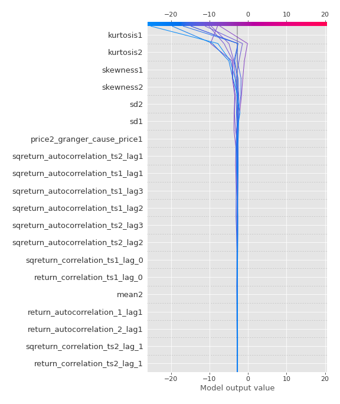
### Top-10 Worst decisions for class 1 (Fold 1)
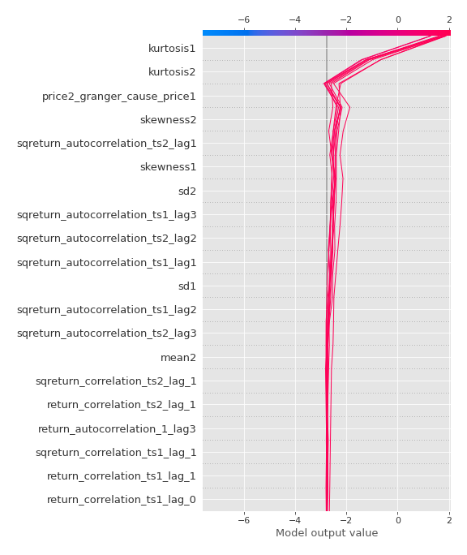
### Top-10 Best decisions for class 1 (Fold 1)
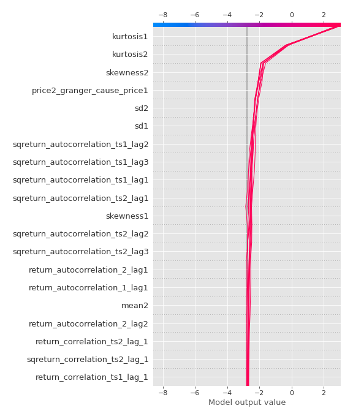

[<< Go back](../README.md)
