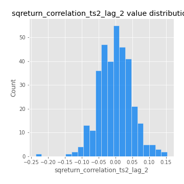

# Exploratory Data Analysis

[<< Go back](../README.md)
## Feature : target
- **Feature type** : categorical
- **Missing** : 0.0%
- **Unique** : 2
- **Count** :347
- **Unique** :2
- **Top** :simulated
- **Freq** :174

## Feature : mean1
- **Feature type** : continous
- **Missing** : 0.0%
- **Unique** : 347
- **Count** :347.0
- **Mean** :0.05252389568176583
- **Std** :0.08174638277219395
- **Min** :-0.22632637961920957
- **25%th Percentile** : 0.003227119753869889
- **50%th Percentile** : 0.05491880521864917
- **75%th Percentile** : 0.10126385870011201
- **Max** :0.37175100008111034

## Feature : mean2
- **Feature type** : continous
- **Missing** : 0.0%
- **Unique** : 347
- **Count** :347.0
- **Mean** :0.07718452052321685
- **Std** :0.09347138586959443
- **Min** :-0.21818165578778434
- **25%th Percentile** : 0.02295653060955131
- **50%th Percentile** : 0.07963983963943058
- **75%th Percentile** : 0.12980717475797943
- **Max** :0.45188228791402346

## Feature : sd1
- **Feature type** : continous
- **Missing** : 0.0%
- **Unique** : 347
- **Count** :347.0
- **Mean** :1.8920282653832263
- **Std** :0.7253542073960157
- **Min** :0.7620831696941981
- **25%th Percentile** : 1.6902017658202082
- **50%th Percentile** : 1.822392144028294
- **75%th Percentile** : 1.90078348466672
- **Max** :9.236766377527575

## Feature : sd2
- **Feature type** : continous
- **Missing** : 0.0%
- **Unique** : 347
- **Count** :347.0
- **Mean** :1.8303604859987943
- **Std** :0.7040859721599625
- **Min** :0.8592887433004143
- **25%th Percentile** : 1.5805920506199356
- **50%th Percentile** : 1.647361960706827
- **75%th Percentile** : 1.735080822080728
- **Max** :5.872800253666788

## Feature : skewness1
- **Feature type** : continous
- **Missing** : 0.0%
- **Unique** : 347
- **Count** :347.0
- **Mean** :-0.07245073712344137
- **Std** :0.5564221298938813
- **Min** :-2.817259764925239
- **25%th Percentile** : -0.17633851046347582
- **50%th Percentile** : -0.025584025847025457
- **75%th Percentile** : 0.10535624979771056
- **Max** :2.5845963767725557

## Feature : skewness2
- **Feature type** : continous
- **Missing** : 0.0%
- **Unique** : 347
- **Count** :347.0
- **Mean** :-0.14066254887253304
- **Std** :0.8053934220553198
- **Min** :-8.801502855292393
- **25%th Percentile** : -0.21153761877069263
- **50%th Percentile** : -0.02034947115528936
- **75%th Percentile** : 0.1083754392538687
- **Max** :2.2606839051517187

## Feature : kurtosis1
- **Feature type** : continous
- **Missing** : 0.0%
- **Unique** : 347
- **Count** :347.0
- **Mean** :2.921000795894693
- **Std** :5.463030116847321
- **Min** :-0.4324860469998155
- **25%th Percentile** : -0.03131734230731764
- **50%th Percentile** : 0.543528339933733
- **75%th Percentile** : 3.399924763042607
- **Max** :36.91113889081053

## Feature : kurtosis2
- **Feature type** : continous
- **Missing** : 0.0%
- **Unique** : 347
- **Count** :347.0
- **Mean** :3.9750613865849336
- **Std** :10.246413273909802
- **Min** :-0.45506776677284044
- **25%th Percentile** : -0.036266251151465756
- **50%th Percentile** : 0.5032902544154987
- **75%th Percentile** : 4.381239604898888
- **Max** :143.10871011533666

## Feature : return_autocorrelation_1_lag1
- **Feature type** : continous
- **Missing** : 0.0%
- **Unique** : 347
- **Count** :347.0
- **Mean** :-0.012266453225780297
- **Std** :0.059729917646843975
- **Min** :-0.2135576224968752
- **25%th Percentile** : -0.04658152475914855
- **50%th Percentile** : -0.0069089598187218
- **75%th Percentile** : 0.02757143774746538
- **Max** :0.12311391564956375

## Feature : return_autocorrelation_1_lag2
- **Feature type** : continous
- **Missing** : 0.0%
- **Unique** : 347
- **Count** :347.0
- **Mean** :-0.005627303230964786
- **Std** :0.05255786114166826
- **Min** :-0.13431591930181597
- **25%th Percentile** : -0.03962350121900626
- **50%th Percentile** : -0.006582711969783566
- **75%th Percentile** : 0.028324738073919317
- **Max** :0.1410313041251234

## Feature : return_autocorrelation_1_lag3
- **Feature type** : continous
- **Missing** : 0.0%
- **Unique** : 347
- **Count** :347.0
- **Mean** :-0.0015250565391001566
- **Std** :0.05115587378598775
- **Min** :-0.15806635192103805
- **25%th Percentile** : -0.03235127762721438
- **50%th Percentile** : -0.00038770534758786053
- **75%th Percentile** : 0.032882636020726136
- **Max** :0.17805869530681923

## Feature : return_autocorrelation_2_lag1
- **Feature type** : continous
- **Missing** : 0.0%
- **Unique** : 347
- **Count** :347.0
- **Mean** :-0.011157812803336978
- **Std** :0.06264718480893017
- **Min** :-0.25075531010123286
- **25%th Percentile** : -0.04352990278415235
- **50%th Percentile** : -0.005938424014338073
- **75%th Percentile** : 0.025530492247996257
- **Max** :0.31863413537898483

## Feature : return_autocorrelation_2_lag2
- **Feature type** : continous
- **Missing** : 0.0%
- **Unique** : 347
- **Count** :347.0
- **Mean** :-0.0024300377695877936
- **Std** :0.052909350030268726
- **Min** :-0.15323211089747296
- **25%th Percentile** : -0.03557178781643894
- **50%th Percentile** : -0.0022115762625575445
- **75%th Percentile** : 0.02717957328461624
- **Max** :0.20974504043791217

## Feature : return_autocorrelation_2_lag3
- **Feature type** : continous
- **Missing** : 0.0%
- **Unique** : 347
- **Count** :347.0
- **Mean** :-0.0022653867660612412
- **Std** :0.046352598747636184
- **Min** :-0.14200107169559698
- **25%th Percentile** : -0.03398776807222093
- **50%th Percentile** : -0.0009941375183985589
- **75%th Percentile** : 0.02724372892394067
- **Max** :0.1419999376914021

## Feature : return_correlation_ts1_lag_0
- **Feature type** : continous
- **Missing** : 0.0%
- **Unique** : 347
- **Count** :347.0
- **Mean** :0.3236012708762525
- **Std** :0.10916386160481018
- **Min** :-0.027089510445801036
- **25%th Percentile** : 0.2700850172843362
- **50%th Percentile** : 0.31440384563214124
- **75%th Percentile** : 0.3661205922260615
- **Max** :0.7041861626832071

## Feature : return_correlation_ts1_lag_1
- **Feature type** : continous
- **Missing** : 0.0%
- **Unique** : 347
- **Count** :347.0
- **Mean** :-0.005167062919357189
- **Std** :0.05300117837960797
- **Min** :-0.16985510949917193
- **25%th Percentile** : -0.039202258107144644
- **50%th Percentile** : -0.0007510302744104748
- **75%th Percentile** : 0.031101479107505048
- **Max** :0.15499424718508623

## Feature : return_correlation_ts1_lag_2
- **Feature type** : continous
- **Missing** : 0.0%
- **Unique** : 347
- **Count** :347.0
- **Mean** :0.0007056595315410455
- **Std** :0.05037892171269625
- **Min** :-0.21653581047581763
- **25%th Percentile** : -0.033688209781193
- **50%th Percentile** : -0.0037460202566904216
- **75%th Percentile** : 0.03798748072568595
- **Max** :0.13407112635756227

## Feature : return_correlation_ts1_lag_3
- **Feature type** : continous
- **Missing** : 0.0%
- **Unique** : 347
- **Count** :347.0
- **Mean** :-0.0006734834528928448
- **Std** :0.05220038743500105
- **Min** :-0.11966556833590063
- **25%th Percentile** : -0.03870941143791272
- **50%th Percentile** : -0.004179797020357867
- **75%th Percentile** : 0.033692900164109946
- **Max** :0.1636773216468148

## Feature : return_correlation_ts2_lag_1
- **Feature type** : continous
- **Missing** : 0.0%
- **Unique** : 347
- **Count** :347.0
- **Mean** :-0.006642417830639992
- **Std** :0.05085841749659191
- **Min** :-0.2081139431093261
- **25%th Percentile** : -0.039158902342413704
- **50%th Percentile** : -0.004748320710641742
- **75%th Percentile** : 0.024247607323680594
- **Max** :0.17208763791364762

## Feature : return_correlation_ts2_lag_2
- **Feature type** : continous
- **Missing** : 0.0%
- **Unique** : 347
- **Count** :347.0
- **Mean** :-0.0008974047748099087
- **Std** :0.0497075528666597
- **Min** :-0.23751835475804678
- **25%th Percentile** : -0.031459943841869786
- **50%th Percentile** : -0.00016553792162788547
- **75%th Percentile** : 0.03137563355286403
- **Max** :0.15388933426238696

## Feature : return_correlation_ts2_lag_3
- **Feature type** : continous
- **Missing** : 0.0%
- **Unique** : 347
- **Count** :347.0
- **Mean** :0.002441613901921907
- **Std** :0.04909553806105053
- **Min** :-0.15490495486968472
- **25%th Percentile** : -0.028768258342618563
- **50%th Percentile** : 0.00028395776016001067
- **75%th Percentile** : 0.036606426533325645
- **Max** :0.14567926010096466

## Feature : sqreturn_autocorrelation_ts1_lag1
- **Feature type** : continous
- **Missing** : 0.0%
- **Unique** : 347
- **Count** :347.0
- **Mean** :0.04907070163569648
- **Std** :0.08945391182623369
- **Min** :-0.11004684993664095
- **25%th Percentile** : -0.010214175024406517
- **50%th Percentile** : 0.027526459453190984
- **75%th Percentile** : 0.08714414876450371
- **Max** :0.49414293176447355

## Feature : sqreturn_autocorrelation_ts1_lag2
- **Feature type** : continous
- **Missing** : 0.0%
- **Unique** : 347
- **Count** :347.0
- **Mean** :0.046229769314718436
- **Std** :0.09461676136615951
- **Min** :-0.10869981933199391
- **25%th Percentile** : -0.012026046314239812
- **50%th Percentile** : 0.01931886528961819
- **75%th Percentile** : 0.07054543886095112
- **Max** :0.540735851444759

## Feature : sqreturn_autocorrelation_ts1_lag3
- **Feature type** : continous
- **Missing** : 0.0%
- **Unique** : 347
- **Count** :347.0
- **Mean** :0.03607172295927546
- **Std** :0.07879754837454912
- **Min** :-0.10639459675387801
- **25%th Percentile** : -0.013301933344011831
- **50%th Percentile** : 0.015055193737716006
- **75%th Percentile** : 0.06159285018491275
- **Max** :0.41030914918857014

## Feature : sqreturn_autocorrelation_ts2_lag1
- **Feature type** : continous
- **Missing** : 0.0%
- **Unique** : 347
- **Count** :347.0
- **Mean** :0.047114211590505536
- **Std** :0.09027685750095804
- **Min** :-0.14351180061155913
- **25%th Percentile** : -0.013002400495374402
- **50%th Percentile** : 0.02818967940006091
- **75%th Percentile** : 0.07877914354111673
- **Max** :0.510085647437958

## Feature : sqreturn_autocorrelation_ts2_lag2
- **Feature type** : continous
- **Missing** : 0.0%
- **Unique** : 347
- **Count** :347.0
- **Mean** :0.03994008122971545
- **Std** :0.08564156402460305
- **Min** :-0.10325239888772031
- **25%th Percentile** : -0.010452342990983002
- **50%th Percentile** : 0.01814012081111259
- **75%th Percentile** : 0.062271622691333434
- **Max** :0.4161185589245815

## Feature : sqreturn_autocorrelation_ts2_lag3
- **Feature type** : continous
- **Missing** : 0.0%
- **Unique** : 347
- **Count** :347.0
- **Mean** :0.026295808835262637
- **Std** :0.06991301505213514
- **Min** :-0.11800173075213866
- **25%th Percentile** : -0.018174398330164175
- **50%th Percentile** : 0.014022053776454471
- **75%th Percentile** : 0.055817538310139234
- **Max** :0.30256115637327263

## Feature : sqreturn_correlation_ts1_lag_0
- **Feature type** : continous
- **Missing** : 0.0%
- **Unique** : 347
- **Count** :347.0
- **Mean** :0.3236012708762525
- **Std** :0.10916386160481018
- **Min** :-0.027089510445801036
- **25%th Percentile** : 0.2700850172843362
- **50%th Percentile** : 0.31440384563214124
- **75%th Percentile** : 0.3661205922260615
- **Max** :0.7041861626832071

## Feature : sqreturn_correlation_ts1_lag_1
- **Feature type** : continous
- **Missing** : 0.0%
- **Unique** : 347
- **Count** :347.0
- **Mean** :-0.005167062919357189
- **Std** :0.05300117837960797
- **Min** :-0.16985510949917193
- **25%th Percentile** : -0.039202258107144644
- **50%th Percentile** : -0.0007510302744104748
- **75%th Percentile** : 0.031101479107505048
- **Max** :0.15499424718508623

## Feature : sqreturn_correlation_ts1_lag_2
- **Feature type** : continous
- **Missing** : 0.0%
- **Unique** : 347
- **Count** :347.0
- **Mean** :0.0007056595315410455
- **Std** :0.05037892171269625
- **Min** :-0.21653581047581763
- **25%th Percentile** : -0.033688209781193
- **50%th Percentile** : -0.0037460202566904216
- **75%th Percentile** : 0.03798748072568595
- **Max** :0.13407112635756227

## Feature : sqreturn_correlation_ts1_lag_3
- **Feature type** : continous
- **Missing** : 0.0%
- **Unique** : 347
- **Count** :347.0
- **Mean** :-0.0006734834528928448
- **Std** :0.05220038743500105
- **Min** :-0.11966556833590063
- **25%th Percentile** : -0.03870941143791272
- **50%th Percentile** : -0.004179797020357867
- **75%th Percentile** : 0.033692900164109946
- **Max** :0.1636773216468148

## Feature : sqreturn_correlation_ts2_lag_1
- **Feature type** : continous
- **Missing** : 0.0%
- **Unique** : 347
- **Count** :347.0
- **Mean** :-0.006642417830639992
- **Std** :0.05085841749659191
- **Min** :-0.2081139431093261
- **25%th Percentile** : -0.039158902342413704
- **50%th Percentile** : -0.004748320710641742
- **75%th Percentile** : 0.024247607323680594
- **Max** :0.17208763791364762

## Feature : sqreturn_correlation_ts2_lag_2
- **Feature type** : continous
- **Missing** : 0.0%
- **Unique** : 347
- **Count** :347.0
- **Mean** :-0.0008974047748099087
- **Std** :0.0497075528666597
- **Min** :-0.23751835475804678
- **25%th Percentile** : -0.031459943841869786
- **50%th Percentile** : -0.00016553792162788547
- **75%th Percentile** : 0.03137563355286403
- **Max** :0.15388933426238696

## Feature : sqreturn_correlation_ts2_lag_3
- **Feature type** : continous
- **Missing** : 0.0%
- **Unique** : 347
- **Count** :347.0
- **Mean** :0.002441613901921907
- **Std** :0.04909553806105053
- **Min** :-0.15490495486968472
- **25%th Percentile** : -0.028768258342618563
- **50%th Percentile** : 0.00028395776016001067
- **75%th Percentile** : 0.036606426533325645
- **Max** :0.14567926010096466

## Feature : price2_granger_cause_price1
- **Feature type** : continous
- **Missing** : 0.0%
- **Unique** : 347
- **Count** :347.0
- **Mean** :0.2638023536068527
- **Std** :0.28900339774427763
- **Min** :1.0819278928654673e-06
- **25%th Percentile** : 0.019819459834924738
- **50%th Percentile** : 0.13828740202441273
- **75%th Percentile** : 0.4353959282104844
- **Max** :0.9885712803689185

## Feature : price1_granger_cause_price2
- **Feature type** : continous
- **Missing** : 0.0%
- **Unique** : 347
- **Count** :347.0
- **Mean** :0.31460298734060477
- **Std** :0.2896000056057029
- **Min** :4.0006501157784105e-09
- **25%th Percentile** : 0.05247821440272704
- **50%th Percentile** : 0.24109263314927018
- **75%th Percentile** : 0.5186197720969438
- **Max** :0.9951398266867577

[<< Go back](../README.md)
