# Summary of 3_Linear

[<< Go back](../README.md)

## Logistic Regression (Linear)
- **n_jobs**: -1
- **explain_level**: 2

## Validation
 - **validation_type**: split
 - **train_ratio**: 0.75
 - **shuffle**: True
 - **stratify**: True

## Optimized metric
accuracy

## Training time

50.7 seconds

## Metric details
|           |    score |    threshold |
|:----------|---------:|-------------:|
| logloss   | 0.138017 | nan          |
| auc       | 1        | nan          |
| f1        | 1        |   0.726702   |
| accuracy  | 1        |   0.726702   |
| precision | 1        |   0.874261   |
| recall    | 1        |   5.9109e-35 |
| mcc       | 1        |   0.726702   |

## Confusion matrix (at threshold=0.726702)
|                      |   Predicted as real |   Predicted as simulated |
|:---------------------|--------------------:|-------------------------:|
| Labeled as real      |                  44 |                        0 |
| Labeled as simulated |                   0 |                       43 |

## Learning curves
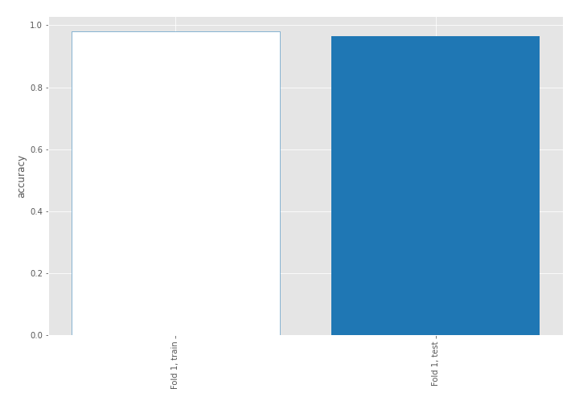

## Coefficients
| feature                           |   Learner_1 |
|:----------------------------------|------------:|
| skewness2                         |   0.699375  |
| return_autocorrelation_2_lag1     |   0.442407  |
| return_correlation_ts2_lag_3      |   0.386119  |
| sqreturn_correlation_ts2_lag_3    |   0.386119  |
| sd1                               |   0.374217  |
| sqreturn_correlation_ts1_lag_1    |   0.358333  |
| return_correlation_ts1_lag_1      |   0.358333  |
| return_autocorrelation_2_lag3     |   0.355405  |
| sqreturn_correlation_ts1_lag_3    |   0.273953  |
| return_correlation_ts1_lag_3      |   0.273953  |
| return_autocorrelation_1_lag2     |   0.252137  |
| return_correlation_ts2_lag_1      |   0.251903  |
| sqreturn_correlation_ts2_lag_1    |   0.251903  |
| return_autocorrelation_1_lag3     |   0.224844  |
| return_autocorrelation_1_lag1     |   0.213672  |
| sqreturn_correlation_ts2_lag_2    |   0.167937  |
| return_correlation_ts2_lag_2      |   0.167937  |
| return_autocorrelation_2_lag2     |   0.145791  |
| mean2                             |   0.121821  |
| return_correlation_ts1_lag_2      |   0.0681546 |
| sqreturn_correlation_ts1_lag_2    |   0.0681546 |
| skewness1                         |  -0.0955372 |
| mean1                             |  -0.192906  |
| sqreturn_correlation_ts1_lag_0    |  -0.24472   |
| return_correlation_ts1_lag_0      |  -0.24472   |
| sd2                               |  -0.272293  |
| price1_granger_cause_price2       |  -0.370568  |
| sqreturn_autocorrelation_ts1_lag3 |  -0.695954  |
| sqreturn_autocorrelation_ts2_lag3 |  -0.73531   |
| sqreturn_autocorrelation_ts1_lag1 |  -0.798825  |
| sqreturn_autocorrelation_ts1_lag2 |  -0.889022  |
| sqreturn_autocorrelation_ts2_lag2 |  -0.919258  |
| price2_granger_cause_price1       |  -0.932256  |
| sqreturn_autocorrelation_ts2_lag1 |  -0.948439  |
| intercept                         |  -1.39856   |
| kurtosis2                         |  -3.52332   |
| kurtosis1                         |  -3.99836   |

## Permutation-based Importance
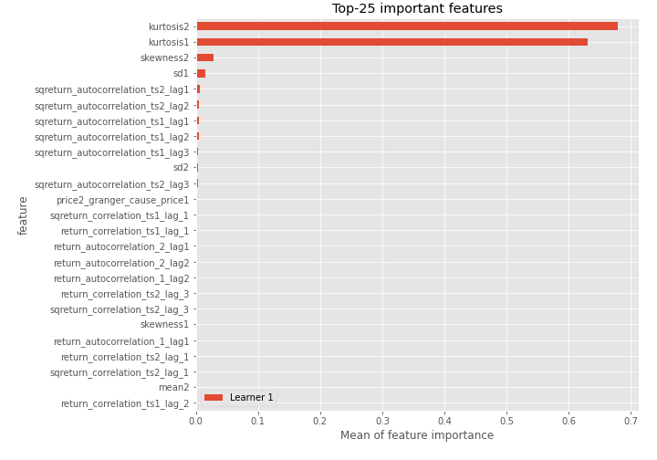
## Confusion Matrix

## Normalized Confusion Matrix

## ROC Curve

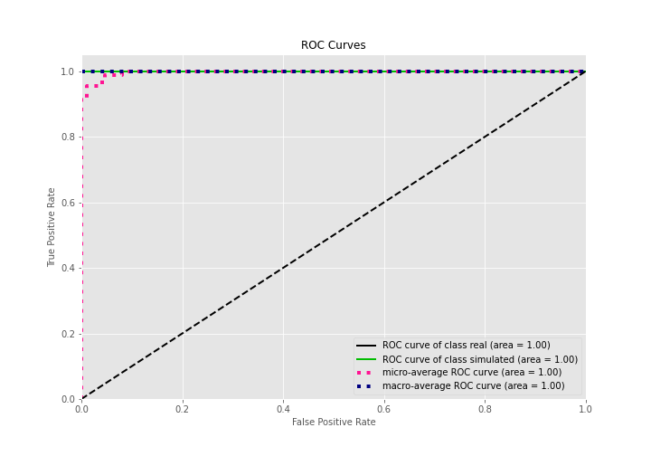

## Kolmogorov-Smirnov Statistic

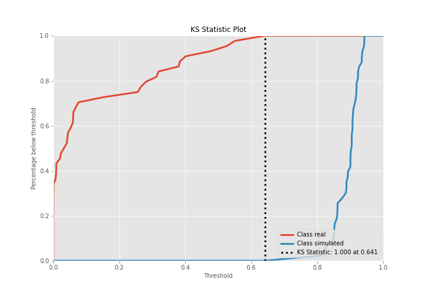

## Precision-Recall Curve

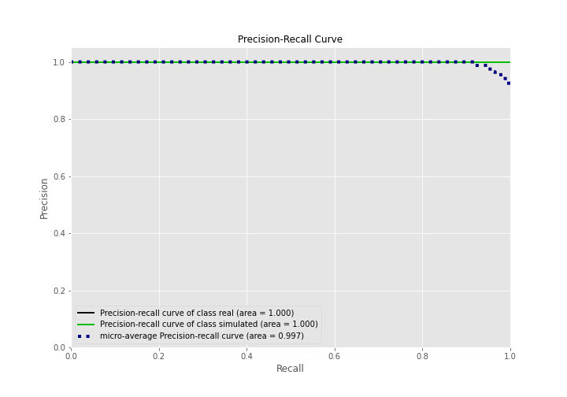

## Calibration Curve

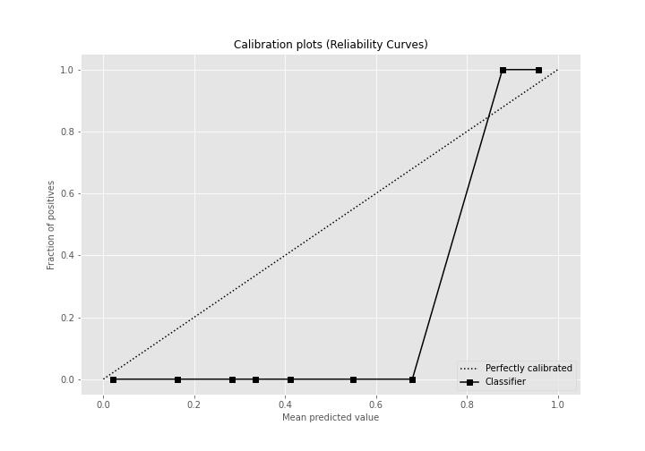

## Cumulative Gains Curve

## Lift Curve

## SHAP Importance
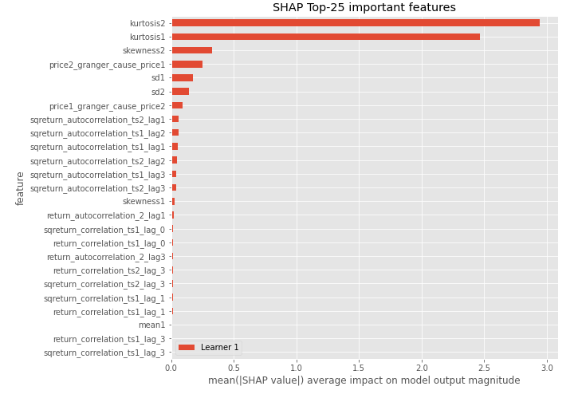

## SHAP Dependence plots

### Dependence (Fold 1)
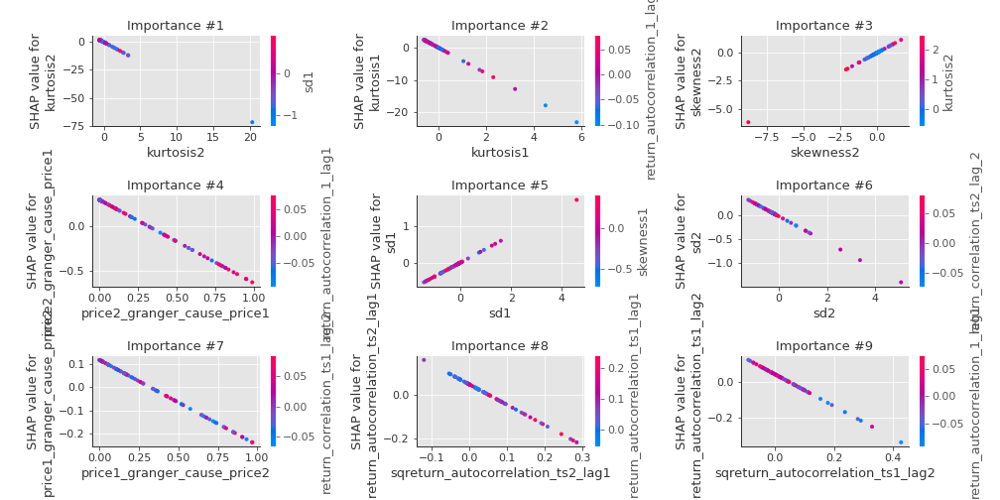

## SHAP Decision plots

### Top-10 Worst decisions for class 0 (Fold 1)
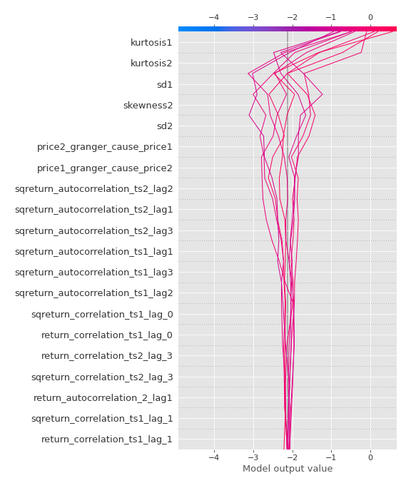
### Top-10 Best decisions for class 0 (Fold 1)
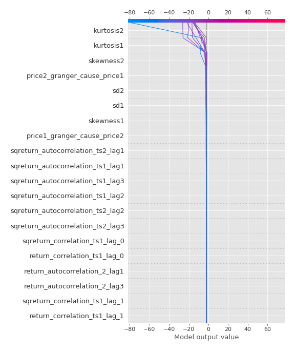
### Top-10 Worst decisions for class 1 (Fold 1)
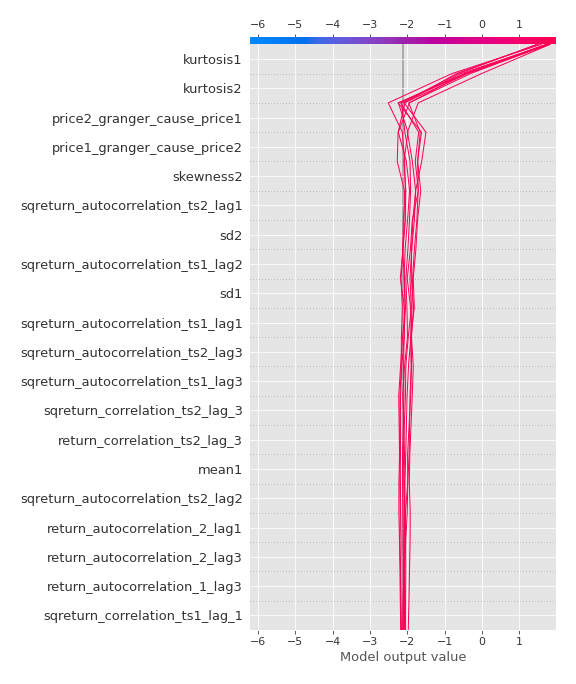
### Top-10 Best decisions for class 1 (Fold 1)
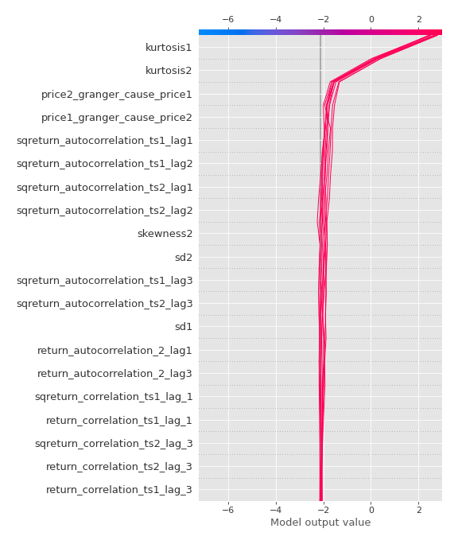

[<< Go back](../README.md)
