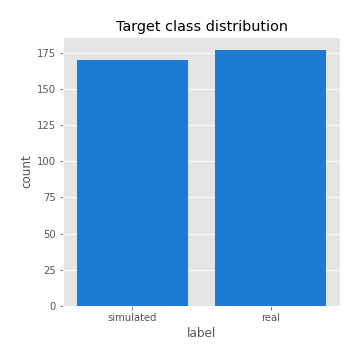
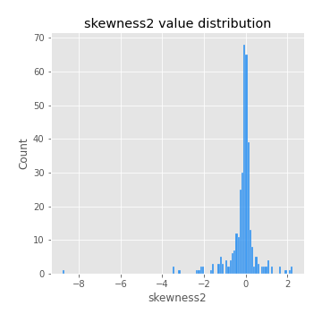
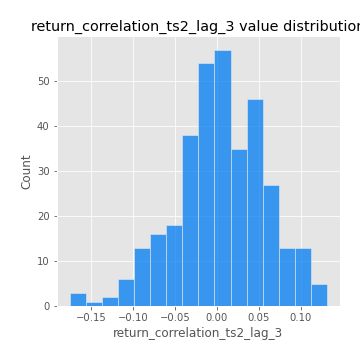

# Exploratory Data Analysis

[<< Go back](../README.md)
## Feature : target
- **Feature type** : categorical
- **Missing** : 0.0%
- **Unique** : 2
- **Count** :347
- **Unique** :2
- **Top** :real
- **Freq** :177

## Feature : mean1
- **Feature type** : continous
- **Missing** : 0.0%
- **Unique** : 347
- **Count** :347.0
- **Mean** :0.05786699176754354
- **Std** :0.0805125607726269
- **Min** :-0.22632637961920957
- **25%th Percentile** : 0.005645834820890436
- **50%th Percentile** : 0.05526274609078925
- **75%th Percentile** : 0.10161295184091254
- **Max** :0.37175100008111034

## Feature : mean2
- **Feature type** : continous
- **Missing** : 0.0%
- **Unique** : 347
- **Count** :347.0
- **Mean** :0.08132344437555879
- **Std** :0.08700052649173706
- **Min** :-0.24205418062825398
- **25%th Percentile** : 0.03691882519451168
- **50%th Percentile** : 0.0785305391558196
- **75%th Percentile** : 0.1357073108465387
- **Max** :0.37616608147096464

## Feature : sd1
- **Feature type** : continous
- **Missing** : 0.0%
- **Unique** : 347
- **Count** :347.0
- **Mean** :1.8554295884166556
- **Std** :0.694894061120263
- **Min** :0.7470080772831957
- **25%th Percentile** : 1.640145929402137
- **50%th Percentile** : 1.8162087047842248
- **75%th Percentile** : 1.8868465349381145
- **Max** :9.236766377527575

## Feature : sd2
- **Feature type** : continous
- **Missing** : 0.0%
- **Unique** : 347
- **Count** :347.0
- **Mean** :1.801159632103682
- **Std** :0.7572976633781087
- **Min** :0.8455946193085045
- **25%th Percentile** : 1.56760435062206
- **50%th Percentile** : 1.6477366168332799
- **75%th Percentile** : 1.7205370191473013
- **Max** :6.737618636746393

## Feature : skewness1
- **Feature type** : continous
- **Missing** : 0.0%
- **Unique** : 347
- **Count** :347.0
- **Mean** :-0.0735132135291121
- **Std** :0.5615824421475535
- **Min** :-3.453087436558107
- **25%th Percentile** : -0.17578639792524042
- **50%th Percentile** : -0.024454357645990025
- **75%th Percentile** : 0.09670544646335866
- **Max** :2.5845963767725557

## Feature : skewness2
- **Feature type** : continous
- **Missing** : 0.0%
- **Unique** : 347
- **Count** :347.0
- **Mean** :-0.13874395139509615
- **Std** :0.7921704439029381
- **Min** :-8.801502855292393
- **25%th Percentile** : -0.2402097291039798
- **50%th Percentile** : -0.033838775746655225
- **75%th Percentile** : 0.09236868210349562
- **Max** :2.2606839051517187

## Feature : kurtosis1
- **Feature type** : continous
- **Missing** : 0.0%
- **Unique** : 347
- **Count** :347.0
- **Mean** :3.0655563115322693
- **Std** :5.8645993362645905
- **Min** :-0.43238923720242894
- **25%th Percentile** : -0.002539202948557584
- **50%th Percentile** : 0.6514678102120954
- **75%th Percentile** : 3.926946560753578
- **Max** :46.07507808162177

## Feature : kurtosis2
- **Feature type** : continous
- **Missing** : 0.0%
- **Unique** : 347
- **Count** :347.0
- **Mean** :4.0449835267039616
- **Std** :10.04048127835252
- **Min** :-0.5589029827527057
- **25%th Percentile** : -0.030131627211080314
- **50%th Percentile** : 0.5959686193600988
- **75%th Percentile** : 4.40507914533392
- **Max** :143.10871011533666

## Feature : return_autocorrelation_1_lag1
- **Feature type** : continous
- **Missing** : 0.0%
- **Unique** : 347
- **Count** :347.0
- **Mean** :-0.010406635117844485
- **Std** :0.0563295156937798
- **Min** :-0.2135576224968752
- **25%th Percentile** : -0.0366324204589526
- **50%th Percentile** : -0.006511135597454065
- **75%th Percentile** : 0.024775270288397384
- **Max** :0.12810656890648087

## Feature : return_autocorrelation_1_lag2
- **Feature type** : continous
- **Missing** : 0.0%
- **Unique** : 347
- **Count** :347.0
- **Mean** :-0.007221900912352719
- **Std** :0.04676781813157404
- **Min** :-0.13309283796645122
- **25%th Percentile** : -0.034724207605005254
- **50%th Percentile** : -0.005964101026921819
- **75%th Percentile** : 0.022957770080193986
- **Max** :0.1561488228015672

## Feature : return_autocorrelation_1_lag3
- **Feature type** : continous
- **Missing** : 0.0%
- **Unique** : 347
- **Count** :347.0
- **Mean** :-0.0004156502843901322
- **Std** :0.050287505575695314
- **Min** :-0.15806635192103805
- **25%th Percentile** : -0.03267842976305847
- **50%th Percentile** : -0.0001900991030594827
- **75%th Percentile** : 0.0340099459021518
- **Max** :0.17805869530681923

## Feature : return_autocorrelation_2_lag1
- **Feature type** : continous
- **Missing** : 0.0%
- **Unique** : 347
- **Count** :347.0
- **Mean** :-0.008277080160173254
- **Std** :0.058341267723342326
- **Min** :-0.25075531010123286
- **25%th Percentile** : -0.03910365914909264
- **50%th Percentile** : -0.005528990699066865
- **75%th Percentile** : 0.0275700216681984
- **Max** :0.16349871797309318

## Feature : return_autocorrelation_2_lag2
- **Feature type** : continous
- **Missing** : 0.0%
- **Unique** : 347
- **Count** :347.0
- **Mean** :-0.004365842700951611
- **Std** :0.0488948821610904
- **Min** :-0.15323211089747296
- **25%th Percentile** : -0.038562610143877796
- **50%th Percentile** : -0.005323983975574878
- **75%th Percentile** : 0.027017547930284273
- **Max** :0.1735398560230086

## Feature : return_autocorrelation_2_lag3
- **Feature type** : continous
- **Missing** : 0.0%
- **Unique** : 347
- **Count** :347.0
- **Mean** :0.0008764813326134011
- **Std** :0.051522259394078215
- **Min** :-0.14200107169559698
- **25%th Percentile** : -0.02882139592255561
- **50%th Percentile** : -0.001992969453947655
- **75%th Percentile** : 0.03349003520125522
- **Max** :0.18577298721381813

## Feature : return_correlation_ts1_lag_0
- **Feature type** : continous
- **Missing** : 0.0%
- **Unique** : 347
- **Count** :347.0
- **Mean** :0.31486250084811956
- **Std** :0.10476193140450937
- **Min** :-0.027089510445801036
- **25%th Percentile** : 0.26430359851304497
- **50%th Percentile** : 0.309767629950894
- **75%th Percentile** : 0.35336660990572066
- **Max** :0.7028422087350163

## Feature : return_correlation_ts1_lag_1
- **Feature type** : continous
- **Missing** : 0.0%
- **Unique** : 347
- **Count** :347.0
- **Mean** :-0.005685502657330132
- **Std** :0.053180358119040545
- **Min** :-0.16985510949917193
- **25%th Percentile** : -0.04117447589183558
- **50%th Percentile** : -0.0033191428202869475
- **75%th Percentile** : 0.0314477578124483
- **Max** :0.15499424718508623

## Feature : return_correlation_ts1_lag_2
- **Feature type** : continous
- **Missing** : 0.0%
- **Unique** : 347
- **Count** :347.0
- **Mean** :-0.0043677766513956695
- **Std** :0.04788385032188967
- **Min** :-0.21653581047581763
- **25%th Percentile** : -0.03697659508905662
- **50%th Percentile** : -0.007697374786748047
- **75%th Percentile** : 0.027809144570238403
- **Max** :0.12425437436089949

## Feature : return_correlation_ts1_lag_3
- **Feature type** : continous
- **Missing** : 0.0%
- **Unique** : 347
- **Count** :347.0
- **Mean** :0.0021973248750910275
- **Std** :0.04866905592505698
- **Min** :-0.13054022342748595
- **25%th Percentile** : -0.02746204406242548
- **50%th Percentile** : 0.0038029787389001067
- **75%th Percentile** : 0.03009595722676326
- **Max** :0.1483470376904481

## Feature : return_correlation_ts2_lag_1
- **Feature type** : continous
- **Missing** : 0.0%
- **Unique** : 347
- **Count** :347.0
- **Mean** :-0.0024881310902478914
- **Std** :0.05043014741152097
- **Min** :-0.2081139431093261
- **25%th Percentile** : -0.02943484810903717
- **50%th Percentile** : -0.0031858225227619657
- **75%th Percentile** : 0.027498596434296457
- **Max** :0.17208763791364762

## Feature : return_correlation_ts2_lag_2
- **Feature type** : continous
- **Missing** : 0.0%
- **Unique** : 347
- **Count** :347.0
- **Mean** :-0.0011898140975696264
- **Std** :0.04966027648382625
- **Min** :-0.23751835475804678
- **25%th Percentile** : -0.03164019901610411
- **50%th Percentile** : -0.00016553792162788547
- **75%th Percentile** : 0.02437102515711754
- **Max** :0.20772887392904255

## Feature : return_correlation_ts2_lag_3
- **Feature type** : continous
- **Missing** : 0.0%
- **Unique** : 347
- **Count** :347.0
- **Mean** :0.00430756720091951
- **Std** :0.05343562221986085
- **Min** :-0.17564076057312866
- **25%th Percentile** : -0.02659312751760127
- **50%th Percentile** : 0.003310343439304396
- **75%th Percentile** : 0.04149833927835894
- **Max** :0.13128380114518473

## Feature : sqreturn_autocorrelation_ts1_lag1
- **Feature type** : continous
- **Missing** : 0.0%
- **Unique** : 347
- **Count** :347.0
- **Mean** :0.0481585923890577
- **Std** :0.09213128771224229
- **Min** :-0.10319301016123833
- **25%th Percentile** : -0.009937781293108405
- **50%th Percentile** : 0.026899891614242912
- **75%th Percentile** : 0.08359895843794286
- **Max** :0.4439086285737898

## Feature : sqreturn_autocorrelation_ts1_lag2
- **Feature type** : continous
- **Missing** : 0.0%
- **Unique** : 347
- **Count** :347.0
- **Mean** :0.041161803258948214
- **Std** :0.09065989968400712
- **Min** :-0.11754416848740949
- **25%th Percentile** : -0.011870719702997069
- **50%th Percentile** : 0.018035097322941774
- **75%th Percentile** : 0.06771142380041774
- **Max** :0.4522162366773919

## Feature : sqreturn_autocorrelation_ts1_lag3
- **Feature type** : continous
- **Missing** : 0.0%
- **Unique** : 347
- **Count** :347.0
- **Mean** :0.035337420774283056
- **Std** :0.0803192673210126
- **Min** :-0.1023523535189205
- **25%th Percentile** : -0.013703652839517175
- **50%th Percentile** : 0.013177590187056989
- **75%th Percentile** : 0.05810039384347518
- **Max** :0.44755937369538146

## Feature : sqreturn_autocorrelation_ts2_lag1
- **Feature type** : continous
- **Missing** : 0.0%
- **Unique** : 347
- **Count** :347.0
- **Mean** :0.048065908003099185
- **Std** :0.08229135717550096
- **Min** :-0.1193294144873762
- **25%th Percentile** : -0.004790594147452273
- **50%th Percentile** : 0.02814716757805405
- **75%th Percentile** : 0.08343447905876857
- **Max** :0.3904869978372003

## Feature : sqreturn_autocorrelation_ts2_lag2
- **Feature type** : continous
- **Missing** : 0.0%
- **Unique** : 347
- **Count** :347.0
- **Mean** :0.036743010703773366
- **Std** :0.08597565842743171
- **Min** :-0.12378499870994658
- **25%th Percentile** : -0.01047429110669044
- **50%th Percentile** : 0.01574233289516576
- **75%th Percentile** : 0.05530398134505484
- **Max** :0.45676817892778204

## Feature : sqreturn_autocorrelation_ts2_lag3
- **Feature type** : continous
- **Missing** : 0.0%
- **Unique** : 347
- **Count** :347.0
- **Mean** :0.0319512055489897
- **Std** :0.06964395301949114
- **Min** :-0.08496434495282057
- **25%th Percentile** : -0.011154985132309368
- **50%th Percentile** : 0.016077379988817676
- **75%th Percentile** : 0.057688256476204194
- **Max** :0.31225727797735664

## Feature : sqreturn_correlation_ts1_lag_0
- **Feature type** : continous
- **Missing** : 0.0%
- **Unique** : 347
- **Count** :347.0
- **Mean** :0.31486250084811956
- **Std** :0.10476193140450937
- **Min** :-0.027089510445801036
- **25%th Percentile** : 0.26430359851304497
- **50%th Percentile** : 0.309767629950894
- **75%th Percentile** : 0.35336660990572066
- **Max** :0.7028422087350163

## Feature : sqreturn_correlation_ts1_lag_1
- **Feature type** : continous
- **Missing** : 0.0%
- **Unique** : 347
- **Count** :347.0
- **Mean** :-0.005685502657330132
- **Std** :0.053180358119040545
- **Min** :-0.16985510949917193
- **25%th Percentile** : -0.04117447589183558
- **50%th Percentile** : -0.0033191428202869475
- **75%th Percentile** : 0.0314477578124483
- **Max** :0.15499424718508623

## Feature : sqreturn_correlation_ts1_lag_2
- **Feature type** : continous
- **Missing** : 0.0%
- **Unique** : 347
- **Count** :347.0
- **Mean** :-0.0043677766513956695
- **Std** :0.04788385032188967
- **Min** :-0.21653581047581763
- **25%th Percentile** : -0.03697659508905662
- **50%th Percentile** : -0.007697374786748047
- **75%th Percentile** : 0.027809144570238403
- **Max** :0.12425437436089949

## Feature : sqreturn_correlation_ts1_lag_3
- **Feature type** : continous
- **Missing** : 0.0%
- **Unique** : 347
- **Count** :347.0
- **Mean** :0.0021973248750910275
- **Std** :0.04866905592505698
- **Min** :-0.13054022342748595
- **25%th Percentile** : -0.02746204406242548
- **50%th Percentile** : 0.0038029787389001067
- **75%th Percentile** : 0.03009595722676326
- **Max** :0.1483470376904481

## Feature : sqreturn_correlation_ts2_lag_1
- **Feature type** : continous
- **Missing** : 0.0%
- **Unique** : 347
- **Count** :347.0
- **Mean** :-0.0024881310902478914
- **Std** :0.05043014741152097
- **Min** :-0.2081139431093261
- **25%th Percentile** : -0.02943484810903717
- **50%th Percentile** : -0.0031858225227619657
- **75%th Percentile** : 0.027498596434296457
- **Max** :0.17208763791364762

## Feature : sqreturn_correlation_ts2_lag_2
- **Feature type** : continous
- **Missing** : 0.0%
- **Unique** : 347
- **Count** :347.0
- **Mean** :-0.0011898140975696264
- **Std** :0.04966027648382625
- **Min** :-0.23751835475804678
- **25%th Percentile** : -0.03164019901610411
- **50%th Percentile** : -0.00016553792162788547
- **75%th Percentile** : 0.02437102515711754
- **Max** :0.20772887392904255

## Feature : sqreturn_correlation_ts2_lag_3
- **Feature type** : continous
- **Missing** : 0.0%
- **Unique** : 347
- **Count** :347.0
- **Mean** :0.00430756720091951
- **Std** :0.05343562221986085
- **Min** :-0.17564076057312866
- **25%th Percentile** : -0.02659312751760127
- **50%th Percentile** : 0.003310343439304396
- **75%th Percentile** : 0.04149833927835894
- **Max** :0.13128380114518473

## Feature : price2_granger_cause_price1
- **Feature type** : continous
- **Missing** : 0.0%
- **Unique** : 347
- **Count** :347.0
- **Mean** :0.3066934367594047
- **Std** :0.29818212114934156
- **Min** :9.772083947979152e-06
- **25%th Percentile** : 0.04845773261340408
- **50%th Percentile** : 0.20368417081248466
- **75%th Percentile** : 0.5114297235059203
- **Max** :0.9902762668265003

## Feature : price1_granger_cause_price2
- **Feature type** : continous
- **Missing** : 0.0%
- **Unique** : 347
- **Count** :347.0
- **Mean** :0.30418230534653673
- **Std** :0.2829100172949995
- **Min** :5.359369827527788e-06
- **25%th Percentile** : 0.05249923045490075
- **50%th Percentile** : 0.2281200440102505
- **75%th Percentile** : 0.5094737712848352
- **Max** :0.9951398266867577

[<< Go back](../README.md)
