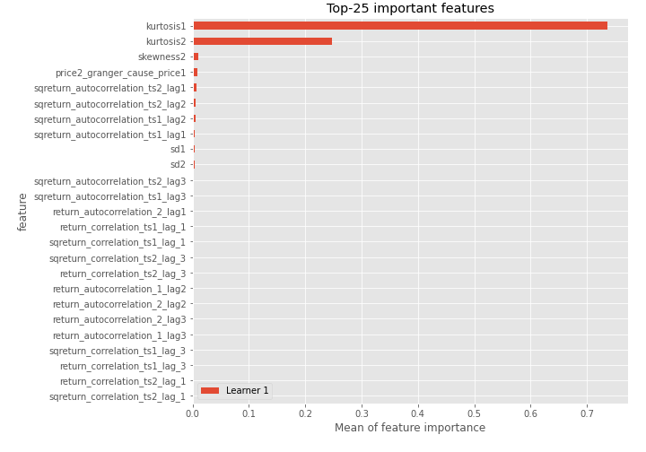

# Summary of 3_Linear

[<< Go back](../README.md)

## Logistic Regression (Linear)
- **n_jobs**: -1
- **explain_level**: 2

## Validation
 - **validation_type**: split
 - **train_ratio**: 0.75
 - **shuffle**: True
 - **stratify**: True

## Optimized metric
accuracy

## Training time

144.4 seconds

## Metric details
|           |    score |     threshold |
|:----------|---------:|--------------:|
| logloss   | 0.152017 | nan           |
| auc       | 1        | nan           |
| f1        | 1        |   0.715349    |
| accuracy  | 1        |   0.715349    |
| precision | 1        |   0.893289    |
| recall    | 1        |   1.79428e-12 |
| mcc       | 1        |   0.715349    |

## Confusion matrix (at threshold=0.715349)
|                      |   Predicted as real |   Predicted as simulated |
|:---------------------|--------------------:|-------------------------:|
| Labeled as real      |                  44 |                        0 |
| Labeled as simulated |                   0 |                       43 |

## Learning curves

## Coefficients
| feature                           |   Learner_1 |
|:----------------------------------|------------:|
| skewness2                         |  0.491208   |
| sd1                               |  0.459849   |
| return_autocorrelation_2_lag3     |  0.38021    |
| return_autocorrelation_2_lag1     |  0.35742    |
| mean2                             |  0.301334   |
| return_correlation_ts1_lag_3      |  0.294405   |
| sqreturn_correlation_ts1_lag_3    |  0.294405   |
| return_correlation_ts1_lag_1      |  0.257541   |
| sqreturn_correlation_ts1_lag_1    |  0.257541   |
| return_correlation_ts2_lag_1      |  0.234668   |
| sqreturn_correlation_ts2_lag_1    |  0.234668   |
| return_autocorrelation_1_lag2     |  0.21341    |
| return_correlation_ts2_lag_3      |  0.203178   |
| sqreturn_correlation_ts2_lag_3    |  0.203178   |
| sqreturn_correlation_ts1_lag_2    |  0.194322   |
| return_correlation_ts1_lag_2      |  0.194322   |
| sqreturn_correlation_ts2_lag_2    |  0.187865   |
| return_correlation_ts2_lag_2      |  0.187865   |
| return_autocorrelation_1_lag3     |  0.154975   |
| return_autocorrelation_2_lag2     |  0.105779   |
| skewness1                         |  0.00714066 |
| mean1                             |  0.00462892 |
| price1_granger_cause_price2       | -0.00493458 |
| return_autocorrelation_1_lag1     | -0.0154541  |
| sqreturn_correlation_ts1_lag_0    | -0.352419   |
| return_correlation_ts1_lag_0      | -0.352419   |
| sd2                               | -0.531847   |
| price2_granger_cause_price1       | -0.756202   |
| sqreturn_autocorrelation_ts2_lag3 | -0.845026   |
| sqreturn_autocorrelation_ts1_lag2 | -1.05818    |
| sqreturn_autocorrelation_ts1_lag3 | -1.10007    |
| sqreturn_autocorrelation_ts2_lag2 | -1.12728    |
| intercept                         | -1.20007    |
| sqreturn_autocorrelation_ts1_lag1 | -1.20646    |
| sqreturn_autocorrelation_ts2_lag1 | -1.45931    |
| kurtosis2                         | -3.61573    |
| kurtosis1                         | -4.04176    |

## Permutation-based Importance

## Confusion Matrix

## Normalized Confusion Matrix

## ROC Curve

## Kolmogorov-Smirnov Statistic

## Precision-Recall Curve

## Calibration Curve

## Cumulative Gains Curve

## Lift Curve

## SHAP Importance

## SHAP Dependence plots

### Dependence (Fold 1)

## SHAP Decision plots

### Top-10 Worst decisions for class 0 (Fold 1)

### Top-10 Best decisions for class 0 (Fold 1)

### Top-10 Worst decisions for class 1 (Fold 1)

### Top-10 Best decisions for class 1 (Fold 1)

[<< Go back](../README.md)
