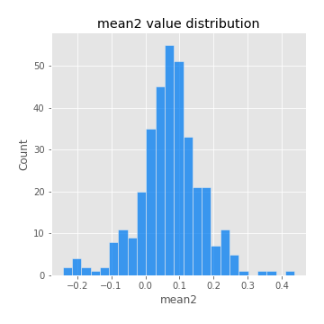
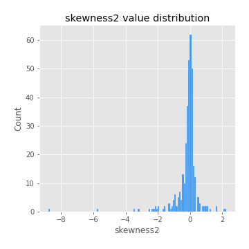
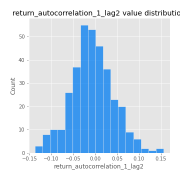
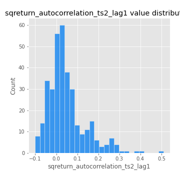

# Exploratory Data Analysis

[<< Go back](../README.md)
## Feature : target
- **Feature type** : categorical
- **Missing** : 0.0%
- **Unique** : 2
- **Count** :347
- **Unique** :2
- **Top** :real
- **Freq** :175

## Feature : mean1
- **Feature type** : continous
- **Missing** : 0.0%
- **Unique** : 347
- **Count** :347.0
- **Mean** :0.05535700250412623
- **Std** :0.08023955413802791
- **Min** :-0.15661989732160375
- **25%th Percentile** : 0.0009027106661574631
- **50%th Percentile** : 0.0523343403511941
- **75%th Percentile** : 0.10196119991000024
- **Max** :0.37175100008111034

## Feature : mean2
- **Feature type** : continous
- **Missing** : 0.0%
- **Unique** : 347
- **Count** :347.0
- **Mean** :0.07204389915424765
- **Std** :0.09250513730076698
- **Min** :-0.24205418062825398
- **25%th Percentile** : 0.025048776610629188
- **50%th Percentile** : 0.07184066115911249
- **75%th Percentile** : 0.1226755494842981
- **Max** :0.4363422518202755

## Feature : sd1
- **Feature type** : continous
- **Missing** : 0.0%
- **Unique** : 347
- **Count** :347.0
- **Mean** :1.8462151544377468
- **Std** :0.5667184711123885
- **Min** :0.7620831696941981
- **25%th Percentile** : 1.6581970693357424
- **50%th Percentile** : 1.8232565325040535
- **75%th Percentile** : 1.9009961789589738
- **Max** :5.996244884956102

## Feature : sd2
- **Feature type** : continous
- **Missing** : 0.0%
- **Unique** : 347
- **Count** :347.0
- **Mean** :1.7701164031758359
- **Std** :0.6863273168317705
- **Min** :0.8455946193085045
- **25%th Percentile** : 1.552417630870434
- **50%th Percentile** : 1.6410486274405316
- **75%th Percentile** : 1.7209420649518736
- **Max** :6.737618636746393

## Feature : skewness1
- **Feature type** : continous
- **Missing** : 0.0%
- **Unique** : 347
- **Count** :347.0
- **Mean** :-0.10481014340655419
- **Std** :0.6267815763204029
- **Min** :-3.530116233761814
- **25%th Percentile** : -0.19044370249779818
- **50%th Percentile** : -0.039519866758760375
- **75%th Percentile** : 0.08618071524886065
- **Max** :2.5845963767725557

## Feature : skewness2
- **Feature type** : continous
- **Missing** : 0.0%
- **Unique** : 347
- **Count** :347.0
- **Mean** :-0.18304081552046575
- **Std** :0.8128887960537661
- **Min** :-8.801502855292393
- **25%th Percentile** : -0.2461753916191839
- **50%th Percentile** : -0.04840185944519485
- **75%th Percentile** : 0.08548324030396912
- **Max** :2.242019525651531

## Feature : kurtosis1
- **Feature type** : continous
- **Missing** : 0.0%
- **Unique** : 347
- **Count** :347.0
- **Mean** :3.4471004338044007
- **Std** :6.332934365838834
- **Min** :-0.4242925247919018
- **25%th Percentile** : -0.0195770511654505
- **50%th Percentile** : 0.5559503011234885
- **75%th Percentile** : 3.9930614339876844
- **Max** :36.91113889081053

## Feature : kurtosis2
- **Feature type** : continous
- **Missing** : 0.0%
- **Unique** : 347
- **Count** :347.0
- **Mean** :3.993528900250436
- **Std** :10.18503394801182
- **Min** :-0.4412904606451735
- **25%th Percentile** : 0.005755944038113858
- **50%th Percentile** : 0.5959686193600988
- **75%th Percentile** : 4.3840343020263415
- **Max** :143.10871011533666

## Feature : return_autocorrelation_1_lag1
- **Feature type** : continous
- **Missing** : 0.0%
- **Unique** : 347
- **Count** :347.0
- **Mean** :-0.01209710525328273
- **Std** :0.05650409821193258
- **Min** :-0.20673896439036124
- **25%th Percentile** : -0.040394924195139216
- **50%th Percentile** : -0.004692733920400917
- **75%th Percentile** : 0.023882817004643953
- **Max** :0.14048897436928312

## Feature : return_autocorrelation_1_lag2
- **Feature type** : continous
- **Missing** : 0.0%
- **Unique** : 347
- **Count** :347.0
- **Mean** :-0.007138598359979728
- **Std** :0.04922415624677057
- **Min** :-0.1377577389362801
- **25%th Percentile** : -0.03758480969436911
- **50%th Percentile** : -0.007185526582386535
- **75%th Percentile** : 0.02521019479285814
- **Max** :0.1561488228015672

## Feature : return_autocorrelation_1_lag3
- **Feature type** : continous
- **Missing** : 0.0%
- **Unique** : 347
- **Count** :347.0
- **Mean** :0.0003467018445028471
- **Std** :0.05072330623693799
- **Min** :-0.15806635192103805
- **25%th Percentile** : -0.031931124822476877
- **50%th Percentile** : -0.0006017800023255181
- **75%th Percentile** : 0.03585541291307903
- **Max** :0.17805869530681923

## Feature : return_autocorrelation_2_lag1
- **Feature type** : continous
- **Missing** : 0.0%
- **Unique** : 347
- **Count** :347.0
- **Mean** :-0.011701735072729175
- **Std** :0.062082315028488676
- **Min** :-0.25075531010123286
- **25%th Percentile** : -0.041993671344154826
- **50%th Percentile** : -0.010657865373458026
- **75%th Percentile** : 0.02686852170730685
- **Max** :0.31863413537898483

## Feature : return_autocorrelation_2_lag2
- **Feature type** : continous
- **Missing** : 0.0%
- **Unique** : 347
- **Count** :347.0
- **Mean** :-0.002429605970094449
- **Std** :0.04941162331708325
- **Min** :-0.1495113937562178
- **25%th Percentile** : -0.032732010506324384
- **50%th Percentile** : 0.0019331227939847727
- **75%th Percentile** : 0.027156492372800593
- **Max** :0.20974504043791217

## Feature : return_autocorrelation_2_lag3
- **Feature type** : continous
- **Missing** : 0.0%
- **Unique** : 347
- **Count** :347.0
- **Mean** :0.00037239933067277257
- **Std** :0.04848852833921707
- **Min** :-0.1344316177078651
- **25%th Percentile** : -0.02889034418984933
- **50%th Percentile** : 0.001058297563840487
- **75%th Percentile** : 0.03350321871970199
- **Max** :0.1419999376914021

## Feature : return_correlation_ts1_lag_0
- **Feature type** : continous
- **Missing** : 0.0%
- **Unique** : 347
- **Count** :347.0
- **Mean** :0.3122277919068566
- **Std** :0.11224436643550502
- **Min** :-0.027089510445801036
- **25%th Percentile** : 0.2559394948548639
- **50%th Percentile** : 0.3097416295631822
- **75%th Percentile** : 0.3577004950670164
- **Max** :0.7041861626832071

## Feature : return_correlation_ts1_lag_1
- **Feature type** : continous
- **Missing** : 0.0%
- **Unique** : 347
- **Count** :347.0
- **Mean** :-0.010350547152727048
- **Std** :0.0504723814469569
- **Min** :-0.15776193292681923
- **25%th Percentile** : -0.04465569523397562
- **50%th Percentile** : -0.0065776061526431175
- **75%th Percentile** : 0.02473789338308535
- **Max** :0.13045177934881838

## Feature : return_correlation_ts1_lag_2
- **Feature type** : continous
- **Missing** : 0.0%
- **Unique** : 347
- **Count** :347.0
- **Mean** :-0.003749977008252956
- **Std** :0.047123580207023556
- **Min** :-0.12864410180561703
- **25%th Percentile** : -0.03272609019997503
- **50%th Percentile** : -0.005084584010345165
- **75%th Percentile** : 0.028584674675203148
- **Max** :0.10999438450016166

## Feature : return_correlation_ts1_lag_3
- **Feature type** : continous
- **Missing** : 0.0%
- **Unique** : 347
- **Count** :347.0
- **Mean** :0.0022265659128221224
- **Std** :0.05043129233305665
- **Min** :-0.1270218498974763
- **25%th Percentile** : -0.02940403713047359
- **50%th Percentile** : 0.003586528888343079
- **75%th Percentile** : 0.03977225071606856
- **Max** :0.11182956656196003

## Feature : return_correlation_ts2_lag_1
- **Feature type** : continous
- **Missing** : 0.0%
- **Unique** : 347
- **Count** :347.0
- **Mean** :-0.0035373526799034696
- **Std** :0.05338753322219333
- **Min** :-0.2081139431093261
- **25%th Percentile** : -0.03352618511395783
- **50%th Percentile** : -0.001885812481597264
- **75%th Percentile** : 0.030856996202913663
- **Max** :0.17208763791364762

## Feature : return_correlation_ts2_lag_2
- **Feature type** : continous
- **Missing** : 0.0%
- **Unique** : 347
- **Count** :347.0
- **Mean** :-0.000909296061752364
- **Std** :0.05044437287536696
- **Min** :-0.23751835475804678
- **25%th Percentile** : -0.03657945777222178
- **50%th Percentile** : -0.0001525907887598406
- **75%th Percentile** : 0.029386523358130696
- **Max** :0.20772887392904255

## Feature : return_correlation_ts2_lag_3
- **Feature type** : continous
- **Missing** : 0.0%
- **Unique** : 347
- **Count** :347.0
- **Mean** :0.002691255005261083
- **Std** :0.05004344509007254
- **Min** :-0.17564076057312866
- **25%th Percentile** : -0.02579907391841523
- **50%th Percentile** : 0.0009626466206731628
- **75%th Percentile** : 0.03294311569031218
- **Max** :0.13128380114518473

## Feature : sqreturn_autocorrelation_ts1_lag1
- **Feature type** : continous
- **Missing** : 0.0%
- **Unique** : 347
- **Count** :347.0
- **Mean** :0.04616696677744034
- **Std** :0.09052848612190424
- **Min** :-0.08774200369834942
- **25%th Percentile** : -0.009790707787663264
- **50%th Percentile** : 0.024191388470883333
- **75%th Percentile** : 0.0767383908521603
- **Max** :0.49414293176447355

## Feature : sqreturn_autocorrelation_ts1_lag2
- **Feature type** : continous
- **Missing** : 0.0%
- **Unique** : 347
- **Count** :347.0
- **Mean** :0.03877249912560022
- **Std** :0.08690874112635247
- **Min** :-0.09656355494305872
- **25%th Percentile** : -0.010777385763502706
- **50%th Percentile** : 0.016718709162397163
- **75%th Percentile** : 0.06352479703874594
- **Max** :0.4522162366773919

## Feature : sqreturn_autocorrelation_ts1_lag3
- **Feature type** : continous
- **Missing** : 0.0%
- **Unique** : 347
- **Count** :347.0
- **Mean** :0.030129742987019377
- **Std** :0.07538196627032365
- **Min** :-0.08766822316519393
- **25%th Percentile** : -0.017100524243853922
- **50%th Percentile** : 0.011710548254852042
- **75%th Percentile** : 0.05564377892665184
- **Max** :0.41030914918857014

## Feature : sqreturn_autocorrelation_ts2_lag1
- **Feature type** : continous
- **Missing** : 0.0%
- **Unique** : 347
- **Count** :347.0
- **Mean** :0.0472839329487441
- **Std** :0.09073281053494492
- **Min** :-0.10193663249366507
- **25%th Percentile** : -0.006544895649013653
- **50%th Percentile** : 0.02644695504582418
- **75%th Percentile** : 0.07716160139986579
- **Max** :0.510085647437958

## Feature : sqreturn_autocorrelation_ts2_lag2
- **Feature type** : continous
- **Missing** : 0.0%
- **Unique** : 347
- **Count** :347.0
- **Mean** :0.03584129311338558
- **Std** :0.08833598548779814
- **Min** :-0.1047180201330261
- **25%th Percentile** : -0.013860422569799729
- **50%th Percentile** : 0.015009649875009542
- **75%th Percentile** : 0.055566491858685535
- **Max** :0.45676817892778204

## Feature : sqreturn_autocorrelation_ts2_lag3
- **Feature type** : continous
- **Missing** : 0.0%
- **Unique** : 347
- **Count** :347.0
- **Mean** :0.027833124823659235
- **Std** :0.0687682380100786
- **Min** :-0.09373081116929213
- **25%th Percentile** : -0.016560765928395865
- **50%th Percentile** : 0.015610956473203269
- **75%th Percentile** : 0.05389655576685938
- **Max** :0.31225727797735664

## Feature : sqreturn_correlation_ts1_lag_0
- **Feature type** : continous
- **Missing** : 0.0%
- **Unique** : 347
- **Count** :347.0
- **Mean** :0.3122277919068566
- **Std** :0.11224436643550502
- **Min** :-0.027089510445801036
- **25%th Percentile** : 0.2559394948548639
- **50%th Percentile** : 0.3097416295631822
- **75%th Percentile** : 0.3577004950670164
- **Max** :0.7041861626832071

## Feature : sqreturn_correlation_ts1_lag_1
- **Feature type** : continous
- **Missing** : 0.0%
- **Unique** : 347
- **Count** :347.0
- **Mean** :-0.010350547152727048
- **Std** :0.0504723814469569
- **Min** :-0.15776193292681923
- **25%th Percentile** : -0.04465569523397562
- **50%th Percentile** : -0.0065776061526431175
- **75%th Percentile** : 0.02473789338308535
- **Max** :0.13045177934881838

## Feature : sqreturn_correlation_ts1_lag_2
- **Feature type** : continous
- **Missing** : 0.0%
- **Unique** : 347
- **Count** :347.0
- **Mean** :-0.003749977008252956
- **Std** :0.047123580207023556
- **Min** :-0.12864410180561703
- **25%th Percentile** : -0.03272609019997503
- **50%th Percentile** : -0.005084584010345165
- **75%th Percentile** : 0.028584674675203148
- **Max** :0.10999438450016166

## Feature : sqreturn_correlation_ts1_lag_3
- **Feature type** : continous
- **Missing** : 0.0%
- **Unique** : 347
- **Count** :347.0
- **Mean** :0.0022265659128221224
- **Std** :0.05043129233305665
- **Min** :-0.1270218498974763
- **25%th Percentile** : -0.02940403713047359
- **50%th Percentile** : 0.003586528888343079
- **75%th Percentile** : 0.03977225071606856
- **Max** :0.11182956656196003

## Feature : sqreturn_correlation_ts2_lag_1
- **Feature type** : continous
- **Missing** : 0.0%
- **Unique** : 347
- **Count** :347.0
- **Mean** :-0.0035373526799034696
- **Std** :0.05338753322219333
- **Min** :-0.2081139431093261
- **25%th Percentile** : -0.03352618511395783
- **50%th Percentile** : -0.001885812481597264
- **75%th Percentile** : 0.030856996202913663
- **Max** :0.17208763791364762

## Feature : sqreturn_correlation_ts2_lag_2
- **Feature type** : continous
- **Missing** : 0.0%
- **Unique** : 347
- **Count** :347.0
- **Mean** :-0.000909296061752364
- **Std** :0.05044437287536696
- **Min** :-0.23751835475804678
- **25%th Percentile** : -0.03657945777222178
- **50%th Percentile** : -0.0001525907887598406
- **75%th Percentile** : 0.029386523358130696
- **Max** :0.20772887392904255

## Feature : sqreturn_correlation_ts2_lag_3
- **Feature type** : continous
- **Missing** : 0.0%
- **Unique** : 347
- **Count** :347.0
- **Mean** :0.002691255005261083
- **Std** :0.05004344509007254
- **Min** :-0.17564076057312866
- **25%th Percentile** : -0.02579907391841523
- **50%th Percentile** : 0.0009626466206731628
- **75%th Percentile** : 0.03294311569031218
- **Max** :0.13128380114518473

## Feature : price2_granger_cause_price1
- **Feature type** : continous
- **Missing** : 0.0%
- **Unique** : 347
- **Count** :347.0
- **Mean** :0.313949905437092
- **Std** :0.29228718501225126
- **Min** :1.754451168725191e-05
- **25%th Percentile** : 0.04442649308816189
- **50%th Percentile** : 0.2308606145278805
- **75%th Percentile** : 0.5260555910616574
- **Max** :0.9885712803689185

## Feature : price1_granger_cause_price2
- **Feature type** : continous
- **Missing** : 0.0%
- **Unique** : 347
- **Count** :347.0
- **Mean** :0.29064113063427427
- **Std** :0.28394190339440384
- **Min** :4.992219363374128e-06
- **25%th Percentile** : 0.04910691198084967
- **50%th Percentile** : 0.2005593585485139
- **75%th Percentile** : 0.48393570652925166
- **Max** :0.9951398266867577

[<< Go back](../README.md)
