# Summary of 3_Linear

[<< Go back](../README.md)

## Logistic Regression (Linear)
- **n_jobs**: -1
- **explain_level**: 2

## Validation
 - **validation_type**: split
 - **train_ratio**: 0.75
 - **shuffle**: True
 - **stratify**: True

## Optimized metric
accuracy

## Training time

43.5 seconds

## Metric details
|           |    score |     threshold |
|:----------|---------:|--------------:|
| logloss   | 0.133969 | nan           |
| auc       | 1        | nan           |
| f1        | 1        |   0.653877    |
| accuracy  | 1        |   0.653877    |
| precision | 1        |   0.876674    |
| recall    | 1        |   6.89824e-14 |
| mcc       | 1        |   0.653877    |

## Confusion matrix (at threshold=0.653877)
|                      |   Predicted as real |   Predicted as simulated |
|:---------------------|--------------------:|-------------------------:|
| Labeled as real      |                  46 |                        0 |
| Labeled as simulated |                   0 |                       41 |

## Learning curves
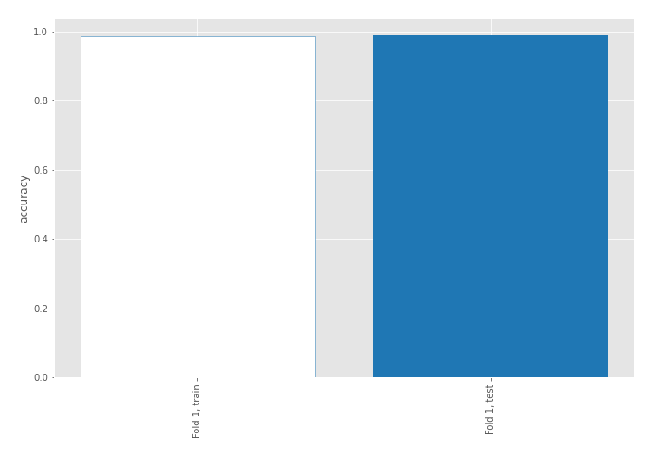

## Coefficients
| feature                           |   Learner_1 |
|:----------------------------------|------------:|
| skewness2                         |   0.486511  |
| return_autocorrelation_2_lag3     |   0.384255  |
| return_autocorrelation_2_lag1     |   0.368371  |
| return_autocorrelation_1_lag3     |   0.365853  |
| return_correlation_ts2_lag_3      |   0.322396  |
| sqreturn_correlation_ts2_lag_3    |   0.322396  |
| return_correlation_ts1_lag_1      |   0.303683  |
| sqreturn_correlation_ts1_lag_1    |   0.303683  |
| mean2                             |   0.298493  |
| sd1                               |   0.285482  |
| return_autocorrelation_1_lag2     |   0.248387  |
| return_correlation_ts2_lag_1      |   0.242207  |
| sqreturn_correlation_ts2_lag_1    |   0.242207  |
| sqreturn_correlation_ts1_lag_3    |   0.236316  |
| return_correlation_ts1_lag_3      |   0.236316  |
| return_autocorrelation_2_lag2     |   0.211388  |
| skewness1                         |   0.198283  |
| return_correlation_ts1_lag_2      |   0.145045  |
| sqreturn_correlation_ts1_lag_2    |   0.145045  |
| return_correlation_ts2_lag_2      |   0.124466  |
| sqreturn_correlation_ts2_lag_2    |   0.124466  |
| mean1                             |   0.0949589 |
| return_autocorrelation_1_lag1     |   0.0704408 |
| return_correlation_ts1_lag_0      |  -0.181307  |
| sqreturn_correlation_ts1_lag_0    |  -0.181307  |
| price1_granger_cause_price2       |  -0.346467  |
| sd2                               |  -0.447882  |
| price2_granger_cause_price1       |  -0.558239  |
| sqreturn_autocorrelation_ts1_lag3 |  -0.979806  |
| sqreturn_autocorrelation_ts2_lag3 |  -1.01372   |
| sqreturn_autocorrelation_ts1_lag2 |  -1.07909   |
| sqreturn_autocorrelation_ts2_lag2 |  -1.19737   |
| sqreturn_autocorrelation_ts1_lag1 |  -1.2602    |
| intercept                         |  -1.47351   |
| sqreturn_autocorrelation_ts2_lag1 |  -1.49485   |
| kurtosis2                         |  -3.14161   |
| kurtosis1                         |  -4.47466   |

## Permutation-based Importance
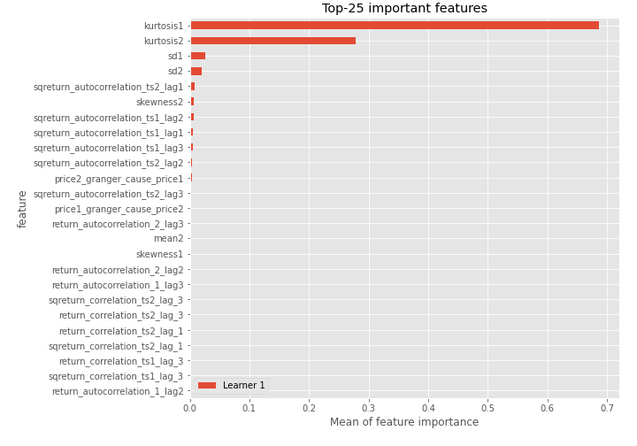
## Confusion Matrix

## Normalized Confusion Matrix

## ROC Curve

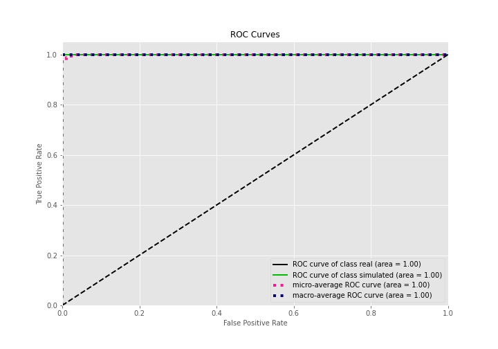

## Kolmogorov-Smirnov Statistic

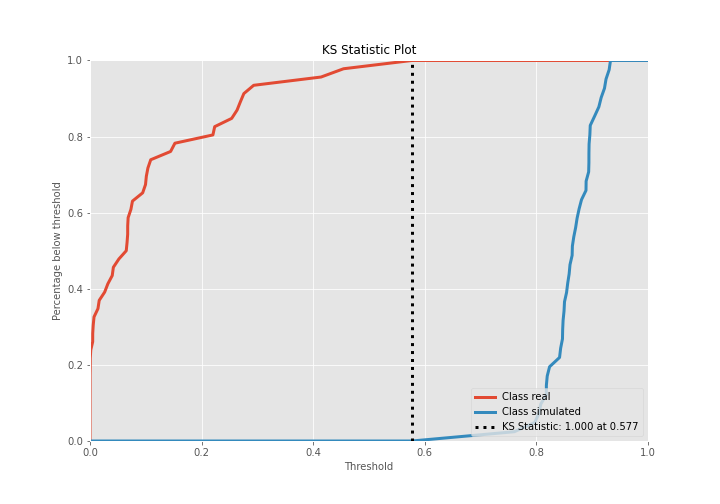

## Precision-Recall Curve

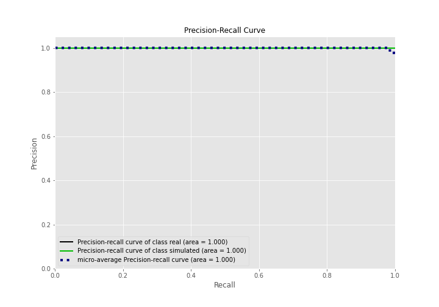

## Calibration Curve

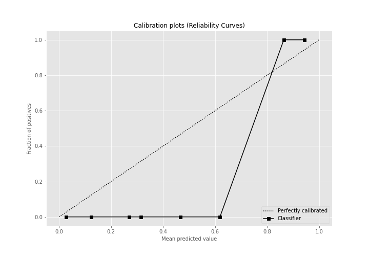

## Cumulative Gains Curve

## Lift Curve

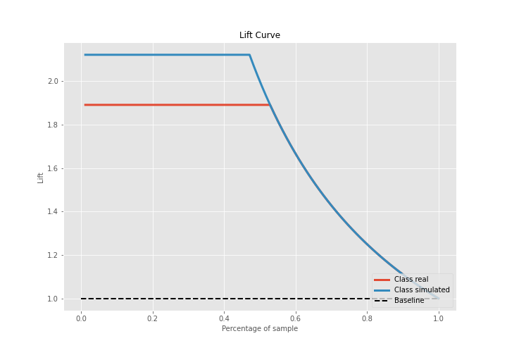

## SHAP Importance
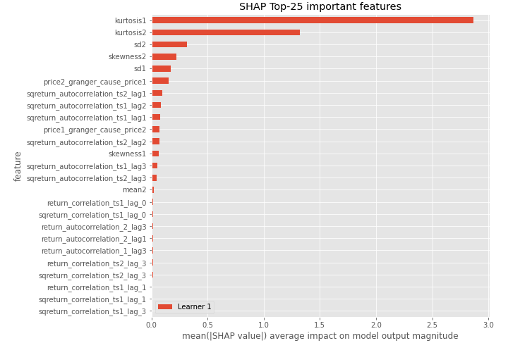

## SHAP Dependence plots

### Dependence (Fold 1)
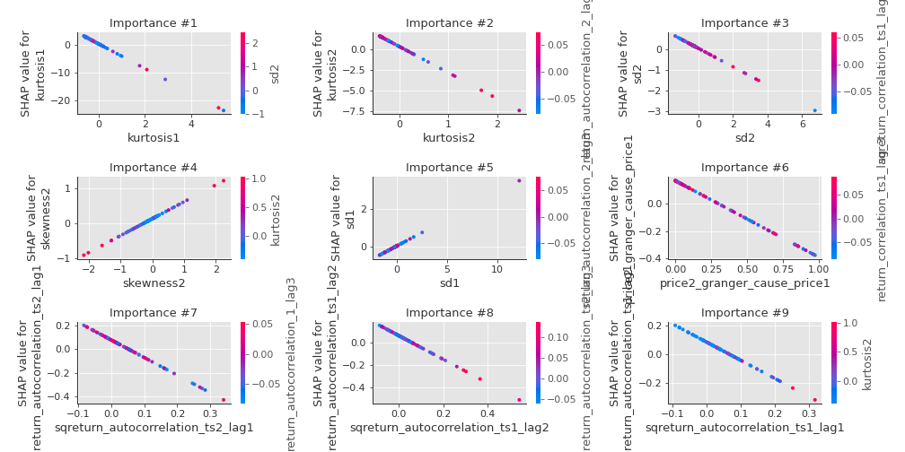

## SHAP Decision plots

### Top-10 Worst decisions for class 0 (Fold 1)
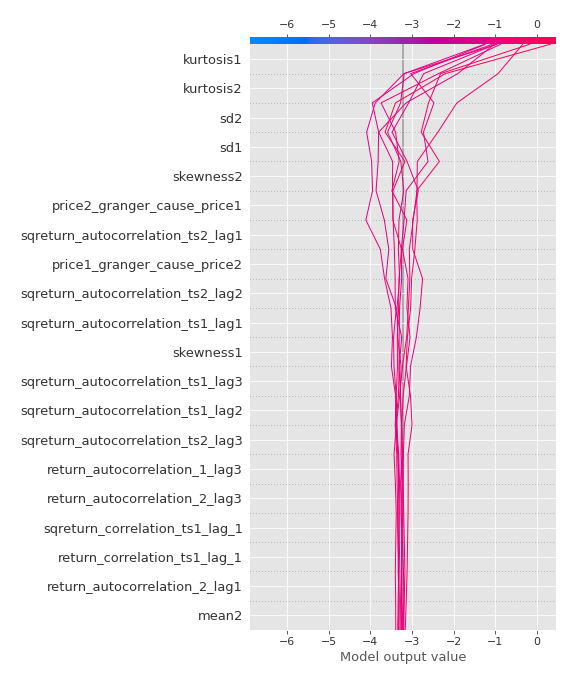
### Top-10 Best decisions for class 0 (Fold 1)
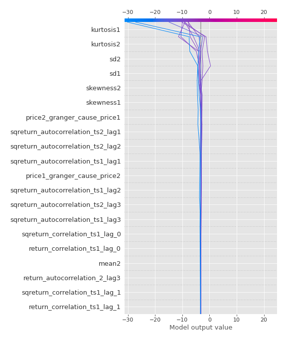
### Top-10 Worst decisions for class 1 (Fold 1)
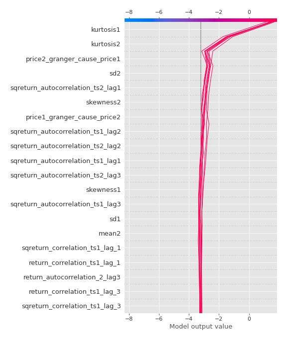
### Top-10 Best decisions for class 1 (Fold 1)
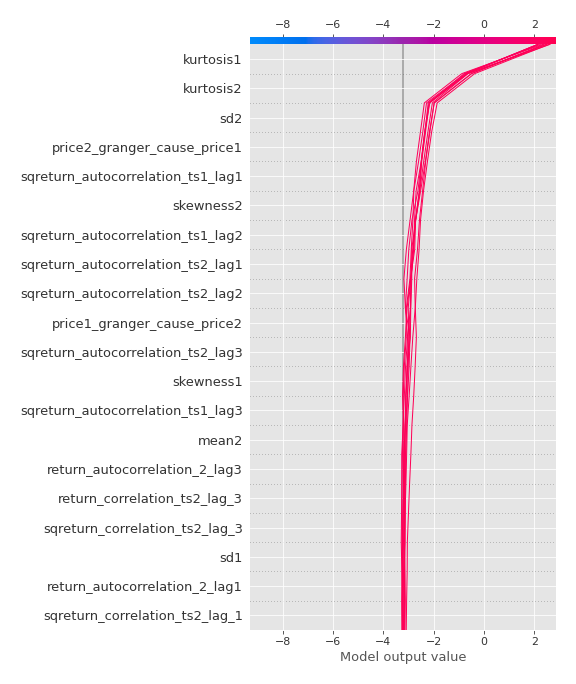

[<< Go back](../README.md)
