# Exploratory Data Analysis

[<< Go back](../README.md)
## Feature : target
- **Feature type** : categorical
- **Missing** : 0.0%
- **Unique** : 2
- **Count** :347
- **Unique** :2
- **Top** :real
- **Freq** :184

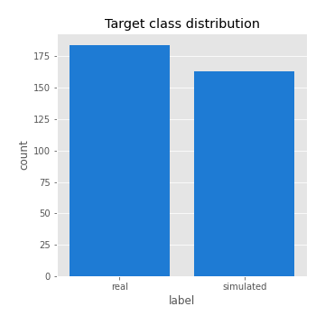
## Feature : mean1
- **Feature type** : continous
- **Missing** : 0.0%
- **Unique** : 347
- **Count** :347.0
- **Mean** :0.05960978335494489
- **Std** :0.0806384208512337
- **Min** :-0.22632637961920957
- **25%th Percentile** : 0.009848008074755412
- **50%th Percentile** : 0.05801750588140843
- **75%th Percentile** : 0.09756580484956984
- **Max** :0.37175100008111034

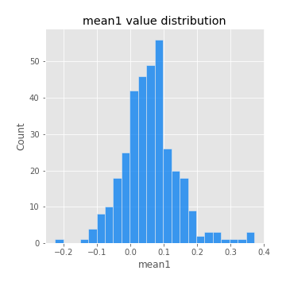
## Feature : mean2
- **Feature type** : continous
- **Missing** : 0.0%
- **Unique** : 347
- **Count** :347.0
- **Mean** :0.07432539726945166
- **Std** :0.08860958788957891
- **Min** :-0.24205418062825398
- **25%th Percentile** : 0.026528677106350783
- **50%th Percentile** : 0.0729487615323011
- **75%th Percentile** : 0.1273516031361657
- **Max** :0.37616608147096464

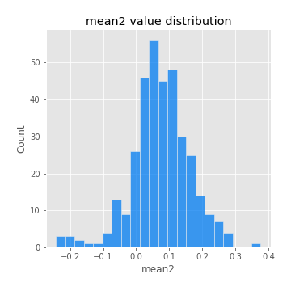
## Feature : sd1
- **Feature type** : continous
- **Missing** : 0.0%
- **Unique** : 347
- **Count** :347.0
- **Mean** :1.8607365396322924
- **Std** :0.6920551732465499
- **Min** :0.7620831696941981
- **25%th Percentile** : 1.6196561523264283
- **50%th Percentile** : 1.8127554694121957
- **75%th Percentile** : 1.8875633854110514
- **Max** :9.236766377527575

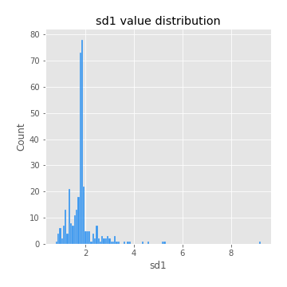
## Feature : sd2
- **Feature type** : continous
- **Missing** : 0.0%
- **Unique** : 347
- **Count** :347.0
- **Mean** :1.814647704202896
- **Std** :0.7542787481700074
- **Min** :0.8455946193085045
- **25%th Percentile** : 1.577765221944154
- **50%th Percentile** : 1.652801039231164
- **75%th Percentile** : 1.74037856066098
- **Max** :6.737618636746393

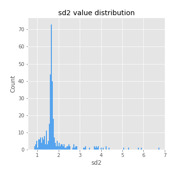
## Feature : skewness1
- **Feature type** : continous
- **Missing** : 0.0%
- **Unique** : 347
- **Count** :347.0
- **Mean** :-0.1127002593421313
- **Std** :0.6067044833223144
- **Min** :-3.530116233761814
- **25%th Percentile** : -0.23999181075326756
- **50%th Percentile** : -0.014831127589538595
- **75%th Percentile** : 0.11309224950918341
- **Max** :2.5845963767725557

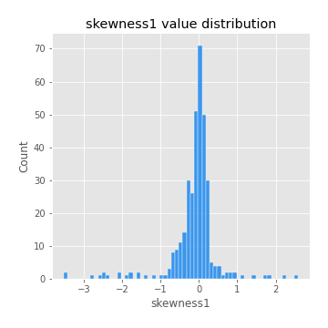
## Feature : skewness2
- **Feature type** : continous
- **Missing** : 0.0%
- **Unique** : 347
- **Count** :347.0
- **Mean** :-0.15602089650333964
- **Std** :0.8317126910376426
- **Min** :-8.801502855292393
- **25%th Percentile** : -0.22140830309483667
- **50%th Percentile** : -0.02857860036576858
- **75%th Percentile** : 0.10931846273002851
- **Max** :2.2606839051517187

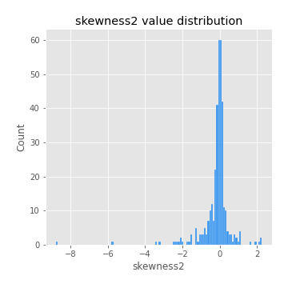
## Feature : kurtosis1
- **Feature type** : continous
- **Missing** : 0.0%
- **Unique** : 347
- **Count** :347.0
- **Mean** :3.2984664443893177
- **Std** :6.239072025218162
- **Min** :-0.4924476267103932
- **25%th Percentile** : 0.033844404551704566
- **50%th Percentile** : 1.014754129978479
- **75%th Percentile** : 3.9672030656784054
- **Max** :46.07507808162177

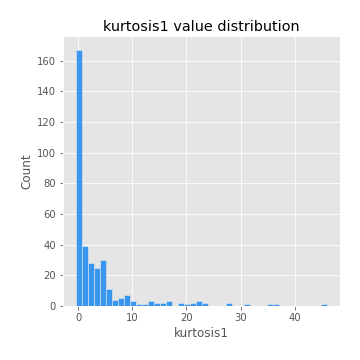
## Feature : kurtosis2
- **Feature type** : continous
- **Missing** : 0.0%
- **Unique** : 347
- **Count** :347.0
- **Mean** :4.2104561913325
- **Std** :10.611560812293668
- **Min** :-0.41545971691915895
- **25%th Percentile** : 0.027216097032787268
- **50%th Percentile** : 1.0149269600058175
- **75%th Percentile** : 4.53498514656377
- **Max** :143.10871011533666

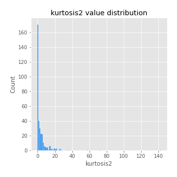
## Feature : return_autocorrelation_1_lag1
- **Feature type** : continous
- **Missing** : 0.0%
- **Unique** : 347
- **Count** :347.0
- **Mean** :-0.01193523570411603
- **Std** :0.0591840619018056
- **Min** :-0.20673896439036124
- **25%th Percentile** : -0.04050680864320923
- **50%th Percentile** : -0.004452624207810848
- **75%th Percentile** : 0.026289915288174395
- **Max** :0.12810656890648087

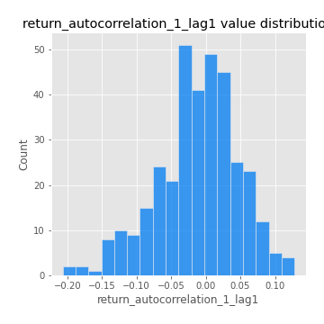
## Feature : return_autocorrelation_1_lag2
- **Feature type** : continous
- **Missing** : 0.0%
- **Unique** : 347
- **Count** :347.0
- **Mean** :-0.007678093717251024
- **Std** :0.052685791836390015
- **Min** :-0.13309283796645122
- **25%th Percentile** : -0.04195520765482123
- **50%th Percentile** : -0.0089962175538008
- **75%th Percentile** : 0.026299574649659773
- **Max** :0.12993318557465194

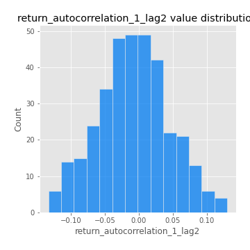
## Feature : return_autocorrelation_1_lag3
- **Feature type** : continous
- **Missing** : 0.0%
- **Unique** : 347
- **Count** :347.0
- **Mean** :-0.001448708887263794
- **Std** :0.05044851032916373
- **Min** :-0.1940836867390813
- **25%th Percentile** : -0.0343017478602364
- **50%th Percentile** : -0.0005637401913804838
- **75%th Percentile** : 0.03291330300227464
- **Max** :0.17805869530681923

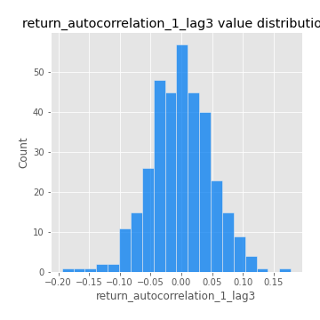
## Feature : return_autocorrelation_2_lag1
- **Feature type** : continous
- **Missing** : 0.0%
- **Unique** : 347
- **Count** :347.0
- **Mean** :-0.009186296123913997
- **Std** :0.059288105685325464
- **Min** :-0.25075531010123286
- **25%th Percentile** : -0.038965176777712746
- **50%th Percentile** : -0.004977827801924052
- **75%th Percentile** : 0.02784863917248155
- **Max** :0.31863413537898483

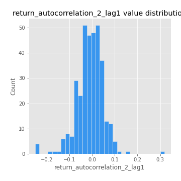
## Feature : return_autocorrelation_2_lag2
- **Feature type** : continous
- **Missing** : 0.0%
- **Unique** : 347
- **Count** :347.0
- **Mean** :-0.0008509567771968376
- **Std** :0.05345634341374242
- **Min** :-0.15323211089747296
- **25%th Percentile** : -0.03495365600065874
- **50%th Percentile** : -0.0031090398446923626
- **75%th Percentile** : 0.03361867465638484
- **Max** :0.20974504043791217

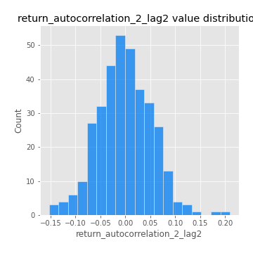
## Feature : return_autocorrelation_2_lag3
- **Feature type** : continous
- **Missing** : 0.0%
- **Unique** : 347
- **Count** :347.0
- **Mean** :-0.001668624378703708
- **Std** :0.05342861384716276
- **Min** :-0.14200107169559698
- **25%th Percentile** : -0.03621060577406876
- **50%th Percentile** : -0.0011962644593644575
- **75%th Percentile** : 0.03391484343647691
- **Max** :0.1419999376914021

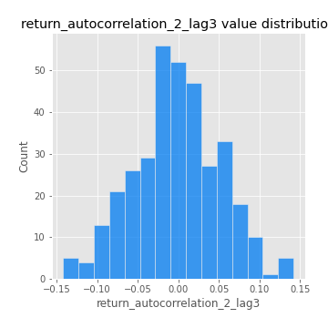
## Feature : return_correlation_ts1_lag_0
- **Feature type** : continous
- **Missing** : 0.0%
- **Unique** : 347
- **Count** :347.0
- **Mean** :0.3152217382044029
- **Std** :0.11412734013220538
- **Min** :-0.027089510445801036
- **25%th Percentile** : 0.2571525503182295
- **50%th Percentile** : 0.31275824107254413
- **75%th Percentile** : 0.35712687934507215
- **Max** :0.7041861626832071

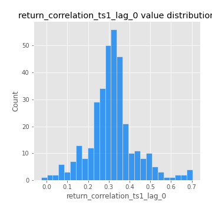
## Feature : return_correlation_ts1_lag_1
- **Feature type** : continous
- **Missing** : 0.0%
- **Unique** : 347
- **Count** :347.0
- **Mean** :-0.005818594221000883
- **Std** :0.05102754241662692
- **Min** :-0.15776193292681923
- **25%th Percentile** : -0.03880524412338261
- **50%th Percentile** : -0.0006259714753227789
- **75%th Percentile** : 0.029348959774200226
- **Max** :0.15499424718508623

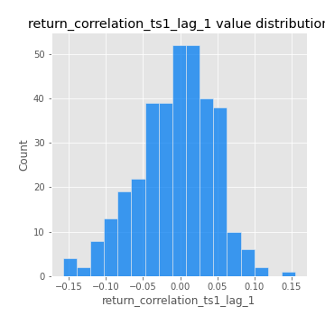
## Feature : return_correlation_ts1_lag_2
- **Feature type** : continous
- **Missing** : 0.0%
- **Unique** : 347
- **Count** :347.0
- **Mean** :-0.001982173010634279
- **Std** :0.04743647660386723
- **Min** :-0.11623115277004417
- **25%th Percentile** : -0.03282877592542105
- **50%th Percentile** : -0.0038769519133569413
- **75%th Percentile** : 0.029052574558201316
- **Max** :0.11348287103672401

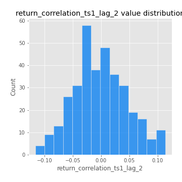
## Feature : return_correlation_ts1_lag_3
- **Feature type** : continous
- **Missing** : 0.0%
- **Unique** : 347
- **Count** :347.0
- **Mean** :0.0026117940337814856
- **Std** :0.05201648185838051
- **Min** :-0.12275228590862461
- **25%th Percentile** : -0.032563921708083546
- **50%th Percentile** : 0.0014003458802558063
- **75%th Percentile** : 0.03686486788087666
- **Max** :0.1636773216468148

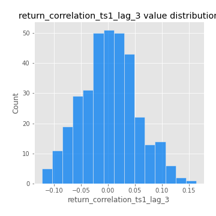
## Feature : return_correlation_ts2_lag_1
- **Feature type** : continous
- **Missing** : 0.0%
- **Unique** : 347
- **Count** :347.0
- **Mean** :-0.000280232908533941
- **Std** :0.05066621709809266
- **Min** :-0.20093919236581337
- **25%th Percentile** : -0.030825263037665952
- **50%th Percentile** : -0.0007044774775073314
- **75%th Percentile** : 0.0337818576035838
- **Max** :0.17208763791364762

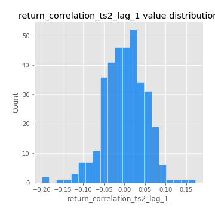
## Feature : return_correlation_ts2_lag_2
- **Feature type** : continous
- **Missing** : 0.0%
- **Unique** : 347
- **Count** :347.0
- **Mean** :0.0005102824571849646
- **Std** :0.04825196780357279
- **Min** :-0.23751835475804678
- **25%th Percentile** : -0.030716123834240654
- **50%th Percentile** : -0.0003449019640725187
- **75%th Percentile** : 0.032080674030091114
- **Max** :0.15388933426238696

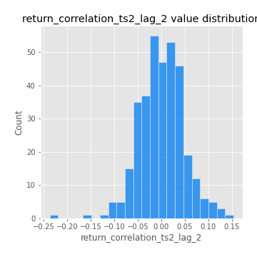
## Feature : return_correlation_ts2_lag_3
- **Feature type** : continous
- **Missing** : 0.0%
- **Unique** : 347
- **Count** :347.0
- **Mean** :0.0013065638006635745
- **Std** :0.051742326511272425
- **Min** :-0.15490495486968472
- **25%th Percentile** : -0.029307679258280164
- **50%th Percentile** : -0.0011679876943202158
- **75%th Percentile** : 0.036606426533325645
- **Max** :0.13975658484829653

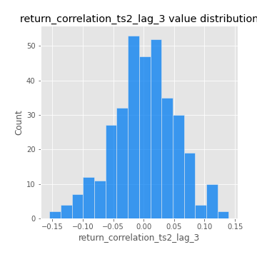
## Feature : sqreturn_autocorrelation_ts1_lag1
- **Feature type** : continous
- **Missing** : 0.0%
- **Unique** : 347
- **Count** :347.0
- **Mean** :0.0540881593656465
- **Std** :0.09244507724081369
- **Min** :-0.09257803343902221
- **25%th Percentile** : -0.010249759670534812
- **50%th Percentile** : 0.03146445754729622
- **75%th Percentile** : 0.09481333738839152
- **Max** :0.4399873614316609

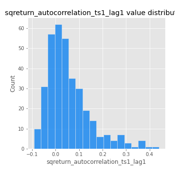
## Feature : sqreturn_autocorrelation_ts1_lag2
- **Feature type** : continous
- **Missing** : 0.0%
- **Unique** : 347
- **Count** :347.0
- **Mean** :0.04317065187482196
- **Std** :0.092145911547591
- **Min** :-0.1281398619492808
- **25%th Percentile** : -0.010531439858032607
- **50%th Percentile** : 0.019026525573813947
- **75%th Percentile** : 0.0668852544186013
- **Max** :0.540735851444759

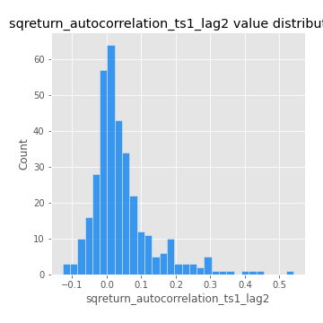
## Feature : sqreturn_autocorrelation_ts1_lag3
- **Feature type** : continous
- **Missing** : 0.0%
- **Unique** : 347
- **Count** :347.0
- **Mean** :0.03236160545090288
- **Std** :0.07931616917875733
- **Min** :-0.14786686306089122
- **25%th Percentile** : -0.01878408944627264
- **50%th Percentile** : 0.013169682220826233
- **75%th Percentile** : 0.05860665932343406
- **Max** :0.41030914918857014

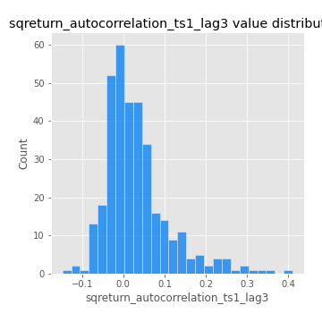
## Feature : sqreturn_autocorrelation_ts2_lag1
- **Feature type** : continous
- **Missing** : 0.0%
- **Unique** : 347
- **Count** :347.0
- **Mean** :0.05015556987707793
- **Std** :0.08927848412583002
- **Min** :-0.0859669075146496
- **25%th Percentile** : -0.0071134024881456094
- **50%th Percentile** : 0.026055728625383856
- **75%th Percentile** : 0.08311599375667086
- **Max** :0.510085647437958

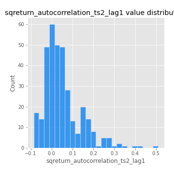
## Feature : sqreturn_autocorrelation_ts2_lag2
- **Feature type** : continous
- **Missing** : 0.0%
- **Unique** : 347
- **Count** :347.0
- **Mean** :0.040402268097221285
- **Std** :0.08540705711366971
- **Min** :-0.08437272295565011
- **25%th Percentile** : -0.009676365551701276
- **50%th Percentile** : 0.015185213759964006
- **75%th Percentile** : 0.059591332977468804
- **Max** :0.4161185589245815

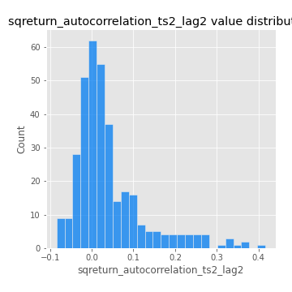
## Feature : sqreturn_autocorrelation_ts2_lag3
- **Feature type** : continous
- **Missing** : 0.0%
- **Unique** : 347
- **Count** :347.0
- **Mean** :0.030168849043689914
- **Std** :0.06953360069258355
- **Min** :-0.10324809788629016
- **25%th Percentile** : -0.012774478864510023
- **50%th Percentile** : 0.017754331608716898
- **75%th Percentile** : 0.05319544954058923
- **Max** :0.30256115637327263

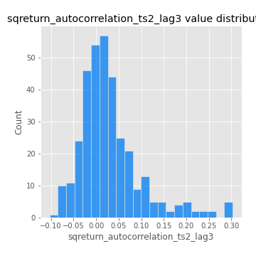
## Feature : sqreturn_correlation_ts1_lag_0
- **Feature type** : continous
- **Missing** : 0.0%
- **Unique** : 347
- **Count** :347.0
- **Mean** :0.3152217382044029
- **Std** :0.11412734013220538
- **Min** :-0.027089510445801036
- **25%th Percentile** : 0.2571525503182295
- **50%th Percentile** : 0.31275824107254413
- **75%th Percentile** : 0.35712687934507215
- **Max** :0.7041861626832071

## Feature : sqreturn_correlation_ts1_lag_1
- **Feature type** : continous
- **Missing** : 0.0%
- **Unique** : 347
- **Count** :347.0
- **Mean** :-0.005818594221000883
- **Std** :0.05102754241662692
- **Min** :-0.15776193292681923
- **25%th Percentile** : -0.03880524412338261
- **50%th Percentile** : -0.0006259714753227789
- **75%th Percentile** : 0.029348959774200226
- **Max** :0.15499424718508623

## Feature : sqreturn_correlation_ts1_lag_2
- **Feature type** : continous
- **Missing** : 0.0%
- **Unique** : 347
- **Count** :347.0
- **Mean** :-0.001982173010634279
- **Std** :0.04743647660386723
- **Min** :-0.11623115277004417
- **25%th Percentile** : -0.03282877592542105
- **50%th Percentile** : -0.0038769519133569413
- **75%th Percentile** : 0.029052574558201316
- **Max** :0.11348287103672401

## Feature : sqreturn_correlation_ts1_lag_3
- **Feature type** : continous
- **Missing** : 0.0%
- **Unique** : 347
- **Count** :347.0
- **Mean** :0.0026117940337814856
- **Std** :0.05201648185838051
- **Min** :-0.12275228590862461
- **25%th Percentile** : -0.032563921708083546
- **50%th Percentile** : 0.0014003458802558063
- **75%th Percentile** : 0.03686486788087666
- **Max** :0.1636773216468148

## Feature : sqreturn_correlation_ts2_lag_1
- **Feature type** : continous
- **Missing** : 0.0%
- **Unique** : 347
- **Count** :347.0
- **Mean** :-0.000280232908533941
- **Std** :0.05066621709809266
- **Min** :-0.20093919236581337
- **25%th Percentile** : -0.030825263037665952
- **50%th Percentile** : -0.0007044774775073314
- **75%th Percentile** : 0.0337818576035838
- **Max** :0.17208763791364762

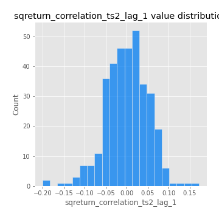
## Feature : sqreturn_correlation_ts2_lag_2
- **Feature type** : continous
- **Missing** : 0.0%
- **Unique** : 347
- **Count** :347.0
- **Mean** :0.0005102824571849646
- **Std** :0.04825196780357279
- **Min** :-0.23751835475804678
- **25%th Percentile** : -0.030716123834240654
- **50%th Percentile** : -0.0003449019640725187
- **75%th Percentile** : 0.032080674030091114
- **Max** :0.15388933426238696

## Feature : sqreturn_correlation_ts2_lag_3
- **Feature type** : continous
- **Missing** : 0.0%
- **Unique** : 347
- **Count** :347.0
- **Mean** :0.0013065638006635745
- **Std** :0.051742326511272425
- **Min** :-0.15490495486968472
- **25%th Percentile** : -0.029307679258280164
- **50%th Percentile** : -0.0011679876943202158
- **75%th Percentile** : 0.036606426533325645
- **Max** :0.13975658484829653

## Feature : price2_granger_cause_price1
- **Feature type** : continous
- **Missing** : 0.0%
- **Unique** : 347
- **Count** :347.0
- **Mean** :0.3071324530952237
- **Std** :0.29413824715682063
- **Min** :9.456261613261679e-07
- **25%th Percentile** : 0.03704108568012586
- **50%th Percentile** : 0.22425096718680798
- **75%th Percentile** : 0.533565081925827
- **Max** :0.9853666024514321

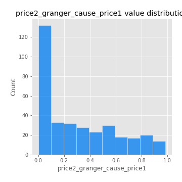
## Feature : price1_granger_cause_price2
- **Feature type** : continous
- **Missing** : 0.0%
- **Unique** : 347
- **Count** :347.0
- **Mean** :0.2990943071317845
- **Std** :0.27567630202464405
- **Min** :1.3176749404222523e-05
- **25%th Percentile** : 0.04955224595093401
- **50%th Percentile** : 0.2310308324162613
- **75%th Percentile** : 0.49454225041777705
- **Max** :0.9951398266867577

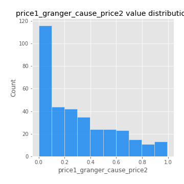

[<< Go back](../README.md)
