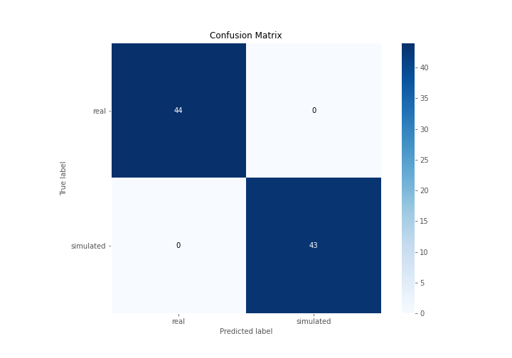
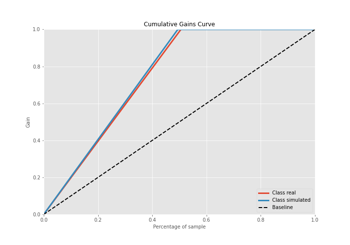

# Summary of 3_Linear

[<< Go back](../README.md)

## Logistic Regression (Linear)
- **n_jobs**: -1
- **explain_level**: 2

## Validation
 - **validation_type**: split
 - **train_ratio**: 0.75
 - **shuffle**: True
 - **stratify**: True

## Optimized metric
accuracy

## Training time

178.3 seconds

## Metric details
|           |    score |     threshold |
|:----------|---------:|--------------:|
| logloss   | 0.130014 | nan           |
| auc       | 1        | nan           |
| f1        | 1        |   0.673494    |
| accuracy  | 1        |   0.673494    |
| precision | 1        |   0.903948    |
| recall    | 1        |   2.02857e-11 |
| mcc       | 1        |   0.673494    |

## Confusion matrix (at threshold=0.673494)
|                      |   Predicted as real |   Predicted as simulated |
|:---------------------|--------------------:|-------------------------:|
| Labeled as real      |                  44 |                        0 |
| Labeled as simulated |                   0 |                       43 |

## Learning curves

## Coefficients
| feature                           |   Learner_1 |
|:----------------------------------|------------:|
| skewness2                         |   0.558111  |
| return_autocorrelation_2_lag1     |   0.372786  |
| sd1                               |   0.358498  |
| return_autocorrelation_1_lag3     |   0.327131  |
| sqreturn_correlation_ts1_lag_3    |   0.294515  |
| return_correlation_ts1_lag_3      |   0.294515  |
| return_correlation_ts2_lag_1      |   0.28807   |
| sqreturn_correlation_ts2_lag_1    |   0.28807   |
| sqreturn_correlation_ts2_lag_3    |   0.287863  |
| return_correlation_ts2_lag_3      |   0.287863  |
| return_autocorrelation_2_lag2     |   0.252096  |
| mean2                             |   0.228566  |
| return_autocorrelation_2_lag3     |   0.211853  |
| return_autocorrelation_1_lag2     |   0.197263  |
| sqreturn_correlation_ts1_lag_1    |   0.191746  |
| return_correlation_ts1_lag_1      |   0.191746  |
| return_correlation_ts2_lag_2      |   0.129169  |
| sqreturn_correlation_ts2_lag_2    |   0.129169  |
| return_autocorrelation_1_lag1     |   0.101754  |
| sqreturn_correlation_ts1_lag_0    |   0.0441322 |
| return_correlation_ts1_lag_0      |   0.0441322 |
| return_correlation_ts1_lag_2      |   0.0197707 |
| sqreturn_correlation_ts1_lag_2    |   0.0197707 |
| mean1                             |  -0.138402  |
| price1_granger_cause_price2       |  -0.146632  |
| skewness1                         |  -0.210266  |
| price2_granger_cause_price1       |  -0.26295   |
| sd2                               |  -0.382045  |
| sqreturn_autocorrelation_ts1_lag3 |  -0.69832   |
| sqreturn_autocorrelation_ts2_lag3 |  -0.81129   |
| sqreturn_autocorrelation_ts2_lag2 |  -0.924818  |
| sqreturn_autocorrelation_ts1_lag1 |  -1.0292    |
| sqreturn_autocorrelation_ts1_lag2 |  -1.11885   |
| sqreturn_autocorrelation_ts2_lag1 |  -1.13587   |
| intercept                         |  -1.72689   |
| kurtosis2                         |  -3.89607   |
| kurtosis1                         |  -4.23104   |

## Permutation-based Importance

## Confusion Matrix

## Normalized Confusion Matrix

## ROC Curve

## Kolmogorov-Smirnov Statistic

## Precision-Recall Curve

## Calibration Curve

## Cumulative Gains Curve

## Lift Curve

## SHAP Importance

## SHAP Dependence plots

### Dependence (Fold 1)

## SHAP Decision plots

### Top-10 Worst decisions for class 0 (Fold 1)

### Top-10 Best decisions for class 0 (Fold 1)

### Top-10 Worst decisions for class 1 (Fold 1)

### Top-10 Best decisions for class 1 (Fold 1)

[<< Go back](../README.md)
