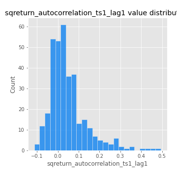

# Exploratory Data Analysis

[<< Go back](../README.md)
## Feature : target
- **Feature type** : categorical
- **Missing** : 0.0%
- **Unique** : 2
- **Count** :347
- **Unique** :2
- **Top** :real
- **Freq** :174

## Feature : mean1
- **Feature type** : continous
- **Missing** : 0.0%
- **Unique** : 347
- **Count** :347.0
- **Mean** :0.054838945549528624
- **Std** :0.08268293466885127
- **Min** :-0.1852280418447557
- **25%th Percentile** : 0.0017532383459129865
- **50%th Percentile** : 0.05404282881060603
- **75%th Percentile** : 0.10156232251214144
- **Max** :0.37175100008111034

## Feature : mean2
- **Feature type** : continous
- **Missing** : 0.0%
- **Unique** : 347
- **Count** :347.0
- **Mean** :0.07809719290770832
- **Std** :0.08946474056984728
- **Min** :-0.24205418062825398
- **25%th Percentile** : 0.025309818755687136
- **50%th Percentile** : 0.07506387476831725
- **75%th Percentile** : 0.13519783092981214
- **Max** :0.38979610828614797

## Feature : sd1
- **Feature type** : continous
- **Missing** : 0.0%
- **Unique** : 347
- **Count** :347.0
- **Mean** :1.8835159318753099
- **Std** :0.6473162642481163
- **Min** :0.7470080772831957
- **25%th Percentile** : 1.6863196421005753
- **50%th Percentile** : 1.8118538524791303
- **75%th Percentile** : 1.8965102289309674
- **Max** :6.495661311240861

## Feature : sd2
- **Feature type** : continous
- **Missing** : 0.0%
- **Unique** : 347
- **Count** :347.0
- **Mean** :1.7891569139864723
- **Std** :0.6711636819640563
- **Min** :0.8455946193085045
- **25%th Percentile** : 1.5725559671832894
- **50%th Percentile** : 1.6541919000002223
- **75%th Percentile** : 1.728495418526956
- **Max** :5.872800253666788

## Feature : skewness1
- **Feature type** : continous
- **Missing** : 0.0%
- **Unique** : 347
- **Count** :347.0
- **Mean** :-0.08849350130054787
- **Std** :0.6119825948639859
- **Min** :-3.453087436558107
- **25%th Percentile** : -0.17576493820169042
- **50%th Percentile** : -0.02331966182084529
- **75%th Percentile** : 0.09500768259824172
- **Max** :2.5845963767725557

## Feature : skewness2
- **Feature type** : continous
- **Missing** : 0.0%
- **Unique** : 347
- **Count** :347.0
- **Mean** :-0.1580511338959673
- **Std** :0.6530952277858576
- **Min** :-5.778144124281153
- **25%th Percentile** : -0.23204672254394254
- **50%th Percentile** : -0.04700177999708027
- **75%th Percentile** : 0.08114954830769089
- **Max** :2.2606839051517187

## Feature : kurtosis1
- **Feature type** : continous
- **Missing** : 0.0%
- **Unique** : 347
- **Count** :347.0
- **Mean** :3.23474420852259
- **Std** :6.206030500992268
- **Min** :-0.5351585640449388
- **25%th Percentile** : -0.028800349302016803
- **50%th Percentile** : 0.543528339933733
- **75%th Percentile** : 3.562148308433014
- **Max** :46.07507808162177

## Feature : kurtosis2
- **Feature type** : continous
- **Missing** : 0.0%
- **Unique** : 347
- **Count** :347.0
- **Mean** :3.392352371048799
- **Std** :7.133939918178762
- **Min** :-0.4256616310211694
- **25%th Percentile** : -0.039325979488749274
- **50%th Percentile** : 0.6208695975279284
- **75%th Percentile** : 4.063516554723738
- **Max** :71.39844769176813

## Feature : return_autocorrelation_1_lag1
- **Feature type** : continous
- **Missing** : 0.0%
- **Unique** : 347
- **Count** :347.0
- **Mean** :-0.01070943090512893
- **Std** :0.05883448846735952
- **Min** :-0.2135576224968752
- **25%th Percentile** : -0.04187545643333986
- **50%th Percentile** : -0.0015692791721990393
- **75%th Percentile** : 0.02905323475126754
- **Max** :0.1253959753011446

## Feature : return_autocorrelation_1_lag2
- **Feature type** : continous
- **Missing** : 0.0%
- **Unique** : 347
- **Count** :347.0
- **Mean** :-0.0038571647903216425
- **Std** :0.04894166450209234
- **Min** :-0.13309283796645122
- **25%th Percentile** : -0.03737044318059571
- **50%th Percentile** : -0.0005711566725760009
- **75%th Percentile** : 0.026257144694387967
- **Max** :0.1561488228015672

## Feature : return_autocorrelation_1_lag3
- **Feature type** : continous
- **Missing** : 0.0%
- **Unique** : 347
- **Count** :347.0
- **Mean** :0.0001949673389481407
- **Std** :0.05242555561531853
- **Min** :-0.15806635192103805
- **25%th Percentile** : -0.03394517024192843
- **50%th Percentile** : 0.0002777521396447955
- **75%th Percentile** : 0.033702668873910005
- **Max** :0.17805869530681923

## Feature : return_autocorrelation_2_lag1
- **Feature type** : continous
- **Missing** : 0.0%
- **Unique** : 347
- **Count** :347.0
- **Mean** :-0.007897756787644606
- **Std** :0.06214324751820875
- **Min** :-0.24590087874039124
- **25%th Percentile** : -0.03893403883887523
- **50%th Percentile** : -0.0043076416986301165
- **75%th Percentile** : 0.02766502338759845
- **Max** :0.31863413537898483

## Feature : return_autocorrelation_2_lag2
- **Feature type** : continous
- **Missing** : 0.0%
- **Unique** : 347
- **Count** :347.0
- **Mean** :-0.0011623729329067163
- **Std** :0.05251441297194642
- **Min** :-0.1495113937562178
- **25%th Percentile** : -0.03588047143526579
- **50%th Percentile** : -0.005244479046351908
- **75%th Percentile** : 0.032478731856859705
- **Max** :0.20974504043791217

## Feature : return_autocorrelation_2_lag3
- **Feature type** : continous
- **Missing** : 0.0%
- **Unique** : 347
- **Count** :347.0
- **Mean** :-0.0010563104658146362
- **Std** :0.04954470062854371
- **Min** :-0.1315535528857823
- **25%th Percentile** : -0.03476168934444427
- **50%th Percentile** : 0.0002648965778117114
- **75%th Percentile** : 0.034266856762127054
- **Max** :0.1419999376914021

## Feature : return_correlation_ts1_lag_0
- **Feature type** : continous
- **Missing** : 0.0%
- **Unique** : 347
- **Count** :347.0
- **Mean** :0.3155940312480652
- **Std** :0.11278146287327885
- **Min** :-0.027089510445801036
- **25%th Percentile** : 0.26103770466160225
- **50%th Percentile** : 0.3136250170290848
- **75%th Percentile** : 0.3516560414072064
- **Max** :0.7041861626832071

## Feature : return_correlation_ts1_lag_1
- **Feature type** : continous
- **Missing** : 0.0%
- **Unique** : 347
- **Count** :347.0
- **Mean** :-0.006364162584233781
- **Std** :0.05060661284406366
- **Min** :-0.16985510949917193
- **25%th Percentile** : -0.03570051075626006
- **50%th Percentile** : -0.001339291596852642
- **75%th Percentile** : 0.025391211628283984
- **Max** :0.11819480385322509

## Feature : return_correlation_ts1_lag_2
- **Feature type** : continous
- **Missing** : 0.0%
- **Unique** : 347
- **Count** :347.0
- **Mean** :0.0045303145225679105
- **Std** :0.049206213006761576
- **Min** :-0.21653581047581763
- **25%th Percentile** : -0.02952186401806613
- **50%th Percentile** : 0.0034276972256211003
- **75%th Percentile** : 0.04156501347001135
- **Max** :0.11963485020967508

## Feature : return_correlation_ts1_lag_3
- **Feature type** : continous
- **Missing** : 0.0%
- **Unique** : 347
- **Count** :347.0
- **Mean** :0.004144250381590544
- **Std** :0.050207479877832056
- **Min** :-0.1270218498974763
- **25%th Percentile** : -0.02739558461813578
- **50%th Percentile** : 0.004915585149977225
- **75%th Percentile** : 0.037158230148314764
- **Max** :0.1636773216468148

## Feature : return_correlation_ts2_lag_1
- **Feature type** : continous
- **Missing** : 0.0%
- **Unique** : 347
- **Count** :347.0
- **Mean** :-0.0009983495173877363
- **Std** :0.05373098210013104
- **Min** :-0.2081139431093261
- **25%th Percentile** : -0.02884889441189616
- **50%th Percentile** : -0.00040077321502892755
- **75%th Percentile** : 0.030234629104162233
- **Max** :0.17208763791364762

## Feature : return_correlation_ts2_lag_2
- **Feature type** : continous
- **Missing** : 0.0%
- **Unique** : 347
- **Count** :347.0
- **Mean** :0.000870607306106154
- **Std** :0.050157161947459256
- **Min** :-0.23751835475804678
- **25%th Percentile** : -0.031159391659117085
- **50%th Percentile** : -6.430254566090361e-05
- **75%th Percentile** : 0.028267421169411798
- **Max** :0.20772887392904255

## Feature : return_correlation_ts2_lag_3
- **Feature type** : continous
- **Missing** : 0.0%
- **Unique** : 347
- **Count** :347.0
- **Mean** :0.001534778118676052
- **Std** :0.051906884871232746
- **Min** :-0.17564076057312866
- **25%th Percentile** : -0.02882273665960835
- **50%th Percentile** : 0.0017062306092014044
- **75%th Percentile** : 0.036720377852432484
- **Max** :0.13128380114518473

## Feature : sqreturn_autocorrelation_ts1_lag1
- **Feature type** : continous
- **Missing** : 0.0%
- **Unique** : 347
- **Count** :347.0
- **Mean** :0.049563224000488675
- **Std** :0.09333075616384581
- **Min** :-0.1129536789634065
- **25%th Percentile** : -0.011814560285250957
- **50%th Percentile** : 0.02774241910564732
- **75%th Percentile** : 0.07984953986941637
- **Max** :0.49414293176447355

## Feature : sqreturn_autocorrelation_ts1_lag2
- **Feature type** : continous
- **Missing** : 0.0%
- **Unique** : 347
- **Count** :347.0
- **Mean** :0.04173790474605734
- **Std** :0.09407535340016049
- **Min** :-0.11081227369215378
- **25%th Percentile** : -0.013932356570351669
- **50%th Percentile** : 0.014440041567386874
- **75%th Percentile** : 0.06664839168202533
- **Max** :0.540735851444759

## Feature : sqreturn_autocorrelation_ts1_lag3
- **Feature type** : continous
- **Missing** : 0.0%
- **Unique** : 347
- **Count** :347.0
- **Mean** :0.032755502086111
- **Std** :0.07861885307952407
- **Min** :-0.11105365562899648
- **25%th Percentile** : -0.01776853149687492
- **50%th Percentile** : 0.015192514144237985
- **75%th Percentile** : 0.056831289985062955
- **Max** :0.41030914918857014

## Feature : sqreturn_autocorrelation_ts2_lag1
- **Feature type** : continous
- **Missing** : 0.0%
- **Unique** : 347
- **Count** :347.0
- **Mean** :0.0492735478754632
- **Std** :0.08934475196055765
- **Min** :-0.10964652384672646
- **25%th Percentile** : -0.008925505139674918
- **50%th Percentile** : 0.027520139397595855
- **75%th Percentile** : 0.08429778788457211
- **Max** :0.510085647437958

## Feature : sqreturn_autocorrelation_ts2_lag2
- **Feature type** : continous
- **Missing** : 0.0%
- **Unique** : 347
- **Count** :347.0
- **Mean** :0.04073983998848928
- **Std** :0.09099017002881438
- **Min** :-0.09305317674242927
- **25%th Percentile** : -0.01191730482798928
- **50%th Percentile** : 0.018097625693563418
- **75%th Percentile** : 0.05917442789862126
- **Max** :0.5373432415582473

## Feature : sqreturn_autocorrelation_ts2_lag3
- **Feature type** : continous
- **Missing** : 0.0%
- **Unique** : 347
- **Count** :347.0
- **Mean** :0.030649823975172647
- **Std** :0.0718285395515297
- **Min** :-0.11188985932957039
- **25%th Percentile** : -0.013833510245465218
- **50%th Percentile** : 0.015570277819308517
- **75%th Percentile** : 0.05890010676578478
- **Max** :0.31225727797735664

## Feature : sqreturn_correlation_ts1_lag_0
- **Feature type** : continous
- **Missing** : 0.0%
- **Unique** : 347
- **Count** :347.0
- **Mean** :0.3155940312480652
- **Std** :0.11278146287327885
- **Min** :-0.027089510445801036
- **25%th Percentile** : 0.26103770466160225
- **50%th Percentile** : 0.3136250170290848
- **75%th Percentile** : 0.3516560414072064
- **Max** :0.7041861626832071

## Feature : sqreturn_correlation_ts1_lag_1
- **Feature type** : continous
- **Missing** : 0.0%
- **Unique** : 347
- **Count** :347.0
- **Mean** :-0.006364162584233781
- **Std** :0.05060661284406366
- **Min** :-0.16985510949917193
- **25%th Percentile** : -0.03570051075626006
- **50%th Percentile** : -0.001339291596852642
- **75%th Percentile** : 0.025391211628283984
- **Max** :0.11819480385322509

## Feature : sqreturn_correlation_ts1_lag_2
- **Feature type** : continous
- **Missing** : 0.0%
- **Unique** : 347
- **Count** :347.0
- **Mean** :0.0045303145225679105
- **Std** :0.049206213006761576
- **Min** :-0.21653581047581763
- **25%th Percentile** : -0.02952186401806613
- **50%th Percentile** : 0.0034276972256211003
- **75%th Percentile** : 0.04156501347001135
- **Max** :0.11963485020967508

## Feature : sqreturn_correlation_ts1_lag_3
- **Feature type** : continous
- **Missing** : 0.0%
- **Unique** : 347
- **Count** :347.0
- **Mean** :0.004144250381590544
- **Std** :0.050207479877832056
- **Min** :-0.1270218498974763
- **25%th Percentile** : -0.02739558461813578
- **50%th Percentile** : 0.004915585149977225
- **75%th Percentile** : 0.037158230148314764
- **Max** :0.1636773216468148

## Feature : sqreturn_correlation_ts2_lag_1
- **Feature type** : continous
- **Missing** : 0.0%
- **Unique** : 347
- **Count** :347.0
- **Mean** :-0.0009983495173877363
- **Std** :0.05373098210013104
- **Min** :-0.2081139431093261
- **25%th Percentile** : -0.02884889441189616
- **50%th Percentile** : -0.00040077321502892755
- **75%th Percentile** : 0.030234629104162233
- **Max** :0.17208763791364762

## Feature : sqreturn_correlation_ts2_lag_2
- **Feature type** : continous
- **Missing** : 0.0%
- **Unique** : 347
- **Count** :347.0
- **Mean** :0.000870607306106154
- **Std** :0.050157161947459256
- **Min** :-0.23751835475804678
- **25%th Percentile** : -0.031159391659117085
- **50%th Percentile** : -6.430254566090361e-05
- **75%th Percentile** : 0.028267421169411798
- **Max** :0.20772887392904255

## Feature : sqreturn_correlation_ts2_lag_3
- **Feature type** : continous
- **Missing** : 0.0%
- **Unique** : 347
- **Count** :347.0
- **Mean** :0.001534778118676052
- **Std** :0.051906884871232746
- **Min** :-0.17564076057312866
- **25%th Percentile** : -0.02882273665960835
- **50%th Percentile** : 0.0017062306092014044
- **75%th Percentile** : 0.036720377852432484
- **Max** :0.13128380114518473

## Feature : price2_granger_cause_price1
- **Feature type** : continous
- **Missing** : 0.0%
- **Unique** : 347
- **Count** :347.0
- **Mean** :0.29373083195741834
- **Std** :0.30028920368191514
- **Min** :1.3100009830767957e-08
- **25%th Percentile** : 0.02119060236444308
- **50%th Percentile** : 0.20368417081248466
- **75%th Percentile** : 0.49615635617564713
- **Max** :0.9958336070210823

## Feature : price1_granger_cause_price2
- **Feature type** : continous
- **Missing** : 0.0%
- **Unique** : 347
- **Count** :347.0
- **Mean** :0.30242006258309995
- **Std** :0.28506689920098294
- **Min** :1.2720078939239172e-05
- **25%th Percentile** : 0.05149410619310993
- **50%th Percentile** : 0.2176774341783571
- **75%th Percentile** : 0.5239522609631372
- **Max** :0.9951398266867577

[<< Go back](../README.md)
