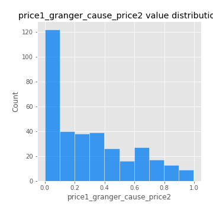

# Exploratory Data Analysis

[<< Go back](../README.md)
## Feature : target
- **Feature type** : categorical
- **Missing** : 0.0%
- **Unique** : 2
- **Count** :347
- **Unique** :2
- **Top** :real
- **Freq** :174

## Feature : mean1
- **Feature type** : continous
- **Missing** : 0.0%
- **Unique** : 347
- **Count** :347.0
- **Mean** :0.04929798126956278
- **Std** :0.07864838976872073
- **Min** :-0.17686457077756634
- **25%th Percentile** : 0.005098676086440095
- **50%th Percentile** : 0.04681167253267929
- **75%th Percentile** : 0.09378233472653003
- **Max** :0.37175100008111034

## Feature : mean2
- **Feature type** : continous
- **Missing** : 0.0%
- **Unique** : 347
- **Count** :347.0
- **Mean** :0.08072086527913472
- **Std** :0.08902978536618619
- **Min** :-0.24205418062825398
- **25%th Percentile** : 0.03596510469484581
- **50%th Percentile** : 0.08076552921544547
- **75%th Percentile** : 0.12844383713414315
- **Max** :0.37616608147096464

## Feature : sd1
- **Feature type** : continous
- **Missing** : 0.0%
- **Unique** : 347
- **Count** :347.0
- **Mean** :1.8530595506321423
- **Std** :0.6233280553544408
- **Min** :0.7470080772831957
- **25%th Percentile** : 1.658148240839754
- **50%th Percentile** : 1.8200859586353761
- **75%th Percentile** : 1.8968820814554401
- **Max** :6.495661311240861

## Feature : sd2
- **Feature type** : continous
- **Missing** : 0.0%
- **Unique** : 347
- **Count** :347.0
- **Mean** :1.8019668055069704
- **Std** :0.7524735650118253
- **Min** :0.8967691504919791
- **25%th Percentile** : 1.5715141309947387
- **50%th Percentile** : 1.6445481796320698
- **75%th Percentile** : 1.7145034017686078
- **Max** :6.737618636746393

## Feature : skewness1
- **Feature type** : continous
- **Missing** : 0.0%
- **Unique** : 347
- **Count** :347.0
- **Mean** :-0.14372612184340774
- **Std** :0.568324895372493
- **Min** :-3.453087436558107
- **25%th Percentile** : -0.20787800299714665
- **50%th Percentile** : -0.027932161988890026
- **75%th Percentile** : 0.07898075234598434
- **Max** :2.224942816365292

## Feature : skewness2
- **Feature type** : continous
- **Missing** : 0.0%
- **Unique** : 347
- **Count** :347.0
- **Mean** :-0.15777565289821235
- **Std** :0.6721452519610112
- **Min** :-5.778144124281153
- **25%th Percentile** : -0.21397802367224394
- **50%th Percentile** : -0.054190418002676474
- **75%th Percentile** : 0.07274529002214858
- **Max** :2.242019525651531

## Feature : kurtosis1
- **Feature type** : continous
- **Missing** : 0.0%
- **Unique** : 347
- **Count** :347.0
- **Mean** :3.210185981831115
- **Std** :6.233378348158388
- **Min** :-0.5660229557816256
- **25%th Percentile** : -0.03591072130423467
- **50%th Percentile** : 0.5189708818682952
- **75%th Percentile** : 3.691025264972352
- **Max** :46.07507808162177

## Feature : kurtosis2
- **Feature type** : continous
- **Missing** : 0.0%
- **Unique** : 347
- **Count** :347.0
- **Mean** :3.625275265767002
- **Std** :7.53603575093794
- **Min** :-0.3776559109909816
- **25%th Percentile** : -0.030844917322840892
- **50%th Percentile** : 0.5567163202427889
- **75%th Percentile** : 4.2221241429233665
- **Max** :71.39844769176813

## Feature : return_autocorrelation_1_lag1
- **Feature type** : continous
- **Missing** : 0.0%
- **Unique** : 347
- **Count** :347.0
- **Mean** :-0.011202753653651705
- **Std** :0.06017159615489743
- **Min** :-0.2135576224968752
- **25%th Percentile** : -0.040074175010335444
- **50%th Percentile** : -0.004456277573547255
- **75%th Percentile** : 0.02902483164643769
- **Max** :0.1660649022590563

## Feature : return_autocorrelation_1_lag2
- **Feature type** : continous
- **Missing** : 0.0%
- **Unique** : 347
- **Count** :347.0
- **Mean** :-0.0021762656004955983
- **Std** :0.04963931716734613
- **Min** :-0.13309283796645122
- **25%th Percentile** : -0.03386494838079884
- **50%th Percentile** : -0.0022984699379012884
- **75%th Percentile** : 0.02892212573778888
- **Max** :0.1561488228015672

## Feature : return_autocorrelation_1_lag3
- **Feature type** : continous
- **Missing** : 0.0%
- **Unique** : 347
- **Count** :347.0
- **Mean** :-0.0029347215989007484
- **Std** :0.049915484100598345
- **Min** :-0.15806635192103805
- **25%th Percentile** : -0.03240138608834573
- **50%th Percentile** : -0.0022876877440721212
- **75%th Percentile** : 0.030646178704970606
- **Max** :0.17805869530681923

## Feature : return_autocorrelation_2_lag1
- **Feature type** : continous
- **Missing** : 0.0%
- **Unique** : 347
- **Count** :347.0
- **Mean** :-0.007250917986178781
- **Std** :0.06158043917003188
- **Min** :-0.25075531010123286
- **25%th Percentile** : -0.039300302533587676
- **50%th Percentile** : -0.003426265101859486
- **75%th Percentile** : 0.028715306575446936
- **Max** :0.31863413537898483

## Feature : return_autocorrelation_2_lag2
- **Feature type** : continous
- **Missing** : 0.0%
- **Unique** : 347
- **Count** :347.0
- **Mean** :-0.00023955684604929007
- **Std** :0.05301287845431284
- **Min** :-0.15323211089747296
- **25%th Percentile** : -0.03671324622005862
- **50%th Percentile** : -0.005062656475098271
- **75%th Percentile** : 0.032653756453095484
- **Max** :0.20974504043791217

## Feature : return_autocorrelation_2_lag3
- **Feature type** : continous
- **Missing** : 0.0%
- **Unique** : 347
- **Count** :347.0
- **Mean** :-0.003913937657695874
- **Std** :0.05193151280530042
- **Min** :-0.14200107169559698
- **25%th Percentile** : -0.03885226158581384
- **50%th Percentile** : -0.0012155251283715214
- **75%th Percentile** : 0.02799514728466762
- **Max** :0.137900282688959

## Feature : return_correlation_ts1_lag_0
- **Feature type** : continous
- **Missing** : 0.0%
- **Unique** : 347
- **Count** :347.0
- **Mean** :0.31744744545756237
- **Std** :0.1105468683025595
- **Min** :-0.027089510445801036
- **25%th Percentile** : 0.26605566560882843
- **50%th Percentile** : 0.3119354995200792
- **75%th Percentile** : 0.35836423920939015
- **Max** :0.7041861626832071

## Feature : return_correlation_ts1_lag_1
- **Feature type** : continous
- **Missing** : 0.0%
- **Unique** : 347
- **Count** :347.0
- **Mean** :-0.0044098138007590375
- **Std** :0.05169542067126535
- **Min** :-0.16985510949917193
- **25%th Percentile** : -0.03614233149943449
- **50%th Percentile** : -0.0007510302744104748
- **75%th Percentile** : 0.031496619696836786
- **Max** :0.1204403962303411

## Feature : return_correlation_ts1_lag_2
- **Feature type** : continous
- **Missing** : 0.0%
- **Unique** : 347
- **Count** :347.0
- **Mean** :0.0010681219515837775
- **Std** :0.049717233054360425
- **Min** :-0.21653581047581763
- **25%th Percentile** : -0.03160929111881888
- **50%th Percentile** : -0.0011491003018566184
- **75%th Percentile** : 0.037856160448245385
- **Max** :0.1248493731925454

## Feature : return_correlation_ts1_lag_3
- **Feature type** : continous
- **Missing** : 0.0%
- **Unique** : 347
- **Count** :347.0
- **Mean** :0.0006921858241539372
- **Std** :0.050129748102605946
- **Min** :-0.2089308344580524
- **25%th Percentile** : -0.028379828234286246
- **50%th Percentile** : -8.11422921759367e-05
- **75%th Percentile** : 0.03247686345034369
- **Max** :0.13869682391641697

## Feature : return_correlation_ts2_lag_1
- **Feature type** : continous
- **Missing** : 0.0%
- **Unique** : 347
- **Count** :347.0
- **Mean** :-0.0013526512088035385
- **Std** :0.05203942332763735
- **Min** :-0.19671969155495325
- **25%th Percentile** : -0.03194027765799738
- **50%th Percentile** : -0.003523151262313052
- **75%th Percentile** : 0.030290698467194555
- **Max** :0.17208763791364762

## Feature : return_correlation_ts2_lag_2
- **Feature type** : continous
- **Missing** : 0.0%
- **Unique** : 347
- **Count** :347.0
- **Mean** :6.458396519843549e-05
- **Std** :0.050627555764587946
- **Min** :-0.23751835475804678
- **25%th Percentile** : -0.033701176964815276
- **50%th Percentile** : -0.00027538229553240797
- **75%th Percentile** : 0.03058201224554132
- **Max** :0.20772887392904255

## Feature : return_correlation_ts2_lag_3
- **Feature type** : continous
- **Missing** : 0.0%
- **Unique** : 347
- **Count** :347.0
- **Mean** :-0.0016775661729219909
- **Std** :0.04978873287187472
- **Min** :-0.17564076057312866
- **25%th Percentile** : -0.029379481101160468
- **50%th Percentile** : -0.003451645375118328
- **75%th Percentile** : 0.030885701731238318
- **Max** :0.14914335485901054

## Feature : sqreturn_autocorrelation_ts1_lag1
- **Feature type** : continous
- **Missing** : 0.0%
- **Unique** : 347
- **Count** :347.0
- **Mean** :0.053430159654666236
- **Std** :0.0986988644990377
- **Min** :-0.0979691374044018
- **25%th Percentile** : -0.008342961691016802
- **50%th Percentile** : 0.0263076799403413
- **75%th Percentile** : 0.08844330958355191
- **Max** :0.49414293176447355

## Feature : sqreturn_autocorrelation_ts1_lag2
- **Feature type** : continous
- **Missing** : 0.0%
- **Unique** : 347
- **Count** :347.0
- **Mean** :0.04647765428368076
- **Std** :0.09536346761962569
- **Min** :-0.10242245830482474
- **25%th Percentile** : -0.010630939653848516
- **50%th Percentile** : 0.020462058885153914
- **75%th Percentile** : 0.06559144137208814
- **Max** :0.540735851444759

## Feature : sqreturn_autocorrelation_ts1_lag3
- **Feature type** : continous
- **Missing** : 0.0%
- **Unique** : 347
- **Count** :347.0
- **Mean** :0.03640730890045817
- **Std** :0.08189187763853378
- **Min** :-0.1006063924103153
- **25%th Percentile** : -0.01256017963926892
- **50%th Percentile** : 0.018045208730160068
- **75%th Percentile** : 0.06302625843491666
- **Max** :0.44755937369538146

## Feature : sqreturn_autocorrelation_ts2_lag1
- **Feature type** : continous
- **Missing** : 0.0%
- **Unique** : 347
- **Count** :347.0
- **Mean** :0.04255298788447858
- **Std** :0.08530643634901873
- **Min** :-0.09942760554150103
- **25%th Percentile** : -0.011864519211522994
- **50%th Percentile** : 0.021499985648253693
- **75%th Percentile** : 0.07292814613234647
- **Max** :0.510085647437958

## Feature : sqreturn_autocorrelation_ts2_lag2
- **Feature type** : continous
- **Missing** : 0.0%
- **Unique** : 347
- **Count** :347.0
- **Mean** :0.03458335514566076
- **Std** :0.08265548261427226
- **Min** :-0.12806423083129792
- **25%th Percentile** : -0.013992106804602663
- **50%th Percentile** : 0.015009649875009542
- **75%th Percentile** : 0.054917227016000894
- **Max** :0.45676817892778204

## Feature : sqreturn_autocorrelation_ts2_lag3
- **Feature type** : continous
- **Missing** : 0.0%
- **Unique** : 347
- **Count** :347.0
- **Mean** :0.023872244542234224
- **Std** :0.06725355136674346
- **Min** :-0.11827625123345072
- **25%th Percentile** : -0.016002013362494277
- **50%th Percentile** : 0.01406292270128381
- **75%th Percentile** : 0.05375066270664977
- **Max** :0.31225727797735664

## Feature : sqreturn_correlation_ts1_lag_0
- **Feature type** : continous
- **Missing** : 0.0%
- **Unique** : 347
- **Count** :347.0
- **Mean** :0.31744744545756237
- **Std** :0.1105468683025595
- **Min** :-0.027089510445801036
- **25%th Percentile** : 0.26605566560882843
- **50%th Percentile** : 0.3119354995200792
- **75%th Percentile** : 0.35836423920939015
- **Max** :0.7041861626832071

## Feature : sqreturn_correlation_ts1_lag_1
- **Feature type** : continous
- **Missing** : 0.0%
- **Unique** : 347
- **Count** :347.0
- **Mean** :-0.0044098138007590375
- **Std** :0.05169542067126535
- **Min** :-0.16985510949917193
- **25%th Percentile** : -0.03614233149943449
- **50%th Percentile** : -0.0007510302744104748
- **75%th Percentile** : 0.031496619696836786
- **Max** :0.1204403962303411

## Feature : sqreturn_correlation_ts1_lag_2
- **Feature type** : continous
- **Missing** : 0.0%
- **Unique** : 347
- **Count** :347.0
- **Mean** :0.0010681219515837775
- **Std** :0.049717233054360425
- **Min** :-0.21653581047581763
- **25%th Percentile** : -0.03160929111881888
- **50%th Percentile** : -0.0011491003018566184
- **75%th Percentile** : 0.037856160448245385
- **Max** :0.1248493731925454

## Feature : sqreturn_correlation_ts1_lag_3
- **Feature type** : continous
- **Missing** : 0.0%
- **Unique** : 347
- **Count** :347.0
- **Mean** :0.0006921858241539372
- **Std** :0.050129748102605946
- **Min** :-0.2089308344580524
- **25%th Percentile** : -0.028379828234286246
- **50%th Percentile** : -8.11422921759367e-05
- **75%th Percentile** : 0.03247686345034369
- **Max** :0.13869682391641697

## Feature : sqreturn_correlation_ts2_lag_1
- **Feature type** : continous
- **Missing** : 0.0%
- **Unique** : 347
- **Count** :347.0
- **Mean** :-0.0013526512088035385
- **Std** :0.05203942332763735
- **Min** :-0.19671969155495325
- **25%th Percentile** : -0.03194027765799738
- **50%th Percentile** : -0.003523151262313052
- **75%th Percentile** : 0.030290698467194555
- **Max** :0.17208763791364762

## Feature : sqreturn_correlation_ts2_lag_2
- **Feature type** : continous
- **Missing** : 0.0%
- **Unique** : 347
- **Count** :347.0
- **Mean** :6.458396519843549e-05
- **Std** :0.050627555764587946
- **Min** :-0.23751835475804678
- **25%th Percentile** : -0.033701176964815276
- **50%th Percentile** : -0.00027538229553240797
- **75%th Percentile** : 0.03058201224554132
- **Max** :0.20772887392904255

## Feature : sqreturn_correlation_ts2_lag_3
- **Feature type** : continous
- **Missing** : 0.0%
- **Unique** : 347
- **Count** :347.0
- **Mean** :-0.0016775661729219909
- **Std** :0.04978873287187472
- **Min** :-0.17564076057312866
- **25%th Percentile** : -0.029379481101160468
- **50%th Percentile** : -0.003451645375118328
- **75%th Percentile** : 0.030885701731238318
- **Max** :0.14914335485901054

## Feature : price2_granger_cause_price1
- **Feature type** : continous
- **Missing** : 0.0%
- **Unique** : 347
- **Count** :347.0
- **Mean** :0.27079785298667614
- **Std** :0.29641131769089085
- **Min** :5.28637147806621e-08
- **25%th Percentile** : 0.02137322518224677
- **50%th Percentile** : 0.13670111622014028
- **75%th Percentile** : 0.48912719091104323
- **Max** :0.9885712803689185

## Feature : price1_granger_cause_price2
- **Feature type** : continous
- **Missing** : 0.0%
- **Unique** : 347
- **Count** :347.0
- **Mean** :0.29798583299062475
- **Std** :0.2732221624354592
- **Min** :7.619234167760966e-06
- **25%th Percentile** : 0.05126198658576815
- **50%th Percentile** : 0.2281200440102505
- **75%th Percentile** : 0.48487088192295796
- **Max** :0.9971472865817793

[<< Go back](../README.md)
