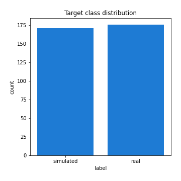

# Exploratory Data Analysis

[<< Go back](../README.md)
## Feature : target
- **Feature type** : categorical
- **Missing** : 0.0%
- **Unique** : 2
- **Count** :347
- **Unique** :2
- **Top** :real
- **Freq** :176

## Feature : mean1
- **Feature type** : continous
- **Missing** : 0.0%
- **Unique** : 347
- **Count** :347.0
- **Mean** :0.053747041204135544
- **Std** :0.08223149885702054
- **Min** :-0.22632637961920957
- **25%th Percentile** : 0.0017957720757565455
- **50%th Percentile** : 0.05349491921336605
- **75%th Percentile** : 0.09989679161767838
- **Max** :0.37175100008111034

## Feature : mean2
- **Feature type** : continous
- **Missing** : 0.0%
- **Unique** : 347
- **Count** :347.0
- **Mean** :0.07670173085250716
- **Std** :0.09442823777857434
- **Min** :-0.21818165578778434
- **25%th Percentile** : 0.024609573051243974
- **50%th Percentile** : 0.07656957711589553
- **75%th Percentile** : 0.13239063024600695
- **Max** :0.37616608147096464

## Feature : sd1
- **Feature type** : continous
- **Missing** : 0.0%
- **Unique** : 347
- **Count** :347.0
- **Mean** :1.9312277579506876
- **Std** :0.7907299390312036
- **Min** :0.7470080772831957
- **25%th Percentile** : 1.6922355994440692
- **50%th Percentile** : 1.81755108182371
- **75%th Percentile** : 1.8983629939570617
- **Max** :9.236766377527575

## Feature : sd2
- **Feature type** : continous
- **Missing** : 0.0%
- **Unique** : 347
- **Count** :347.0
- **Mean** :1.799473936861505
- **Std** :0.7080210954346763
- **Min** :0.8592887433004143
- **25%th Percentile** : 1.5580712151385756
- **50%th Percentile** : 1.643423721934397
- **75%th Percentile** : 1.7196197634599426
- **Max** :6.737618636746393

## Feature : skewness1
- **Feature type** : continous
- **Missing** : 0.0%
- **Unique** : 347
- **Count** :347.0
- **Mean** :-0.07387518988669707
- **Std** :0.6128200293612749
- **Min** :-3.530116233761814
- **25%th Percentile** : -0.17305467561196608
- **50%th Percentile** : -0.019899885064920807
- **75%th Percentile** : 0.09911645020578713
- **Max** :2.5845963767725557

## Feature : skewness2
- **Feature type** : continous
- **Missing** : 0.0%
- **Unique** : 347
- **Count** :347.0
- **Mean** :-0.18308776610905467
- **Std** :0.8207483425468316
- **Min** :-8.801502855292393
- **25%th Percentile** : -0.24495441139602225
- **50%th Percentile** : -0.042546427942578166
- **75%th Percentile** : 0.08393663537195496
- **Max** :2.2606839051517187

## Feature : kurtosis1
- **Feature type** : continous
- **Missing** : 0.0%
- **Unique** : 347
- **Count** :347.0
- **Mean** :3.4279995130019163
- **Std** :6.400376453367344
- **Min** :-0.4655884019808223
- **25%th Percentile** : -0.018268132693835204
- **50%th Percentile** : 0.724810704045284
- **75%th Percentile** : 3.9945238268597105
- **Max** :46.07507808162177

## Feature : kurtosis2
- **Feature type** : continous
- **Missing** : 0.0%
- **Unique** : 347
- **Count** :347.0
- **Mean** :3.9847414801584002
- **Std** :10.545813465042066
- **Min** :-0.4122407813689901
- **25%th Percentile** : -0.036708196730804055
- **50%th Percentile** : 0.5287361180894306
- **75%th Percentile** : 4.335825686593465
- **Max** :143.10871011533666

## Feature : return_autocorrelation_1_lag1
- **Feature type** : continous
- **Missing** : 0.0%
- **Unique** : 347
- **Count** :347.0
- **Mean** :-0.009675847169361233
- **Std** :0.05722561001310717
- **Min** :-0.2135576224968752
- **25%th Percentile** : -0.04340125194558605
- **50%th Percentile** : -0.0053187763310248585
- **75%th Percentile** : 0.026996738004876702
- **Max** :0.12810656890648087

## Feature : return_autocorrelation_1_lag2
- **Feature type** : continous
- **Missing** : 0.0%
- **Unique** : 347
- **Count** :347.0
- **Mean** :-0.005860605536551817
- **Std** :0.04830853557033209
- **Min** :-0.12172858720259
- **25%th Percentile** : -0.036136220007438324
- **50%th Percentile** : -0.006993231998461453
- **75%th Percentile** : 0.024132504344337308
- **Max** :0.12993318557465194

## Feature : return_autocorrelation_1_lag3
- **Feature type** : continous
- **Missing** : 0.0%
- **Unique** : 347
- **Count** :347.0
- **Mean** :-0.0027501036511664353
- **Std** :0.0488547339308974
- **Min** :-0.1311932951846271
- **25%th Percentile** : -0.03392050619685966
- **50%th Percentile** : -0.004670915865281931
- **75%th Percentile** : 0.03187588166442995
- **Max** :0.17805869530681923

## Feature : return_autocorrelation_2_lag1
- **Feature type** : continous
- **Missing** : 0.0%
- **Unique** : 347
- **Count** :347.0
- **Mean** :-0.008163340848193205
- **Std** :0.05737157592139981
- **Min** :-0.25075531010123286
- **25%th Percentile** : -0.03727703724371159
- **50%th Percentile** : -0.004217356921165435
- **75%th Percentile** : 0.029067982203224325
- **Max** :0.31863413537898483

## Feature : return_autocorrelation_2_lag2
- **Feature type** : continous
- **Missing** : 0.0%
- **Unique** : 347
- **Count** :347.0
- **Mean** :-0.0010628379570844862
- **Std** :0.0531057025883857
- **Min** :-0.1495113937562178
- **25%th Percentile** : -0.03915126993964137
- **50%th Percentile** : -0.004912527168355069
- **75%th Percentile** : 0.036406268746343964
- **Max** :0.20974504043791217

## Feature : return_autocorrelation_2_lag3
- **Feature type** : continous
- **Missing** : 0.0%
- **Unique** : 347
- **Count** :347.0
- **Mean** :-0.004278480871621058
- **Std** :0.05081852020337656
- **Min** :-0.14200107169559698
- **25%th Percentile** : -0.03546838280154443
- **50%th Percentile** : -0.004101317810487607
- **75%th Percentile** : 0.030294622374747185
- **Max** :0.1419999376914021

## Feature : return_correlation_ts1_lag_0
- **Feature type** : continous
- **Missing** : 0.0%
- **Unique** : 347
- **Count** :347.0
- **Mean** :0.31629924699287376
- **Std** :0.11053961785651471
- **Min** :-0.027089510445801036
- **25%th Percentile** : 0.2639138126465061
- **50%th Percentile** : 0.3142673817754578
- **75%th Percentile** : 0.36231590304574635
- **Max** :0.7041861626832071

## Feature : return_correlation_ts1_lag_1
- **Feature type** : continous
- **Missing** : 0.0%
- **Unique** : 347
- **Count** :347.0
- **Mean** :-0.005646163050078704
- **Std** :0.04909538690743102
- **Min** :-0.16985510949917193
- **25%th Percentile** : -0.03752822531210838
- **50%th Percentile** : -0.0029806713094563215
- **75%th Percentile** : 0.02676567917260852
- **Max** :0.15499424718508623

## Feature : return_correlation_ts1_lag_2
- **Feature type** : continous
- **Missing** : 0.0%
- **Unique** : 347
- **Count** :347.0
- **Mean** :-0.0030404087072509176
- **Std** :0.046855292649041445
- **Min** :-0.21653581047581763
- **25%th Percentile** : -0.03412282712285926
- **50%th Percentile** : -0.0024991748000942177
- **75%th Percentile** : 0.030276886247547985
- **Max** :0.11336681296926542

## Feature : return_correlation_ts1_lag_3
- **Feature type** : continous
- **Missing** : 0.0%
- **Unique** : 347
- **Count** :347.0
- **Mean** :0.00013934878928049661
- **Std** :0.052938154846315734
- **Min** :-0.1304175282133597
- **25%th Percentile** : -0.033843006634036846
- **50%th Percentile** : -0.0017126292236696195
- **75%th Percentile** : 0.0356439256711133
- **Max** :0.1636773216468148

## Feature : return_correlation_ts2_lag_1
- **Feature type** : continous
- **Missing** : 0.0%
- **Unique** : 347
- **Count** :347.0
- **Mean** :-0.006473660529114034
- **Std** :0.0517396922948964
- **Min** :-0.20093919236581337
- **25%th Percentile** : -0.037343631515296044
- **50%th Percentile** : -0.007477891707464732
- **75%th Percentile** : 0.025432073707012236
- **Max** :0.17208763791364762

## Feature : return_correlation_ts2_lag_2
- **Feature type** : continous
- **Missing** : 0.0%
- **Unique** : 347
- **Count** :347.0
- **Mean** :-9.90431659719863e-05
- **Std** :0.0510037486251767
- **Min** :-0.15299951737180204
- **25%th Percentile** : -0.035204040319244234
- **50%th Percentile** : -0.00045688431833074323
- **75%th Percentile** : 0.03502203222946326
- **Max** :0.15388933426238696

## Feature : return_correlation_ts2_lag_3
- **Feature type** : continous
- **Missing** : 0.0%
- **Unique** : 347
- **Count** :347.0
- **Mean** :-3.6627276800210763e-05
- **Std** :0.05090277104161906
- **Min** :-0.16212823605110202
- **25%th Percentile** : -0.030690481836834836
- **50%th Percentile** : -0.0011269900233670457
- **75%th Percentile** : 0.03393817548390328
- **Max** :0.1315155574351737

## Feature : sqreturn_autocorrelation_ts1_lag1
- **Feature type** : continous
- **Missing** : 0.0%
- **Unique** : 347
- **Count** :347.0
- **Mean** :0.045755772334614295
- **Std** :0.08623974018552091
- **Min** :-0.08597106874598565
- **25%th Percentile** : -0.009770573792025844
- **50%th Percentile** : 0.025521775142948813
- **75%th Percentile** : 0.08103706959886789
- **Max** :0.4399873614316609

## Feature : sqreturn_autocorrelation_ts1_lag2
- **Feature type** : continous
- **Missing** : 0.0%
- **Unique** : 347
- **Count** :347.0
- **Mean** :0.037830365217804356
- **Std** :0.08964766721478429
- **Min** :-0.12163273898704689
- **25%th Percentile** : -0.017281276676379475
- **50%th Percentile** : 0.015272211200579837
- **75%th Percentile** : 0.06370830133280704
- **Max** :0.540735851444759

## Feature : sqreturn_autocorrelation_ts1_lag3
- **Feature type** : continous
- **Missing** : 0.0%
- **Unique** : 347
- **Count** :347.0
- **Mean** :0.03174025451888233
- **Std** :0.07223679393446451
- **Min** :-0.09680561523415443
- **25%th Percentile** : -0.012928310361249674
- **50%th Percentile** : 0.014078064389113137
- **75%th Percentile** : 0.06172032179489927
- **Max** :0.41030914918857014

## Feature : sqreturn_autocorrelation_ts2_lag1
- **Feature type** : continous
- **Missing** : 0.0%
- **Unique** : 347
- **Count** :347.0
- **Mean** :0.05061700019604797
- **Std** :0.08968885217220088
- **Min** :-0.08083144236067658
- **25%th Percentile** : -0.009217162710037053
- **50%th Percentile** : 0.028024673012368214
- **75%th Percentile** : 0.08526681371940328
- **Max** :0.510085647437958

## Feature : sqreturn_autocorrelation_ts2_lag2
- **Feature type** : continous
- **Missing** : 0.0%
- **Unique** : 347
- **Count** :347.0
- **Mean** :0.03753070206460685
- **Std** :0.08859709015532131
- **Min** :-0.11141366631740432
- **25%th Percentile** : -0.015537079867840337
- **50%th Percentile** : 0.015842004093379932
- **75%th Percentile** : 0.061780614156513355
- **Max** :0.4161185589245815

## Feature : sqreturn_autocorrelation_ts2_lag3
- **Feature type** : continous
- **Missing** : 0.0%
- **Unique** : 347
- **Count** :347.0
- **Mean** :0.0269857230308349
- **Std** :0.071095297462353
- **Min** :-0.10276579858916814
- **25%th Percentile** : -0.014958200338266218
- **50%th Percentile** : 0.011963473051834915
- **75%th Percentile** : 0.0477444197233558
- **Max** :0.30256115637327263

## Feature : sqreturn_correlation_ts1_lag_0
- **Feature type** : continous
- **Missing** : 0.0%
- **Unique** : 347
- **Count** :347.0
- **Mean** :0.31629924699287376
- **Std** :0.11053961785651471
- **Min** :-0.027089510445801036
- **25%th Percentile** : 0.2639138126465061
- **50%th Percentile** : 0.3142673817754578
- **75%th Percentile** : 0.36231590304574635
- **Max** :0.7041861626832071

## Feature : sqreturn_correlation_ts1_lag_1
- **Feature type** : continous
- **Missing** : 0.0%
- **Unique** : 347
- **Count** :347.0
- **Mean** :-0.005646163050078704
- **Std** :0.04909538690743102
- **Min** :-0.16985510949917193
- **25%th Percentile** : -0.03752822531210838
- **50%th Percentile** : -0.0029806713094563215
- **75%th Percentile** : 0.02676567917260852
- **Max** :0.15499424718508623

## Feature : sqreturn_correlation_ts1_lag_2
- **Feature type** : continous
- **Missing** : 0.0%
- **Unique** : 347
- **Count** :347.0
- **Mean** :-0.0030404087072509176
- **Std** :0.046855292649041445
- **Min** :-0.21653581047581763
- **25%th Percentile** : -0.03412282712285926
- **50%th Percentile** : -0.0024991748000942177
- **75%th Percentile** : 0.030276886247547985
- **Max** :0.11336681296926542

## Feature : sqreturn_correlation_ts1_lag_3
- **Feature type** : continous
- **Missing** : 0.0%
- **Unique** : 347
- **Count** :347.0
- **Mean** :0.00013934878928049661
- **Std** :0.052938154846315734
- **Min** :-0.1304175282133597
- **25%th Percentile** : -0.033843006634036846
- **50%th Percentile** : -0.0017126292236696195
- **75%th Percentile** : 0.0356439256711133
- **Max** :0.1636773216468148

## Feature : sqreturn_correlation_ts2_lag_1
- **Feature type** : continous
- **Missing** : 0.0%
- **Unique** : 347
- **Count** :347.0
- **Mean** :-0.006473660529114034
- **Std** :0.0517396922948964
- **Min** :-0.20093919236581337
- **25%th Percentile** : -0.037343631515296044
- **50%th Percentile** : -0.007477891707464732
- **75%th Percentile** : 0.025432073707012236
- **Max** :0.17208763791364762

## Feature : sqreturn_correlation_ts2_lag_2
- **Feature type** : continous
- **Missing** : 0.0%
- **Unique** : 347
- **Count** :347.0
- **Mean** :-9.90431659719863e-05
- **Std** :0.0510037486251767
- **Min** :-0.15299951737180204
- **25%th Percentile** : -0.035204040319244234
- **50%th Percentile** : -0.00045688431833074323
- **75%th Percentile** : 0.03502203222946326
- **Max** :0.15388933426238696

## Feature : sqreturn_correlation_ts2_lag_3
- **Feature type** : continous
- **Missing** : 0.0%
- **Unique** : 347
- **Count** :347.0
- **Mean** :-3.6627276800210763e-05
- **Std** :0.05090277104161906
- **Min** :-0.16212823605110202
- **25%th Percentile** : -0.030690481836834836
- **50%th Percentile** : -0.0011269900233670457
- **75%th Percentile** : 0.03393817548390328
- **Max** :0.1315155574351737

## Feature : price2_granger_cause_price1
- **Feature type** : continous
- **Missing** : 0.0%
- **Unique** : 347
- **Count** :347.0
- **Mean** :0.30756043531343985
- **Std** :0.2956162136171555
- **Min** :1.3336408637877266e-08
- **25%th Percentile** : 0.04493609395744444
- **50%th Percentile** : 0.21669319275661944
- **75%th Percentile** : 0.5598988542721589
- **Max** :0.9885712803689185

## Feature : price1_granger_cause_price2
- **Feature type** : continous
- **Missing** : 0.0%
- **Unique** : 347
- **Count** :347.0
- **Mean** :0.28601275013487665
- **Std** :0.270654706254095
- **Min** :1.0501685054881596e-07
- **25%th Percentile** : 0.039370396482791045
- **50%th Percentile** : 0.22153185261321595
- **75%th Percentile** : 0.46812772258260316
- **Max** :0.9951398266867577

[<< Go back](../README.md)
