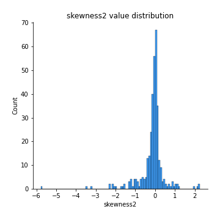

# Exploratory Data Analysis

[<< Go back](../README.md)
## Feature : target
- **Feature type** : categorical
- **Missing** : 0.0%
- **Unique** : 2
- **Count** :347
- **Unique** :2
- **Top** :real
- **Freq** :178

## Feature : mean1
- **Feature type** : continous
- **Missing** : 0.0%
- **Unique** : 347
- **Count** :347.0
- **Mean** :0.05244567918276587
- **Std** :0.08378364918694531
- **Min** :-0.22632637961920957
- **25%th Percentile** : 0.003693729255978305
- **50%th Percentile** : 0.05034544162439482
- **75%th Percentile** : 0.09705349737200655
- **Max** :0.37175100008111034

## Feature : mean2
- **Feature type** : continous
- **Missing** : 0.0%
- **Unique** : 347
- **Count** :347.0
- **Mean** :0.07896308713200968
- **Std** :0.08472613375900757
- **Min** :-0.21818165578778434
- **25%th Percentile** : 0.03569481595311272
- **50%th Percentile** : 0.07637190842461924
- **75%th Percentile** : 0.12584152919537905
- **Max** :0.3960665987150344

## Feature : sd1
- **Feature type** : continous
- **Missing** : 0.0%
- **Unique** : 347
- **Count** :347.0
- **Mean** :1.909953206338461
- **Std** :0.7701810808749131
- **Min** :0.7470080772831957
- **25%th Percentile** : 1.685529473784726
- **50%th Percentile** : 1.8175941912983768
- **75%th Percentile** : 1.900371417389396
- **Max** :9.236766377527575

## Feature : sd2
- **Feature type** : continous
- **Missing** : 0.0%
- **Unique** : 347
- **Count** :347.0
- **Mean** :1.8015717487345064
- **Std** :0.6723296565280272
- **Min** :0.8455946193085045
- **25%th Percentile** : 1.57664830423337
- **50%th Percentile** : 1.6498136909098178
- **75%th Percentile** : 1.7230874559839113
- **Max** :5.872800253666788

## Feature : skewness1
- **Feature type** : continous
- **Missing** : 0.0%
- **Unique** : 347
- **Count** :347.0
- **Mean** :-0.08955549139633778
- **Std** :0.6290391724329093
- **Min** :-3.530116233761814
- **25%th Percentile** : -0.19262476573329385
- **50%th Percentile** : -0.026451785452209615
- **75%th Percentile** : 0.1003503729122491
- **Max** :2.5845963767725557

## Feature : skewness2
- **Feature type** : continous
- **Missing** : 0.0%
- **Unique** : 347
- **Count** :347.0
- **Mean** :-0.13975863795331725
- **Std** :0.6681961152443903
- **Min** :-5.778144124281153
- **25%th Percentile** : -0.22019640052434636
- **50%th Percentile** : -0.04780462648400617
- **75%th Percentile** : 0.07473926322137532
- **Max** :2.2606839051517187

## Feature : kurtosis1
- **Feature type** : continous
- **Missing** : 0.0%
- **Unique** : 347
- **Count** :347.0
- **Mean** :3.2639419388110165
- **Std** :6.150984951031857
- **Min** :-0.4914745145194468
- **25%th Percentile** : -0.023889541416182825
- **50%th Percentile** : 0.6514678102120954
- **75%th Percentile** : 3.8376122618365898
- **Max** :46.07507808162177

## Feature : kurtosis2
- **Feature type** : continous
- **Missing** : 0.0%
- **Unique** : 347
- **Count** :347.0
- **Mean** :3.539536583620448
- **Std** :7.150058445670756
- **Min** :-0.49938760617647837
- **25%th Percentile** : -0.013685794408988095
- **50%th Percentile** : 0.8394212703206594
- **75%th Percentile** : 4.335825686593465
- **Max** :71.39844769176813

## Feature : return_autocorrelation_1_lag1
- **Feature type** : continous
- **Missing** : 0.0%
- **Unique** : 347
- **Count** :347.0
- **Mean** :-0.010214408647935467
- **Std** :0.057644518049428266
- **Min** :-0.2135576224968752
- **25%th Percentile** : -0.0402245304956986
- **50%th Percentile** : -0.004456277573547255
- **75%th Percentile** : 0.027118506556472074
- **Max** :0.13034176220410604

## Feature : return_autocorrelation_1_lag2
- **Feature type** : continous
- **Missing** : 0.0%
- **Unique** : 347
- **Count** :347.0
- **Mean** :-0.006040045449217311
- **Std** :0.049915761411201236
- **Min** :-0.12172858720259
- **25%th Percentile** : -0.04030958841989901
- **50%th Percentile** : -0.0016392323698294076
- **75%th Percentile** : 0.02772392766055541
- **Max** :0.13553587149024285

## Feature : return_autocorrelation_1_lag3
- **Feature type** : continous
- **Missing** : 0.0%
- **Unique** : 347
- **Count** :347.0
- **Mean** :-0.0019528170909851293
- **Std** :0.051567979845881524
- **Min** :-0.1940836867390813
- **25%th Percentile** : -0.03646084878516233
- **50%th Percentile** : 0.0019268479604953811
- **75%th Percentile** : 0.031923141668234116
- **Max** :0.15347914956123304

## Feature : return_autocorrelation_2_lag1
- **Feature type** : continous
- **Missing** : 0.0%
- **Unique** : 347
- **Count** :347.0
- **Mean** :-0.0068384532153957294
- **Std** :0.062262723473215896
- **Min** :-0.25075531010123286
- **25%th Percentile** : -0.04137203817105518
- **50%th Percentile** : -0.0013947385982922458
- **75%th Percentile** : 0.033599173714150124
- **Max** :0.31863413537898483

## Feature : return_autocorrelation_2_lag2
- **Feature type** : continous
- **Missing** : 0.0%
- **Unique** : 347
- **Count** :347.0
- **Mean** :-0.004078357434281952
- **Std** :0.05113753415584449
- **Min** :-0.15323211089747296
- **25%th Percentile** : -0.03964500646240875
- **50%th Percentile** : -0.006303184136612406
- **75%th Percentile** : 0.030943753707731773
- **Max** :0.20974504043791217

## Feature : return_autocorrelation_2_lag3
- **Feature type** : continous
- **Missing** : 0.0%
- **Unique** : 347
- **Count** :347.0
- **Mean** :0.0012741001682997802
- **Std** :0.04756220228591384
- **Min** :-0.14200107169559698
- **25%th Percentile** : -0.028985630805753962
- **50%th Percentile** : -0.0003904222372115092
- **75%th Percentile** : 0.035753288415426375
- **Max** :0.13561993266022912

## Feature : return_correlation_ts1_lag_0
- **Feature type** : continous
- **Missing** : 0.0%
- **Unique** : 347
- **Count** :347.0
- **Mean** :0.3116951372536475
- **Std** :0.10866290448088683
- **Min** :-0.027089510445801036
- **25%th Percentile** : 0.2610503538960717
- **50%th Percentile** : 0.31096932530260973
- **75%th Percentile** : 0.356139824920872
- **Max** :0.7041861626832071

## Feature : return_correlation_ts1_lag_1
- **Feature type** : continous
- **Missing** : 0.0%
- **Unique** : 347
- **Count** :347.0
- **Mean** :-0.003580708865141441
- **Std** :0.05013934749942934
- **Min** :-0.16985510949917193
- **25%th Percentile** : -0.034362279414447416
- **50%th Percentile** : 7.104278811083254e-05
- **75%th Percentile** : 0.03119434125401511
- **Max** :0.15499424718508623

## Feature : return_correlation_ts1_lag_2
- **Feature type** : continous
- **Missing** : 0.0%
- **Unique** : 347
- **Count** :347.0
- **Mean** :-0.0006479247389155089
- **Std** :0.0494167750043494
- **Min** :-0.21653581047581763
- **25%th Percentile** : -0.03226207588497314
- **50%th Percentile** : -0.0020126584596116674
- **75%th Percentile** : 0.03710198095511427
- **Max** :0.10916944041387708

## Feature : return_correlation_ts1_lag_3
- **Feature type** : continous
- **Missing** : 0.0%
- **Unique** : 347
- **Count** :347.0
- **Mean** :0.0019162409184365445
- **Std** :0.05146424601865009
- **Min** :-0.12306593817498207
- **25%th Percentile** : -0.02796153629722297
- **50%th Percentile** : -0.0008687998567496397
- **75%th Percentile** : 0.03450664505736821
- **Max** :0.1636773216468148

## Feature : return_correlation_ts2_lag_1
- **Feature type** : continous
- **Missing** : 0.0%
- **Unique** : 347
- **Count** :347.0
- **Mean** :-0.0025557657084714813
- **Std** :0.051915792422606424
- **Min** :-0.2081139431093261
- **25%th Percentile** : -0.031223855065352635
- **50%th Percentile** : -0.0036952781043913495
- **75%th Percentile** : 0.03229788999225136
- **Max** :0.17208763791364762

## Feature : return_correlation_ts2_lag_2
- **Feature type** : continous
- **Missing** : 0.0%
- **Unique** : 347
- **Count** :347.0
- **Mean** :0.0005097172681223202
- **Std** :0.05113660201411437
- **Min** :-0.23751835475804678
- **25%th Percentile** : -0.03411291783622873
- **50%th Percentile** : -0.0003449019640725187
- **75%th Percentile** : 0.0332139663200993
- **Max** :0.15388933426238696

## Feature : return_correlation_ts2_lag_3
- **Feature type** : continous
- **Missing** : 0.0%
- **Unique** : 347
- **Count** :347.0
- **Mean** :0.001041788537069969
- **Std** :0.05019895542662503
- **Min** :-0.1603001201932561
- **25%th Percentile** : -0.030697598883466487
- **50%th Percentile** : 0.0017062306092014044
- **75%th Percentile** : 0.035547194977176455
- **Max** :0.13128380114518473

## Feature : sqreturn_autocorrelation_ts1_lag1
- **Feature type** : continous
- **Missing** : 0.0%
- **Unique** : 347
- **Count** :347.0
- **Mean** :0.04831966299312657
- **Std** :0.09140709263876617
- **Min** :-0.10136040023471415
- **25%th Percentile** : -0.012384588827276052
- **50%th Percentile** : 0.027699802735512046
- **75%th Percentile** : 0.08249100109328394
- **Max** :0.4399873614316609

## Feature : sqreturn_autocorrelation_ts1_lag2
- **Feature type** : continous
- **Missing** : 0.0%
- **Unique** : 347
- **Count** :347.0
- **Mean** :0.04250002009560042
- **Std** :0.0840118600447399
- **Min** :-0.08976002227124472
- **25%th Percentile** : -0.009871835418804372
- **50%th Percentile** : 0.01626135840334948
- **75%th Percentile** : 0.07289157923188289
- **Max** :0.42719220751700526

## Feature : sqreturn_autocorrelation_ts1_lag3
- **Feature type** : continous
- **Missing** : 0.0%
- **Unique** : 347
- **Count** :347.0
- **Mean** :0.033874064713517456
- **Std** :0.08067291781945855
- **Min** :-0.12032070662454927
- **25%th Percentile** : -0.014409557295502369
- **50%th Percentile** : 0.012593715022244586
- **75%th Percentile** : 0.06411415209195377
- **Max** :0.44755937369538146

## Feature : sqreturn_autocorrelation_ts2_lag1
- **Feature type** : continous
- **Missing** : 0.0%
- **Unique** : 347
- **Count** :347.0
- **Mean** :0.044469665397488985
- **Std** :0.08718569718260945
- **Min** :-0.12127974645177328
- **25%th Percentile** : -0.012320920476285495
- **50%th Percentile** : 0.02496628680229653
- **75%th Percentile** : 0.07388155160495859
- **Max** :0.510085647437958

## Feature : sqreturn_autocorrelation_ts2_lag2
- **Feature type** : continous
- **Missing** : 0.0%
- **Unique** : 347
- **Count** :347.0
- **Mean** :0.03451725622974977
- **Std** :0.08061907324591776
- **Min** :-0.11124857679808511
- **25%th Percentile** : -0.01522321399051194
- **50%th Percentile** : 0.01386660012565615
- **75%th Percentile** : 0.053442956409929916
- **Max** :0.4161185589245815

## Feature : sqreturn_autocorrelation_ts2_lag3
- **Feature type** : continous
- **Missing** : 0.0%
- **Unique** : 347
- **Count** :347.0
- **Mean** :0.028583275043431
- **Std** :0.06658637048147353
- **Min** :-0.1211187759266544
- **25%th Percentile** : -0.012477424724420608
- **50%th Percentile** : 0.01578708598028757
- **75%th Percentile** : 0.059299749161890014
- **Max** :0.2982547942937359

## Feature : sqreturn_correlation_ts1_lag_0
- **Feature type** : continous
- **Missing** : 0.0%
- **Unique** : 347
- **Count** :347.0
- **Mean** :0.3116951372536475
- **Std** :0.10866290448088683
- **Min** :-0.027089510445801036
- **25%th Percentile** : 0.2610503538960717
- **50%th Percentile** : 0.31096932530260973
- **75%th Percentile** : 0.356139824920872
- **Max** :0.7041861626832071

## Feature : sqreturn_correlation_ts1_lag_1
- **Feature type** : continous
- **Missing** : 0.0%
- **Unique** : 347
- **Count** :347.0
- **Mean** :-0.003580708865141441
- **Std** :0.05013934749942934
- **Min** :-0.16985510949917193
- **25%th Percentile** : -0.034362279414447416
- **50%th Percentile** : 7.104278811083254e-05
- **75%th Percentile** : 0.03119434125401511
- **Max** :0.15499424718508623

## Feature : sqreturn_correlation_ts1_lag_2
- **Feature type** : continous
- **Missing** : 0.0%
- **Unique** : 347
- **Count** :347.0
- **Mean** :-0.0006479247389155089
- **Std** :0.0494167750043494
- **Min** :-0.21653581047581763
- **25%th Percentile** : -0.03226207588497314
- **50%th Percentile** : -0.0020126584596116674
- **75%th Percentile** : 0.03710198095511427
- **Max** :0.10916944041387708

## Feature : sqreturn_correlation_ts1_lag_3
- **Feature type** : continous
- **Missing** : 0.0%
- **Unique** : 347
- **Count** :347.0
- **Mean** :0.0019162409184365445
- **Std** :0.05146424601865009
- **Min** :-0.12306593817498207
- **25%th Percentile** : -0.02796153629722297
- **50%th Percentile** : -0.0008687998567496397
- **75%th Percentile** : 0.03450664505736821
- **Max** :0.1636773216468148

## Feature : sqreturn_correlation_ts2_lag_1
- **Feature type** : continous
- **Missing** : 0.0%
- **Unique** : 347
- **Count** :347.0
- **Mean** :-0.0025557657084714813
- **Std** :0.051915792422606424
- **Min** :-0.2081139431093261
- **25%th Percentile** : -0.031223855065352635
- **50%th Percentile** : -0.0036952781043913495
- **75%th Percentile** : 0.03229788999225136
- **Max** :0.17208763791364762

## Feature : sqreturn_correlation_ts2_lag_2
- **Feature type** : continous
- **Missing** : 0.0%
- **Unique** : 347
- **Count** :347.0
- **Mean** :0.0005097172681223202
- **Std** :0.05113660201411437
- **Min** :-0.23751835475804678
- **25%th Percentile** : -0.03411291783622873
- **50%th Percentile** : -0.0003449019640725187
- **75%th Percentile** : 0.0332139663200993
- **Max** :0.15388933426238696

## Feature : sqreturn_correlation_ts2_lag_3
- **Feature type** : continous
- **Missing** : 0.0%
- **Unique** : 347
- **Count** :347.0
- **Mean** :0.001041788537069969
- **Std** :0.05019895542662503
- **Min** :-0.1603001201932561
- **25%th Percentile** : -0.030697598883466487
- **50%th Percentile** : 0.0017062306092014044
- **75%th Percentile** : 0.035547194977176455
- **Max** :0.13128380114518473

## Feature : price2_granger_cause_price1
- **Feature type** : continous
- **Missing** : 0.0%
- **Unique** : 347
- **Count** :347.0
- **Mean** :0.29974943604468063
- **Std** :0.302451040148137
- **Min** :8.790117645170474e-08
- **25%th Percentile** : 0.03126715473056348
- **50%th Percentile** : 0.19064920058774415
- **75%th Percentile** : 0.5473893946008519
- **Max** :0.9976481504227616

## Feature : price1_granger_cause_price2
- **Feature type** : continous
- **Missing** : 0.0%
- **Unique** : 347
- **Count** :347.0
- **Mean** :0.30245001433516816
- **Std** :0.2802265340674037
- **Min** :8.363538658074648e-08
- **25%th Percentile** : 0.05754005093239317
- **50%th Percentile** : 0.2244123542631357
- **75%th Percentile** : 0.495276925742221
- **Max** :0.9660122325264373

[<< Go back](../README.md)
