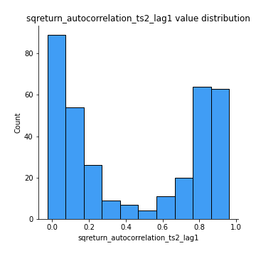

# Exploratory Data Analysis

[<< Go back](../README.md)
## Feature : target
- **Feature type** : categorical
- **Missing** : 0.0%
- **Unique** : 2
- **Count** :347
- **Unique** :2
- **Top** :real
- **Freq** :176

## Feature : mean1
- **Feature type** : continous
- **Missing** : 0.0%
- **Unique** : 347
- **Count** :347.0
- **Mean** :-0.2317105511488433
- **Std** :0.3171804233052914
- **Min** :-0.9650132289839891
- **25%th Percentile** : -0.5469500488728676
- **50%th Percentile** : -0.12477099925157659
- **75%th Percentile** : 0.05800209500123443
- **Max** :0.37175100008111034

## Feature : mean2
- **Feature type** : continous
- **Missing** : 0.0%
- **Unique** : 347
- **Count** :347.0
- **Mean** :-0.25480173483322227
- **Std** :0.3556029653806264
- **Min** :-1.267119787472086
- **25%th Percentile** : -0.575495045713335
- **50%th Percentile** : -0.17229417140111347
- **75%th Percentile** : 0.06470037891879146
- **Max** :0.5747421691219511

## Feature : sd1
- **Feature type** : continous
- **Missing** : 0.0%
- **Unique** : 347
- **Count** :347.0
- **Mean** :1.6482942172746142
- **Std** :0.8760496762952162
- **Min** :0.7470080772831957
- **25%th Percentile** : 1.2349365440142506
- **50%th Percentile** : 1.2843770539615864
- **75%th Percentile** : 1.739912324402026
- **Max** :9.236766377527575

## Feature : sd2
- **Feature type** : continous
- **Missing** : 0.0%
- **Unique** : 347
- **Count** :347.0
- **Mean** :1.9108371879231236
- **Std** :0.7311332087212411
- **Min** :0.8592887433004143
- **25%th Percentile** : 1.4508326865006744
- **50%th Percentile** : 1.8027570823795103
- **75%th Percentile** : 2.0889208494853113
- **Max** :6.737618636746393

## Feature : skewness1
- **Feature type** : continous
- **Missing** : 0.0%
- **Unique** : 347
- **Count** :347.0
- **Mean** :-0.07143747373550607
- **Std** :0.6128657136808443
- **Min** :-3.530116233761814
- **25%th Percentile** : -0.16040827136937724
- **50%th Percentile** : -0.020115238214939553
- **75%th Percentile** : 0.10451390185293624
- **Max** :2.5845963767725557

## Feature : skewness2
- **Feature type** : continous
- **Missing** : 0.0%
- **Unique** : 347
- **Count** :347.0
- **Mean** :-0.9228893201867533
- **Std** :1.03180543649689
- **Min** :-8.801502855292393
- **25%th Percentile** : -1.606585152807889
- **50%th Percentile** : -0.963707481053519
- **75%th Percentile** : -0.22065337180543873
- **Max** :2.2606839051517187

## Feature : kurtosis1
- **Feature type** : continous
- **Missing** : 0.0%
- **Unique** : 347
- **Count** :347.0
- **Mean** :3.4052492108700188
- **Std** :6.412281120068166
- **Min** :-0.4369542331191556
- **25%th Percentile** : -0.032438790606513335
- **50%th Percentile** : 0.5559503011234885
- **75%th Percentile** : 3.9945238268597105
- **Max** :46.07507808162177

## Feature : kurtosis2
- **Feature type** : continous
- **Missing** : 0.0%
- **Unique** : 347
- **Count** :347.0
- **Mean** :5.721504174892582
- **Std** :10.057191479479501
- **Min** :-0.2893210760090166
- **25%th Percentile** : 2.5654746690405066
- **50%th Percentile** : 3.807491907103644
- **75%th Percentile** : 5.029640012208282
- **Max** :143.10871011533666

## Feature : return_autocorrelation_1_lag1
- **Feature type** : continous
- **Missing** : 0.0%
- **Unique** : 347
- **Count** :347.0
- **Mean** :0.018933305813122123
- **Std** :0.06908406626315562
- **Min** :-0.2135576224968752
- **25%th Percentile** : -0.02378652330192311
- **50%th Percentile** : 0.02735778799452716
- **75%th Percentile** : 0.06861213423669232
- **Max** :0.14764754699899688

## Feature : return_autocorrelation_1_lag2
- **Feature type** : continous
- **Missing** : 0.0%
- **Unique** : 347
- **Count** :347.0
- **Mean** :0.02368183107703239
- **Std** :0.06227846743487545
- **Min** :-0.12172858720259
- **25%th Percentile** : -0.0180127398141643
- **50%th Percentile** : 0.02315084904333409
- **75%th Percentile** : 0.06736268687423827
- **Max** :0.21133238907133325

## Feature : return_autocorrelation_1_lag3
- **Feature type** : continous
- **Missing** : 0.0%
- **Unique** : 347
- **Count** :347.0
- **Mean** :0.026603165132644324
- **Std** :0.062034736703406625
- **Min** :-0.1311932951846271
- **25%th Percentile** : -0.018978808268058537
- **50%th Percentile** : 0.027349119847265544
- **75%th Percentile** : 0.07122283170823876
- **Max** :0.19650157418988748

## Feature : return_autocorrelation_2_lag1
- **Feature type** : continous
- **Missing** : 0.0%
- **Unique** : 347
- **Count** :347.0
- **Mean** :0.29888611844819274
- **Std** :0.3438470403186628
- **Min** :-0.25075531010123286
- **25%th Percentile** : -0.02370892168786351
- **50%th Percentile** : 0.09323526263664529
- **75%th Percentile** : 0.6540279404217499
- **Max** :0.8774342347200382

## Feature : return_autocorrelation_2_lag2
- **Feature type** : continous
- **Missing** : 0.0%
- **Unique** : 347
- **Count** :347.0
- **Mean** :0.30253755088003925
- **Std** :0.3336621356622932
- **Min** :-0.1495113937562178
- **25%th Percentile** : -0.01397320986299358
- **50%th Percentile** : 0.10995061649562812
- **75%th Percentile** : 0.6427729093493153
- **Max** :0.888003661525757

## Feature : return_autocorrelation_2_lag3
- **Feature type** : continous
- **Missing** : 0.0%
- **Unique** : 347
- **Count** :347.0
- **Mean** :0.2976301621192824
- **Std** :0.3327049928737376
- **Min** :-0.14200107169559698
- **25%th Percentile** : -0.010728526486871195
- **50%th Percentile** : 0.09916361039684134
- **75%th Percentile** : 0.6380783659513809
- **Max** :0.8776222429827312

## Feature : return_correlation_ts1_lag_0
- **Feature type** : continous
- **Missing** : 0.0%
- **Unique** : 347
- **Count** :347.0
- **Mean** :0.32102147199242015
- **Std** :0.11235528281645267
- **Min** :-0.027089510445801036
- **25%th Percentile** : 0.26681463681214973
- **50%th Percentile** : 0.32032219667042244
- **75%th Percentile** : 0.37307138592835365
- **Max** :0.7041861626832071

## Feature : return_correlation_ts1_lag_1
- **Feature type** : continous
- **Missing** : 0.0%
- **Unique** : 347
- **Count** :347.0
- **Mean** :0.0643362306154507
- **Std** :0.09801147276624739
- **Min** :-0.17296070285499274
- **25%th Percentile** : -0.009260806631008683
- **50%th Percentile** : 0.053463901772618706
- **75%th Percentile** : 0.14643284915687976
- **Max** :0.28141397467387513

## Feature : return_correlation_ts1_lag_2
- **Feature type** : continous
- **Missing** : 0.0%
- **Unique** : 347
- **Count** :347.0
- **Mean** :0.06780341527593726
- **Std** :0.09339132571771377
- **Min** :-0.21653581047581763
- **25%th Percentile** : -0.008138292844192922
- **50%th Percentile** : 0.06047763875453644
- **75%th Percentile** : 0.14574225649168343
- **Max** :0.2616933148016215

## Feature : return_correlation_ts1_lag_3
- **Feature type** : continous
- **Missing** : 0.0%
- **Unique** : 347
- **Count** :347.0
- **Mean** :0.0705104789789687
- **Std** :0.09409655927593136
- **Min** :-0.12306593817498207
- **25%th Percentile** : -0.006228470043947278
- **50%th Percentile** : 0.07059907358968932
- **75%th Percentile** : 0.14850463918578505
- **Max** :0.27228956051094516

## Feature : return_correlation_ts2_lag_1
- **Feature type** : continous
- **Missing** : 0.0%
- **Unique** : 347
- **Count** :347.0
- **Mean** :0.060021167408909684
- **Std** :0.09703066262986046
- **Min** :-0.20093919236581337
- **25%th Percentile** : -0.015880061648030325
- **50%th Percentile** : 0.05805391402664234
- **75%th Percentile** : 0.14462691085815513
- **Max** :0.2760901653333765

## Feature : return_correlation_ts2_lag_2
- **Feature type** : continous
- **Missing** : 0.0%
- **Unique** : 347
- **Count** :347.0
- **Mean** :0.06546118841988609
- **Std** :0.09059000041763969
- **Min** :-0.1751713543700236
- **25%th Percentile** : -0.009927901908124209
- **50%th Percentile** : 0.056172056142476126
- **75%th Percentile** : 0.14030876656889402
- **Max** :0.2794223973872521

## Feature : return_correlation_ts2_lag_3
- **Feature type** : continous
- **Missing** : 0.0%
- **Unique** : 347
- **Count** :347.0
- **Mean** :0.06502218930972059
- **Std** :0.09096426479892804
- **Min** :-0.16212823605110202
- **25%th Percentile** : -0.003321297640232924
- **50%th Percentile** : 0.05895040093846576
- **75%th Percentile** : 0.13745376685783514
- **Max** :0.26255640662077495

## Feature : sqreturn_autocorrelation_ts1_lag1
- **Feature type** : continous
- **Missing** : 0.0%
- **Unique** : 347
- **Count** :347.0
- **Mean** :0.05814700778594525
- **Std** :0.08184308401135704
- **Min** :-0.10027176361587455
- **25%th Percentile** : 0.009064006135843515
- **50%th Percentile** : 0.04008491218039823
- **75%th Percentile** : 0.08538969663794785
- **Max** :0.4399873614316609

## Feature : sqreturn_autocorrelation_ts1_lag2
- **Feature type** : continous
- **Missing** : 0.0%
- **Unique** : 347
- **Count** :347.0
- **Mean** :0.05332567192461787
- **Std** :0.08685859715776745
- **Min** :-0.09868413431091519
- **25%th Percentile** : -0.001978741177795102
- **50%th Percentile** : 0.031321149234482884
- **75%th Percentile** : 0.08463011124721329
- **Max** :0.540735851444759

## Feature : sqreturn_autocorrelation_ts1_lag3
- **Feature type** : continous
- **Missing** : 0.0%
- **Unique** : 347
- **Count** :347.0
- **Mean** :0.03995917756642713
- **Std** :0.07198604364689715
- **Min** :-0.09298301497226831
- **25%th Percentile** : -0.009262224263765075
- **50%th Percentile** : 0.02594879424324117
- **75%th Percentile** : 0.07366583386455205
- **Max** :0.41030914918857014

## Feature : sqreturn_autocorrelation_ts2_lag1
- **Feature type** : continous
- **Missing** : 0.0%
- **Unique** : 347
- **Count** :347.0
- **Mean** :0.4410872135589431
- **Std** :0.37051859892211086
- **Min** :-0.026796415279758023
- **25%th Percentile** : 0.06525428948442955
- **50%th Percentile** : 0.2973355041414194
- **75%th Percentile** : 0.8391715313370989
- **Max** :0.9620232839819706

## Feature : sqreturn_autocorrelation_ts2_lag2
- **Feature type** : continous
- **Missing** : 0.0%
- **Unique** : 347
- **Count** :347.0
- **Mean** :0.42523132661457425
- **Std** :0.3776396253145259
- **Min** :-0.051523884196217395
- **25%th Percentile** : 0.040500607325808555
- **50%th Percentile** : 0.301564883065927
- **75%th Percentile** : 0.8336853332951066
- **Max** :0.9680736972612093

## Feature : sqreturn_autocorrelation_ts2_lag3
- **Feature type** : continous
- **Missing** : 0.0%
- **Unique** : 347
- **Count** :347.0
- **Mean** :0.4160655880398148
- **Std** :0.3833331043873189
- **Min** :-0.06065894750062144
- **25%th Percentile** : 0.03313354511444918
- **50%th Percentile** : 0.25602360891048725
- **75%th Percentile** : 0.8230495684161597
- **Max** :0.9713118772242493

## Feature : sqreturn_correlation_ts1_lag_0
- **Feature type** : continous
- **Missing** : 0.0%
- **Unique** : 347
- **Count** :347.0
- **Mean** :0.32102147199242015
- **Std** :0.11235528281645267
- **Min** :-0.027089510445801036
- **25%th Percentile** : 0.26681463681214973
- **50%th Percentile** : 0.32032219667042244
- **75%th Percentile** : 0.37307138592835365
- **Max** :0.7041861626832071

## Feature : sqreturn_correlation_ts1_lag_1
- **Feature type** : continous
- **Missing** : 0.0%
- **Unique** : 347
- **Count** :347.0
- **Mean** :0.0643362306154507
- **Std** :0.09801147276624739
- **Min** :-0.17296070285499274
- **25%th Percentile** : -0.009260806631008683
- **50%th Percentile** : 0.053463901772618706
- **75%th Percentile** : 0.14643284915687976
- **Max** :0.28141397467387513

## Feature : sqreturn_correlation_ts1_lag_2
- **Feature type** : continous
- **Missing** : 0.0%
- **Unique** : 347
- **Count** :347.0
- **Mean** :0.06780341527593726
- **Std** :0.09339132571771377
- **Min** :-0.21653581047581763
- **25%th Percentile** : -0.008138292844192922
- **50%th Percentile** : 0.06047763875453644
- **75%th Percentile** : 0.14574225649168343
- **Max** :0.2616933148016215

## Feature : sqreturn_correlation_ts1_lag_3
- **Feature type** : continous
- **Missing** : 0.0%
- **Unique** : 347
- **Count** :347.0
- **Mean** :0.0705104789789687
- **Std** :0.09409655927593136
- **Min** :-0.12306593817498207
- **25%th Percentile** : -0.006228470043947278
- **50%th Percentile** : 0.07059907358968932
- **75%th Percentile** : 0.14850463918578505
- **Max** :0.27228956051094516

## Feature : sqreturn_correlation_ts2_lag_1
- **Feature type** : continous
- **Missing** : 0.0%
- **Unique** : 347
- **Count** :347.0
- **Mean** :0.060021167408909684
- **Std** :0.09703066262986046
- **Min** :-0.20093919236581337
- **25%th Percentile** : -0.015880061648030325
- **50%th Percentile** : 0.05805391402664234
- **75%th Percentile** : 0.14462691085815513
- **Max** :0.2760901653333765

## Feature : sqreturn_correlation_ts2_lag_2
- **Feature type** : continous
- **Missing** : 0.0%
- **Unique** : 347
- **Count** :347.0
- **Mean** :0.06546118841988609
- **Std** :0.09059000041763969
- **Min** :-0.1751713543700236
- **25%th Percentile** : -0.009927901908124209
- **50%th Percentile** : 0.056172056142476126
- **75%th Percentile** : 0.14030876656889402
- **Max** :0.2794223973872521

## Feature : sqreturn_correlation_ts2_lag_3
- **Feature type** : continous
- **Missing** : 0.0%
- **Unique** : 347
- **Count** :347.0
- **Mean** :0.06502218930972059
- **Std** :0.09096426479892804
- **Min** :-0.16212823605110202
- **25%th Percentile** : -0.003321297640232924
- **50%th Percentile** : 0.05895040093846576
- **75%th Percentile** : 0.13745376685783514
- **Max** :0.26255640662077495

## Feature : price2_granger_cause_price1
- **Feature type** : continous
- **Missing** : 0.0%
- **Unique** : 347
- **Count** :347.0
- **Mean** :0.18512857976755842
- **Std** :0.2706185027407891
- **Min** :3.1794345140458307e-27
- **25%th Percentile** : 1.2848268596630604e-06
- **50%th Percentile** : 0.021889905087815405
- **75%th Percentile** : 0.2950340110940076
- **Max** :0.9885712803689185

## Feature : price1_granger_cause_price2
- **Feature type** : continous
- **Missing** : 0.0%
- **Unique** : 347
- **Count** :347.0
- **Mean** :0.17463940706451375
- **Std** :0.2547214048505577
- **Min** :1.081159502069284e-36
- **25%th Percentile** : 1.3845608100249108e-05
- **50%th Percentile** : 0.02096154046250328
- **75%th Percentile** : 0.28890238592227924
- **Max** :0.9985681350499597

[<< Go back](../README.md)
