# Exploratory Data Analysis

[<< Go back](../README.md)
## Feature : target
- **Feature type** : categorical
- **Missing** : 0.0%
- **Unique** : 2
- **Count** :347
- **Unique** :2
- **Top** :real
- **Freq** :183

## Feature : mean1
- **Feature type** : continous
- **Missing** : 0.0%
- **Unique** : 347
- **Count** :347.0
- **Mean** :0.05763025318332403
- **Std** :0.07708992185999028
- **Min** :-0.22632637961920957
- **25%th Percentile** : 0.009325461350109886
- **50%th Percentile** : 0.0569880516617246
- **75%th Percentile** : 0.10087956522964306
- **Max** :0.37175100008111034

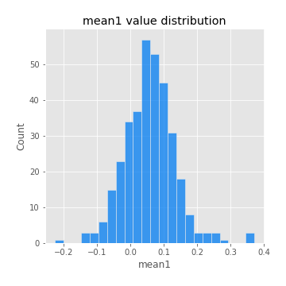
## Feature : mean2
- **Feature type** : continous
- **Missing** : 0.0%
- **Unique** : 347
- **Count** :347.0
- **Mean** :0.07718491368702088
- **Std** :0.09189256983360418
- **Min** :-0.24205418062825398
- **25%th Percentile** : 0.022833767826194597
- **50%th Percentile** : 0.07838090715836227
- **75%th Percentile** : 0.12718891594730097
- **Max** :0.37616608147096464

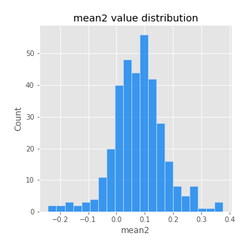
## Feature : sd1
- **Feature type** : continous
- **Missing** : 0.0%
- **Unique** : 347
- **Count** :347.0
- **Mean** :1.8687187320900387
- **Std** :0.7375269072531204
- **Min** :0.7470080772831957
- **25%th Percentile** : 1.6236185958738418
- **50%th Percentile** : 1.8083016164686496
- **75%th Percentile** : 1.8762611650609533
- **Max** :9.236766377527575

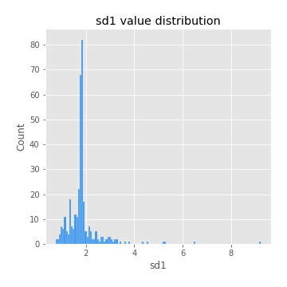
## Feature : sd2
- **Feature type** : continous
- **Missing** : 0.0%
- **Unique** : 347
- **Count** :347.0
- **Mean** :1.8284034862783272
- **Std** :0.7727532189312311
- **Min** :0.8592887433004143
- **25%th Percentile** : 1.5737421899082285
- **50%th Percentile** : 1.6517507365467592
- **75%th Percentile** : 1.7334232920382897
- **Max** :6.737618636746393

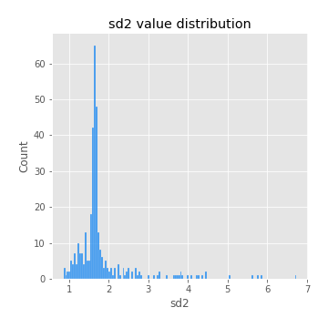
## Feature : skewness1
- **Feature type** : continous
- **Missing** : 0.0%
- **Unique** : 347
- **Count** :347.0
- **Mean** :-0.10332051839544024
- **Std** :0.572435947188243
- **Min** :-3.530116233761814
- **25%th Percentile** : -0.19091602200991012
- **50%th Percentile** : -0.03841364122291741
- **75%th Percentile** : 0.07847301359862527
- **Max** :2.224942816365292

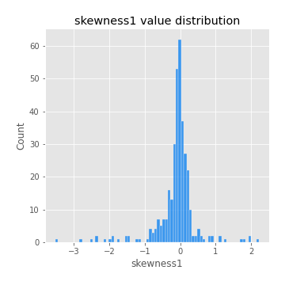
## Feature : skewness2
- **Feature type** : continous
- **Missing** : 0.0%
- **Unique** : 347
- **Count** :347.0
- **Mean** :-0.0900951524211666
- **Std** :0.5732286462323875
- **Min** :-2.5169062744473636
- **25%th Percentile** : -0.215216132304621
- **50%th Percentile** : -0.040448019034576725
- **75%th Percentile** : 0.10129107444199226
- **Max** :2.2606839051517187

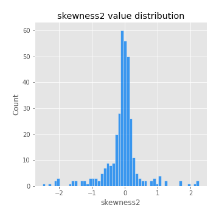
## Feature : kurtosis1
- **Feature type** : continous
- **Missing** : 0.0%
- **Unique** : 347
- **Count** :347.0
- **Mean** :3.2951593980805574
- **Std** :6.014451824341955
- **Min** :-0.4778319934244637
- **25%th Percentile** : -0.0008110091300053135
- **50%th Percentile** : 0.8951508960829169
- **75%th Percentile** : 3.9672030656784054
- **Max** :36.91113889081053

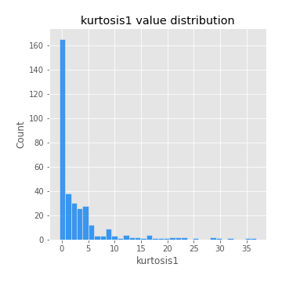
## Feature : kurtosis2
- **Feature type** : continous
- **Missing** : 0.0%
- **Unique** : 347
- **Count** :347.0
- **Mean** :3.4663152286530106
- **Std** :5.827355081060585
- **Min** :-0.5578317980918768
- **25%th Percentile** : 0.00369128893876991
- **50%th Percentile** : 1.0180535884625033
- **75%th Percentile** : 4.3840343020263415
- **Max** :36.023880269969645

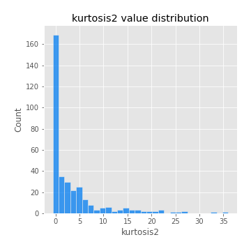
## Feature : return_autocorrelation_1_lag1
- **Feature type** : continous
- **Missing** : 0.0%
- **Unique** : 347
- **Count** :347.0
- **Mean** :-0.010309838969525583
- **Std** :0.05908543754556871
- **Min** :-0.20673896439036124
- **25%th Percentile** : -0.04163922937080389
- **50%th Percentile** : -0.0038203955790839317
- **75%th Percentile** : 0.027486387425191064
- **Max** :0.16036161621571132

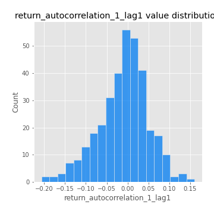
## Feature : return_autocorrelation_1_lag2
- **Feature type** : continous
- **Missing** : 0.0%
- **Unique** : 347
- **Count** :347.0
- **Mean** :-0.003664546187570304
- **Std** :0.05169811510290833
- **Min** :-0.13309283796645122
- **25%th Percentile** : -0.03638224514991953
- **50%th Percentile** : -0.0031257793901211016
- **75%th Percentile** : 0.02990432503281967
- **Max** :0.13553587149024285

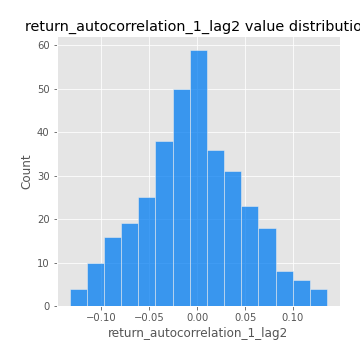
## Feature : return_autocorrelation_1_lag3
- **Feature type** : continous
- **Missing** : 0.0%
- **Unique** : 347
- **Count** :347.0
- **Mean** :-0.002244266914873222
- **Std** :0.04911969271327772
- **Min** :-0.1940836867390813
- **25%th Percentile** : -0.03171287588509719
- **50%th Percentile** : -0.003363973867245875
- **75%th Percentile** : 0.030345099219148068
- **Max** :0.11028973727744579

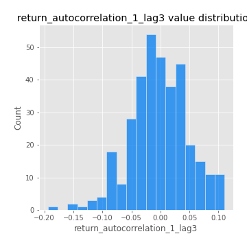
## Feature : return_autocorrelation_2_lag1
- **Feature type** : continous
- **Missing** : 0.0%
- **Unique** : 347
- **Count** :347.0
- **Mean** :-0.009455750978451057
- **Std** :0.0587401921760173
- **Min** :-0.25075531010123286
- **25%th Percentile** : -0.03942712745488897
- **50%th Percentile** : -0.0040379535451759725
- **75%th Percentile** : 0.030623997132484038
- **Max** :0.16349871797309318

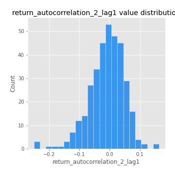
## Feature : return_autocorrelation_2_lag2
- **Feature type** : continous
- **Missing** : 0.0%
- **Unique** : 347
- **Count** :347.0
- **Mean** :-0.0032879368168544794
- **Std** :0.05122523794077975
- **Min** :-0.15323211089747296
- **25%th Percentile** : -0.03900632542240111
- **50%th Percentile** : -0.005244479046351908
- **75%th Percentile** : 0.031349500106429416
- **Max** :0.1735398560230086

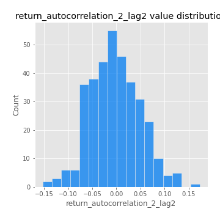
## Feature : return_autocorrelation_2_lag3
- **Feature type** : continous
- **Missing** : 0.0%
- **Unique** : 347
- **Count** :347.0
- **Mean** :-0.003671768612313467
- **Std** :0.048107050905318124
- **Min** :-0.14200107169559698
- **25%th Percentile** : -0.03582640693099927
- **50%th Percentile** : -0.004182172858400258
- **75%th Percentile** : 0.027849659521178505
- **Max** :0.1419999376914021

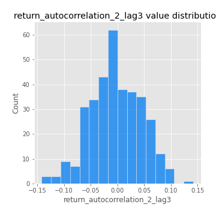
## Feature : return_correlation_ts1_lag_0
- **Feature type** : continous
- **Missing** : 0.0%
- **Unique** : 347
- **Count** :347.0
- **Mean** :0.3122752930777663
- **Std** :0.10968467816277994
- **Min** :-0.027089510445801036
- **25%th Percentile** : 0.26082795295104505
- **50%th Percentile** : 0.3042022254301422
- **75%th Percentile** : 0.3570695321402913
- **Max** :0.6949986865664105

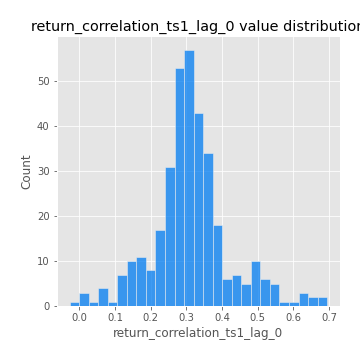
## Feature : return_correlation_ts1_lag_1
- **Feature type** : continous
- **Missing** : 0.0%
- **Unique** : 347
- **Count** :347.0
- **Mean** :-0.0037727570361674
- **Std** :0.05281537039148009
- **Min** :-0.15776193292681923
- **25%th Percentile** : -0.03615563412193527
- **50%th Percentile** : -0.0023876450910519285
- **75%th Percentile** : 0.03499741204239416
- **Max** :0.15499424718508623

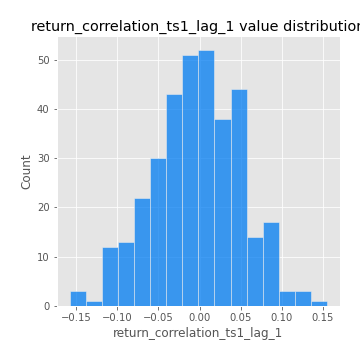
## Feature : return_correlation_ts1_lag_2
- **Feature type** : continous
- **Missing** : 0.0%
- **Unique** : 347
- **Count** :347.0
- **Mean** :0.0013284063965380277
- **Std** :0.047891855753417985
- **Min** :-0.12864410180561703
- **25%th Percentile** : -0.03208121852812228
- **50%th Percentile** : 0.004383345295197112
- **75%th Percentile** : 0.036764567760058535
- **Max** :0.12144625462142164

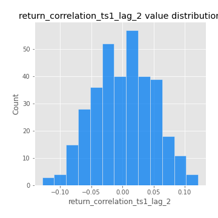
## Feature : return_correlation_ts1_lag_3
- **Feature type** : continous
- **Missing** : 0.0%
- **Unique** : 347
- **Count** :347.0
- **Mean** :-0.0015792883049055631
- **Std** :0.05206625758295007
- **Min** :-0.12979647620776422
- **25%th Percentile** : -0.03893519239134055
- **50%th Percentile** : -0.003697091126349173
- **75%th Percentile** : 0.03459667249614573
- **Max** :0.1636773216468148

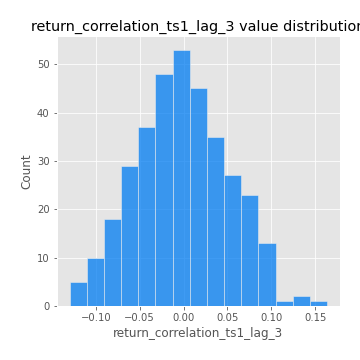
## Feature : return_correlation_ts2_lag_1
- **Feature type** : continous
- **Missing** : 0.0%
- **Unique** : 347
- **Count** :347.0
- **Mean** :-0.0026315295711685335
- **Std** :0.054770005563276714
- **Min** :-0.2081139431093261
- **25%th Percentile** : -0.034071114181776795
- **50%th Percentile** : -0.002148506714879542
- **75%th Percentile** : 0.03236165726480711
- **Max** :0.17208763791364762

## Feature : return_correlation_ts2_lag_2
- **Feature type** : continous
- **Missing** : 0.0%
- **Unique** : 347
- **Count** :347.0
- **Mean** :0.002358190351862873
- **Std** :0.05131103744261201
- **Min** :-0.23751835475804678
- **25%th Percentile** : -0.030360229469091872
- **50%th Percentile** : 0.0022770941881023487
- **75%th Percentile** : 0.03833894504520394
- **Max** :0.15388933426238696

## Feature : return_correlation_ts2_lag_3
- **Feature type** : continous
- **Missing** : 0.0%
- **Unique** : 347
- **Count** :347.0
- **Mean** :0.0021746987708467645
- **Std** :0.05098736745350771
- **Min** :-0.16212823605110202
- **25%th Percentile** : -0.026364586087782756
- **50%th Percentile** : -0.000737130669953019
- **75%th Percentile** : 0.03821214994963706
- **Max** :0.12578577770423086

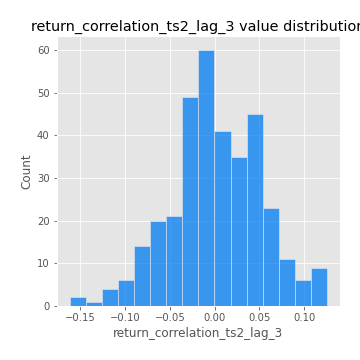
## Feature : sqreturn_autocorrelation_ts1_lag1
- **Feature type** : continous
- **Missing** : 0.0%
- **Unique** : 347
- **Count** :347.0
- **Mean** :0.05484207231624647
- **Std** :0.09250384136471507
- **Min** :-0.11555097242784294
- **25%th Percentile** : -0.005709956456953288
- **50%th Percentile** : 0.034435124607755566
- **75%th Percentile** : 0.08874036423615442
- **Max** :0.49414293176447355

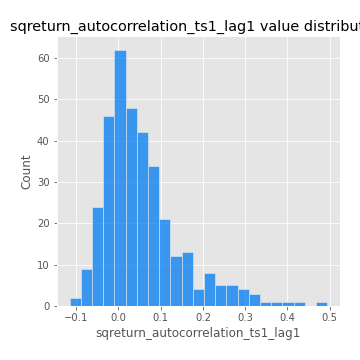
## Feature : sqreturn_autocorrelation_ts1_lag2
- **Feature type** : continous
- **Missing** : 0.0%
- **Unique** : 347
- **Count** :347.0
- **Mean** :0.04719894567774016
- **Std** :0.08778903549169925
- **Min** :-0.125331876894558
- **25%th Percentile** : -0.007822131149358402
- **50%th Percentile** : 0.02299773418208078
- **75%th Percentile** : 0.07323189063454116
- **Max** :0.540735851444759

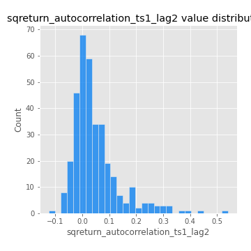
## Feature : sqreturn_autocorrelation_ts1_lag3
- **Feature type** : continous
- **Missing** : 0.0%
- **Unique** : 347
- **Count** :347.0
- **Mean** :0.033792666809750585
- **Std** :0.08040306061098423
- **Min** :-0.09265239090751343
- **25%th Percentile** : -0.018073953880004115
- **50%th Percentile** : 0.015052897394360675
- **75%th Percentile** : 0.06398059220322794
- **Max** :0.44755937369538146

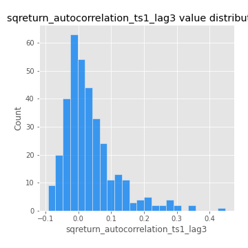
## Feature : sqreturn_autocorrelation_ts2_lag1
- **Feature type** : continous
- **Missing** : 0.0%
- **Unique** : 347
- **Count** :347.0
- **Mean** :0.047451121870080985
- **Std** :0.08697087299766801
- **Min** :-0.10298086616362957
- **25%th Percentile** : -0.0075009176185885425
- **50%th Percentile** : 0.02704786661907116
- **75%th Percentile** : 0.08343447905876857
- **Max** :0.510085647437958

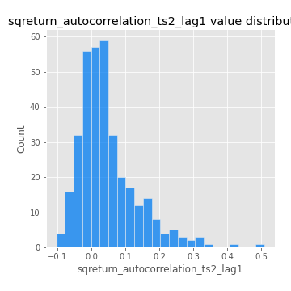
## Feature : sqreturn_autocorrelation_ts2_lag2
- **Feature type** : continous
- **Missing** : 0.0%
- **Unique** : 347
- **Count** :347.0
- **Mean** :0.039290817635182766
- **Std** :0.08888277238662527
- **Min** :-0.10468299276537926
- **25%th Percentile** : -0.012612674141478802
- **50%th Percentile** : 0.016923177930317234
- **75%th Percentile** : 0.057033099923109336
- **Max** :0.5373432415582473

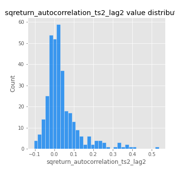
## Feature : sqreturn_autocorrelation_ts2_lag3
- **Feature type** : continous
- **Missing** : 0.0%
- **Unique** : 347
- **Count** :347.0
- **Mean** :0.027622427555623816
- **Std** :0.07088901003983154
- **Min** :-0.08536074132862692
- **25%th Percentile** : -0.015314713312194243
- **50%th Percentile** : 0.01369761785042116
- **75%th Percentile** : 0.05368772213306185
- **Max** :0.30256115637327263

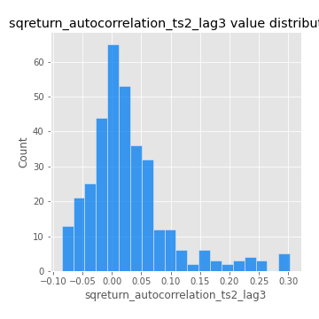
## Feature : sqreturn_correlation_ts1_lag_0
- **Feature type** : continous
- **Missing** : 0.0%
- **Unique** : 347
- **Count** :347.0
- **Mean** :0.3122752930777663
- **Std** :0.10968467816277994
- **Min** :-0.027089510445801036
- **25%th Percentile** : 0.26082795295104505
- **50%th Percentile** : 0.3042022254301422
- **75%th Percentile** : 0.3570695321402913
- **Max** :0.6949986865664105

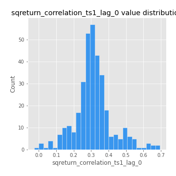
## Feature : sqreturn_correlation_ts1_lag_1
- **Feature type** : continous
- **Missing** : 0.0%
- **Unique** : 347
- **Count** :347.0
- **Mean** :-0.0037727570361674
- **Std** :0.05281537039148009
- **Min** :-0.15776193292681923
- **25%th Percentile** : -0.03615563412193527
- **50%th Percentile** : -0.0023876450910519285
- **75%th Percentile** : 0.03499741204239416
- **Max** :0.15499424718508623

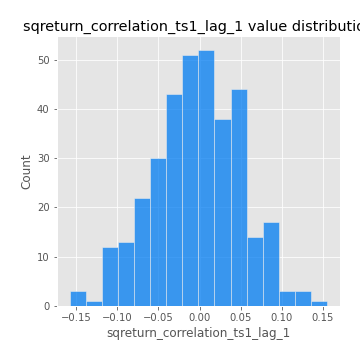
## Feature : sqreturn_correlation_ts1_lag_2
- **Feature type** : continous
- **Missing** : 0.0%
- **Unique** : 347
- **Count** :347.0
- **Mean** :0.0013284063965380277
- **Std** :0.047891855753417985
- **Min** :-0.12864410180561703
- **25%th Percentile** : -0.03208121852812228
- **50%th Percentile** : 0.004383345295197112
- **75%th Percentile** : 0.036764567760058535
- **Max** :0.12144625462142164

## Feature : sqreturn_correlation_ts1_lag_3
- **Feature type** : continous
- **Missing** : 0.0%
- **Unique** : 347
- **Count** :347.0
- **Mean** :-0.0015792883049055631
- **Std** :0.05206625758295007
- **Min** :-0.12979647620776422
- **25%th Percentile** : -0.03893519239134055
- **50%th Percentile** : -0.003697091126349173
- **75%th Percentile** : 0.03459667249614573
- **Max** :0.1636773216468148

## Feature : sqreturn_correlation_ts2_lag_1
- **Feature type** : continous
- **Missing** : 0.0%
- **Unique** : 347
- **Count** :347.0
- **Mean** :-0.0026315295711685335
- **Std** :0.054770005563276714
- **Min** :-0.2081139431093261
- **25%th Percentile** : -0.034071114181776795
- **50%th Percentile** : -0.002148506714879542
- **75%th Percentile** : 0.03236165726480711
- **Max** :0.17208763791364762

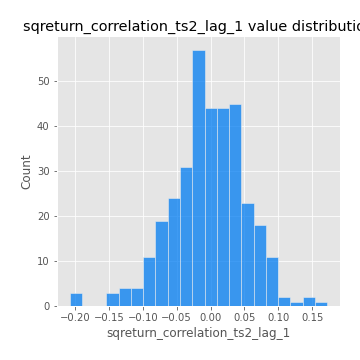
## Feature : sqreturn_correlation_ts2_lag_2
- **Feature type** : continous
- **Missing** : 0.0%
- **Unique** : 347
- **Count** :347.0
- **Mean** :0.002358190351862873
- **Std** :0.05131103744261201
- **Min** :-0.23751835475804678
- **25%th Percentile** : -0.030360229469091872
- **50%th Percentile** : 0.0022770941881023487
- **75%th Percentile** : 0.03833894504520394
- **Max** :0.15388933426238696

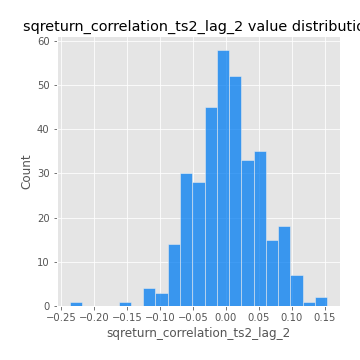
## Feature : sqreturn_correlation_ts2_lag_3
- **Feature type** : continous
- **Missing** : 0.0%
- **Unique** : 347
- **Count** :347.0
- **Mean** :0.0021746987708467645
- **Std** :0.05098736745350771
- **Min** :-0.16212823605110202
- **25%th Percentile** : -0.026364586087782756
- **50%th Percentile** : -0.000737130669953019
- **75%th Percentile** : 0.03821214994963706
- **Max** :0.12578577770423086

## Feature : price2_granger_cause_price1
- **Feature type** : continous
- **Missing** : 0.0%
- **Unique** : 347
- **Count** :347.0
- **Mean** :0.2917769921419985
- **Std** :0.2997054340797995
- **Min** :1.0804850288419687e-06
- **25%th Percentile** : 0.024729590496559213
- **50%th Percentile** : 0.18734676649679682
- **75%th Percentile** : 0.49288916197351035
- **Max** :0.9885712803689185

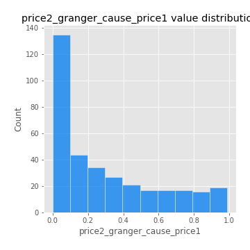
## Feature : price1_granger_cause_price2
- **Feature type** : continous
- **Missing** : 0.0%
- **Unique** : 347
- **Count** :347.0
- **Mean** :0.2976573218636134
- **Std** :0.28760052029738
- **Min** :6.791769791935148e-06
- **25%th Percentile** : 0.04237291367768381
- **50%th Percentile** : 0.21618554854361255
- **75%th Percentile** : 0.49204011190386476
- **Max** :0.9951398266867577

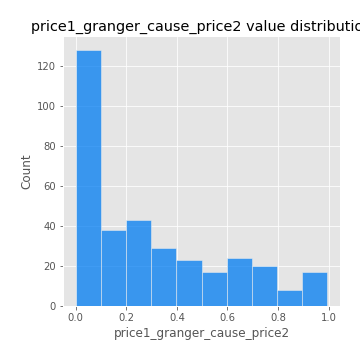

[<< Go back](../README.md)
