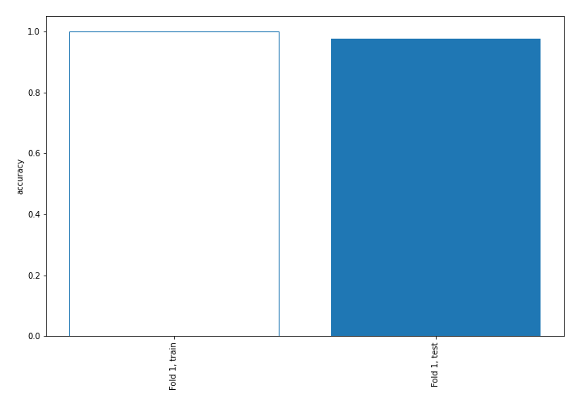
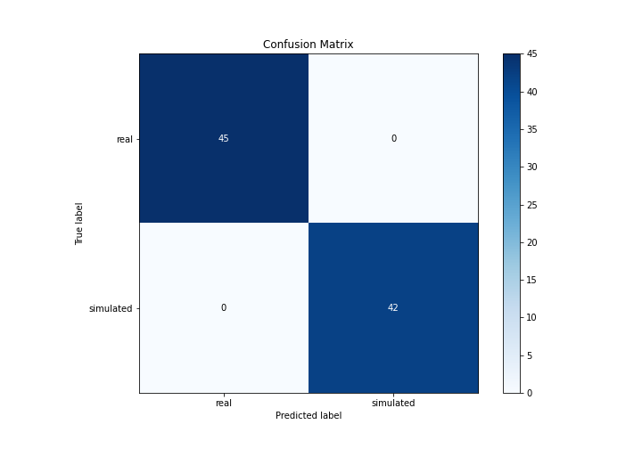

# Summary of 3_Linear

[<< Go back](../README.md)

## Logistic Regression (Linear)
- **n_jobs**: -1
- **explain_level**: 2

## Validation
 - **validation_type**: split
 - **train_ratio**: 0.75
 - **shuffle**: True
 - **stratify**: True

## Optimized metric
accuracy

## Training time

3.4 seconds

## Metric details
|           |     score |     threshold |
|:----------|----------:|--------------:|
| logloss   | 0.0487517 | nan           |
| auc       | 1         | nan           |
| f1        | 1         |   0.139007    |
| accuracy  | 1         |   0.139007    |
| precision | 1         |   0.516403    |
| recall    | 1         |   2.53877e-08 |
| mcc       | 1         |   0.139007    |

## Confusion matrix (at threshold=0.139007)
|                      |   Predicted as real |   Predicted as simulated |
|:---------------------|--------------------:|-------------------------:|
| Labeled as real      |                  45 |                        0 |
| Labeled as simulated |                   0 |                       42 |

## Learning curves

## Coefficients
| feature                           |   Learner_1 |
|:----------------------------------|------------:|
| sqreturn_autocorrelation_ts2_lag3 |   1.06269   |
| sqreturn_autocorrelation_ts2_lag2 |   1.05      |
| return_autocorrelation_2_lag1     |   1.01758   |
| sqreturn_autocorrelation_ts2_lag1 |   0.987125  |
| return_autocorrelation_2_lag3     |   0.963769  |
| return_autocorrelation_2_lag2     |   0.960869  |
| sqreturn_correlation_ts1_lag_1    |   0.352243  |
| return_correlation_ts1_lag_1      |   0.352243  |
| sqreturn_correlation_ts2_lag_1    |   0.305696  |
| return_correlation_ts2_lag_1      |   0.305696  |
| sqreturn_correlation_ts2_lag_3    |   0.276475  |
| return_correlation_ts2_lag_3      |   0.276475  |
| sqreturn_correlation_ts1_lag_2    |   0.27264   |
| return_correlation_ts1_lag_2      |   0.27264   |
| return_correlation_ts1_lag_3      |   0.267945  |
| sqreturn_correlation_ts1_lag_3    |   0.267945  |
| return_correlation_ts2_lag_2      |   0.221345  |
| sqreturn_correlation_ts2_lag_2    |   0.221345  |
| return_autocorrelation_1_lag1     |   0.202687  |
| return_autocorrelation_1_lag2     |   0.160129  |
| skewness1                         |   0.129839  |
| return_autocorrelation_1_lag3     |   0.119946  |
| return_correlation_ts1_lag_0      |   0.080539  |
| sqreturn_correlation_ts1_lag_0    |   0.080539  |
| sqreturn_autocorrelation_ts1_lag3 |  -0.0866435 |
| sqreturn_autocorrelation_ts1_lag2 |  -0.14621   |
| sqreturn_autocorrelation_ts1_lag1 |  -0.195287  |
| sd2                               |  -0.377198  |
| price2_granger_cause_price1       |  -0.464318  |
| price1_granger_cause_price2       |  -0.563338  |
| sd1                               |  -0.680126  |
| kurtosis2                         |  -0.849933  |
| mean2                             |  -0.938639  |
| skewness2                         |  -1.0408    |
| kurtosis1                         |  -1.11317   |
| mean1                             |  -1.26344   |
| intercept                         |  -3.1223    |

## Permutation-based Importance

## Confusion Matrix

## Normalized Confusion Matrix

## ROC Curve

## Kolmogorov-Smirnov Statistic

## Precision-Recall Curve

## Calibration Curve

## Cumulative Gains Curve

## Lift Curve

## SHAP Importance

## SHAP Dependence plots

### Dependence (Fold 1)

## SHAP Decision plots

### Top-10 Worst decisions for class 0 (Fold 1)

### Top-10 Best decisions for class 0 (Fold 1)

### Top-10 Worst decisions for class 1 (Fold 1)

### Top-10 Best decisions for class 1 (Fold 1)

[<< Go back](../README.md)
