# Exploratory Data Analysis

[<< Go back](../README.md)
## Feature : target
- **Feature type** : categorical
- **Missing** : 0.0%
- **Unique** : 2
- **Count** :347
- **Unique** :2
- **Top** :simulated
- **Freq** :175

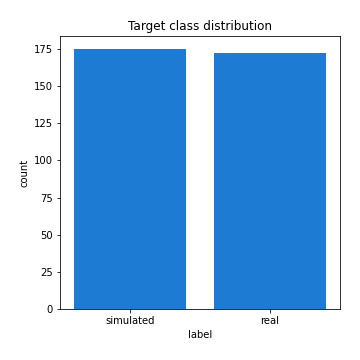
## Feature : mean1
- **Feature type** : continous
- **Missing** : 0.0%
- **Unique** : 347
- **Count** :347.0
- **Mean** :-0.2400792910805217
- **Std** :0.31269131461336935
- **Min** :-0.9879410617164108
- **25%th Percentile** : -0.5285657866703417
- **50%th Percentile** : -0.168172461179569
- **75%th Percentile** : 0.056249217410686
- **Max** :0.37175100008111034

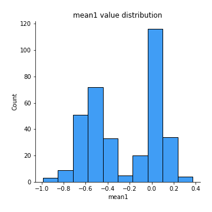
## Feature : mean2
- **Feature type** : continous
- **Missing** : 0.0%
- **Unique** : 347
- **Count** :347.0
- **Mean** :-0.25109707198955966
- **Std** :0.35198805969894054
- **Min** :-1.270736214642525
- **25%th Percentile** : -0.5614056326282284
- **50%th Percentile** : -0.20022088889057277
- **75%th Percentile** : 0.0633292015740678
- **Max** :0.5912911220991229

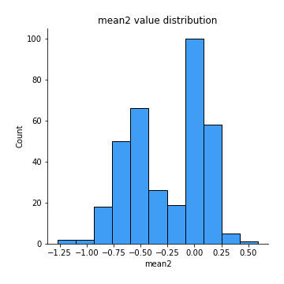
## Feature : sd1
- **Feature type** : continous
- **Missing** : 0.0%
- **Unique** : 347
- **Count** :347.0
- **Mean** :1.6129009865643336
- **Std** :0.8151091138853392
- **Min** :0.8382061051466024
- **25%th Percentile** : 1.240743784898522
- **50%th Percentile** : 1.2898994819071414
- **75%th Percentile** : 1.6902017658202082
- **Max** :9.236766377527575

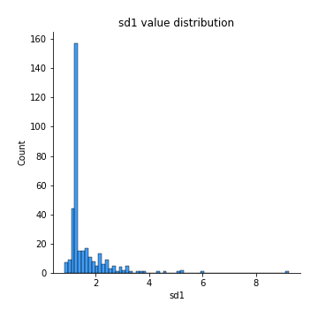
## Feature : sd2
- **Feature type** : continous
- **Missing** : 0.0%
- **Unique** : 347
- **Count** :347.0
- **Mean** :1.89884597680712
- **Std** :0.7456406071366785
- **Min** :0.8455946193085045
- **25%th Percentile** : 1.4475735044415012
- **50%th Percentile** : 1.7690549378630431
- **75%th Percentile** : 2.097569577343857
- **Max** :6.737618636746393

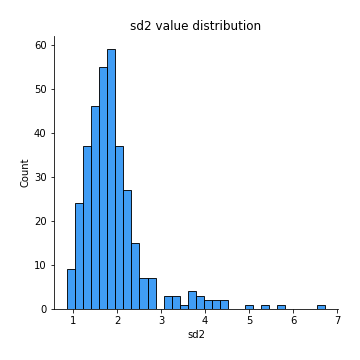
## Feature : skewness1
- **Feature type** : continous
- **Missing** : 0.0%
- **Unique** : 347
- **Count** :347.0
- **Mean** :-0.0757137222972413
- **Std** :0.5325083746142694
- **Min** :-2.5812453059760836
- **25%th Percentile** : -0.17595881248177003
- **50%th Percentile** : -0.027291809684819975
- **75%th Percentile** : 0.09816184827323696
- **Max** :2.5845963767725557

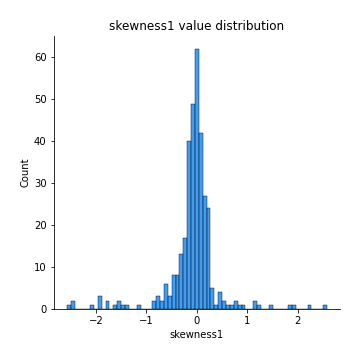
## Feature : skewness2
- **Feature type** : continous
- **Missing** : 0.0%
- **Unique** : 347
- **Count** :347.0
- **Mean** :-0.8694271324266714
- **Std** :0.9894855684375845
- **Min** :-8.801502855292393
- **25%th Percentile** : -1.5916147424799392
- **50%th Percentile** : -0.9636898102767512
- **75%th Percentile** : -0.22619501368185102
- **Max** :2.2606839051517187

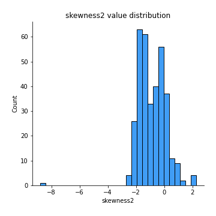
## Feature : kurtosis1
- **Feature type** : continous
- **Missing** : 0.0%
- **Unique** : 347
- **Count** :347.0
- **Mean** :2.971278671112974
- **Std** :5.416393187048692
- **Min** :-0.5742939522784116
- **25%th Percentile** : -0.022123969712913194
- **50%th Percentile** : 0.4774006033063416
- **75%th Percentile** : 3.746268461128576
- **Max** :35.56636016047202

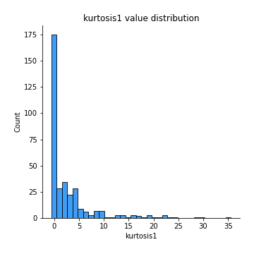
## Feature : kurtosis2
- **Feature type** : continous
- **Missing** : 0.0%
- **Unique** : 347
- **Count** :347.0
- **Mean** :5.119855777838196
- **Std** :8.85115016981844
- **Min** :0.1684962933611045
- **25%th Percentile** : 2.2914829841954996
- **50%th Percentile** : 3.581691327732822
- **75%th Percentile** : 4.944994671387573
- **Max** :143.10871011533666

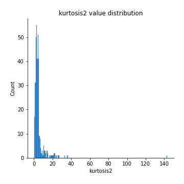
## Feature : return_autocorrelation_1_lag1
- **Feature type** : continous
- **Missing** : 0.0%
- **Unique** : 347
- **Count** :347.0
- **Mean** :0.01902993467119649
- **Std** :0.0737127376769341
- **Min** :-0.2135576224968752
- **25%th Percentile** : -0.024674623949140974
- **50%th Percentile** : 0.02247059035266658
- **75%th Percentile** : 0.06709806113900013
- **Max** :0.22925454807645065

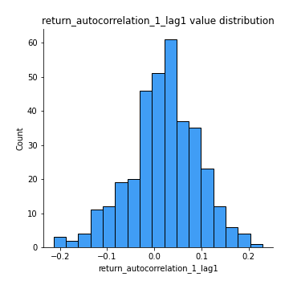
## Feature : return_autocorrelation_1_lag2
- **Feature type** : continous
- **Missing** : 0.0%
- **Unique** : 347
- **Count** :347.0
- **Mean** :0.023386835866565345
- **Std** :0.061690146284895206
- **Min** :-0.12172858720259
- **25%th Percentile** : -0.016674598749719
- **50%th Percentile** : 0.02347672751572899
- **75%th Percentile** : 0.06871337028230004
- **Max** :0.23616653178065505

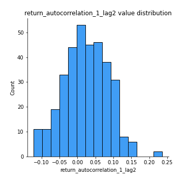
## Feature : return_autocorrelation_1_lag3
- **Feature type** : continous
- **Missing** : 0.0%
- **Unique** : 347
- **Count** :347.0
- **Mean** :0.027733974897924365
- **Std** :0.06328145477037553
- **Min** :-0.1940836867390813
- **25%th Percentile** : -0.013079098626781116
- **50%th Percentile** : 0.03079716265078791
- **75%th Percentile** : 0.07068912979172814
- **Max** :0.20517299816234222

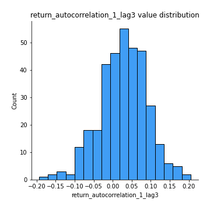
## Feature : return_autocorrelation_2_lag1
- **Feature type** : continous
- **Missing** : 0.0%
- **Unique** : 347
- **Count** :347.0
- **Mean** :0.29937621447644186
- **Std** :0.342693403500588
- **Min** :-0.25075531010123286
- **25%th Percentile** : -0.020560949899106624
- **50%th Percentile** : 0.16349871797309318
- **75%th Percentile** : 0.6512139836527592
- **Max** :0.8985104546419959

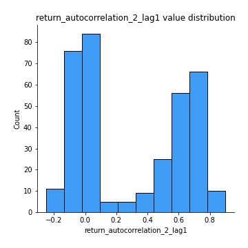
## Feature : return_autocorrelation_2_lag2
- **Feature type** : continous
- **Missing** : 0.0%
- **Unique** : 347
- **Count** :347.0
- **Mean** :0.307633856357778
- **Std** :0.33169087181920676
- **Min** :-0.15323211089747296
- **25%th Percentile** : -0.011753787292693694
- **50%th Percentile** : 0.1735398560230086
- **75%th Percentile** : 0.6417268172898734
- **Max** :0.8908004863305832

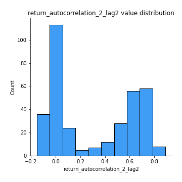
## Feature : return_autocorrelation_2_lag3
- **Feature type** : continous
- **Missing** : 0.0%
- **Unique** : 347
- **Count** :347.0
- **Mean** :0.3023588305973909
- **Std** :0.3290972495151864
- **Min** :-0.1344316177078651
- **25%th Percentile** : -0.010398664715047511
- **50%th Percentile** : 0.1528555731474462
- **75%th Percentile** : 0.6395330313065561
- **Max** :0.8900351102995179

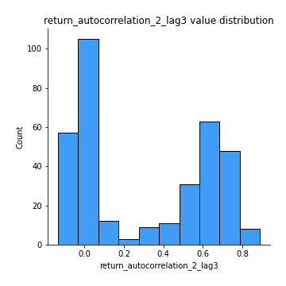
## Feature : return_correlation_ts1_lag_0
- **Feature type** : continous
- **Missing** : 0.0%
- **Unique** : 347
- **Count** :347.0
- **Mean** :0.32229605120921745
- **Std** :0.10908463631093944
- **Min** :0.005136598099876001
- **25%th Percentile** : 0.26854983804974897
- **50%th Percentile** : 0.32450929640185366
- **75%th Percentile** : 0.3725822645022181
- **Max** :0.7041861626832071

## Feature : return_correlation_ts1_lag_1
- **Feature type** : continous
- **Missing** : 0.0%
- **Unique** : 347
- **Count** :347.0
- **Mean** :0.0657344989775827
- **Std** :0.0991504269461805
- **Min** :-0.16985510949917193
- **25%th Percentile** : -0.007797594680113104
- **50%th Percentile** : 0.05826225071620892
- **75%th Percentile** : 0.14511260516695462
- **Max** :0.2989748379022218

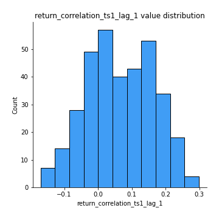
## Feature : return_correlation_ts1_lag_2
- **Feature type** : continous
- **Missing** : 0.0%
- **Unique** : 347
- **Count** :347.0
- **Mean** :0.0710255459585392
- **Std** :0.09346238092987813
- **Min** :-0.21653581047581763
- **25%th Percentile** : -0.007034388280091981
- **50%th Percentile** : 0.0770466904194569
- **75%th Percentile** : 0.14831392121583317
- **Max** :0.3195453307611928

## Feature : return_correlation_ts1_lag_3
- **Feature type** : continous
- **Missing** : 0.0%
- **Unique** : 347
- **Count** :347.0
- **Mean** :0.06908568755850246
- **Std** :0.09705209601063812
- **Min** :-0.15605674702748062
- **25%th Percentile** : -0.008260071945100431
- **50%th Percentile** : 0.076331923851684
- **75%th Percentile** : 0.14913256438344064
- **Max** :0.3193040718139603

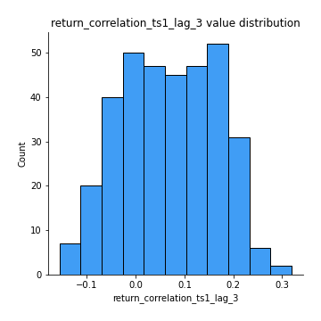
## Feature : return_correlation_ts2_lag_1
- **Feature type** : continous
- **Missing** : 0.0%
- **Unique** : 347
- **Count** :347.0
- **Mean** :0.062167771025026596
- **Std** :0.09939292302022314
- **Min** :-0.2081139431093261
- **25%th Percentile** : -0.01493098189403046
- **50%th Percentile** : 0.06342925132952129
- **75%th Percentile** : 0.14229767363925622
- **Max** :0.2893491631963184

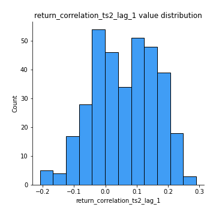
## Feature : return_correlation_ts2_lag_2
- **Feature type** : continous
- **Missing** : 0.0%
- **Unique** : 347
- **Count** :347.0
- **Mean** :0.0689489274485652
- **Std** :0.09179219924336139
- **Min** :-0.23751835475804678
- **25%th Percentile** : -0.0022512417195271195
- **50%th Percentile** : 0.06737122932429367
- **75%th Percentile** : 0.14527368356241138
- **Max** :0.2763972306232334

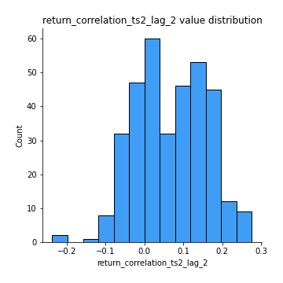
## Feature : return_correlation_ts2_lag_3
- **Feature type** : continous
- **Missing** : 0.0%
- **Unique** : 347
- **Count** :347.0
- **Mean** :0.06634014842694176
- **Std** :0.0942059220150193
- **Min** :-0.18160798044786475
- **25%th Percentile** : -0.005974205230168661
- **50%th Percentile** : 0.06629597773069457
- **75%th Percentile** : 0.1397243773415351
- **Max** :0.2797151399045794

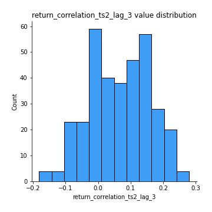
## Feature : sqreturn_autocorrelation_ts1_lag1
- **Feature type** : continous
- **Missing** : 0.0%
- **Unique** : 347
- **Count** :347.0
- **Mean** :0.06461377155186544
- **Std** :0.09083115818831107
- **Min** :-0.109822899527318
- **25%th Percentile** : 0.007462684566466043
- **50%th Percentile** : 0.044667372656317296
- **75%th Percentile** : 0.09770397260389588
- **Max** :0.49414293176447355

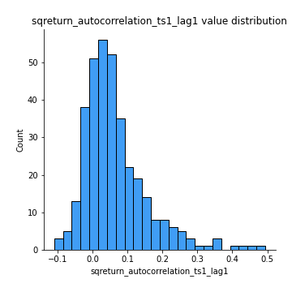
## Feature : sqreturn_autocorrelation_ts1_lag2
- **Feature type** : continous
- **Missing** : 0.0%
- **Unique** : 347
- **Count** :347.0
- **Mean** :0.05380166427053756
- **Std** :0.08771907463003632
- **Min** :-0.09246752569130148
- **25%th Percentile** : -3.3075453528622715e-05
- **50%th Percentile** : 0.03438685400467464
- **75%th Percentile** : 0.07678756743683285
- **Max** :0.4522162366773919

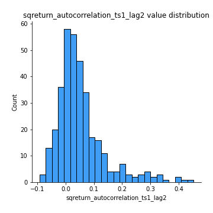
## Feature : sqreturn_autocorrelation_ts1_lag3
- **Feature type** : continous
- **Missing** : 0.0%
- **Unique** : 347
- **Count** :347.0
- **Mean** :0.0490522106797295
- **Std** :0.07958848566491963
- **Min** :-0.10147379308807908
- **25%th Percentile** : -0.0029275587244673405
- **50%th Percentile** : 0.032672333461034375
- **75%th Percentile** : 0.07699284752168568
- **Max** :0.44755937369538146

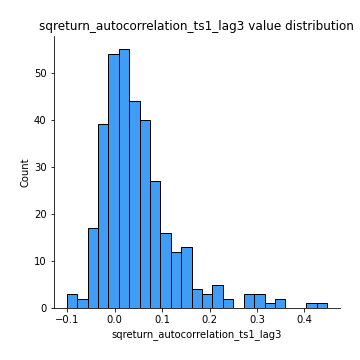
## Feature : sqreturn_autocorrelation_ts2_lag1
- **Feature type** : continous
- **Missing** : 0.0%
- **Unique** : 347
- **Count** :347.0
- **Mean** :0.4475521822368619
- **Std** :0.3686506690460024
- **Min** :-0.08520586663750691
- **25%th Percentile** : 0.07464678766495364
- **50%th Percentile** : 0.32232813308842917
- **75%th Percentile** : 0.8304220206787156
- **Max** :0.9688336671363889

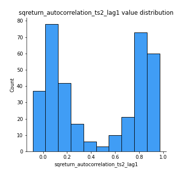
## Feature : sqreturn_autocorrelation_ts2_lag2
- **Feature type** : continous
- **Missing** : 0.0%
- **Unique** : 347
- **Count** :347.0
- **Mean** :0.43707530688341906
- **Std** :0.3753289481349227
- **Min** :-0.058122802804236914
- **25%th Percentile** : 0.04374470691813551
- **50%th Percentile** : 0.3619190735159723
- **75%th Percentile** : 0.8231413588242862
- **Max** :0.9708815116990767

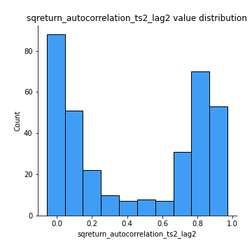
## Feature : sqreturn_autocorrelation_ts2_lag3
- **Feature type** : continous
- **Missing** : 0.0%
- **Unique** : 347
- **Count** :347.0
- **Mean** :0.4240266617472939
- **Std** :0.37940320315362086
- **Min** :-0.06065894750062144
- **25%th Percentile** : 0.042620870085027705
- **50%th Percentile** : 0.2982547942937359
- **75%th Percentile** : 0.8272816306008972
- **Max** :0.972239047883529

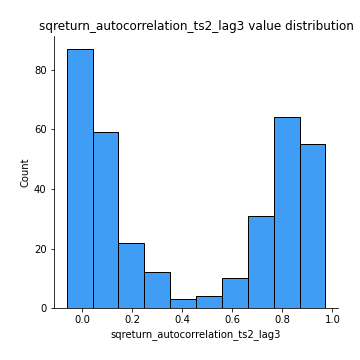
## Feature : sqreturn_correlation_ts1_lag_0
- **Feature type** : continous
- **Missing** : 0.0%
- **Unique** : 347
- **Count** :347.0
- **Mean** :0.32229605120921745
- **Std** :0.10908463631093944
- **Min** :0.005136598099876001
- **25%th Percentile** : 0.26854983804974897
- **50%th Percentile** : 0.32450929640185366
- **75%th Percentile** : 0.3725822645022181
- **Max** :0.7041861626832071

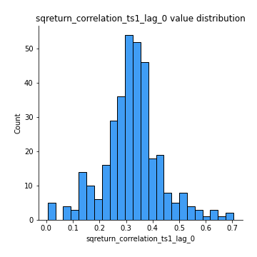
## Feature : sqreturn_correlation_ts1_lag_1
- **Feature type** : continous
- **Missing** : 0.0%
- **Unique** : 347
- **Count** :347.0
- **Mean** :0.0657344989775827
- **Std** :0.0991504269461805
- **Min** :-0.16985510949917193
- **25%th Percentile** : -0.007797594680113104
- **50%th Percentile** : 0.05826225071620892
- **75%th Percentile** : 0.14511260516695462
- **Max** :0.2989748379022218

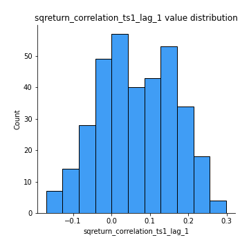
## Feature : sqreturn_correlation_ts1_lag_2
- **Feature type** : continous
- **Missing** : 0.0%
- **Unique** : 347
- **Count** :347.0
- **Mean** :0.0710255459585392
- **Std** :0.09346238092987813
- **Min** :-0.21653581047581763
- **25%th Percentile** : -0.007034388280091981
- **50%th Percentile** : 0.0770466904194569
- **75%th Percentile** : 0.14831392121583317
- **Max** :0.3195453307611928

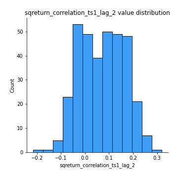
## Feature : sqreturn_correlation_ts1_lag_3
- **Feature type** : continous
- **Missing** : 0.0%
- **Unique** : 347
- **Count** :347.0
- **Mean** :0.06908568755850246
- **Std** :0.09705209601063812
- **Min** :-0.15605674702748062
- **25%th Percentile** : -0.008260071945100431
- **50%th Percentile** : 0.076331923851684
- **75%th Percentile** : 0.14913256438344064
- **Max** :0.3193040718139603

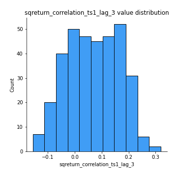
## Feature : sqreturn_correlation_ts2_lag_1
- **Feature type** : continous
- **Missing** : 0.0%
- **Unique** : 347
- **Count** :347.0
- **Mean** :0.062167771025026596
- **Std** :0.09939292302022314
- **Min** :-0.2081139431093261
- **25%th Percentile** : -0.01493098189403046
- **50%th Percentile** : 0.06342925132952129
- **75%th Percentile** : 0.14229767363925622
- **Max** :0.2893491631963184

## Feature : sqreturn_correlation_ts2_lag_2
- **Feature type** : continous
- **Missing** : 0.0%
- **Unique** : 347
- **Count** :347.0
- **Mean** :0.0689489274485652
- **Std** :0.09179219924336139
- **Min** :-0.23751835475804678
- **25%th Percentile** : -0.0022512417195271195
- **50%th Percentile** : 0.06737122932429367
- **75%th Percentile** : 0.14527368356241138
- **Max** :0.2763972306232334

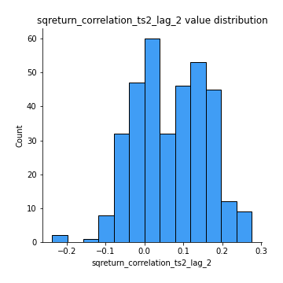
## Feature : sqreturn_correlation_ts2_lag_3
- **Feature type** : continous
- **Missing** : 0.0%
- **Unique** : 347
- **Count** :347.0
- **Mean** :0.06634014842694176
- **Std** :0.0942059220150193
- **Min** :-0.18160798044786475
- **25%th Percentile** : -0.005974205230168661
- **50%th Percentile** : 0.06629597773069457
- **75%th Percentile** : 0.1397243773415351
- **Max** :0.2797151399045794

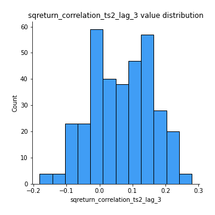
## Feature : price2_granger_cause_price1
- **Feature type** : continous
- **Missing** : 0.0%
- **Unique** : 347
- **Count** :347.0
- **Mean** :0.1744460517518084
- **Std** :0.2650267041259649
- **Min** :1.3204983082680953e-38
- **25%th Percentile** : 4.42548438367091e-07
- **50%th Percentile** : 0.01308589412976371
- **75%th Percentile** : 0.27417804556346564
- **Max** :0.9885712803689185

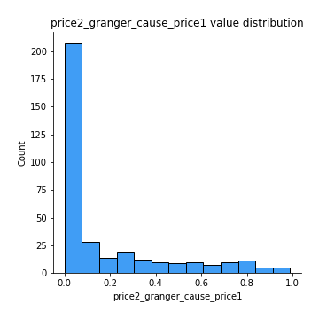
## Feature : price1_granger_cause_price2
- **Feature type** : continous
- **Missing** : 0.0%
- **Unique** : 347
- **Count** :347.0
- **Mean** :0.17095110438423425
- **Std** :0.25875603264925506
- **Min** :2.8485476124643996e-28
- **25%th Percentile** : 2.3568442663895186e-05
- **50%th Percentile** : 0.018118674230546323
- **75%th Percentile** : 0.2685671350450062
- **Max** :0.9677499172353743

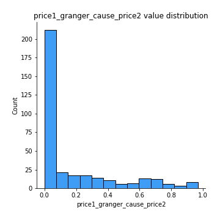

[<< Go back](../README.md)
