# Exploratory Data Analysis

[<< Go back](../README.md)
## Feature : target
- **Feature type** : categorical
- **Missing** : 0.0%
- **Unique** : 2
- **Count** :347
- **Unique** :2
- **Top** :real
- **Freq** :174

## Feature : mean1
- **Feature type** : continous
- **Missing** : 0.0%
- **Unique** : 347
- **Count** :347.0
- **Mean** :-0.23264859572217475
- **Std** :0.3161405296619541
- **Min** :-0.960975938035395
- **25%th Percentile** : -0.5219656873449826
- **50%th Percentile** : -0.15256913196305744
- **75%th Percentile** : 0.05800209500123443
- **Max** :0.37175100008111034

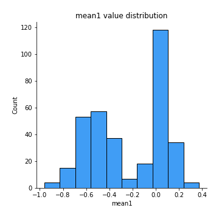
## Feature : mean2
- **Feature type** : continous
- **Missing** : 0.0%
- **Unique** : 347
- **Count** :347.0
- **Mean** :-0.2591126637592019
- **Std** :0.35088531842115234
- **Min** :-1.2602640322853562
- **25%th Percentile** : -0.5739213195742021
- **50%th Percentile** : -0.17442947090951988
- **75%th Percentile** : 0.05761700908004474
- **Max** :0.37616608147096464

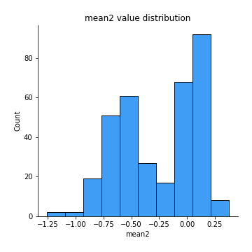
## Feature : sd1
- **Feature type** : continous
- **Missing** : 0.0%
- **Unique** : 347
- **Count** :347.0
- **Mean** :1.6117031996814646
- **Std** :0.8369748654496626
- **Min** :0.7470080772831957
- **25%th Percentile** : 1.230383202996347
- **50%th Percentile** : 1.2965918498634943
- **75%th Percentile** : 1.6902017658202082
- **Max** :9.236766377527575

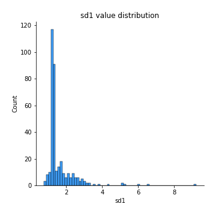
## Feature : sd2
- **Feature type** : continous
- **Missing** : 0.0%
- **Unique** : 347
- **Count** :347.0
- **Mean** :1.893496830099381
- **Std** :0.6853172916045063
- **Min** :0.8592887433004143
- **25%th Percentile** : 1.4872094749102267
- **50%th Percentile** : 1.803663407154682
- **75%th Percentile** : 2.094875153510495
- **Max** :6.737618636746393

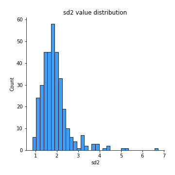
## Feature : skewness1
- **Feature type** : continous
- **Missing** : 0.0%
- **Unique** : 347
- **Count** :347.0
- **Mean** :-0.09898718688756343
- **Std** :0.5962839592338331
- **Min** :-3.530116233761814
- **25%th Percentile** : -0.17870449721245246
- **50%th Percentile** : -0.027670296419491022
- **75%th Percentile** : 0.07524566632277162
- **Max** :2.5845963767725557

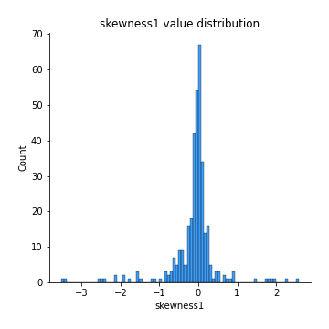
## Feature : skewness2
- **Feature type** : continous
- **Missing** : 0.0%
- **Unique** : 347
- **Count** :347.0
- **Mean** :-0.9098759472457231
- **Std** :1.037214506950152
- **Min** :-8.801502855292393
- **25%th Percentile** : -1.607871365209356
- **50%th Percentile** : -0.9898909235555128
- **75%th Percentile** : -0.18648664075767668
- **Max** :2.2606839051517187

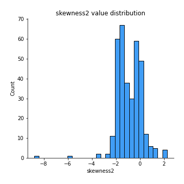
## Feature : kurtosis1
- **Feature type** : continous
- **Missing** : 0.0%
- **Unique** : 347
- **Count** :347.0
- **Mean** :3.2105639480785833
- **Std** :6.059144533106077
- **Min** :-0.45514233764351264
- **25%th Percentile** : -0.039410396702885375
- **50%th Percentile** : 0.619144756918546
- **75%th Percentile** : 3.9945238268597105
- **Max** :46.07507808162177

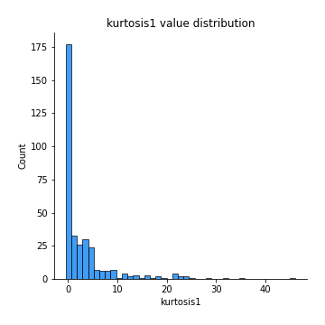
## Feature : kurtosis2
- **Feature type** : continous
- **Missing** : 0.0%
- **Unique** : 347
- **Count** :347.0
- **Mean** :5.634245964224134
- **Std** :9.931124382018467
- **Min** :-0.2813672379404686
- **25%th Percentile** : 2.4556725114531286
- **50%th Percentile** : 3.714827415799983
- **75%th Percentile** : 4.956441170229406
- **Max** :143.10871011533666

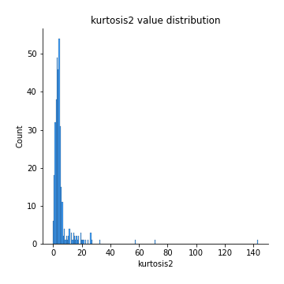
## Feature : return_autocorrelation_1_lag1
- **Feature type** : continous
- **Missing** : 0.0%
- **Unique** : 347
- **Count** :347.0
- **Mean** :0.01983442894045004
- **Std** :0.06877315790070652
- **Min** :-0.2135576224968752
- **25%th Percentile** : -0.022230910734464322
- **50%th Percentile** : 0.026361263443736495
- **75%th Percentile** : 0.06784247894872575
- **Max** :0.2024196454266263

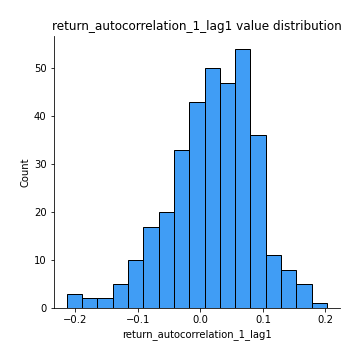
## Feature : return_autocorrelation_1_lag2
- **Feature type** : continous
- **Missing** : 0.0%
- **Unique** : 347
- **Count** :347.0
- **Mean** :0.026402138494400883
- **Std** :0.06205648232438996
- **Min** :-0.11950109167626709
- **25%th Percentile** : -0.01473035106503081
- **50%th Percentile** : 0.027804829410482044
- **75%th Percentile** : 0.07069101545295087
- **Max** :0.1855643044216655

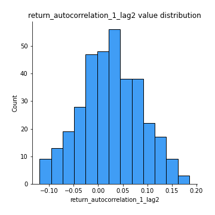
## Feature : return_autocorrelation_1_lag3
- **Feature type** : continous
- **Missing** : 0.0%
- **Unique** : 347
- **Count** :347.0
- **Mean** :0.026184770134851886
- **Std** :0.06400884489221612
- **Min** :-0.15806635192103805
- **25%th Percentile** : -0.01715735218865266
- **50%th Percentile** : 0.024922381096648297
- **75%th Percentile** : 0.07006592094950873
- **Max** :0.21438926580817136

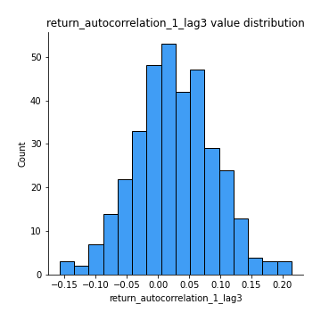
## Feature : return_autocorrelation_2_lag1
- **Feature type** : continous
- **Missing** : 0.0%
- **Unique** : 347
- **Count** :347.0
- **Mean** :0.2987171222808886
- **Std** :0.34526559823858466
- **Min** :-0.24590087874039124
- **25%th Percentile** : -0.021914118398861718
- **50%th Percentile** : 0.12235403572864123
- **75%th Percentile** : 0.6488863696365501
- **Max** :0.8965345915438185

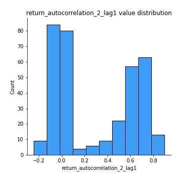
## Feature : return_autocorrelation_2_lag2
- **Feature type** : continous
- **Missing** : 0.0%
- **Unique** : 347
- **Count** :347.0
- **Mean** :0.30381007377586017
- **Std** :0.33283393576032
- **Min** :-0.15323211089747296
- **25%th Percentile** : -0.012233306517560834
- **50%th Percentile** : 0.14734721826682337
- **75%th Percentile** : 0.6508256141528077
- **Max** :0.8897108068088839

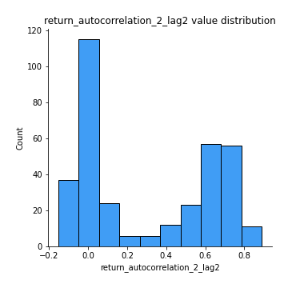
## Feature : return_autocorrelation_2_lag3
- **Feature type** : continous
- **Missing** : 0.0%
- **Unique** : 347
- **Count** :347.0
- **Mean** :0.3018045821444585
- **Std** :0.3320431967880071
- **Min** :-0.14200107169559698
- **25%th Percentile** : -0.010398664715047511
- **50%th Percentile** : 0.12489629575199976
- **75%th Percentile** : 0.6439372536228184
- **Max** :0.8853340673484661

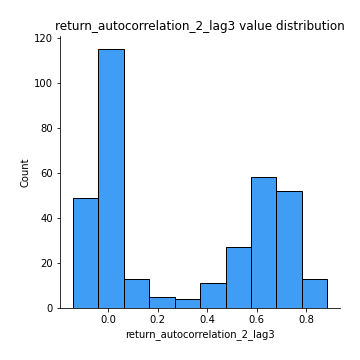
## Feature : return_correlation_ts1_lag_0
- **Feature type** : continous
- **Missing** : 0.0%
- **Unique** : 347
- **Count** :347.0
- **Mean** :0.3230566654156935
- **Std** :0.10569331665822376
- **Min** :0.013725064995079429
- **25%th Percentile** : 0.26614527033975427
- **50%th Percentile** : 0.3227669214101962
- **75%th Percentile** : 0.371791616868458
- **Max** :0.6949986865664105

## Feature : return_correlation_ts1_lag_1
- **Feature type** : continous
- **Missing** : 0.0%
- **Unique** : 347
- **Count** :347.0
- **Mean** :0.06668449274664331
- **Std** :0.09702845150886115
- **Min** :-0.16985510949917193
- **25%th Percentile** : -0.003966079648395475
- **50%th Percentile** : 0.05360797310433389
- **75%th Percentile** : 0.14750057964690913
- **Max** :0.28919586297659483

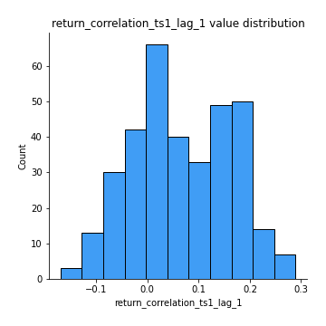
## Feature : return_correlation_ts1_lag_2
- **Feature type** : continous
- **Missing** : 0.0%
- **Unique** : 347
- **Count** :347.0
- **Mean** :0.07075028121682013
- **Std** :0.09616406918649553
- **Min** :-0.21653581047581763
- **25%th Percentile** : -0.008791677086170274
- **50%th Percentile** : 0.06800507882204183
- **75%th Percentile** : 0.15111386608126862
- **Max** :0.3087899302477114

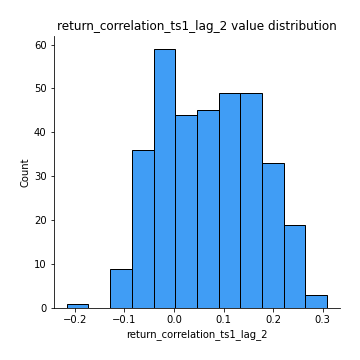
## Feature : return_correlation_ts1_lag_3
- **Feature type** : continous
- **Missing** : 0.0%
- **Unique** : 347
- **Count** :347.0
- **Mean** :0.0736878326994929
- **Std** :0.09544643951510434
- **Min** :-0.1270218498974763
- **25%th Percentile** : -0.0047970400291574185
- **50%th Percentile** : 0.06751546430621147
- **75%th Percentile** : 0.15047911174934664
- **Max** :0.31396316044927824

## Feature : return_correlation_ts2_lag_1
- **Feature type** : continous
- **Missing** : 0.0%
- **Unique** : 347
- **Count** :347.0
- **Mean** :0.06361980477381422
- **Std** :0.0973649737993351
- **Min** :-0.2081139431093261
- **25%th Percentile** : -0.014488319055960968
- **50%th Percentile** : 0.06342925132952129
- **75%th Percentile** : 0.14506802800399238
- **Max** :0.2863046688042512

## Feature : return_correlation_ts2_lag_2
- **Feature type** : continous
- **Missing** : 0.0%
- **Unique** : 347
- **Count** :347.0
- **Mean** :0.06790430988925747
- **Std** :0.09344790727033048
- **Min** :-0.15299951737180204
- **25%th Percentile** : -0.010340049916074363
- **50%th Percentile** : 0.056220283165737614
- **75%th Percentile** : 0.14787450789964518
- **Max** :0.3079986917591852

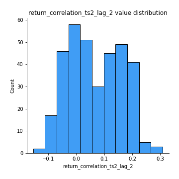
## Feature : return_correlation_ts2_lag_3
- **Feature type** : continous
- **Missing** : 0.0%
- **Unique** : 347
- **Count** :347.0
- **Mean** :0.06712587293214545
- **Std** :0.09278554921490999
- **Min** :-0.17564076057312866
- **25%th Percentile** : -0.003321297640232924
- **50%th Percentile** : 0.06167202009359097
- **75%th Percentile** : 0.1398430433316052
- **Max** :0.3234445634004551

## Feature : sqreturn_autocorrelation_ts1_lag1
- **Feature type** : continous
- **Missing** : 0.0%
- **Unique** : 347
- **Count** :347.0
- **Mean** :0.06217574848619574
- **Std** :0.08792361586391409
- **Min** :-0.08299298223636982
- **25%th Percentile** : 0.007138027184673415
- **50%th Percentile** : 0.046116176282182765
- **75%th Percentile** : 0.09227458170946141
- **Max** :0.49414293176447355

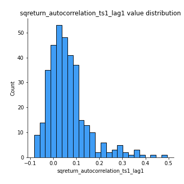
## Feature : sqreturn_autocorrelation_ts1_lag2
- **Feature type** : continous
- **Missing** : 0.0%
- **Unique** : 347
- **Count** :347.0
- **Mean** :0.05701530007892362
- **Std** :0.08839621162758503
- **Min** :-0.10722194188093519
- **25%th Percentile** : 0.001970882652816939
- **50%th Percentile** : 0.03817519266194312
- **75%th Percentile** : 0.08089736601777087
- **Max** :0.540735851444759

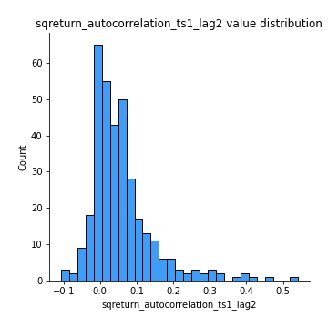
## Feature : sqreturn_autocorrelation_ts1_lag3
- **Feature type** : continous
- **Missing** : 0.0%
- **Unique** : 347
- **Count** :347.0
- **Mean** :0.0436447878610067
- **Std** :0.07403276046596777
- **Min** :-0.11117263645575114
- **25%th Percentile** : -0.0035509623707987168
- **50%th Percentile** : 0.03272787541740248
- **75%th Percentile** : 0.07561878949392012
- **Max** :0.41030914918857014

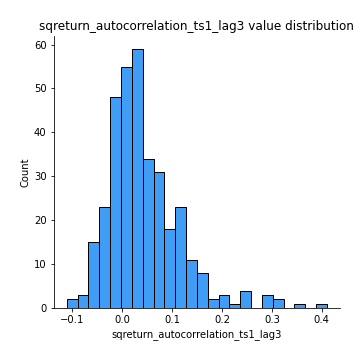
## Feature : sqreturn_autocorrelation_ts2_lag1
- **Feature type** : continous
- **Missing** : 0.0%
- **Unique** : 347
- **Count** :347.0
- **Mean** :0.4428988381966619
- **Std** :0.37014866449814915
- **Min** :-0.04997282481431907
- **25%th Percentile** : 0.07394764919296465
- **50%th Percentile** : 0.2942563895640028
- **75%th Percentile** : 0.8370121570702136
- **Max** :0.969088705129567

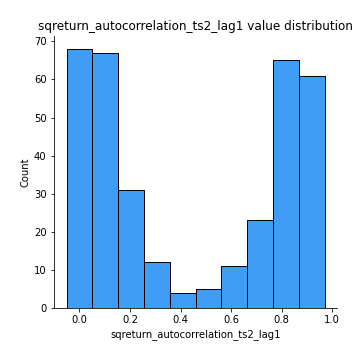
## Feature : sqreturn_autocorrelation_ts2_lag2
- **Feature type** : continous
- **Missing** : 0.0%
- **Unique** : 347
- **Count** :347.0
- **Mean** :0.4311388702509207
- **Std** :0.37833145392171597
- **Min** :-0.033377693228870714
- **25%th Percentile** : 0.040325590577819856
- **50%th Percentile** : 0.33220227779206013
- **75%th Percentile** : 0.8405465941895223
- **Max** :0.9676539427829347

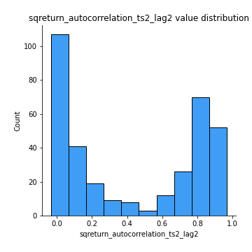
## Feature : sqreturn_autocorrelation_ts2_lag3
- **Feature type** : continous
- **Missing** : 0.0%
- **Unique** : 347
- **Count** :347.0
- **Mean** :0.418851277990147
- **Std** :0.38205825886659617
- **Min** :-0.06082766359524085
- **25%th Percentile** : 0.035976608635472196
- **50%th Percentile** : 0.25190998707047263
- **75%th Percentile** : 0.8295886952454691
- **Max** :0.9680260733290385

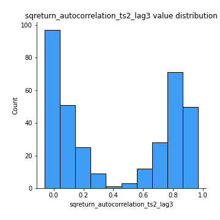
## Feature : sqreturn_correlation_ts1_lag_0
- **Feature type** : continous
- **Missing** : 0.0%
- **Unique** : 347
- **Count** :347.0
- **Mean** :0.3230566654156935
- **Std** :0.10569331665822376
- **Min** :0.013725064995079429
- **25%th Percentile** : 0.26614527033975427
- **50%th Percentile** : 0.3227669214101962
- **75%th Percentile** : 0.371791616868458
- **Max** :0.6949986865664105

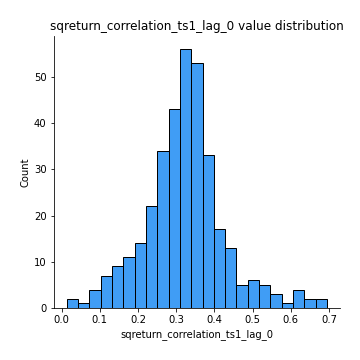
## Feature : sqreturn_correlation_ts1_lag_1
- **Feature type** : continous
- **Missing** : 0.0%
- **Unique** : 347
- **Count** :347.0
- **Mean** :0.06668449274664331
- **Std** :0.09702845150886115
- **Min** :-0.16985510949917193
- **25%th Percentile** : -0.003966079648395475
- **50%th Percentile** : 0.05360797310433389
- **75%th Percentile** : 0.14750057964690913
- **Max** :0.28919586297659483

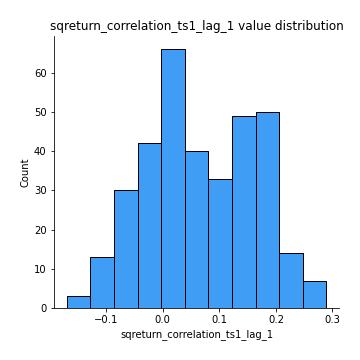
## Feature : sqreturn_correlation_ts1_lag_2
- **Feature type** : continous
- **Missing** : 0.0%
- **Unique** : 347
- **Count** :347.0
- **Mean** :0.07075028121682013
- **Std** :0.09616406918649553
- **Min** :-0.21653581047581763
- **25%th Percentile** : -0.008791677086170274
- **50%th Percentile** : 0.06800507882204183
- **75%th Percentile** : 0.15111386608126862
- **Max** :0.3087899302477114

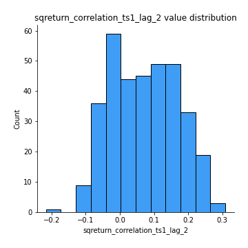
## Feature : sqreturn_correlation_ts1_lag_3
- **Feature type** : continous
- **Missing** : 0.0%
- **Unique** : 347
- **Count** :347.0
- **Mean** :0.0736878326994929
- **Std** :0.09544643951510434
- **Min** :-0.1270218498974763
- **25%th Percentile** : -0.0047970400291574185
- **50%th Percentile** : 0.06751546430621147
- **75%th Percentile** : 0.15047911174934664
- **Max** :0.31396316044927824

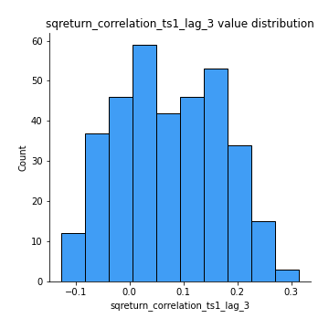
## Feature : sqreturn_correlation_ts2_lag_1
- **Feature type** : continous
- **Missing** : 0.0%
- **Unique** : 347
- **Count** :347.0
- **Mean** :0.06361980477381422
- **Std** :0.0973649737993351
- **Min** :-0.2081139431093261
- **25%th Percentile** : -0.014488319055960968
- **50%th Percentile** : 0.06342925132952129
- **75%th Percentile** : 0.14506802800399238
- **Max** :0.2863046688042512

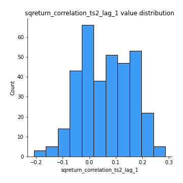
## Feature : sqreturn_correlation_ts2_lag_2
- **Feature type** : continous
- **Missing** : 0.0%
- **Unique** : 347
- **Count** :347.0
- **Mean** :0.06790430988925747
- **Std** :0.09344790727033048
- **Min** :-0.15299951737180204
- **25%th Percentile** : -0.010340049916074363
- **50%th Percentile** : 0.056220283165737614
- **75%th Percentile** : 0.14787450789964518
- **Max** :0.3079986917591852

## Feature : sqreturn_correlation_ts2_lag_3
- **Feature type** : continous
- **Missing** : 0.0%
- **Unique** : 347
- **Count** :347.0
- **Mean** :0.06712587293214545
- **Std** :0.09278554921490999
- **Min** :-0.17564076057312866
- **25%th Percentile** : -0.003321297640232924
- **50%th Percentile** : 0.06167202009359097
- **75%th Percentile** : 0.1398430433316052
- **Max** :0.3234445634004551

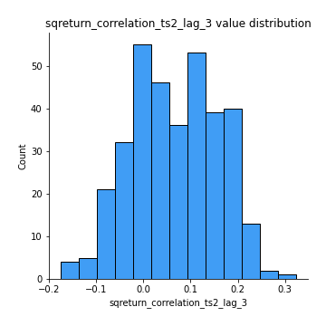
## Feature : price2_granger_cause_price1
- **Feature type** : continous
- **Missing** : 0.0%
- **Unique** : 347
- **Count** :347.0
- **Mean** :0.17783058863262785
- **Std** :0.2677958857509097
- **Min** :2.6775139922580404e-33
- **25%th Percentile** : 4.581019507766862e-07
- **50%th Percentile** : 0.013826785514594521
- **75%th Percentile** : 0.2733881676332255
- **Max** :0.9885712803689185

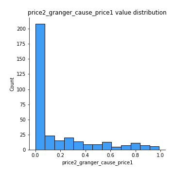
## Feature : price1_granger_cause_price2
- **Feature type** : continous
- **Missing** : 0.0%
- **Unique** : 347
- **Count** :347.0
- **Mean** :0.16546777549637548
- **Std** :0.24238228814457907
- **Min** :3.737646239297406e-26
- **25%th Percentile** : 9.444638913911394e-06
- **50%th Percentile** : 0.026026166518635114
- **75%th Percentile** : 0.26367712224147033
- **Max** :0.957735830123105

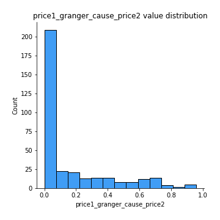

[<< Go back](../README.md)
