# Exploratory Data Analysis

[<< Go back](../README.md)
## Feature : target
- **Feature type** : categorical
- **Missing** : 0.0%
- **Unique** : 2
- **Count** :347
- **Unique** :2
- **Top** :simulated
- **Freq** :184

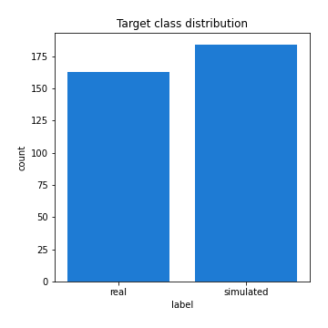
## Feature : mean1
- **Feature type** : continous
- **Missing** : 0.0%
- **Unique** : 347
- **Count** :347.0
- **Mean** :-0.2511635287166377
- **Std** :0.3144126808604905
- **Min** :-0.8810381792230925
- **25%th Percentile** : -0.5442072839608323
- **50%th Percentile** : -0.3239192855612671
- **75%th Percentile** : 0.054213055105445704
- **Max** :0.37175100008111034

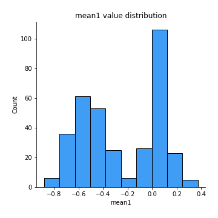
## Feature : mean2
- **Feature type** : continous
- **Missing** : 0.0%
- **Unique** : 347
- **Count** :347.0
- **Mean** :-0.2783336187933056
- **Std** :0.34469463443713805
- **Min** :-1.2647038559073416
- **25%th Percentile** : -0.5843345054983262
- **50%th Percentile** : -0.28806393222892124
- **75%th Percentile** : 0.05091887841123908
- **Max** :0.37616608147096464

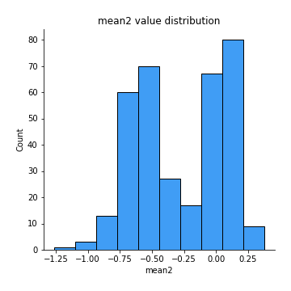
## Feature : sd1
- **Feature type** : continous
- **Missing** : 0.0%
- **Unique** : 347
- **Count** :347.0
- **Mean** :1.5965530069799734
- **Std** :0.8194454496028497
- **Min** :0.7470080772831957
- **25%th Percentile** : 1.2304353645055683
- **50%th Percentile** : 1.2823214551580493
- **75%th Percentile** : 1.654338199060348
- **Max** :9.236766377527575

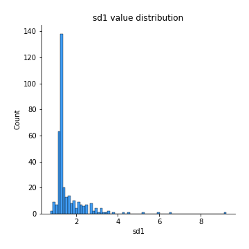
## Feature : sd2
- **Feature type** : continous
- **Missing** : 0.0%
- **Unique** : 347
- **Count** :347.0
- **Mean** :1.9111006007490867
- **Std** :0.7356911368199677
- **Min** :0.8455946193085045
- **25%th Percentile** : 1.4926009281132255
- **50%th Percentile** : 1.811221229295349
- **75%th Percentile** : 2.06707056270948
- **Max** :6.737618636746393

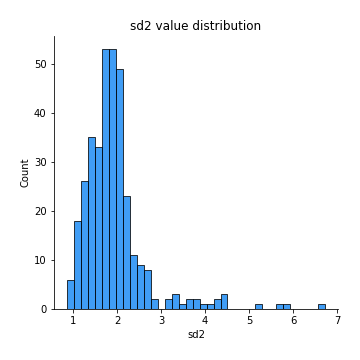
## Feature : skewness1
- **Feature type** : continous
- **Missing** : 0.0%
- **Unique** : 347
- **Count** :347.0
- **Mean** :-0.09798859388339369
- **Std** :0.6155543375052951
- **Min** :-3.530116233761814
- **25%th Percentile** : -0.15725012026111432
- **50%th Percentile** : -0.040988023112700986
- **75%th Percentile** : 0.06944759625665542
- **Max** :2.5845963767725557

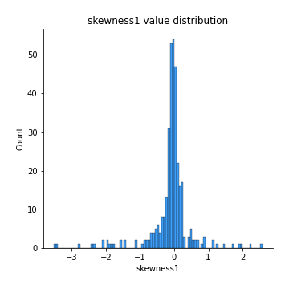
## Feature : skewness2
- **Feature type** : continous
- **Missing** : 0.0%
- **Unique** : 347
- **Count** :347.0
- **Mean** :-0.9505457157608194
- **Std** :0.9359845885665645
- **Min** :-5.778144124281153
- **25%th Percentile** : -1.629532705819003
- **50%th Percentile** : -1.1877676891433824
- **75%th Percentile** : -0.24997546702811635
- **Max** :2.2606839051517187

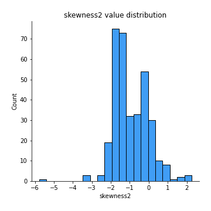
## Feature : kurtosis1
- **Feature type** : continous
- **Missing** : 0.0%
- **Unique** : 347
- **Count** :347.0
- **Mean** :3.270783227744837
- **Std** :6.448468410229776
- **Min** :-0.46994047004558315
- **25%th Percentile** : -0.011944447990113849
- **50%th Percentile** : 0.34914452820259534
- **75%th Percentile** : 3.691025264972352
- **Max** :46.07507808162177

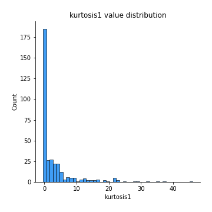
## Feature : kurtosis2
- **Feature type** : continous
- **Missing** : 0.0%
- **Unique** : 347
- **Count** :347.0
- **Mean** :5.579441773375903
- **Std** :7.111399378045345
- **Min** :0.15044486626750198
- **25%th Percentile** : 2.655167723929245
- **50%th Percentile** : 3.734678148962406
- **75%th Percentile** : 5.115781531992249
- **Max** :71.39844769176813

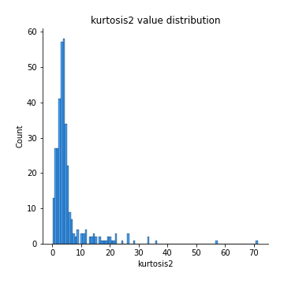
## Feature : return_autocorrelation_1_lag1
- **Feature type** : continous
- **Missing** : 0.0%
- **Unique** : 347
- **Count** :347.0
- **Mean** :0.020547562049114575
- **Std** :0.0719702603007795
- **Min** :-0.2135576224968752
- **25%th Percentile** : -0.022083627425212
- **50%th Percentile** : 0.026361263443736495
- **75%th Percentile** : 0.06983380496162228
- **Max** :0.2032622426325086

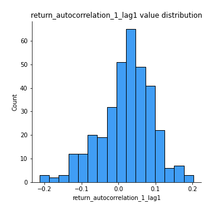
## Feature : return_autocorrelation_1_lag2
- **Feature type** : continous
- **Missing** : 0.0%
- **Unique** : 347
- **Count** :347.0
- **Mean** :0.025745740436881544
- **Std** :0.06437827470128812
- **Min** :-0.12172858720259
- **25%th Percentile** : -0.01774214506504322
- **50%th Percentile** : 0.023438774709691634
- **75%th Percentile** : 0.07260980626686513
- **Max** :0.23120886099628776

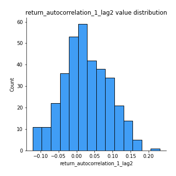
## Feature : return_autocorrelation_1_lag3
- **Feature type** : continous
- **Missing** : 0.0%
- **Unique** : 347
- **Count** :347.0
- **Mean** :0.03382354779568431
- **Std** :0.06489251423932964
- **Min** :-0.15806635192103805
- **25%th Percentile** : -0.009855766435461467
- **50%th Percentile** : 0.03422055204349248
- **75%th Percentile** : 0.08002000143476748
- **Max** :0.18776030627276077

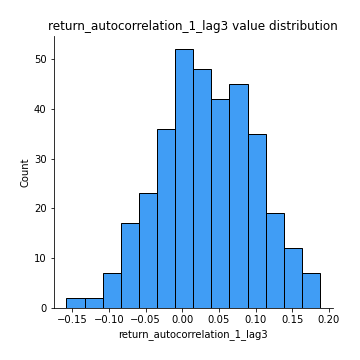
## Feature : return_autocorrelation_2_lag1
- **Feature type** : continous
- **Missing** : 0.0%
- **Unique** : 347
- **Count** :347.0
- **Mean** :0.3190668594373454
- **Std** :0.34124575142569663
- **Min** :-0.25075531010123286
- **25%th Percentile** : -0.013785570480215862
- **50%th Percentile** : 0.36901356953281406
- **75%th Percentile** : 0.6555274629919672
- **Max** :0.8841742669352901

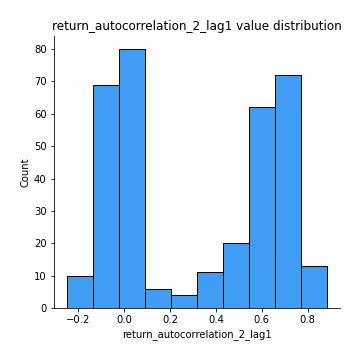
## Feature : return_autocorrelation_2_lag2
- **Feature type** : continous
- **Missing** : 0.0%
- **Unique** : 347
- **Count** :347.0
- **Mean** :0.324925800905241
- **Std** :0.32868787827740714
- **Min** :-0.15323211089747296
- **25%th Percentile** : -0.0052842315109633935
- **50%th Percentile** : 0.370279094995864
- **75%th Percentile** : 0.6558641352355937
- **Max** :0.893459755321469

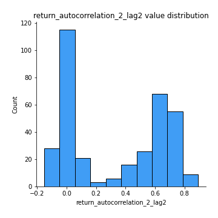
## Feature : return_autocorrelation_2_lag3
- **Feature type** : continous
- **Missing** : 0.0%
- **Unique** : 347
- **Count** :347.0
- **Mean** :0.320648856800777
- **Std** :0.33050563808231825
- **Min** :-0.14200107169559698
- **25%th Percentile** : -0.006396346839666692
- **50%th Percentile** : 0.3693017573777719
- **75%th Percentile** : 0.647595064553448
- **Max** :0.8924059718256301

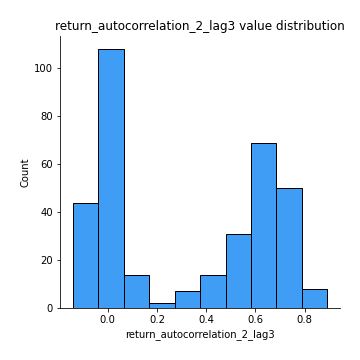
## Feature : return_correlation_ts1_lag_0
- **Feature type** : continous
- **Missing** : 0.0%
- **Unique** : 347
- **Count** :347.0
- **Mean** :0.31846043343297203
- **Std** :0.11006907521021578
- **Min** :-0.027089510445801036
- **25%th Percentile** : 0.26818061433390034
- **50%th Percentile** : 0.3193236616188181
- **75%th Percentile** : 0.37178185982520706
- **Max** :0.6949986865664105

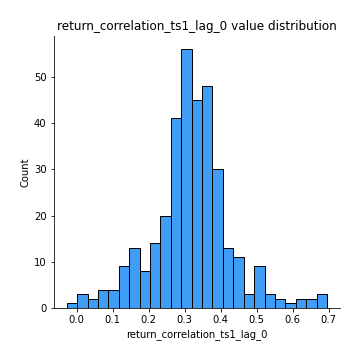
## Feature : return_correlation_ts1_lag_1
- **Feature type** : continous
- **Missing** : 0.0%
- **Unique** : 347
- **Count** :347.0
- **Mean** :0.06971887407931088
- **Std** :0.09756986746772667
- **Min** :-0.16985510949917193
- **25%th Percentile** : -0.005640950210160695
- **50%th Percentile** : 0.06738307620692129
- **75%th Percentile** : 0.1533839697796356
- **Max** :0.2895277339995097

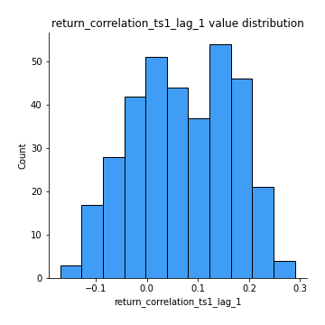
## Feature : return_correlation_ts1_lag_2
- **Feature type** : continous
- **Missing** : 0.0%
- **Unique** : 347
- **Count** :347.0
- **Mean** :0.07443499511481191
- **Std** :0.09232705122576255
- **Min** :-0.21653581047581763
- **25%th Percentile** : -0.0021548360356211677
- **50%th Percentile** : 0.07330576071046911
- **75%th Percentile** : 0.14851285187749774
- **Max** :0.2745894285380757

## Feature : return_correlation_ts1_lag_3
- **Feature type** : continous
- **Missing** : 0.0%
- **Unique** : 347
- **Count** :347.0
- **Mean** :0.07450753528303734
- **Std** :0.0934902217184128
- **Min** :-0.1270218498974763
- **25%th Percentile** : -0.004707312199351053
- **50%th Percentile** : 0.07919841739319078
- **75%th Percentile** : 0.14903345068041793
- **Max** :0.282260413447666

## Feature : return_correlation_ts2_lag_1
- **Feature type** : continous
- **Missing** : 0.0%
- **Unique** : 347
- **Count** :347.0
- **Mean** :0.06710910699015538
- **Std** :0.09656176885210802
- **Min** :-0.2081139431093261
- **25%th Percentile** : -0.010184624309810842
- **50%th Percentile** : 0.07490418251662108
- **75%th Percentile** : 0.1438487037845499
- **Max** :0.29998745917625136

## Feature : return_correlation_ts2_lag_2
- **Feature type** : continous
- **Missing** : 0.0%
- **Unique** : 347
- **Count** :347.0
- **Mean** :0.07267834230605719
- **Std** :0.08834704772296918
- **Min** :-0.23751835475804678
- **25%th Percentile** : -0.00040089314120163094
- **50%th Percentile** : 0.07329094857814106
- **75%th Percentile** : 0.14176815427812445
- **Max** :0.3016227660253815

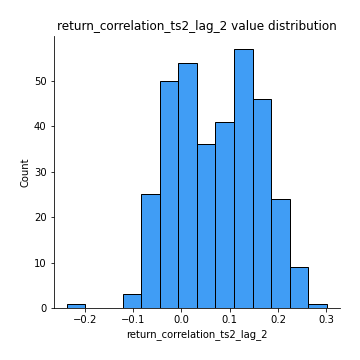
## Feature : return_correlation_ts2_lag_3
- **Feature type** : continous
- **Missing** : 0.0%
- **Unique** : 347
- **Count** :347.0
- **Mean** :0.072142881617378
- **Std** :0.09245829978094587
- **Min** :-0.17564076057312866
- **25%th Percentile** : -0.002957781469976122
- **50%th Percentile** : 0.06996459047615922
- **75%th Percentile** : 0.1419794269192789
- **Max** :0.2866390267744367

## Feature : sqreturn_autocorrelation_ts1_lag1
- **Feature type** : continous
- **Missing** : 0.0%
- **Unique** : 347
- **Count** :347.0
- **Mean** :0.06117828222510605
- **Std** :0.0876666499521626
- **Min** :-0.09389538771443602
- **25%th Percentile** : 0.00827890163571874
- **50%th Percentile** : 0.04058866245527696
- **75%th Percentile** : 0.09163053981031241
- **Max** :0.4439086285737898

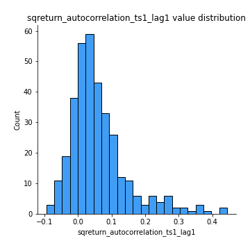
## Feature : sqreturn_autocorrelation_ts1_lag2
- **Feature type** : continous
- **Missing** : 0.0%
- **Unique** : 347
- **Count** :347.0
- **Mean** :0.05517341009042687
- **Std** :0.08858983806269717
- **Min** :-0.08386705565268623
- **25%th Percentile** : 0.0010910969254055059
- **50%th Percentile** : 0.033783557614598794
- **75%th Percentile** : 0.08217999943336692
- **Max** :0.540735851444759

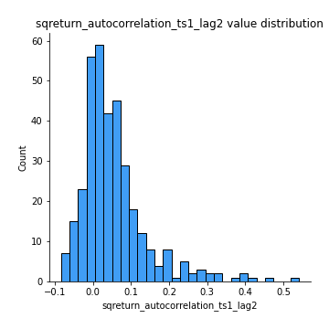
## Feature : sqreturn_autocorrelation_ts1_lag3
- **Feature type** : continous
- **Missing** : 0.0%
- **Unique** : 347
- **Count** :347.0
- **Mean** :0.04789263684178511
- **Std** :0.07856746061377559
- **Min** :-0.1128112061371121
- **25%th Percentile** : -0.0015578721043570066
- **50%th Percentile** : 0.028501746916570727
- **75%th Percentile** : 0.08147006788549793
- **Max** :0.44755937369538146

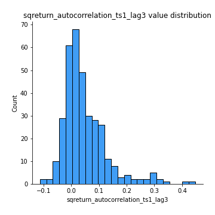
## Feature : sqreturn_autocorrelation_ts2_lag1
- **Feature type** : continous
- **Missing** : 0.0%
- **Unique** : 347
- **Count** :347.0
- **Mean** :0.45991960989600306
- **Std** :0.3664447535290437
- **Min** :-0.04997282481431907
- **25%th Percentile** : 0.07315581278036896
- **50%th Percentile** : 0.5520345643990852
- **75%th Percentile** : 0.8270623382932127
- **Max** :0.9482205454869791

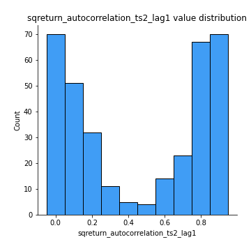
## Feature : sqreturn_autocorrelation_ts2_lag2
- **Feature type** : continous
- **Missing** : 0.0%
- **Unique** : 347
- **Count** :347.0
- **Mean** :0.4498785985235979
- **Std** :0.3774494782257277
- **Min** :-0.051523884196217395
- **25%th Percentile** : 0.040773196714296384
- **50%th Percentile** : 0.5271299037311589
- **75%th Percentile** : 0.8282910984482578
- **Max** :0.9518003126823035

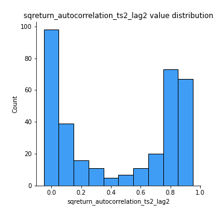
## Feature : sqreturn_autocorrelation_ts2_lag3
- **Feature type** : continous
- **Missing** : 0.0%
- **Unique** : 347
- **Count** :347.0
- **Mean** :0.439107850652746
- **Std** :0.3816362735730865
- **Min** :-0.06082766359524085
- **25%th Percentile** : 0.034628025646407753
- **50%th Percentile** : 0.558860081775002
- **75%th Percentile** : 0.8276840926418703
- **Max** :0.9563218825802628

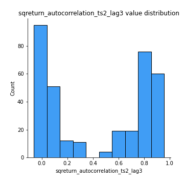
## Feature : sqreturn_correlation_ts1_lag_0
- **Feature type** : continous
- **Missing** : 0.0%
- **Unique** : 347
- **Count** :347.0
- **Mean** :0.31846043343297203
- **Std** :0.11006907521021578
- **Min** :-0.027089510445801036
- **25%th Percentile** : 0.26818061433390034
- **50%th Percentile** : 0.3193236616188181
- **75%th Percentile** : 0.37178185982520706
- **Max** :0.6949986865664105

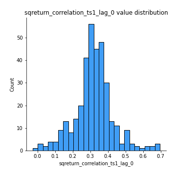
## Feature : sqreturn_correlation_ts1_lag_1
- **Feature type** : continous
- **Missing** : 0.0%
- **Unique** : 347
- **Count** :347.0
- **Mean** :0.06971887407931088
- **Std** :0.09756986746772667
- **Min** :-0.16985510949917193
- **25%th Percentile** : -0.005640950210160695
- **50%th Percentile** : 0.06738307620692129
- **75%th Percentile** : 0.1533839697796356
- **Max** :0.2895277339995097

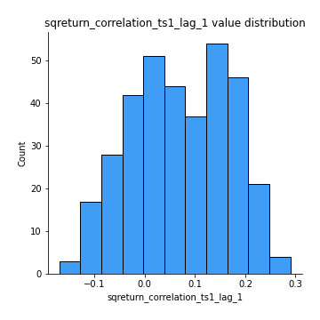
## Feature : sqreturn_correlation_ts1_lag_2
- **Feature type** : continous
- **Missing** : 0.0%
- **Unique** : 347
- **Count** :347.0
- **Mean** :0.07443499511481191
- **Std** :0.09232705122576255
- **Min** :-0.21653581047581763
- **25%th Percentile** : -0.0021548360356211677
- **50%th Percentile** : 0.07330576071046911
- **75%th Percentile** : 0.14851285187749774
- **Max** :0.2745894285380757

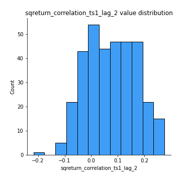
## Feature : sqreturn_correlation_ts1_lag_3
- **Feature type** : continous
- **Missing** : 0.0%
- **Unique** : 347
- **Count** :347.0
- **Mean** :0.07450753528303734
- **Std** :0.0934902217184128
- **Min** :-0.1270218498974763
- **25%th Percentile** : -0.004707312199351053
- **50%th Percentile** : 0.07919841739319078
- **75%th Percentile** : 0.14903345068041793
- **Max** :0.282260413447666

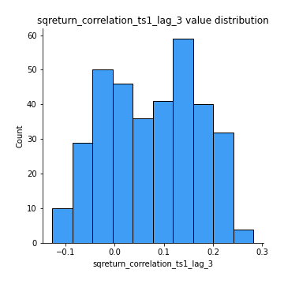
## Feature : sqreturn_correlation_ts2_lag_1
- **Feature type** : continous
- **Missing** : 0.0%
- **Unique** : 347
- **Count** :347.0
- **Mean** :0.06710910699015538
- **Std** :0.09656176885210802
- **Min** :-0.2081139431093261
- **25%th Percentile** : -0.010184624309810842
- **50%th Percentile** : 0.07490418251662108
- **75%th Percentile** : 0.1438487037845499
- **Max** :0.29998745917625136

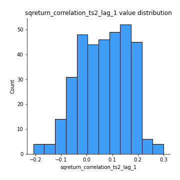
## Feature : sqreturn_correlation_ts2_lag_2
- **Feature type** : continous
- **Missing** : 0.0%
- **Unique** : 347
- **Count** :347.0
- **Mean** :0.07267834230605719
- **Std** :0.08834704772296918
- **Min** :-0.23751835475804678
- **25%th Percentile** : -0.00040089314120163094
- **50%th Percentile** : 0.07329094857814106
- **75%th Percentile** : 0.14176815427812445
- **Max** :0.3016227660253815

## Feature : sqreturn_correlation_ts2_lag_3
- **Feature type** : continous
- **Missing** : 0.0%
- **Unique** : 347
- **Count** :347.0
- **Mean** :0.072142881617378
- **Std** :0.09245829978094587
- **Min** :-0.17564076057312866
- **25%th Percentile** : -0.002957781469976122
- **50%th Percentile** : 0.06996459047615922
- **75%th Percentile** : 0.1419794269192789
- **Max** :0.2866390267744367

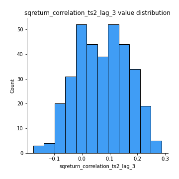
## Feature : price2_granger_cause_price1
- **Feature type** : continous
- **Missing** : 0.0%
- **Unique** : 347
- **Count** :347.0
- **Mean** :0.15732478019824786
- **Std** :0.24460254266457382
- **Min** :5.9871874922087594e-30
- **25%th Percentile** : 1.4704081758247134e-07
- **50%th Percentile** : 0.00983017927856528
- **75%th Percentile** : 0.24239694051505425
- **Max** :0.9534340306480406

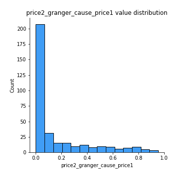
## Feature : price1_granger_cause_price2
- **Feature type** : continous
- **Missing** : 0.0%
- **Unique** : 347
- **Count** :347.0
- **Mean** :0.15865116741842503
- **Std** :0.24514692864029158
- **Min** :2.7418449952646535e-37
- **25%th Percentile** : 2.310391018533054e-05
- **50%th Percentile** : 0.008783265197022801
- **75%th Percentile** : 0.24782342804073867
- **Max** :0.9951398266867577

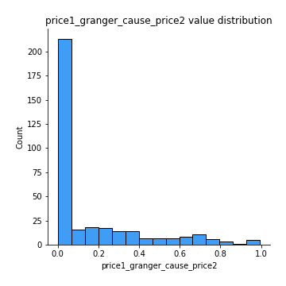

[<< Go back](../README.md)
