# Summary of 3_Linear

[<< Go back](../README.md)

## Logistic Regression (Linear)
- **n_jobs**: -1
- **explain_level**: 2

## Validation
 - **validation_type**: split
 - **train_ratio**: 0.75
 - **shuffle**: True
 - **stratify**: True

## Optimized metric
accuracy

## Training time

3.9 seconds

## Metric details
|           |    score |     threshold |
|:----------|---------:|--------------:|
| logloss   | 0.043995 | nan           |
| auc       | 1        | nan           |
| f1        | 1        |   0.280089    |
| accuracy  | 1        |   0.280089    |
| precision | 1        |   0.529117    |
| recall    | 1        |   4.20455e-05 |
| mcc       | 1        |   0.280089    |

## Confusion matrix (at threshold=0.280089)
|                      |   Predicted as real |   Predicted as simulated |
|:---------------------|--------------------:|-------------------------:|
| Labeled as real      |                  41 |                        0 |
| Labeled as simulated |                   0 |                       46 |

## Learning curves

## Coefficients
| feature                           |   Learner_1 |
|:----------------------------------|------------:|
| sqreturn_autocorrelation_ts2_lag2 |  1.07528    |
| sqreturn_autocorrelation_ts2_lag3 |  1.04714    |
| sqreturn_autocorrelation_ts2_lag1 |  1.0211     |
| return_autocorrelation_2_lag1     |  1.00018    |
| return_autocorrelation_2_lag3     |  0.942098   |
| return_autocorrelation_2_lag2     |  0.916435   |
| sqreturn_correlation_ts1_lag_1    |  0.333171   |
| return_correlation_ts1_lag_1      |  0.333171   |
| return_correlation_ts2_lag_1      |  0.332484   |
| sqreturn_correlation_ts2_lag_1    |  0.332484   |
| sqreturn_correlation_ts1_lag_3    |  0.292607   |
| return_correlation_ts1_lag_3      |  0.292607   |
| skewness1                         |  0.274907   |
| sqreturn_correlation_ts1_lag_2    |  0.260377   |
| return_correlation_ts1_lag_2      |  0.260377   |
| return_correlation_ts2_lag_3      |  0.228856   |
| sqreturn_correlation_ts2_lag_3    |  0.228856   |
| return_correlation_ts2_lag_2      |  0.194001   |
| sqreturn_correlation_ts2_lag_2    |  0.194001   |
| return_autocorrelation_1_lag1     |  0.177222   |
| return_autocorrelation_1_lag3     |  0.136276   |
| return_autocorrelation_1_lag2     |  0.10201    |
| sqreturn_correlation_ts1_lag_0    | -0.00311836 |
| return_correlation_ts1_lag_0      | -0.00311836 |
| sqreturn_autocorrelation_ts1_lag3 | -0.15382    |
| sqreturn_autocorrelation_ts1_lag1 | -0.154567   |
| sqreturn_autocorrelation_ts1_lag2 | -0.162591   |
| sd2                               | -0.303938   |
| price2_granger_cause_price1       | -0.534874   |
| sd1                               | -0.550424   |
| price1_granger_cause_price2       | -0.625783   |
| kurtosis2                         | -0.868369   |
| mean2                             | -0.919974   |
| kurtosis1                         | -1.11461    |
| skewness2                         | -1.17444    |
| mean1                             | -1.30099    |
| intercept                         | -2.66238    |

## Permutation-based Importance
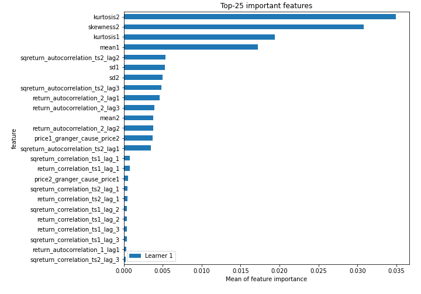
## Confusion Matrix

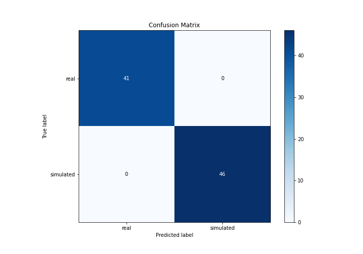

## Normalized Confusion Matrix

## ROC Curve

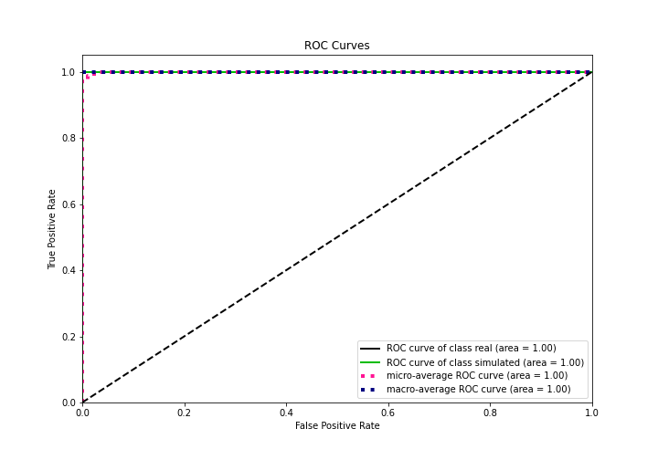

## Kolmogorov-Smirnov Statistic

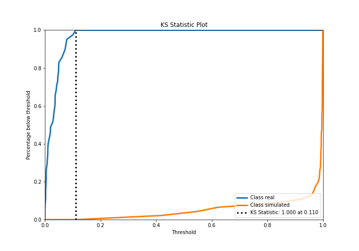

## Precision-Recall Curve

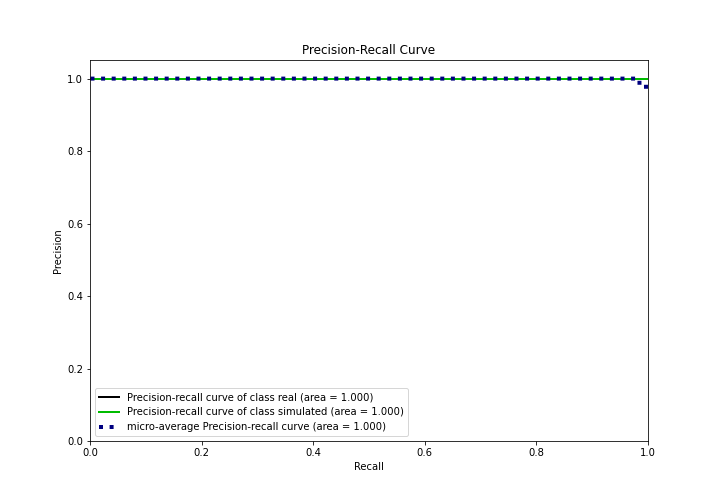

## Calibration Curve

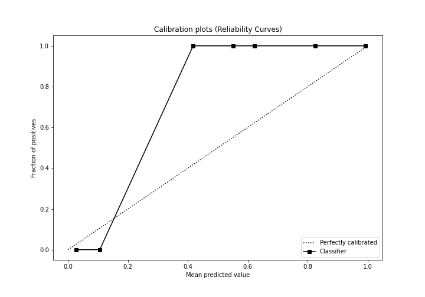

## Cumulative Gains Curve

## Lift Curve

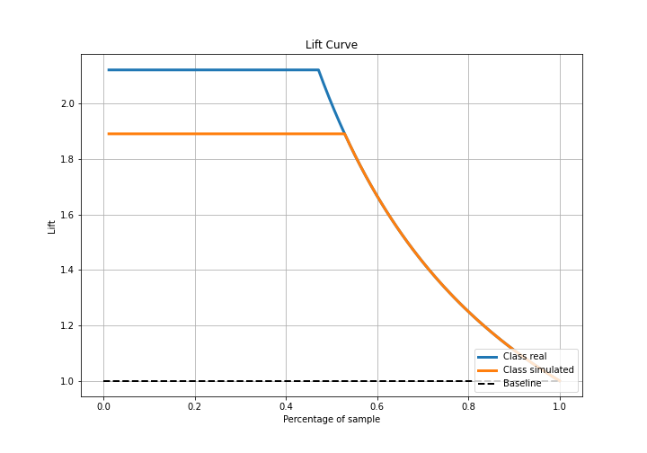

## SHAP Importance
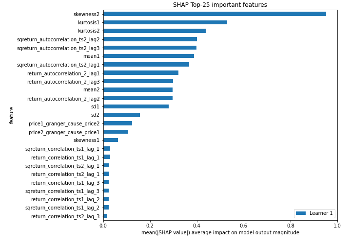

## SHAP Dependence plots

### Dependence (Fold 1)
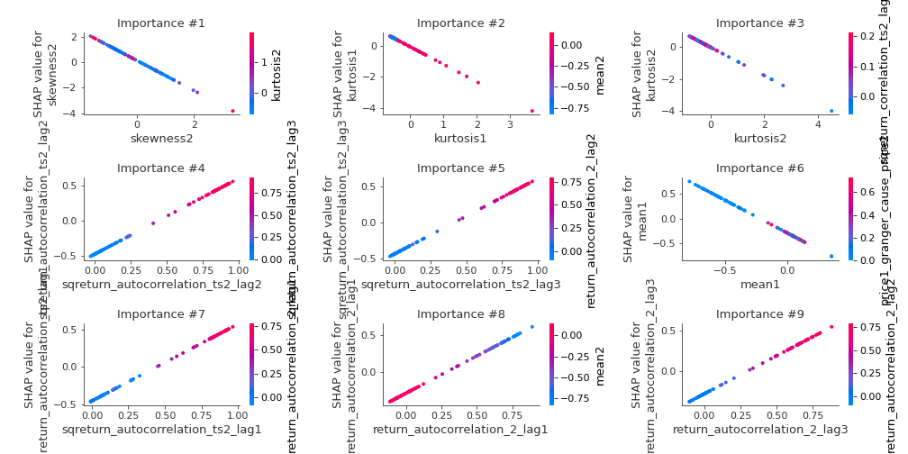

## SHAP Decision plots

### Top-10 Worst decisions for class 0 (Fold 1)
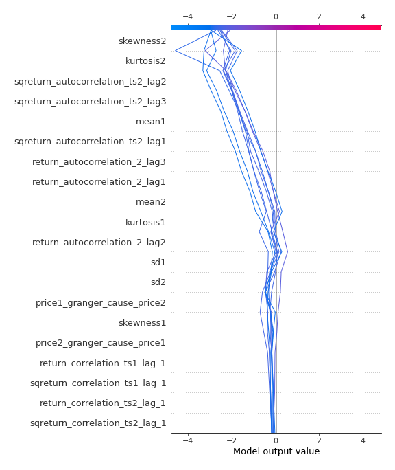
### Top-10 Best decisions for class 0 (Fold 1)
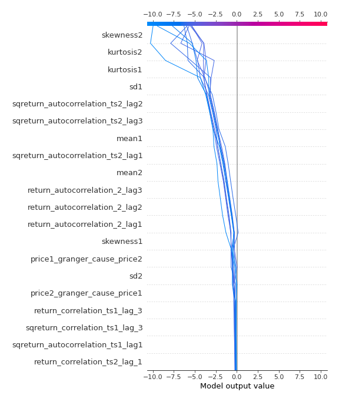
### Top-10 Worst decisions for class 1 (Fold 1)
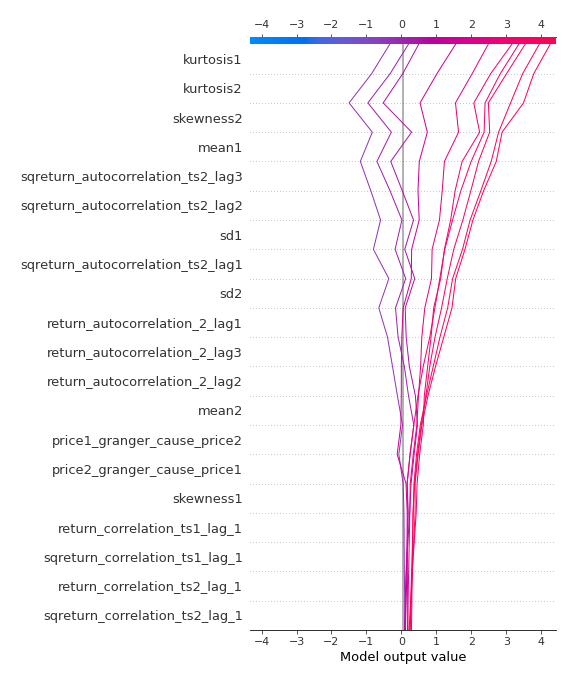
### Top-10 Best decisions for class 1 (Fold 1)
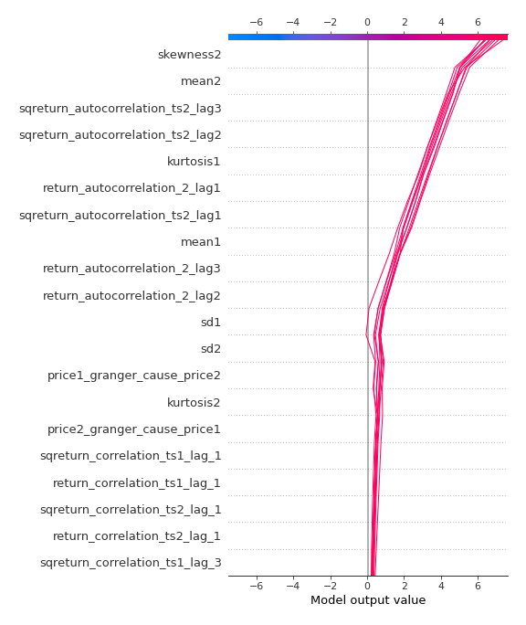

[<< Go back](../README.md)
