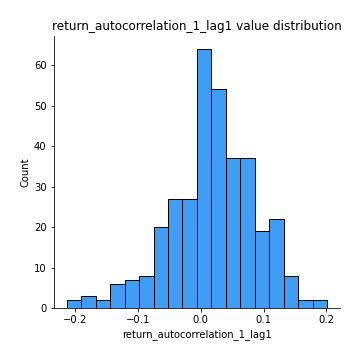

# Exploratory Data Analysis

[<< Go back](../README.md)
## Feature : target
- **Feature type** : categorical
- **Missing** : 0.0%
- **Unique** : 2
- **Count** :347
- **Unique** :2
- **Top** :real
- **Freq** :174

## Feature : mean1
- **Feature type** : continous
- **Missing** : 0.0%
- **Unique** : 347
- **Count** :347.0
- **Mean** :-0.23152029413569325
- **Std** :0.31064407445034203
- **Min** :-0.9369642460500199
- **25%th Percentile** : -0.5202640614534015
- **50%th Percentile** : -0.16806132843731086
- **75%th Percentile** : 0.05504941237065453
- **Max** :0.37175100008111034

## Feature : mean2
- **Feature type** : continous
- **Missing** : 0.0%
- **Unique** : 347
- **Count** :347.0
- **Mean** :-0.25448367539646094
- **Std** :0.3469823712395736
- **Min** :-1.254094335513492
- **25%th Percentile** : -0.5687249572766071
- **50%th Percentile** : -0.1699301048295367
- **75%th Percentile** : 0.0542170815428286
- **Max** :0.5719038252413439

## Feature : sd1
- **Feature type** : continous
- **Missing** : 0.0%
- **Unique** : 347
- **Count** :347.0
- **Mean** :1.5893944752772922
- **Std** :0.7825432671290671
- **Min** :0.7470080772831957
- **25%th Percentile** : 1.2328206137966418
- **50%th Percentile** : 1.2879615894987115
- **75%th Percentile** : 1.674952288994973
- **Max** :9.236766377527575

## Feature : sd2
- **Feature type** : continous
- **Missing** : 0.0%
- **Unique** : 347
- **Count** :347.0
- **Mean** :1.8763952504983235
- **Std** :0.683258328260519
- **Min** :0.8455946193085045
- **25%th Percentile** : 1.4649973372640264
- **50%th Percentile** : 1.763593397254265
- **75%th Percentile** : 2.0687959111961973
- **Max** :5.762808157208253

## Feature : skewness1
- **Feature type** : continous
- **Missing** : 0.0%
- **Unique** : 347
- **Count** :347.0
- **Mean** :-0.11598486325297516
- **Std** :0.5817076175629377
- **Min** :-3.530116233761814
- **25%th Percentile** : -0.19617018978257228
- **50%th Percentile** : -0.03296282448951981
- **75%th Percentile** : 0.0825702110814458
- **Max** :2.5845963767725557

## Feature : skewness2
- **Feature type** : continous
- **Missing** : 0.0%
- **Unique** : 347
- **Count** :347.0
- **Mean** :-0.8856193729929486
- **Std** :1.0161428200102889
- **Min** :-8.801502855292393
- **25%th Percentile** : -1.5958393621894542
- **50%th Percentile** : -0.9832201572958815
- **75%th Percentile** : -0.161423360271586
- **Max** :2.2606839051517187

## Feature : kurtosis1
- **Feature type** : continous
- **Missing** : 0.0%
- **Unique** : 347
- **Count** :347.0
- **Mean** :3.0885882422402178
- **Std** :5.657939701398416
- **Min** :-0.5330209233019803
- **25%th Percentile** : -0.019299181866143655
- **50%th Percentile** : 0.6514678102120954
- **75%th Percentile** : 3.746268461128576
- **Max** :36.91113889081053

## Feature : kurtosis2
- **Feature type** : continous
- **Missing** : 0.0%
- **Unique** : 347
- **Count** :347.0
- **Mean** :5.421898631029072
- **Std** :9.579739194152216
- **Min** :0.02482180041309423
- **25%th Percentile** : 2.2116131320594152
- **50%th Percentile** : 3.5517683414841117
- **75%th Percentile** : 4.863378869434664
- **Max** :143.10871011533666

## Feature : return_autocorrelation_1_lag1
- **Feature type** : continous
- **Missing** : 0.0%
- **Unique** : 347
- **Count** :347.0
- **Mean** :0.01778129742303852
- **Std** :0.06835291283962468
- **Min** :-0.2135576224968752
- **25%th Percentile** : -0.020398789833511552
- **50%th Percentile** : 0.01995891650290494
- **75%th Percentile** : 0.06407620117447993
- **Max** :0.20115707086381895

## Feature : return_autocorrelation_1_lag2
- **Feature type** : continous
- **Missing** : 0.0%
- **Unique** : 347
- **Count** :347.0
- **Mean** :0.021959744755652346
- **Std** :0.06476793112353865
- **Min** :-0.13309283796645122
- **25%th Percentile** : -0.020295919598650864
- **50%th Percentile** : 0.021244902803953573
- **75%th Percentile** : 0.062234927198447657
- **Max** :0.19030838115080667

## Feature : return_autocorrelation_1_lag3
- **Feature type** : continous
- **Missing** : 0.0%
- **Unique** : 347
- **Count** :347.0
- **Mean** :0.02359256026265009
- **Std** :0.06085566179797879
- **Min** :-0.1940836867390813
- **25%th Percentile** : -0.01340374053905899
- **50%th Percentile** : 0.026303367938674604
- **75%th Percentile** : 0.06141641085430706
- **Max** :0.18691990407803277

## Feature : return_autocorrelation_2_lag1
- **Feature type** : continous
- **Missing** : 0.0%
- **Unique** : 347
- **Count** :347.0
- **Mean** :0.2935146819545518
- **Std** :0.3439721261337126
- **Min** :-0.25075531010123286
- **25%th Percentile** : -0.025113874107817458
- **50%th Percentile** : 0.12235403572864123
- **75%th Percentile** : 0.6475526654353874
- **Max** :0.8855711138775935

## Feature : return_autocorrelation_2_lag2
- **Feature type** : continous
- **Missing** : 0.0%
- **Unique** : 347
- **Count** :347.0
- **Mean** :0.3034094149539649
- **Std** :0.3292849478864901
- **Min** :-0.15323211089747296
- **25%th Percentile** : -0.009426652683992655
- **50%th Percentile** : 0.1293707715454908
- **75%th Percentile** : 0.6456048090231338
- **Max** :0.8880517883918799

## Feature : return_autocorrelation_2_lag3
- **Feature type** : continous
- **Missing** : 0.0%
- **Unique** : 347
- **Count** :347.0
- **Mean** :0.29895631609389905
- **Std** :0.3270161138950765
- **Min** :-0.1344316177078651
- **25%th Percentile** : -0.0020687192016726036
- **50%th Percentile** : 0.10104658877048524
- **75%th Percentile** : 0.6289464789203971
- **Max** :0.8791824891479308

## Feature : return_correlation_ts1_lag_0
- **Feature type** : continous
- **Missing** : 0.0%
- **Unique** : 347
- **Count** :347.0
- **Mean** :0.32107717124327195
- **Std** :0.11568858939865471
- **Min** :-0.027089510445801036
- **25%th Percentile** : 0.2643318769707829
- **50%th Percentile** : 0.3263532931122831
- **75%th Percentile** : 0.36736112564901485
- **Max** :0.7041861626832071

## Feature : return_correlation_ts1_lag_1
- **Feature type** : continous
- **Missing** : 0.0%
- **Unique** : 347
- **Count** :347.0
- **Mean** :0.062179590881173
- **Std** :0.09899227524401387
- **Min** :-0.18617810443715402
- **25%th Percentile** : -0.012500261007805324
- **50%th Percentile** : 0.05909077747229414
- **75%th Percentile** : 0.1446538469921208
- **Max** :0.32545951779142385

## Feature : return_correlation_ts1_lag_2
- **Feature type** : continous
- **Missing** : 0.0%
- **Unique** : 347
- **Count** :347.0
- **Mean** :0.07058900792544898
- **Std** :0.09330622216401227
- **Min** :-0.21653581047581763
- **25%th Percentile** : -0.0038227453140269145
- **50%th Percentile** : 0.06800507882204183
- **75%th Percentile** : 0.14862059887109202
- **Max** :0.2754855947831802

## Feature : return_correlation_ts1_lag_3
- **Feature type** : continous
- **Missing** : 0.0%
- **Unique** : 347
- **Count** :347.0
- **Mean** :0.07196054063290702
- **Std** :0.09007684973530522
- **Min** :-0.1270218498974763
- **25%th Percentile** : -0.00303713195710665
- **50%th Percentile** : 0.08198326170945186
- **75%th Percentile** : 0.14565933921659407
- **Max** :0.2582859001227427

## Feature : return_correlation_ts2_lag_1
- **Feature type** : continous
- **Missing** : 0.0%
- **Unique** : 347
- **Count** :347.0
- **Mean** :0.06227190420688379
- **Std** :0.09675074052173158
- **Min** :-0.2081139431093261
- **25%th Percentile** : -0.01325337253357048
- **50%th Percentile** : 0.06274814921598755
- **75%th Percentile** : 0.14055430049024636
- **Max** :0.2828136935546977

## Feature : return_correlation_ts2_lag_2
- **Feature type** : continous
- **Missing** : 0.0%
- **Unique** : 347
- **Count** :347.0
- **Mean** :0.0703679594571143
- **Std** :0.09160030189968606
- **Min** :-0.23751835475804678
- **25%th Percentile** : -0.0008991074182214133
- **50%th Percentile** : 0.06978998002715091
- **75%th Percentile** : 0.1432986143469459
- **Max** :0.2930155249811326

## Feature : return_correlation_ts2_lag_3
- **Feature type** : continous
- **Missing** : 0.0%
- **Unique** : 347
- **Count** :347.0
- **Mean** :0.06658116745305741
- **Std** :0.09185223674708717
- **Min** :-0.17564076057312866
- **25%th Percentile** : -0.004220457513243464
- **50%th Percentile** : 0.06443442599178285
- **75%th Percentile** : 0.14493235545129332
- **Max** :0.2877057600074647

## Feature : sqreturn_autocorrelation_ts1_lag1
- **Feature type** : continous
- **Missing** : 0.0%
- **Unique** : 347
- **Count** :347.0
- **Mean** :0.06431129656548495
- **Std** :0.09079297238204602
- **Min** :-0.08366669413503726
- **25%th Percentile** : 0.007984151803891448
- **50%th Percentile** : 0.04386925091915798
- **75%th Percentile** : 0.09085526177759445
- **Max** :0.49414293176447355

## Feature : sqreturn_autocorrelation_ts1_lag2
- **Feature type** : continous
- **Missing** : 0.0%
- **Unique** : 347
- **Count** :347.0
- **Mean** :0.056509165013372505
- **Std** :0.09075961545959896
- **Min** :-0.07520967951640074
- **25%th Percentile** : -0.001398308165069299
- **50%th Percentile** : 0.03267627245771423
- **75%th Percentile** : 0.08167686635931033
- **Max** :0.540735851444759

## Feature : sqreturn_autocorrelation_ts1_lag3
- **Feature type** : continous
- **Missing** : 0.0%
- **Unique** : 347
- **Count** :347.0
- **Mean** :0.05032919569999407
- **Std** :0.07741908010567342
- **Min** :-0.09416210846846124
- **25%th Percentile** : -0.0026491830937133165
- **50%th Percentile** : 0.037576660374945114
- **75%th Percentile** : 0.08195039521333307
- **Max** :0.41030914918857014

## Feature : sqreturn_autocorrelation_ts2_lag1
- **Feature type** : continous
- **Missing** : 0.0%
- **Unique** : 347
- **Count** :347.0
- **Mean** :0.43773485237050075
- **Std** :0.3669545426167416
- **Min** :-0.08520586663750691
- **25%th Percentile** : 0.07395600250557574
- **50%th Percentile** : 0.2932867660283794
- **75%th Percentile** : 0.8187999985392062
- **Max** :0.9713207760883894

## Feature : sqreturn_autocorrelation_ts2_lag2
- **Feature type** : continous
- **Missing** : 0.0%
- **Unique** : 347
- **Count** :347.0
- **Mean** :0.4288376996121818
- **Std** :0.37468133440805307
- **Min** :-0.051523884196217395
- **25%th Percentile** : 0.046081836434424206
- **50%th Percentile** : 0.33220227779206013
- **75%th Percentile** : 0.824966091968113
- **Max** :0.9658080704010018

## Feature : sqreturn_autocorrelation_ts2_lag3
- **Feature type** : continous
- **Missing** : 0.0%
- **Unique** : 347
- **Count** :347.0
- **Mean** :0.41513938874490364
- **Std** :0.38158576041621123
- **Min** :-0.06082766359524085
- **25%th Percentile** : 0.034599402868232355
- **50%th Percentile** : 0.28000281374738145
- **75%th Percentile** : 0.8251872335251766
- **Max** :0.9675181958930976

## Feature : sqreturn_correlation_ts1_lag_0
- **Feature type** : continous
- **Missing** : 0.0%
- **Unique** : 347
- **Count** :347.0
- **Mean** :0.32107717124327195
- **Std** :0.11568858939865471
- **Min** :-0.027089510445801036
- **25%th Percentile** : 0.2643318769707829
- **50%th Percentile** : 0.3263532931122831
- **75%th Percentile** : 0.36736112564901485
- **Max** :0.7041861626832071

## Feature : sqreturn_correlation_ts1_lag_1
- **Feature type** : continous
- **Missing** : 0.0%
- **Unique** : 347
- **Count** :347.0
- **Mean** :0.062179590881173
- **Std** :0.09899227524401387
- **Min** :-0.18617810443715402
- **25%th Percentile** : -0.012500261007805324
- **50%th Percentile** : 0.05909077747229414
- **75%th Percentile** : 0.1446538469921208
- **Max** :0.32545951779142385

## Feature : sqreturn_correlation_ts1_lag_2
- **Feature type** : continous
- **Missing** : 0.0%
- **Unique** : 347
- **Count** :347.0
- **Mean** :0.07058900792544898
- **Std** :0.09330622216401227
- **Min** :-0.21653581047581763
- **25%th Percentile** : -0.0038227453140269145
- **50%th Percentile** : 0.06800507882204183
- **75%th Percentile** : 0.14862059887109202
- **Max** :0.2754855947831802

## Feature : sqreturn_correlation_ts1_lag_3
- **Feature type** : continous
- **Missing** : 0.0%
- **Unique** : 347
- **Count** :347.0
- **Mean** :0.07196054063290702
- **Std** :0.09007684973530522
- **Min** :-0.1270218498974763
- **25%th Percentile** : -0.00303713195710665
- **50%th Percentile** : 0.08198326170945186
- **75%th Percentile** : 0.14565933921659407
- **Max** :0.2582859001227427

## Feature : sqreturn_correlation_ts2_lag_1
- **Feature type** : continous
- **Missing** : 0.0%
- **Unique** : 347
- **Count** :347.0
- **Mean** :0.06227190420688379
- **Std** :0.09675074052173158
- **Min** :-0.2081139431093261
- **25%th Percentile** : -0.01325337253357048
- **50%th Percentile** : 0.06274814921598755
- **75%th Percentile** : 0.14055430049024636
- **Max** :0.2828136935546977

## Feature : sqreturn_correlation_ts2_lag_2
- **Feature type** : continous
- **Missing** : 0.0%
- **Unique** : 347
- **Count** :347.0
- **Mean** :0.0703679594571143
- **Std** :0.09160030189968606
- **Min** :-0.23751835475804678
- **25%th Percentile** : -0.0008991074182214133
- **50%th Percentile** : 0.06978998002715091
- **75%th Percentile** : 0.1432986143469459
- **Max** :0.2930155249811326

## Feature : sqreturn_correlation_ts2_lag_3
- **Feature type** : continous
- **Missing** : 0.0%
- **Unique** : 347
- **Count** :347.0
- **Mean** :0.06658116745305741
- **Std** :0.09185223674708717
- **Min** :-0.17564076057312866
- **25%th Percentile** : -0.004220457513243464
- **50%th Percentile** : 0.06443442599178285
- **75%th Percentile** : 0.14493235545129332
- **Max** :0.2877057600074647

## Feature : price2_granger_cause_price1
- **Feature type** : continous
- **Missing** : 0.0%
- **Unique** : 347
- **Count** :347.0
- **Mean** :0.18068572318006762
- **Std** :0.2755145019030882
- **Min** :2.635456348905927e-26
- **25%th Percentile** : 7.771592151283807e-07
- **50%th Percentile** : 0.011907208480242439
- **75%th Percentile** : 0.28126760595427347
- **Max** :0.9999977040875935

## Feature : price1_granger_cause_price2
- **Feature type** : continous
- **Missing** : 0.0%
- **Unique** : 347
- **Count** :347.0
- **Mean** :0.16623148172009622
- **Std** :0.24467412417183876
- **Min** :2.5272538248556087e-21
- **25%th Percentile** : 7.5045379912283035e-06
- **50%th Percentile** : 0.025118127485026235
- **75%th Percentile** : 0.2691716910585089
- **Max** :0.9951398266867577

[<< Go back](../README.md)
