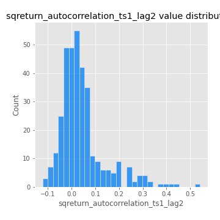
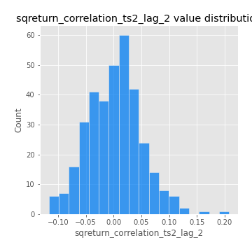

# Exploratory Data Analysis

[<< Go back](../README.md)
## Feature : target
- **Feature type** : categorical
- **Missing** : 0.0%
- **Unique** : 2
- **Count** :347
- **Unique** :2
- **Top** :simulated
- **Freq** :176

## Feature : mean1
- **Feature type** : continous
- **Missing** : 0.0%
- **Unique** : 347
- **Count** :347.0
- **Mean** :0.06218134431560643
- **Std** :0.08262096668828624
- **Min** :-0.194877134547707
- **25%th Percentile** : 0.01142065644368307
- **50%th Percentile** : 0.06134034035414438
- **75%th Percentile** : 0.10393976031735627
- **Max** :0.37175100008111034

## Feature : mean2
- **Feature type** : continous
- **Missing** : 0.0%
- **Unique** : 347
- **Count** :347.0
- **Mean** :0.0810487314277995
- **Std** :0.09269130921526758
- **Min** :-0.24205418062825398
- **25%th Percentile** : 0.02854499344967968
- **50%th Percentile** : 0.07589208259833399
- **75%th Percentile** : 0.13332284942414385
- **Max** :0.40295267094010045

## Feature : sd1
- **Feature type** : continous
- **Missing** : 0.0%
- **Unique** : 347
- **Count** :347.0
- **Mean** :1.8496474592356855
- **Std** :0.5573730759803591
- **Min** :0.7470080772831957
- **25%th Percentile** : 1.682308479562066
- **50%th Percentile** : 1.8204004790811656
- **75%th Percentile** : 1.8921160195984243
- **Max** :6.495661311240861

## Feature : sd2
- **Feature type** : continous
- **Missing** : 0.0%
- **Unique** : 347
- **Count** :347.0
- **Mean** :1.7931982201755103
- **Std** :0.7273177266804917
- **Min** :0.8592887433004143
- **25%th Percentile** : 1.5646915397751577
- **50%th Percentile** : 1.6494008957003203
- **75%th Percentile** : 1.7275511864902935
- **Max** :6.737618636746393

## Feature : skewness1
- **Feature type** : continous
- **Missing** : 0.0%
- **Unique** : 347
- **Count** :347.0
- **Mean** :-0.07065216805807063
- **Std** :0.5865990303718622
- **Min** :-3.530116233761814
- **25%th Percentile** : -0.19750668523238285
- **50%th Percentile** : -0.014392804170402479
- **75%th Percentile** : 0.09562010537922846
- **Max** :2.5845963767725557

## Feature : skewness2
- **Feature type** : continous
- **Missing** : 0.0%
- **Unique** : 347
- **Count** :347.0
- **Mean** :-0.16109099290942172
- **Std** :0.6344046790068505
- **Min** :-5.778144124281153
- **25%th Percentile** : -0.23204672254394254
- **50%th Percentile** : -0.060482553995824535
- **75%th Percentile** : 0.07325231307898594
- **Max** :2.242019525651531

## Feature : kurtosis1
- **Feature type** : continous
- **Missing** : 0.0%
- **Unique** : 347
- **Count** :347.0
- **Mean** :3.0906423246254664
- **Std** :5.983709215982638
- **Min** :-0.39276097704002844
- **25%th Percentile** : -0.04328537142422628
- **50%th Percentile** : 0.37766356473947926
- **75%th Percentile** : 3.3144235969375373
- **Max** :36.91113889081053

## Feature : kurtosis2
- **Feature type** : continous
- **Missing** : 0.0%
- **Unique** : 347
- **Count** :347.0
- **Mean** :3.260127203471226
- **Std** :6.787333052490057
- **Min** :-0.49815222273154447
- **25%th Percentile** : -0.038560795368679956
- **50%th Percentile** : 0.4087016535545356
- **75%th Percentile** : 4.101810584478865
- **Max** :71.39844769176813

## Feature : return_autocorrelation_1_lag1
- **Feature type** : continous
- **Missing** : 0.0%
- **Unique** : 347
- **Count** :347.0
- **Mean** :-0.009497353149107409
- **Std** :0.05683220985451872
- **Min** :-0.2135576224968752
- **25%th Percentile** : -0.04339695841257226
- **50%th Percentile** : -0.005270151898627388
- **75%th Percentile** : 0.027409658300812757
- **Max** :0.12810656890648087

## Feature : return_autocorrelation_1_lag2
- **Feature type** : continous
- **Missing** : 0.0%
- **Unique** : 347
- **Count** :347.0
- **Mean** :-0.0036722181073928087
- **Std** :0.05008988327784942
- **Min** :-0.13309283796645122
- **25%th Percentile** : -0.03624730064290761
- **50%th Percentile** : -0.002025791800541246
- **75%th Percentile** : 0.028076272528254214
- **Max** :0.1561488228015672

## Feature : return_autocorrelation_1_lag3
- **Feature type** : continous
- **Missing** : 0.0%
- **Unique** : 347
- **Count** :347.0
- **Mean** :-0.0021749459295862987
- **Std** :0.051490815022786914
- **Min** :-0.1940836867390813
- **25%th Percentile** : -0.03235168932563448
- **50%th Percentile** : 0.0015663593689978104
- **75%th Percentile** : 0.03245418132393174
- **Max** :0.17805869530681923

## Feature : return_autocorrelation_2_lag1
- **Feature type** : continous
- **Missing** : 0.0%
- **Unique** : 347
- **Count** :347.0
- **Mean** :-0.007524411575197653
- **Std** :0.06061419520506428
- **Min** :-0.25075531010123286
- **25%th Percentile** : -0.03693697570861686
- **50%th Percentile** : -0.0007150581423045594
- **75%th Percentile** : 0.03051387463330848
- **Max** :0.31863413537898483

## Feature : return_autocorrelation_2_lag2
- **Feature type** : continous
- **Missing** : 0.0%
- **Unique** : 347
- **Count** :347.0
- **Mean** :0.0010992960976364298
- **Std** :0.05127132185873793
- **Min** :-0.15323211089747296
- **25%th Percentile** : -0.03261751079502832
- **50%th Percentile** : -0.001644639370337752
- **75%th Percentile** : 0.03408449300584189
- **Max** :0.20974504043791217

## Feature : return_autocorrelation_2_lag3
- **Feature type** : continous
- **Missing** : 0.0%
- **Unique** : 347
- **Count** :347.0
- **Mean** :0.0018663580978240924
- **Std** :0.04800643743198085
- **Min** :-0.1344316177078651
- **25%th Percentile** : -0.026477830568407783
- **50%th Percentile** : 0.001058297563840487
- **75%th Percentile** : 0.03224325172133742
- **Max** :0.1419999376914021

## Feature : return_correlation_ts1_lag_0
- **Feature type** : continous
- **Missing** : 0.0%
- **Unique** : 347
- **Count** :347.0
- **Mean** :0.31754751754934457
- **Std** :0.11214987514844679
- **Min** :-0.027089510445801036
- **25%th Percentile** : 0.2670002938482018
- **50%th Percentile** : 0.3141806563433137
- **75%th Percentile** : 0.3565610289606974
- **Max** :0.7041861626832071

## Feature : return_correlation_ts1_lag_1
- **Feature type** : continous
- **Missing** : 0.0%
- **Unique** : 347
- **Count** :347.0
- **Mean** :-0.0038077592621071914
- **Std** :0.053002976644740386
- **Min** :-0.16985510949917193
- **25%th Percentile** : -0.038835577762649266
- **50%th Percentile** : 0.002038852059619574
- **75%th Percentile** : 0.036321484329080514
- **Max** :0.11819480385322509

## Feature : return_correlation_ts1_lag_2
- **Feature type** : continous
- **Missing** : 0.0%
- **Unique** : 347
- **Count** :347.0
- **Mean** :-0.0012100335452949645
- **Std** :0.047912065536600754
- **Min** :-0.21653581047581763
- **25%th Percentile** : -0.03175523893056423
- **50%th Percentile** : -0.0029386859479065305
- **75%th Percentile** : 0.0307181538138692
- **Max** :0.1107199842610318

## Feature : return_correlation_ts1_lag_3
- **Feature type** : continous
- **Missing** : 0.0%
- **Unique** : 347
- **Count** :347.0
- **Mean** :-0.00028571083196506075
- **Std** :0.049925086538410726
- **Min** :-0.1270218498974763
- **25%th Percentile** : -0.03285935706900952
- **50%th Percentile** : 0.0005085061733351187
- **75%th Percentile** : 0.029525907488530075
- **Max** :0.1636773216468148

## Feature : return_correlation_ts2_lag_1
- **Feature type** : continous
- **Missing** : 0.0%
- **Unique** : 347
- **Count** :347.0
- **Mean** :-0.008974853589209113
- **Std** :0.0512624007120889
- **Min** :-0.2081139431093261
- **25%th Percentile** : -0.040710844205456544
- **50%th Percentile** : -0.008235021310776268
- **75%th Percentile** : 0.02538518321075106
- **Max** :0.17208763791364762

## Feature : return_correlation_ts2_lag_2
- **Feature type** : continous
- **Missing** : 0.0%
- **Unique** : 347
- **Count** :347.0
- **Mean** :0.002093292447739993
- **Std** :0.04839503783694292
- **Min** :-0.11689832689418005
- **25%th Percentile** : -0.03164019901610411
- **50%th Percentile** : 0.0026979248538658252
- **75%th Percentile** : 0.03300792185064792
- **Max** :0.20772887392904255

## Feature : return_correlation_ts2_lag_3
- **Feature type** : continous
- **Missing** : 0.0%
- **Unique** : 347
- **Count** :347.0
- **Mean** :-0.0033458439550984624
- **Std** :0.0502653032690301
- **Min** :-0.17564076057312866
- **25%th Percentile** : -0.032063985079879134
- **50%th Percentile** : -0.002789457377233445
- **75%th Percentile** : 0.031048936287750226
- **Max** :0.12179225297274299

## Feature : sqreturn_autocorrelation_ts1_lag1
- **Feature type** : continous
- **Missing** : 0.0%
- **Unique** : 347
- **Count** :347.0
- **Mean** :0.04969512569471049
- **Std** :0.0910037683099936
- **Min** :-0.13715784808548165
- **25%th Percentile** : -0.009096733333610569
- **50%th Percentile** : 0.02672915646187806
- **75%th Percentile** : 0.08310802391865449
- **Max** :0.4439086285737898

## Feature : sqreturn_autocorrelation_ts1_lag2
- **Feature type** : continous
- **Missing** : 0.0%
- **Unique** : 347
- **Count** :347.0
- **Mean** :0.04398616166858634
- **Std** :0.09590142486429225
- **Min** :-0.12203977835551597
- **25%th Percentile** : -0.01405607424887167
- **50%th Percentile** : 0.02212600260435422
- **75%th Percentile** : 0.0640570426289565
- **Max** :0.540735851444759

## Feature : sqreturn_autocorrelation_ts1_lag3
- **Feature type** : continous
- **Missing** : 0.0%
- **Unique** : 347
- **Count** :347.0
- **Mean** :0.03543426392006067
- **Std** :0.08286594545229789
- **Min** :-0.08578056936917824
- **25%th Percentile** : -0.01305032568277718
- **50%th Percentile** : 0.012680766069520899
- **75%th Percentile** : 0.061544376056263325
- **Max** :0.44755937369538146

## Feature : sqreturn_autocorrelation_ts2_lag1
- **Feature type** : continous
- **Missing** : 0.0%
- **Unique** : 347
- **Count** :347.0
- **Mean** :0.05248431991995881
- **Std** :0.08826604859030673
- **Min** :-0.12268973402177324
- **25%th Percentile** : -0.004724611511159783
- **50%th Percentile** : 0.031602112314456095
- **75%th Percentile** : 0.08922130391107522
- **Max** :0.4190090519891419

## Feature : sqreturn_autocorrelation_ts2_lag2
- **Feature type** : continous
- **Missing** : 0.0%
- **Unique** : 347
- **Count** :347.0
- **Mean** :0.038826260532651244
- **Std** :0.09535544906982914
- **Min** :-0.1250234414549579
- **25%th Percentile** : -0.015069378475285073
- **50%th Percentile** : 0.01386660012565615
- **75%th Percentile** : 0.06277351904217746
- **Max** :0.5373432415582473

## Feature : sqreturn_autocorrelation_ts2_lag3
- **Feature type** : continous
- **Missing** : 0.0%
- **Unique** : 347
- **Count** :347.0
- **Mean** :0.030018692194415997
- **Std** :0.07180843172038359
- **Min** :-0.11317192967535225
- **25%th Percentile** : -0.008951940807698986
- **50%th Percentile** : 0.015600659260481023
- **75%th Percentile** : 0.05065854991244066
- **Max** :0.31225727797735664

## Feature : sqreturn_correlation_ts1_lag_0
- **Feature type** : continous
- **Missing** : 0.0%
- **Unique** : 347
- **Count** :347.0
- **Mean** :0.31754751754934457
- **Std** :0.11214987514844679
- **Min** :-0.027089510445801036
- **25%th Percentile** : 0.2670002938482018
- **50%th Percentile** : 0.3141806563433137
- **75%th Percentile** : 0.3565610289606974
- **Max** :0.7041861626832071

## Feature : sqreturn_correlation_ts1_lag_1
- **Feature type** : continous
- **Missing** : 0.0%
- **Unique** : 347
- **Count** :347.0
- **Mean** :-0.0038077592621071914
- **Std** :0.053002976644740386
- **Min** :-0.16985510949917193
- **25%th Percentile** : -0.038835577762649266
- **50%th Percentile** : 0.002038852059619574
- **75%th Percentile** : 0.036321484329080514
- **Max** :0.11819480385322509

## Feature : sqreturn_correlation_ts1_lag_2
- **Feature type** : continous
- **Missing** : 0.0%
- **Unique** : 347
- **Count** :347.0
- **Mean** :-0.0012100335452949645
- **Std** :0.047912065536600754
- **Min** :-0.21653581047581763
- **25%th Percentile** : -0.03175523893056423
- **50%th Percentile** : -0.0029386859479065305
- **75%th Percentile** : 0.0307181538138692
- **Max** :0.1107199842610318

## Feature : sqreturn_correlation_ts1_lag_3
- **Feature type** : continous
- **Missing** : 0.0%
- **Unique** : 347
- **Count** :347.0
- **Mean** :-0.00028571083196506075
- **Std** :0.049925086538410726
- **Min** :-0.1270218498974763
- **25%th Percentile** : -0.03285935706900952
- **50%th Percentile** : 0.0005085061733351187
- **75%th Percentile** : 0.029525907488530075
- **Max** :0.1636773216468148

## Feature : sqreturn_correlation_ts2_lag_1
- **Feature type** : continous
- **Missing** : 0.0%
- **Unique** : 347
- **Count** :347.0
- **Mean** :-0.008974853589209113
- **Std** :0.0512624007120889
- **Min** :-0.2081139431093261
- **25%th Percentile** : -0.040710844205456544
- **50%th Percentile** : -0.008235021310776268
- **75%th Percentile** : 0.02538518321075106
- **Max** :0.17208763791364762

## Feature : sqreturn_correlation_ts2_lag_2
- **Feature type** : continous
- **Missing** : 0.0%
- **Unique** : 347
- **Count** :347.0
- **Mean** :0.002093292447739993
- **Std** :0.04839503783694292
- **Min** :-0.11689832689418005
- **25%th Percentile** : -0.03164019901610411
- **50%th Percentile** : 0.0026979248538658252
- **75%th Percentile** : 0.03300792185064792
- **Max** :0.20772887392904255

## Feature : sqreturn_correlation_ts2_lag_3
- **Feature type** : continous
- **Missing** : 0.0%
- **Unique** : 347
- **Count** :347.0
- **Mean** :-0.0033458439550984624
- **Std** :0.0502653032690301
- **Min** :-0.17564076057312866
- **25%th Percentile** : -0.032063985079879134
- **50%th Percentile** : -0.002789457377233445
- **75%th Percentile** : 0.031048936287750226
- **Max** :0.12179225297274299

## Feature : price2_granger_cause_price1
- **Feature type** : continous
- **Missing** : 0.0%
- **Unique** : 347
- **Count** :347.0
- **Mean** :0.29374472037891386
- **Std** :0.29488894535541066
- **Min** :8.094654087372294e-08
- **25%th Percentile** : 0.040998594999196745
- **50%th Percentile** : 0.18335968001925124
- **75%th Percentile** : 0.49983704518629146
- **Max** :0.9957022819548803

## Feature : price1_granger_cause_price2
- **Feature type** : continous
- **Missing** : 0.0%
- **Unique** : 347
- **Count** :347.0
- **Mean** :0.2954653204038137
- **Std** :0.28318344371949067
- **Min** :2.160233695636459e-07
- **25%th Percentile** : 0.040893074121326554
- **50%th Percentile** : 0.21685373727221552
- **75%th Percentile** : 0.49958574542317025
- **Max** :0.9875660195933221

[<< Go back](../README.md)
