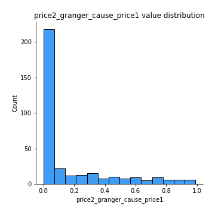

# Exploratory Data Analysis

[<< Go back](../README.md)
## Feature : target
- **Feature type** : categorical
- **Missing** : 0.0%
- **Unique** : 2
- **Count** :347
- **Unique** :2
- **Top** :simulated
- **Freq** :183

## Feature : mean1
- **Feature type** : continous
- **Missing** : 0.0%
- **Unique** : 347
- **Count** :347.0
- **Mean** :-0.25492293725702064
- **Std** :0.3170185906570625
- **Min** :-0.868216034494762
- **25%th Percentile** : -0.5541410435900693
- **50%th Percentile** : -0.2975636148520716
- **75%th Percentile** : 0.04644331402108039
- **Max** :0.37175100008111034

## Feature : mean2
- **Feature type** : continous
- **Missing** : 0.0%
- **Unique** : 347
- **Count** :347.0
- **Mean** :-0.2744279108752123
- **Std** :0.34502573360249417
- **Min** :-1.233146050460182
- **25%th Percentile** : -0.586555261581813
- **50%th Percentile** : -0.2593866838446533
- **75%th Percentile** : 0.056780718659108734
- **Max** :0.37616608147096464

## Feature : sd1
- **Feature type** : continous
- **Missing** : 0.0%
- **Unique** : 347
- **Count** :347.0
- **Mean** :1.612244008216193
- **Std** :0.8467680826358377
- **Min** :0.7470080772831957
- **25%th Percentile** : 1.2289871620380048
- **50%th Percentile** : 1.291890207556286
- **75%th Percentile** : 1.6703461105138246
- **Max** :9.236766377527575

## Feature : sd2
- **Feature type** : continous
- **Missing** : 0.0%
- **Unique** : 347
- **Count** :347.0
- **Mean** :1.9073998858443117
- **Std** :0.7279263563608843
- **Min** :0.8455946193085045
- **25%th Percentile** : 1.5000702241036907
- **50%th Percentile** : 1.8027176378657188
- **75%th Percentile** : 2.079456142345485
- **Max** :6.737618636746393

## Feature : skewness1
- **Feature type** : continous
- **Missing** : 0.0%
- **Unique** : 347
- **Count** :347.0
- **Mean** :-0.08328676367280152
- **Std** :0.5637671272946646
- **Min** :-3.530116233761814
- **25%th Percentile** : -0.15662699395667093
- **50%th Percentile** : -0.014146021599373481
- **75%th Percentile** : 0.0816923197397722
- **Max** :2.5845963767725557

## Feature : skewness2
- **Feature type** : continous
- **Missing** : 0.0%
- **Unique** : 347
- **Count** :347.0
- **Mean** :-0.9016276644130091
- **Std** :0.924870501766598
- **Min** :-5.778144124281153
- **25%th Percentile** : -1.6415240259914017
- **50%th Percentile** : -1.0593899297109877
- **75%th Percentile** : -0.22065337180543873
- **Max** :2.2606839051517187

## Feature : kurtosis1
- **Feature type** : continous
- **Missing** : 0.0%
- **Unique** : 347
- **Count** :347.0
- **Mean** :2.904315726642557
- **Std** :5.619604778730826
- **Min** :-0.5631542641873959
- **25%th Percentile** : -0.0490801932238174
- **50%th Percentile** : 0.2717051594284383
- **75%th Percentile** : 3.4366902029241593
- **Max** :35.56636016047202

## Feature : kurtosis2
- **Feature type** : continous
- **Missing** : 0.0%
- **Unique** : 347
- **Count** :347.0
- **Mean** :5.059542639386884
- **Std** :5.9955707403128935
- **Min** :0.13988932613051963
- **25%th Percentile** : 2.4810081553188916
- **50%th Percentile** : 3.7814919591796117
- **75%th Percentile** : 4.919970900305234
- **Max** :71.39844769176813

## Feature : return_autocorrelation_1_lag1
- **Feature type** : continous
- **Missing** : 0.0%
- **Unique** : 347
- **Count** :347.0
- **Mean** :0.02053652320524825
- **Std** :0.07390635095220685
- **Min** :-0.2135576224968752
- **25%th Percentile** : -0.02560781279889556
- **50%th Percentile** : 0.028318179932451008
- **75%th Percentile** : 0.07138270538015598
- **Max** :0.17852516956956674

## Feature : return_autocorrelation_1_lag2
- **Feature type** : continous
- **Missing** : 0.0%
- **Unique** : 347
- **Count** :347.0
- **Mean** :0.02621479385209992
- **Std** :0.06440069726442864
- **Min** :-0.13309283796645122
- **25%th Percentile** : -0.01716879238365223
- **50%th Percentile** : 0.024022599967157228
- **75%th Percentile** : 0.07465046226679664
- **Max** :0.17370433082878897

## Feature : return_autocorrelation_1_lag3
- **Feature type** : continous
- **Missing** : 0.0%
- **Unique** : 347
- **Count** :347.0
- **Mean** :0.03247592458815565
- **Std** :0.06222112320833569
- **Min** :-0.15806635192103805
- **25%th Percentile** : -0.00839314454415692
- **50%th Percentile** : 0.03247079424055601
- **75%th Percentile** : 0.0739226812151563
- **Max** :0.22516490689956933

## Feature : return_autocorrelation_2_lag1
- **Feature type** : continous
- **Missing** : 0.0%
- **Unique** : 347
- **Count** :347.0
- **Mean** :0.3172563738262595
- **Std** :0.34251855363076583
- **Min** :-0.25075531010123286
- **25%th Percentile** : -0.016768681115712527
- **50%th Percentile** : 0.3233937682343642
- **75%th Percentile** : 0.6673829558967195
- **Max** :0.8919413126112418

## Feature : return_autocorrelation_2_lag2
- **Feature type** : continous
- **Missing** : 0.0%
- **Unique** : 347
- **Count** :347.0
- **Mean** :0.3212693682338817
- **Std** :0.33403965050879053
- **Min** :-0.1495113937562178
- **25%th Percentile** : -0.00917405975095612
- **50%th Percentile** : 0.3052857027498608
- **75%th Percentile** : 0.6511849308853244
- **Max** :0.8822144201362616

## Feature : return_autocorrelation_2_lag3
- **Feature type** : continous
- **Missing** : 0.0%
- **Unique** : 347
- **Count** :347.0
- **Mean** :0.32055972094971763
- **Std** :0.33010973638409585
- **Min** :-0.1315535528857823
- **25%th Percentile** : -0.004443324243048777
- **50%th Percentile** : 0.3151570858451599
- **75%th Percentile** : 0.6554244131687523
- **Max** :0.8825178894782447

## Feature : return_correlation_ts1_lag_0
- **Feature type** : continous
- **Missing** : 0.0%
- **Unique** : 347
- **Count** :347.0
- **Mean** :0.32487701492239024
- **Std** :0.10579539269623292
- **Min** :-0.027089510445801036
- **25%th Percentile** : 0.27281427024144916
- **50%th Percentile** : 0.32485277676697166
- **75%th Percentile** : 0.37629268612243744
- **Max** :0.7041861626832071

## Feature : return_correlation_ts1_lag_1
- **Feature type** : continous
- **Missing** : 0.0%
- **Unique** : 347
- **Count** :347.0
- **Mean** :0.07341574592704864
- **Std** :0.10294780233657347
- **Min** :-0.16985510949917193
- **25%th Percentile** : -0.006639098514806168
- **50%th Percentile** : 0.07635242122617178
- **75%th Percentile** : 0.16087783446066345
- **Max** :0.28799958934795883

## Feature : return_correlation_ts1_lag_2
- **Feature type** : continous
- **Missing** : 0.0%
- **Unique** : 347
- **Count** :347.0
- **Mean** :0.07810847689652951
- **Std** :0.09759751125815067
- **Min** :-0.21653581047581763
- **25%th Percentile** : -0.003963677865958395
- **50%th Percentile** : 0.07687543161765752
- **75%th Percentile** : 0.16345642897166668
- **Max** :0.28328359678456205

## Feature : return_correlation_ts1_lag_3
- **Feature type** : continous
- **Missing** : 0.0%
- **Unique** : 347
- **Count** :347.0
- **Mean** :0.07885158066604588
- **Std** :0.09573997301848435
- **Min** :-0.12275228590862461
- **25%th Percentile** : -0.004769038175634717
- **50%th Percentile** : 0.08122043721198063
- **75%th Percentile** : 0.15602517830988605
- **Max** :0.2765805086110656

## Feature : return_correlation_ts2_lag_1
- **Feature type** : continous
- **Missing** : 0.0%
- **Unique** : 347
- **Count** :347.0
- **Mean** :0.0746803459877568
- **Std** :0.09730113253423371
- **Min** :-0.2081139431093261
- **25%th Percentile** : -0.00855794411780083
- **50%th Percentile** : 0.08302904665515691
- **75%th Percentile** : 0.15594494319023064
- **Max** :0.2755242145775247

## Feature : return_correlation_ts2_lag_2
- **Feature type** : continous
- **Missing** : 0.0%
- **Unique** : 347
- **Count** :347.0
- **Mean** :0.07391253801275006
- **Std** :0.09431770747146241
- **Min** :-0.23751835475804678
- **25%th Percentile** : -0.0024764623518550603
- **50%th Percentile** : 0.06727606800023815
- **75%th Percentile** : 0.15157676540929038
- **Max** :0.26841372695537236

## Feature : return_correlation_ts2_lag_3
- **Feature type** : continous
- **Missing** : 0.0%
- **Unique** : 347
- **Count** :347.0
- **Mean** :0.07878871980737931
- **Std** :0.08873745261010817
- **Min** :-0.16212823605110202
- **25%th Percentile** : 0.005208502668019208
- **50%th Percentile** : 0.08215493490345889
- **75%th Percentile** : 0.147620001594892
- **Max** :0.2852837876024331

## Feature : sqreturn_autocorrelation_ts1_lag1
- **Feature type** : continous
- **Missing** : 0.0%
- **Unique** : 347
- **Count** :347.0
- **Mean** :0.05931084409192659
- **Std** :0.0845974824758869
- **Min** :-0.16111635485717934
- **25%th Percentile** : 0.005587532348323222
- **50%th Percentile** : 0.039956757887171436
- **75%th Percentile** : 0.09612218434749835
- **Max** :0.4399873614316609

## Feature : sqreturn_autocorrelation_ts1_lag2
- **Feature type** : continous
- **Missing** : 0.0%
- **Unique** : 347
- **Count** :347.0
- **Mean** :0.047775784205354825
- **Std** :0.08218310607206605
- **Min** :-0.10047514690152197
- **25%th Percentile** : -0.0027518800123574167
- **50%th Percentile** : 0.027324253584472158
- **75%th Percentile** : 0.06836917793222505
- **Max** :0.4522162366773919

## Feature : sqreturn_autocorrelation_ts1_lag3
- **Feature type** : continous
- **Missing** : 0.0%
- **Unique** : 347
- **Count** :347.0
- **Mean** :0.04561060945128514
- **Std** :0.07270776212878685
- **Min** :-0.07811333261955969
- **25%th Percentile** : -0.007869745348064757
- **50%th Percentile** : 0.032672333461034375
- **75%th Percentile** : 0.07876284214635365
- **Max** :0.41030914918857014

## Feature : sqreturn_autocorrelation_ts2_lag1
- **Feature type** : continous
- **Missing** : 0.0%
- **Unique** : 347
- **Count** :347.0
- **Mean** :0.46183390422806403
- **Std** :0.36960321454134853
- **Min** :-0.04997282481431907
- **25%th Percentile** : 0.07495209806557487
- **50%th Percentile** : 0.46037934460053165
- **75%th Percentile** : 0.8388298097202709
- **Max** :0.9653393549465249

## Feature : sqreturn_autocorrelation_ts2_lag2
- **Feature type** : continous
- **Missing** : 0.0%
- **Unique** : 347
- **Count** :347.0
- **Mean** :0.4513098419626538
- **Std** :0.3782237529330886
- **Min** :-0.051523884196217395
- **25%th Percentile** : 0.046548818573184825
- **50%th Percentile** : 0.47587475759321224
- **75%th Percentile** : 0.8406382413643023
- **Max** :0.9565977915254654

## Feature : sqreturn_autocorrelation_ts2_lag3
- **Feature type** : continous
- **Missing** : 0.0%
- **Unique** : 347
- **Count** :347.0
- **Mean** :0.43982409081846047
- **Std** :0.38429843670193964
- **Min** :-0.06082766359524085
- **25%th Percentile** : 0.04038268509217745
- **50%th Percentile** : 0.38106713072767107
- **75%th Percentile** : 0.8367361288016788
- **Max** :0.9592924543409578

## Feature : sqreturn_correlation_ts1_lag_0
- **Feature type** : continous
- **Missing** : 0.0%
- **Unique** : 347
- **Count** :347.0
- **Mean** :0.32487701492239024
- **Std** :0.10579539269623292
- **Min** :-0.027089510445801036
- **25%th Percentile** : 0.27281427024144916
- **50%th Percentile** : 0.32485277676697166
- **75%th Percentile** : 0.37629268612243744
- **Max** :0.7041861626832071

## Feature : sqreturn_correlation_ts1_lag_1
- **Feature type** : continous
- **Missing** : 0.0%
- **Unique** : 347
- **Count** :347.0
- **Mean** :0.07341574592704864
- **Std** :0.10294780233657347
- **Min** :-0.16985510949917193
- **25%th Percentile** : -0.006639098514806168
- **50%th Percentile** : 0.07635242122617178
- **75%th Percentile** : 0.16087783446066345
- **Max** :0.28799958934795883

## Feature : sqreturn_correlation_ts1_lag_2
- **Feature type** : continous
- **Missing** : 0.0%
- **Unique** : 347
- **Count** :347.0
- **Mean** :0.07810847689652951
- **Std** :0.09759751125815067
- **Min** :-0.21653581047581763
- **25%th Percentile** : -0.003963677865958395
- **50%th Percentile** : 0.07687543161765752
- **75%th Percentile** : 0.16345642897166668
- **Max** :0.28328359678456205

## Feature : sqreturn_correlation_ts1_lag_3
- **Feature type** : continous
- **Missing** : 0.0%
- **Unique** : 347
- **Count** :347.0
- **Mean** :0.07885158066604588
- **Std** :0.09573997301848435
- **Min** :-0.12275228590862461
- **25%th Percentile** : -0.004769038175634717
- **50%th Percentile** : 0.08122043721198063
- **75%th Percentile** : 0.15602517830988605
- **Max** :0.2765805086110656

## Feature : sqreturn_correlation_ts2_lag_1
- **Feature type** : continous
- **Missing** : 0.0%
- **Unique** : 347
- **Count** :347.0
- **Mean** :0.0746803459877568
- **Std** :0.09730113253423371
- **Min** :-0.2081139431093261
- **25%th Percentile** : -0.00855794411780083
- **50%th Percentile** : 0.08302904665515691
- **75%th Percentile** : 0.15594494319023064
- **Max** :0.2755242145775247

## Feature : sqreturn_correlation_ts2_lag_2
- **Feature type** : continous
- **Missing** : 0.0%
- **Unique** : 347
- **Count** :347.0
- **Mean** :0.07391253801275006
- **Std** :0.09431770747146241
- **Min** :-0.23751835475804678
- **25%th Percentile** : -0.0024764623518550603
- **50%th Percentile** : 0.06727606800023815
- **75%th Percentile** : 0.15157676540929038
- **Max** :0.26841372695537236

## Feature : sqreturn_correlation_ts2_lag_3
- **Feature type** : continous
- **Missing** : 0.0%
- **Unique** : 347
- **Count** :347.0
- **Mean** :0.07878871980737931
- **Std** :0.08873745261010817
- **Min** :-0.16212823605110202
- **25%th Percentile** : 0.005208502668019208
- **50%th Percentile** : 0.08215493490345889
- **75%th Percentile** : 0.147620001594892
- **Max** :0.2852837876024331

## Feature : price2_granger_cause_price1
- **Feature type** : continous
- **Missing** : 0.0%
- **Unique** : 347
- **Count** :347.0
- **Mean** :0.16451853841038944
- **Std** :0.26291421122661973
- **Min** :2.219342026575993e-42
- **25%th Percentile** : 1.4556945094915716e-07
- **50%th Percentile** : 0.007781382400304122
- **75%th Percentile** : 0.2622198361164677
- **Max** :0.9912456119204166

## Feature : price1_granger_cause_price2
- **Feature type** : continous
- **Missing** : 0.0%
- **Unique** : 347
- **Count** :347.0
- **Mean** :0.16438839859610313
- **Std** :0.24750703319202638
- **Min** :3.1967414860057594e-29
- **25%th Percentile** : 2.3921367921605348e-06
- **50%th Percentile** : 0.01808118015367275
- **75%th Percentile** : 0.25242019186612186
- **Max** :0.9951398266867577

[<< Go back](../README.md)
