# Exploratory Data Analysis

[<< Go back](../README.md)
## Feature : target
- **Feature type** : categorical
- **Missing** : 0.0%
- **Unique** : 2
- **Count** :347
- **Unique** :2
- **Top** :simulated
- **Freq** :175

## Feature : mean1
- **Feature type** : continous
- **Missing** : 0.0%
- **Unique** : 347
- **Count** :347.0
- **Mean** :-0.23971677094620852
- **Std** :0.3157216714451007
- **Min** :-0.8925254385063002
- **25%th Percentile** : -0.5392655449535998
- **50%th Percentile** : -0.15526548537710397
- **75%th Percentile** : 0.053080451029895254
- **Max** :0.37175100008111034

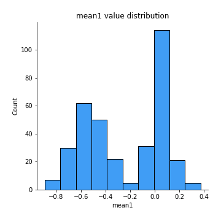
## Feature : mean2
- **Feature type** : continous
- **Missing** : 0.0%
- **Unique** : 347
- **Count** :347.0
- **Mean** :-0.25522240737889884
- **Std** :0.35027489881934115
- **Min** :-1.2805937711916069
- **25%th Percentile** : -0.5745983362633053
- **50%th Percentile** : -0.17229417140111347
- **75%th Percentile** : 0.05699570592054339
- **Max** :0.5687183922727664

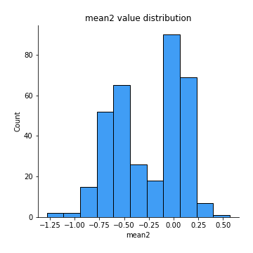
## Feature : sd1
- **Feature type** : continous
- **Missing** : 0.0%
- **Unique** : 347
- **Count** :347.0
- **Mean** :1.6208075051642274
- **Std** :0.857623129156127
- **Min** :0.7470080772831957
- **25%th Percentile** : 1.2310833894115665
- **50%th Percentile** : 1.2892295485573222
- **75%th Percentile** : 1.6755231874636776
- **Max** :9.236766377527575

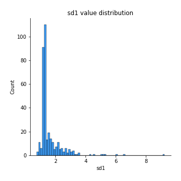
## Feature : sd2
- **Feature type** : continous
- **Missing** : 0.0%
- **Unique** : 347
- **Count** :347.0
- **Mean** :1.9251295381699383
- **Std** :0.7924348634825892
- **Min** :0.8455946193085045
- **25%th Percentile** : 1.445759715720079
- **50%th Percentile** : 1.7663004660728803
- **75%th Percentile** : 2.099976426950948
- **Max** :6.737618636746393

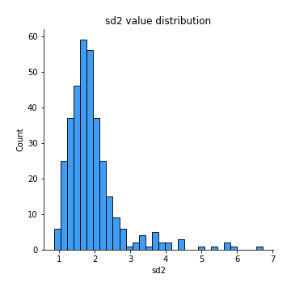
## Feature : skewness1
- **Feature type** : continous
- **Missing** : 0.0%
- **Unique** : 347
- **Count** :347.0
- **Mean** :-0.1320135911779381
- **Std** :0.557698063430316
- **Min** :-3.530116233761814
- **25%th Percentile** : -0.21146566990573287
- **50%th Percentile** : -0.05791821250814228
- **75%th Percentile** : 0.06830964298128196
- **Max** :2.224942816365292

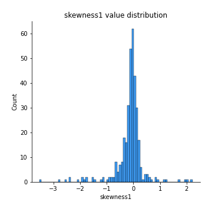
## Feature : skewness2
- **Feature type** : continous
- **Missing** : 0.0%
- **Unique** : 347
- **Count** :347.0
- **Mean** :-0.836551861992028
- **Std** :0.9349392254836354
- **Min** :-5.778144124281153
- **25%th Percentile** : -1.5869052037134939
- **50%th Percentile** : -0.9089376110679146
- **75%th Percentile** : -0.16043762737180547
- **Max** :2.2606839051517187

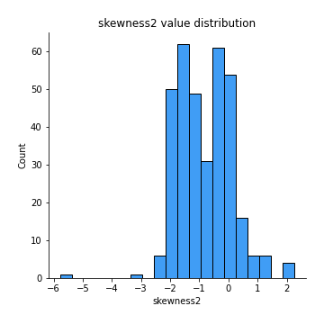
## Feature : kurtosis1
- **Feature type** : continous
- **Missing** : 0.0%
- **Unique** : 347
- **Count** :347.0
- **Mean** :3.0418841458553567
- **Std** :5.811407742277107
- **Min** :-0.5232449867069202
- **25%th Percentile** : -0.04491141724869041
- **50%th Percentile** : 0.4186212202548285
- **75%th Percentile** : 3.5848718614659205
- **Max** :36.91113889081053

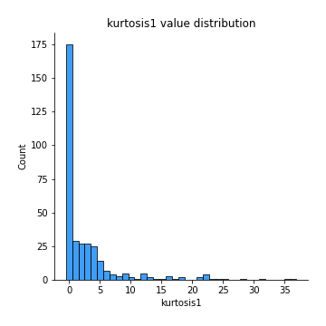
## Feature : kurtosis2
- **Feature type** : continous
- **Missing** : 0.0%
- **Unique** : 347
- **Count** :347.0
- **Mean** :4.983924774024846
- **Std** :5.987606854160069
- **Min** :-0.0776247995345063
- **25%th Percentile** : 2.2985472449946016
- **50%th Percentile** : 3.6458015402087196
- **75%th Percentile** : 5.030909651160541
- **Max** :71.39844769176813

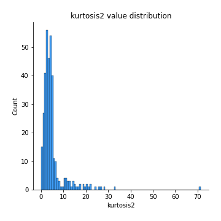
## Feature : return_autocorrelation_1_lag1
- **Feature type** : continous
- **Missing** : 0.0%
- **Unique** : 347
- **Count** :347.0
- **Mean** :0.019007085880931262
- **Std** :0.07385270120394954
- **Min** :-0.2135576224968752
- **25%th Percentile** : -0.02552770671814783
- **50%th Percentile** : 0.024609054748141124
- **75%th Percentile** : 0.06953316058168861
- **Max** :0.22297431272025123

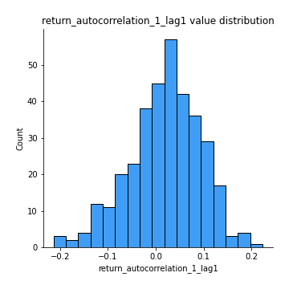
## Feature : return_autocorrelation_1_lag2
- **Feature type** : continous
- **Missing** : 0.0%
- **Unique** : 347
- **Count** :347.0
- **Mean** :0.024468026525842786
- **Std** :0.06426942890785611
- **Min** :-0.13309283796645122
- **25%th Percentile** : -0.016942668922604452
- **50%th Percentile** : 0.02429153838056115
- **75%th Percentile** : 0.07193623628356327
- **Max** :0.19052669625302351

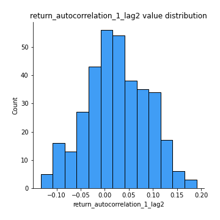
## Feature : return_autocorrelation_1_lag3
- **Feature type** : continous
- **Missing** : 0.0%
- **Unique** : 347
- **Count** :347.0
- **Mean** :0.032305273928775656
- **Std** :0.06357097339959146
- **Min** :-0.15806635192103805
- **25%th Percentile** : -0.011234037277110212
- **50%th Percentile** : 0.03344956878585196
- **75%th Percentile** : 0.0734249527839862
- **Max** :0.23453767553235452

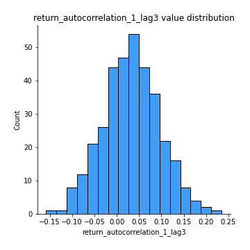
## Feature : return_autocorrelation_2_lag1
- **Feature type** : continous
- **Missing** : 0.0%
- **Unique** : 347
- **Count** :347.0
- **Mean** :0.29750652491550833
- **Std** :0.34203368701957226
- **Min** :-0.25075531010123286
- **25%th Percentile** : -0.02370892168786351
- **50%th Percentile** : 0.16349871797309318
- **75%th Percentile** : 0.64677487535176
- **Max** :0.896868805511493

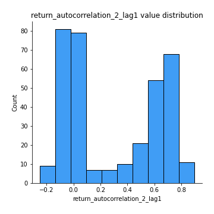
## Feature : return_autocorrelation_2_lag2
- **Feature type** : continous
- **Missing** : 0.0%
- **Unique** : 347
- **Count** :347.0
- **Mean** :0.3020816731529253
- **Std** :0.33018931341487157
- **Min** :-0.15323211089747296
- **25%th Percentile** : -0.0108165922389197
- **50%th Percentile** : 0.13713926067744384
- **75%th Percentile** : 0.6436416073932736
- **Max** :0.8911072545297541

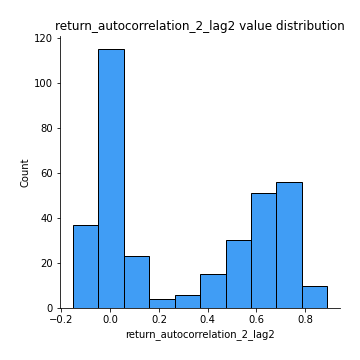
## Feature : return_autocorrelation_2_lag3
- **Feature type** : continous
- **Missing** : 0.0%
- **Unique** : 347
- **Count** :347.0
- **Mean** :0.300194131134218
- **Std** :0.32728051427033145
- **Min** :-0.14200107169559698
- **25%th Percentile** : -0.006779290810339401
- **50%th Percentile** : 0.1419999376914021
- **75%th Percentile** : 0.6360326061330179
- **Max** :0.880618751299699

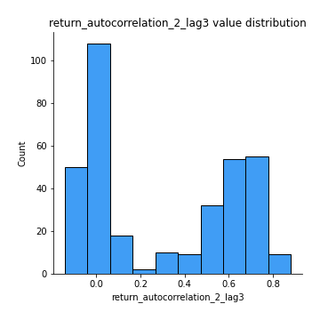
## Feature : return_correlation_ts1_lag_0
- **Feature type** : continous
- **Missing** : 0.0%
- **Unique** : 347
- **Count** :347.0
- **Mean** :0.3216894255935507
- **Std** :0.10925010131895461
- **Min** :-0.027089510445801036
- **25%th Percentile** : 0.2698885566411583
- **50%th Percentile** : 0.3241876455057691
- **75%th Percentile** : 0.369784928577669
- **Max** :0.7028422087350163

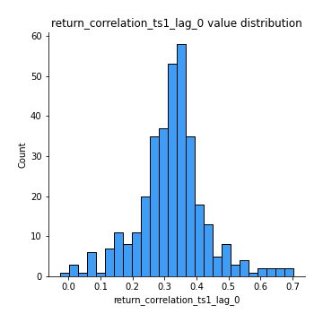
## Feature : return_correlation_ts1_lag_1
- **Feature type** : continous
- **Missing** : 0.0%
- **Unique** : 347
- **Count** :347.0
- **Mean** :0.06645178383569235
- **Std** :0.10140484353088207
- **Min** :-0.16985510949917193
- **25%th Percentile** : -0.014399621945062233
- **50%th Percentile** : 0.06147430047831889
- **75%th Percentile** : 0.1542343991066446
- **Max** :0.28732616708852055

## Feature : return_correlation_ts1_lag_2
- **Feature type** : continous
- **Missing** : 0.0%
- **Unique** : 347
- **Count** :347.0
- **Mean** :0.06907049044370067
- **Std** :0.09555865260291137
- **Min** :-0.21653581047581763
- **25%th Percentile** : -0.012673911512314348
- **50%th Percentile** : 0.0660388300808174
- **75%th Percentile** : 0.14589633528647794
- **Max** :0.30936787216206224

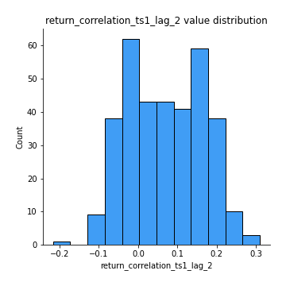
## Feature : return_correlation_ts1_lag_3
- **Feature type** : continous
- **Missing** : 0.0%
- **Unique** : 347
- **Count** :347.0
- **Mean** :0.07387479388690286
- **Std** :0.09390491064387704
- **Min** :-0.12306593817498207
- **25%th Percentile** : -0.005049621123639951
- **50%th Percentile** : 0.076331923851684
- **75%th Percentile** : 0.15050070813069844
- **Max** :0.31397584030768855

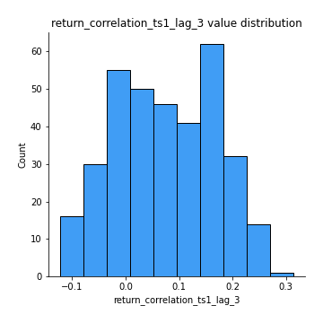
## Feature : return_correlation_ts2_lag_1
- **Feature type** : continous
- **Missing** : 0.0%
- **Unique** : 347
- **Count** :347.0
- **Mean** :0.06594306146275981
- **Std** :0.09576734112910175
- **Min** :-0.2081139431093261
- **25%th Percentile** : -0.013461300191039588
- **50%th Percentile** : 0.06194682373840076
- **75%th Percentile** : 0.15145110342262108
- **Max** :0.28507686238328317

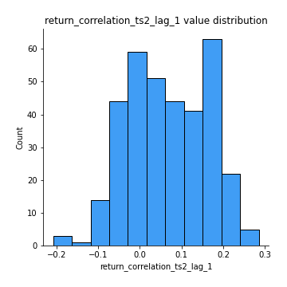
## Feature : return_correlation_ts2_lag_2
- **Feature type** : continous
- **Missing** : 0.0%
- **Unique** : 347
- **Count** :347.0
- **Mean** :0.06891847588513562
- **Std** :0.09343925940874352
- **Min** :-0.23751835475804678
- **25%th Percentile** : -0.006706523499043602
- **50%th Percentile** : 0.06087731275039304
- **75%th Percentile** : 0.14989848324503585
- **Max** :0.2922018413426908

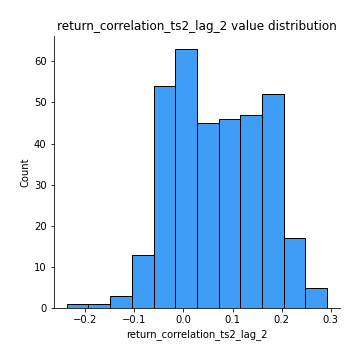
## Feature : return_correlation_ts2_lag_3
- **Feature type** : continous
- **Missing** : 0.0%
- **Unique** : 347
- **Count** :347.0
- **Mean** :0.07063822156697991
- **Std** :0.09109662192163677
- **Min** :-0.15490495486968472
- **25%th Percentile** : -0.003777353247000896
- **50%th Percentile** : 0.0670048500093504
- **75%th Percentile** : 0.14727839517489416
- **Max** :0.28181903043324524

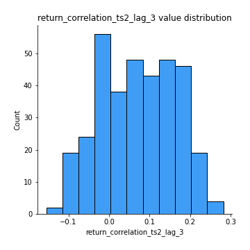
## Feature : sqreturn_autocorrelation_ts1_lag1
- **Feature type** : continous
- **Missing** : 0.0%
- **Unique** : 347
- **Count** :347.0
- **Mean** :0.06672973166325949
- **Std** :0.0908845069784423
- **Min** :-0.09801091791841847
- **25%th Percentile** : 0.009724830324710354
- **50%th Percentile** : 0.049565859640496736
- **75%th Percentile** : 0.09770397260389588
- **Max** :0.49414293176447355

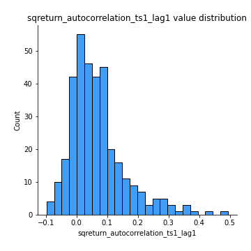
## Feature : sqreturn_autocorrelation_ts1_lag2
- **Feature type** : continous
- **Missing** : 0.0%
- **Unique** : 347
- **Count** :347.0
- **Mean** :0.056235101017280985
- **Std** :0.08564443222290923
- **Min** :-0.10277269657151572
- **25%th Percentile** : 0.0026829657610583295
- **50%th Percentile** : 0.036820457913224594
- **75%th Percentile** : 0.08541732926685142
- **Max** :0.540735851444759

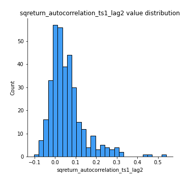
## Feature : sqreturn_autocorrelation_ts1_lag3
- **Feature type** : continous
- **Missing** : 0.0%
- **Unique** : 347
- **Count** :347.0
- **Mean** :0.045149002590558054
- **Std** :0.07689392363586617
- **Min** :-0.12409959044614279
- **25%th Percentile** : -0.005284885150637108
- **50%th Percentile** : 0.03209039846333219
- **75%th Percentile** : 0.07497318758361943
- **Max** :0.44755937369538146

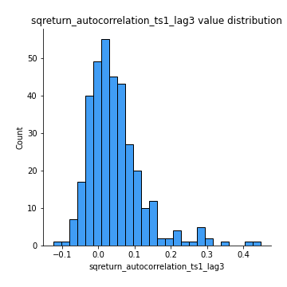
## Feature : sqreturn_autocorrelation_ts2_lag1
- **Feature type** : continous
- **Missing** : 0.0%
- **Unique** : 347
- **Count** :347.0
- **Mean** :0.44332389801834343
- **Std** :0.36339023603893394
- **Min** :-0.04997282481431907
- **25%th Percentile** : 0.08384687394187884
- **50%th Percentile** : 0.32232813308842917
- **75%th Percentile** : 0.8344747426327124
- **Max** :0.9657902672878608

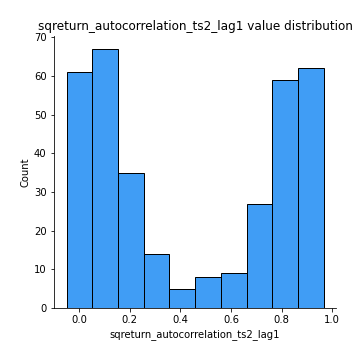
## Feature : sqreturn_autocorrelation_ts2_lag2
- **Feature type** : continous
- **Missing** : 0.0%
- **Unique** : 347
- **Count** :347.0
- **Mean** :0.42918361131407634
- **Std** :0.3726843756761272
- **Min** :-0.051523884196217395
- **25%th Percentile** : 0.040325590577819856
- **50%th Percentile** : 0.3380799547374326
- **75%th Percentile** : 0.8251328238163125
- **Max** :0.9662342987036823

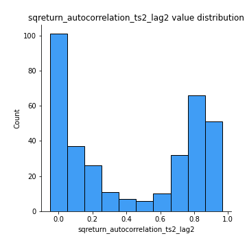
## Feature : sqreturn_autocorrelation_ts2_lag3
- **Feature type** : continous
- **Missing** : 0.0%
- **Unique** : 347
- **Count** :347.0
- **Mean** :0.4162180373787647
- **Std** :0.37899563207088377
- **Min** :-0.06082766359524085
- **25%th Percentile** : 0.038866460167832524
- **50%th Percentile** : 0.2878058608565052
- **75%th Percentile** : 0.8284583397406158
- **Max** :0.9718714135472651

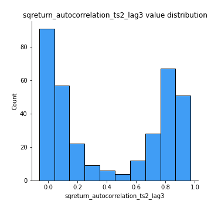
## Feature : sqreturn_correlation_ts1_lag_0
- **Feature type** : continous
- **Missing** : 0.0%
- **Unique** : 347
- **Count** :347.0
- **Mean** :0.3216894255935507
- **Std** :0.10925010131895461
- **Min** :-0.027089510445801036
- **25%th Percentile** : 0.2698885566411583
- **50%th Percentile** : 0.3241876455057691
- **75%th Percentile** : 0.369784928577669
- **Max** :0.7028422087350163

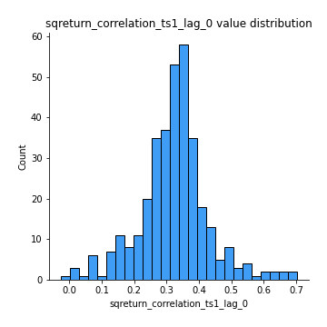
## Feature : sqreturn_correlation_ts1_lag_1
- **Feature type** : continous
- **Missing** : 0.0%
- **Unique** : 347
- **Count** :347.0
- **Mean** :0.06645178383569235
- **Std** :0.10140484353088207
- **Min** :-0.16985510949917193
- **25%th Percentile** : -0.014399621945062233
- **50%th Percentile** : 0.06147430047831889
- **75%th Percentile** : 0.1542343991066446
- **Max** :0.28732616708852055

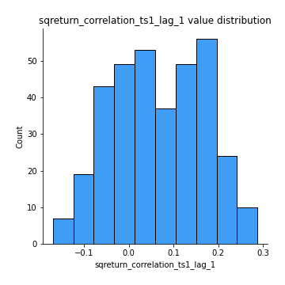
## Feature : sqreturn_correlation_ts1_lag_2
- **Feature type** : continous
- **Missing** : 0.0%
- **Unique** : 347
- **Count** :347.0
- **Mean** :0.06907049044370067
- **Std** :0.09555865260291137
- **Min** :-0.21653581047581763
- **25%th Percentile** : -0.012673911512314348
- **50%th Percentile** : 0.0660388300808174
- **75%th Percentile** : 0.14589633528647794
- **Max** :0.30936787216206224

## Feature : sqreturn_correlation_ts1_lag_3
- **Feature type** : continous
- **Missing** : 0.0%
- **Unique** : 347
- **Count** :347.0
- **Mean** :0.07387479388690286
- **Std** :0.09390491064387704
- **Min** :-0.12306593817498207
- **25%th Percentile** : -0.005049621123639951
- **50%th Percentile** : 0.076331923851684
- **75%th Percentile** : 0.15050070813069844
- **Max** :0.31397584030768855

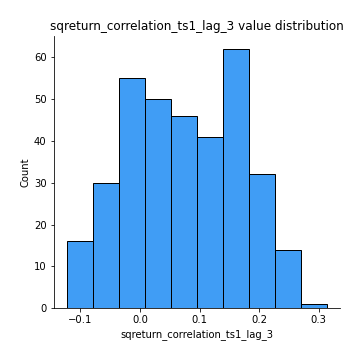
## Feature : sqreturn_correlation_ts2_lag_1
- **Feature type** : continous
- **Missing** : 0.0%
- **Unique** : 347
- **Count** :347.0
- **Mean** :0.06594306146275981
- **Std** :0.09576734112910175
- **Min** :-0.2081139431093261
- **25%th Percentile** : -0.013461300191039588
- **50%th Percentile** : 0.06194682373840076
- **75%th Percentile** : 0.15145110342262108
- **Max** :0.28507686238328317

## Feature : sqreturn_correlation_ts2_lag_2
- **Feature type** : continous
- **Missing** : 0.0%
- **Unique** : 347
- **Count** :347.0
- **Mean** :0.06891847588513562
- **Std** :0.09343925940874352
- **Min** :-0.23751835475804678
- **25%th Percentile** : -0.006706523499043602
- **50%th Percentile** : 0.06087731275039304
- **75%th Percentile** : 0.14989848324503585
- **Max** :0.2922018413426908

## Feature : sqreturn_correlation_ts2_lag_3
- **Feature type** : continous
- **Missing** : 0.0%
- **Unique** : 347
- **Count** :347.0
- **Mean** :0.07063822156697991
- **Std** :0.09109662192163677
- **Min** :-0.15490495486968472
- **25%th Percentile** : -0.003777353247000896
- **50%th Percentile** : 0.0670048500093504
- **75%th Percentile** : 0.14727839517489416
- **Max** :0.28181903043324524

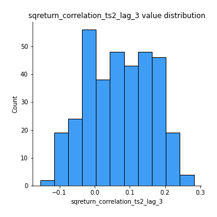
## Feature : price2_granger_cause_price1
- **Feature type** : continous
- **Missing** : 0.0%
- **Unique** : 347
- **Count** :347.0
- **Mean** :0.18059028090366372
- **Std** :0.270423979966365
- **Min** :1.6168841209426472e-36
- **25%th Percentile** : 9.590859384244508e-07
- **50%th Percentile** : 0.013743952132905829
- **75%th Percentile** : 0.28320843171633026
- **Max** :0.9885712803689185

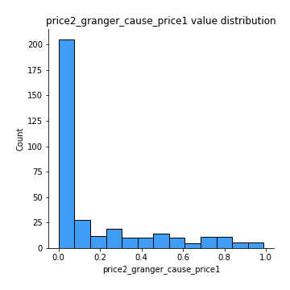
## Feature : price1_granger_cause_price2
- **Feature type** : continous
- **Missing** : 0.0%
- **Unique** : 347
- **Count** :347.0
- **Mean** :0.168528774437935
- **Std** :0.24783178831689548
- **Min** :3.967578052237933e-31
- **25%th Percentile** : 2.1077426065682845e-05
- **50%th Percentile** : 0.02083543024029141
- **75%th Percentile** : 0.2685671350450062
- **Max** :0.9951398266867577

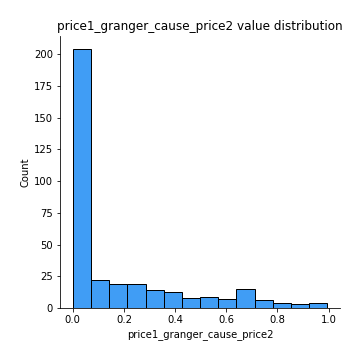

[<< Go back](../README.md)
