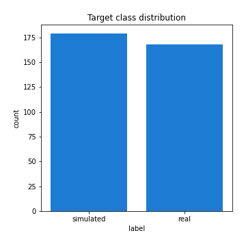
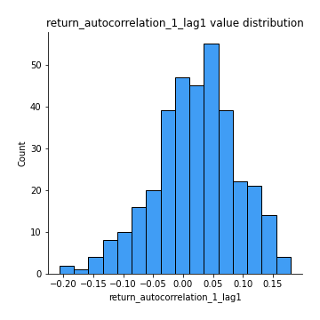
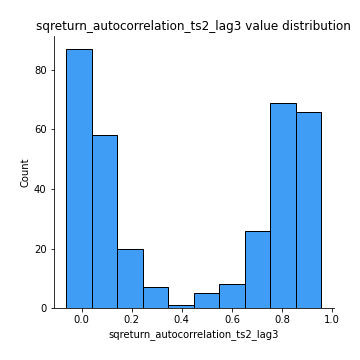

# Exploratory Data Analysis

[<< Go back](../README.md)
## Feature : target
- **Feature type** : categorical
- **Missing** : 0.0%
- **Unique** : 2
- **Count** :347
- **Unique** :2
- **Top** :simulated
- **Freq** :179

## Feature : mean1
- **Feature type** : continous
- **Missing** : 0.0%
- **Unique** : 347
- **Count** :347.0
- **Mean** :-0.24507188148295075
- **Std** :0.31143421797056503
- **Min** :-0.8427338209942623
- **25%th Percentile** : -0.5398296567561449
- **50%th Percentile** : -0.277004009790476
- **75%th Percentile** : 0.045780897688334016
- **Max** :0.37175100008111034

## Feature : mean2
- **Feature type** : continous
- **Missing** : 0.0%
- **Unique** : 347
- **Count** :347.0
- **Mean** :-0.27056779048044355
- **Std** :0.3525090674807362
- **Min** :-1.2637122193823678
- **25%th Percentile** : -0.6042698309225697
- **50%th Percentile** : -0.21818165578778434
- **75%th Percentile** : 0.059098349255906554
- **Max** :0.5782838961811019

## Feature : sd1
- **Feature type** : continous
- **Missing** : 0.0%
- **Unique** : 347
- **Count** :347.0
- **Mean** :1.599803008141169
- **Std** :0.8105736859942693
- **Min** :0.7470080772831957
- **25%th Percentile** : 1.2350683082777345
- **50%th Percentile** : 1.2858511374271704
- **75%th Percentile** : 1.6703461105138246
- **Max** :9.236766377527575

## Feature : sd2
- **Feature type** : continous
- **Missing** : 0.0%
- **Unique** : 347
- **Count** :347.0
- **Mean** :1.899334557426434
- **Std** :0.7012910079724428
- **Min** :0.8455946193085045
- **25%th Percentile** : 1.4832634345625844
- **50%th Percentile** : 1.807869905464638
- **75%th Percentile** : 2.074910915987495
- **Max** :6.737618636746393

## Feature : skewness1
- **Feature type** : continous
- **Missing** : 0.0%
- **Unique** : 347
- **Count** :347.0
- **Mean** :-0.0840586765280885
- **Std** :0.611225706644952
- **Min** :-3.530116233761814
- **25%th Percentile** : -0.15744845058342477
- **50%th Percentile** : -0.030058696136889426
- **75%th Percentile** : 0.10582194706411682
- **Max** :2.5845963767725557

## Feature : skewness2
- **Feature type** : continous
- **Missing** : 0.0%
- **Unique** : 347
- **Count** :347.0
- **Mean** :-0.9156400705017534
- **Std** :1.007995569597948
- **Min** :-8.801502855292393
- **25%th Percentile** : -1.616564724012189
- **50%th Percentile** : -1.0622108520500213
- **75%th Percentile** : -0.18245770096756
- **Max** :2.242019525651531

## Feature : kurtosis1
- **Feature type** : continous
- **Missing** : 0.0%
- **Unique** : 347
- **Count** :347.0
- **Mean** :3.2250262144646653
- **Std** :6.324550798273979
- **Min** :-0.4911901383103938
- **25%th Percentile** : -0.04869118309571219
- **50%th Percentile** : 0.3847340709384963
- **75%th Percentile** : 3.435368886158079
- **Max** :46.07507808162177

## Feature : kurtosis2
- **Feature type** : continous
- **Missing** : 0.0%
- **Unique** : 347
- **Count** :347.0
- **Mean** :5.421180162795347
- **Std** :9.298844811157657
- **Min** :0.12581920995867923
- **25%th Percentile** : 2.388665119329157
- **50%th Percentile** : 3.606699147878572
- **75%th Percentile** : 4.984993795471442
- **Max** :143.10871011533666

## Feature : return_autocorrelation_1_lag1
- **Feature type** : continous
- **Missing** : 0.0%
- **Unique** : 347
- **Count** :347.0
- **Mean** :0.020988056851369688
- **Std** :0.0691457385777293
- **Min** :-0.20673896439036124
- **25%th Percentile** : -0.020152461076982348
- **50%th Percentile** : 0.025419842879159927
- **75%th Percentile** : 0.06889796434150132
- **Max** :0.1796747757668762

## Feature : return_autocorrelation_1_lag2
- **Feature type** : continous
- **Missing** : 0.0%
- **Unique** : 347
- **Count** :347.0
- **Mean** :0.02454727801214988
- **Std** :0.062242230320610964
- **Min** :-0.11950109167626709
- **25%th Percentile** : -0.01673081531095167
- **50%th Percentile** : 0.02193259302285961
- **75%th Percentile** : 0.06906871251592862
- **Max** :0.1795482362370176

## Feature : return_autocorrelation_1_lag3
- **Feature type** : continous
- **Missing** : 0.0%
- **Unique** : 347
- **Count** :347.0
- **Mean** :0.024787903579572477
- **Std** :0.06381792530739805
- **Min** :-0.1940836867390813
- **25%th Percentile** : -0.017810364176424114
- **50%th Percentile** : 0.0236770646125004
- **75%th Percentile** : 0.06627303338147263
- **Max** :0.17805869530681923

## Feature : return_autocorrelation_2_lag1
- **Feature type** : continous
- **Missing** : 0.0%
- **Unique** : 347
- **Count** :347.0
- **Mean** :0.31274843625519855
- **Std** :0.3473304811610218
- **Min** :-0.25075531010123286
- **25%th Percentile** : -0.019044151913358082
- **50%th Percentile** : 0.28269096306271085
- **75%th Percentile** : 0.659153640854987
- **Max** :0.8909940121543862

## Feature : return_autocorrelation_2_lag2
- **Feature type** : continous
- **Missing** : 0.0%
- **Unique** : 347
- **Count** :347.0
- **Mean** :0.3216234656478648
- **Std** :0.3347965137787541
- **Min** :-0.1495113937562178
- **25%th Percentile** : -0.00740080760542283
- **50%th Percentile** : 0.2988756375618416
- **75%th Percentile** : 0.6582771216167997
- **Max** :0.8742472959971482

## Feature : return_autocorrelation_2_lag3
- **Feature type** : continous
- **Missing** : 0.0%
- **Unique** : 347
- **Count** :347.0
- **Mean** :0.31439540542100314
- **Std** :0.3330872730769904
- **Min** :-0.14200107169559698
- **25%th Percentile** : -0.009702341767227955
- **50%th Percentile** : 0.31169273167022965
- **75%th Percentile** : 0.6527594910400472
- **Max** :0.8814650039094037

## Feature : return_correlation_ts1_lag_0
- **Feature type** : continous
- **Missing** : 0.0%
- **Unique** : 347
- **Count** :347.0
- **Mean** :0.32050679536289517
- **Std** :0.1102059268622881
- **Min** :-0.027089510445801036
- **25%th Percentile** : 0.26465362750531884
- **50%th Percentile** : 0.3280505116330136
- **75%th Percentile** : 0.3710202940133813
- **Max** :0.7041861626832071

## Feature : return_correlation_ts1_lag_1
- **Feature type** : continous
- **Missing** : 0.0%
- **Unique** : 347
- **Count** :347.0
- **Mean** :0.06978053817351114
- **Std** :0.10270058541525938
- **Min** :-0.15776193292681923
- **25%th Percentile** : -0.012500261007805324
- **50%th Percentile** : 0.07424793774505052
- **75%th Percentile** : 0.15530094135850506
- **Max** :0.2863636532116889

## Feature : return_correlation_ts1_lag_2
- **Feature type** : continous
- **Missing** : 0.0%
- **Unique** : 347
- **Count** :347.0
- **Mean** :0.07785764263875561
- **Std** :0.09531889936443631
- **Min** :-0.12864410180561703
- **25%th Percentile** : -0.0008559760563118977
- **50%th Percentile** : 0.07624632743978074
- **75%th Percentile** : 0.1574217739598337
- **Max** :0.3054009820583554

## Feature : return_correlation_ts1_lag_3
- **Feature type** : continous
- **Missing** : 0.0%
- **Unique** : 347
- **Count** :347.0
- **Mean** :0.07259071226637465
- **Std** :0.09783052369800833
- **Min** :-0.19880585687411928
- **25%th Percentile** : -0.00628983279664014
- **50%th Percentile** : 0.06700963868304387
- **75%th Percentile** : 0.14979988017013776
- **Max** :0.29224881925610624

## Feature : return_correlation_ts2_lag_1
- **Feature type** : continous
- **Missing** : 0.0%
- **Unique** : 347
- **Count** :347.0
- **Mean** :0.06537997178707201
- **Std** :0.10035730965315784
- **Min** :-0.2081139431093261
- **25%th Percentile** : -0.013828890375101507
- **50%th Percentile** : 0.06676380846422836
- **75%th Percentile** : 0.14584924378655187
- **Max** :0.2785837985769877

## Feature : return_correlation_ts2_lag_2
- **Feature type** : continous
- **Missing** : 0.0%
- **Unique** : 347
- **Count** :347.0
- **Mean** :0.07358998695828368
- **Std** :0.09546631719239428
- **Min** :-0.23751835475804678
- **25%th Percentile** : -0.003434919576595386
- **50%th Percentile** : 0.07245939502077892
- **75%th Percentile** : 0.15161882626268905
- **Max** :0.32216399554566666

## Feature : return_correlation_ts2_lag_3
- **Feature type** : continous
- **Missing** : 0.0%
- **Unique** : 347
- **Count** :347.0
- **Mean** :0.06914574215912894
- **Std** :0.09588317290880821
- **Min** :-0.16212823605110202
- **25%th Percentile** : -0.005974205230168661
- **50%th Percentile** : 0.06629597773069457
- **75%th Percentile** : 0.14608066271981407
- **Max** :0.33099137194850625

## Feature : sqreturn_autocorrelation_ts1_lag1
- **Feature type** : continous
- **Missing** : 0.0%
- **Unique** : 347
- **Count** :347.0
- **Mean** :0.06027539754806838
- **Std** :0.0871539744289143
- **Min** :-0.10510038141948674
- **25%th Percentile** : 0.010021671234898222
- **50%th Percentile** : 0.04067952983272183
- **75%th Percentile** : 0.0911222812063712
- **Max** :0.49414293176447355

## Feature : sqreturn_autocorrelation_ts1_lag2
- **Feature type** : continous
- **Missing** : 0.0%
- **Unique** : 347
- **Count** :347.0
- **Mean** :0.054016332753133764
- **Std** :0.08559688490312338
- **Min** :-0.08276890245028826
- **25%th Percentile** : 0.002495780442726322
- **50%th Percentile** : 0.031321149234482884
- **75%th Percentile** : 0.07928708555236243
- **Max** :0.4522162366773919

## Feature : sqreturn_autocorrelation_ts1_lag3
- **Feature type** : continous
- **Missing** : 0.0%
- **Unique** : 347
- **Count** :347.0
- **Mean** :0.048059290229396374
- **Std** :0.0792495454166268
- **Min** :-0.09711410538823421
- **25%th Percentile** : -0.003192894865194286
- **50%th Percentile** : 0.029789059461591393
- **75%th Percentile** : 0.07780994913374417
- **Max** :0.44755937369538146

## Feature : sqreturn_autocorrelation_ts2_lag1
- **Feature type** : continous
- **Missing** : 0.0%
- **Unique** : 347
- **Count** :347.0
- **Mean** :0.4565654095951643
- **Std** :0.3738739573858078
- **Min** :-0.08520586663750691
- **25%th Percentile** : 0.07077590058488178
- **50%th Percentile** : 0.4387874625900537
- **75%th Percentile** : 0.8390125640393119
- **Max** :0.959697445375683

## Feature : sqreturn_autocorrelation_ts2_lag2
- **Feature type** : continous
- **Missing** : 0.0%
- **Unique** : 347
- **Count** :347.0
- **Mean** :0.45103855510038066
- **Std** :0.3797455484065155
- **Min** :-0.051523884196217395
- **25%th Percentile** : 0.046081836434424206
- **50%th Percentile** : 0.4732665444556156
- **75%th Percentile** : 0.8411853019669417
- **Max** :0.9472739223133195

## Feature : sqreturn_autocorrelation_ts2_lag3
- **Feature type** : continous
- **Missing** : 0.0%
- **Unique** : 347
- **Count** :347.0
- **Mean** :0.4364747255695079
- **Std** :0.385954606084236
- **Min** :-0.06065894750062144
- **25%th Percentile** : 0.04013730036265499
- **50%th Percentile** : 0.46559879289022504
- **75%th Percentile** : 0.8305352628736691
- **Max** :0.956794422578542

## Feature : sqreturn_correlation_ts1_lag_0
- **Feature type** : continous
- **Missing** : 0.0%
- **Unique** : 347
- **Count** :347.0
- **Mean** :0.32050679536289517
- **Std** :0.1102059268622881
- **Min** :-0.027089510445801036
- **25%th Percentile** : 0.26465362750531884
- **50%th Percentile** : 0.3280505116330136
- **75%th Percentile** : 0.3710202940133813
- **Max** :0.7041861626832071

## Feature : sqreturn_correlation_ts1_lag_1
- **Feature type** : continous
- **Missing** : 0.0%
- **Unique** : 347
- **Count** :347.0
- **Mean** :0.06978053817351114
- **Std** :0.10270058541525938
- **Min** :-0.15776193292681923
- **25%th Percentile** : -0.012500261007805324
- **50%th Percentile** : 0.07424793774505052
- **75%th Percentile** : 0.15530094135850506
- **Max** :0.2863636532116889

## Feature : sqreturn_correlation_ts1_lag_2
- **Feature type** : continous
- **Missing** : 0.0%
- **Unique** : 347
- **Count** :347.0
- **Mean** :0.07785764263875561
- **Std** :0.09531889936443631
- **Min** :-0.12864410180561703
- **25%th Percentile** : -0.0008559760563118977
- **50%th Percentile** : 0.07624632743978074
- **75%th Percentile** : 0.1574217739598337
- **Max** :0.3054009820583554

## Feature : sqreturn_correlation_ts1_lag_3
- **Feature type** : continous
- **Missing** : 0.0%
- **Unique** : 347
- **Count** :347.0
- **Mean** :0.07259071226637465
- **Std** :0.09783052369800833
- **Min** :-0.19880585687411928
- **25%th Percentile** : -0.00628983279664014
- **50%th Percentile** : 0.06700963868304387
- **75%th Percentile** : 0.14979988017013776
- **Max** :0.29224881925610624

## Feature : sqreturn_correlation_ts2_lag_1
- **Feature type** : continous
- **Missing** : 0.0%
- **Unique** : 347
- **Count** :347.0
- **Mean** :0.06537997178707201
- **Std** :0.10035730965315784
- **Min** :-0.2081139431093261
- **25%th Percentile** : -0.013828890375101507
- **50%th Percentile** : 0.06676380846422836
- **75%th Percentile** : 0.14584924378655187
- **Max** :0.2785837985769877

## Feature : sqreturn_correlation_ts2_lag_2
- **Feature type** : continous
- **Missing** : 0.0%
- **Unique** : 347
- **Count** :347.0
- **Mean** :0.07358998695828368
- **Std** :0.09546631719239428
- **Min** :-0.23751835475804678
- **25%th Percentile** : -0.003434919576595386
- **50%th Percentile** : 0.07245939502077892
- **75%th Percentile** : 0.15161882626268905
- **Max** :0.32216399554566666

## Feature : sqreturn_correlation_ts2_lag_3
- **Feature type** : continous
- **Missing** : 0.0%
- **Unique** : 347
- **Count** :347.0
- **Mean** :0.06914574215912894
- **Std** :0.09588317290880821
- **Min** :-0.16212823605110202
- **25%th Percentile** : -0.005974205230168661
- **50%th Percentile** : 0.06629597773069457
- **75%th Percentile** : 0.14608066271981407
- **Max** :0.33099137194850625

## Feature : price2_granger_cause_price1
- **Feature type** : continous
- **Missing** : 0.0%
- **Unique** : 347
- **Count** :347.0
- **Mean** :0.18061214394245265
- **Std** :0.27439573096864833
- **Min** :1.8200856996322183e-31
- **25%th Percentile** : 2.1972170126256056e-07
- **50%th Percentile** : 0.00983017927856528
- **75%th Percentile** : 0.29204710003063694
- **Max** :0.9885712803689185

## Feature : price1_granger_cause_price2
- **Feature type** : continous
- **Missing** : 0.0%
- **Unique** : 347
- **Count** :347.0
- **Mean** :0.17352828896998104
- **Std** :0.25452546298939716
- **Min** :7.472940008376977e-39
- **25%th Percentile** : 7.46021751158336e-06
- **50%th Percentile** : 0.01588744432454305
- **75%th Percentile** : 0.2759021306176978
- **Max** :0.9968474224969014

[<< Go back](../README.md)
