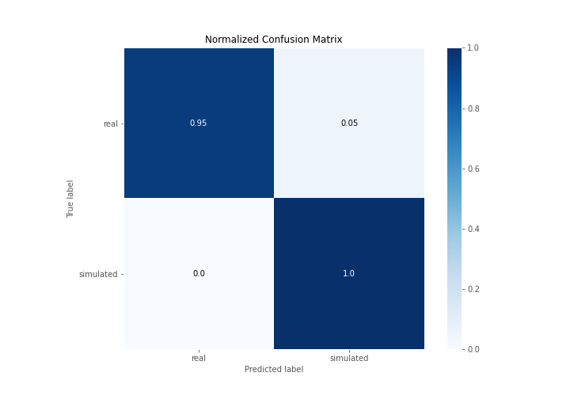

# Summary of 3_Linear

[<< Go back](../README.md)

## Logistic Regression (Linear)
- **n_jobs**: -1
- **explain_level**: 2

## Validation
 - **validation_type**: split
 - **train_ratio**: 0.75
 - **shuffle**: True
 - **stratify**: True

## Optimized metric
accuracy

## Training time

9.0 seconds

## Metric details
|           |    score |     threshold |
|:----------|---------:|--------------:|
| logloss   | 0.148497 | nan           |
| auc       | 0.998414 | nan           |
| f1        | 0.977273 |   0.494301    |
| accuracy  | 0.977011 |   0.494301    |
| precision | 1        |   0.866698    |
| recall    | 1        |   6.08872e-11 |
| mcc       | 0.95505  |   0.494301    |

## Confusion matrix (at threshold=0.494301)
|                      |   Predicted as real |   Predicted as simulated |
|:---------------------|--------------------:|-------------------------:|
| Labeled as real      |                  42 |                        2 |
| Labeled as simulated |                   0 |                       43 |

## Learning curves

## Coefficients
| feature                           |   Learner_1 |
|:----------------------------------|------------:|
| skewness2                         |   0.854732  |
| return_autocorrelation_2_lag1     |   0.551732  |
| sd1                               |   0.381003  |
| return_correlation_ts1_lag_1      |   0.353666  |
| sqreturn_correlation_ts1_lag_1    |   0.353666  |
| return_autocorrelation_2_lag3     |   0.329489  |
| return_correlation_ts2_lag_3      |   0.285596  |
| sqreturn_correlation_ts2_lag_3    |   0.285596  |
| return_autocorrelation_1_lag2     |   0.272415  |
| sqreturn_correlation_ts2_lag_2    |   0.238002  |
| return_correlation_ts2_lag_2      |   0.238002  |
| return_autocorrelation_2_lag2     |   0.204603  |
| return_correlation_ts1_lag_3      |   0.179868  |
| sqreturn_correlation_ts1_lag_3    |   0.179868  |
| sqreturn_correlation_ts2_lag_1    |   0.179312  |
| return_correlation_ts2_lag_1      |   0.179312  |
| mean2                             |   0.175308  |
| return_autocorrelation_1_lag3     |   0.170758  |
| return_autocorrelation_1_lag1     |   0.120471  |
| sqreturn_correlation_ts1_lag_2    |   0.113688  |
| return_correlation_ts1_lag_2      |   0.113688  |
| skewness1                         |   0.094489  |
| sqreturn_correlation_ts1_lag_0    |  -0.0227963 |
| return_correlation_ts1_lag_0      |  -0.0227963 |
| sd2                               |  -0.276797  |
| price1_granger_cause_price2       |  -0.281089  |
| mean1                             |  -0.299419  |
| price2_granger_cause_price1       |  -0.796833  |
| sqreturn_autocorrelation_ts2_lag3 |  -0.872999  |
| sqreturn_autocorrelation_ts1_lag3 |  -0.873584  |
| sqreturn_autocorrelation_ts2_lag2 |  -0.954778  |
| sqreturn_autocorrelation_ts1_lag2 |  -1.06408   |
| sqreturn_autocorrelation_ts1_lag1 |  -1.22889   |
| intercept                         |  -1.32872   |
| sqreturn_autocorrelation_ts2_lag1 |  -1.37888   |
| kurtosis2                         |  -3.51229   |
| kurtosis1                         |  -4.40171   |

## Permutation-based Importance

## Confusion Matrix

## Normalized Confusion Matrix

## ROC Curve

## Kolmogorov-Smirnov Statistic

## Precision-Recall Curve

## Calibration Curve

## Cumulative Gains Curve

## Lift Curve

## SHAP Importance

## SHAP Dependence plots

### Dependence (Fold 1)

## SHAP Decision plots

### Top-10 Worst decisions for class 0 (Fold 1)

### Top-10 Best decisions for class 0 (Fold 1)

### Top-10 Worst decisions for class 1 (Fold 1)

### Top-10 Best decisions for class 1 (Fold 1)

[<< Go back](../README.md)
