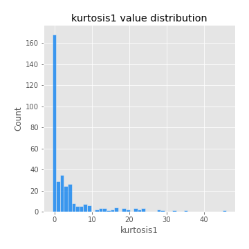
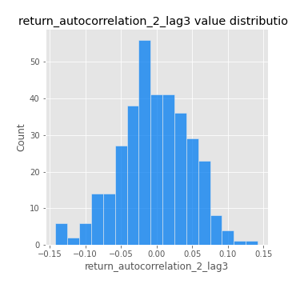
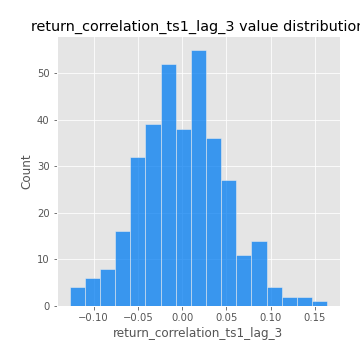
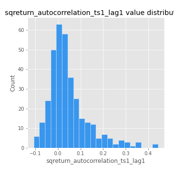

# Exploratory Data Analysis

[<< Go back](../README.md)
## Feature : target
- **Feature type** : categorical
- **Missing** : 0.0%
- **Unique** : 2
- **Count** :347
- **Unique** :2
- **Top** :real
- **Freq** :176

## Feature : mean1
- **Feature type** : continous
- **Missing** : 0.0%
- **Unique** : 347
- **Count** :347.0
- **Mean** :0.05457382471364368
- **Std** :0.08427682533140689
- **Min** :-0.22632637961920957
- **25%th Percentile** : -0.002324321823342917
- **50%th Percentile** : 0.0538114414292508
- **75%th Percentile** : 0.1044795169412874
- **Max** :0.37175100008111034

## Feature : mean2
- **Feature type** : continous
- **Missing** : 0.0%
- **Unique** : 347
- **Count** :347.0
- **Mean** :0.07862568962023654
- **Std** :0.08558660400280503
- **Min** :-0.24205418062825398
- **25%th Percentile** : 0.03105916684228828
- **50%th Percentile** : 0.07560207566623522
- **75%th Percentile** : 0.1344302682547434
- **Max** :0.37616608147096464

## Feature : sd1
- **Feature type** : continous
- **Missing** : 0.0%
- **Unique** : 347
- **Count** :347.0
- **Mean** :1.8927472824662042
- **Std** :0.7510173092875558
- **Min** :0.7470080772831957
- **25%th Percentile** : 1.6733509823646724
- **50%th Percentile** : 1.814259484393695
- **75%th Percentile** : 1.8928886447340796
- **Max** :9.236766377527575

## Feature : sd2
- **Feature type** : continous
- **Missing** : 0.0%
- **Unique** : 347
- **Count** :347.0
- **Mean** :1.8071223723932524
- **Std** :0.7575634921735444
- **Min** :0.8455946193085045
- **25%th Percentile** : 1.5657800895263434
- **50%th Percentile** : 1.6435259640813977
- **75%th Percentile** : 1.737348871418336
- **Max** :6.737618636746393

## Feature : skewness1
- **Feature type** : continous
- **Missing** : 0.0%
- **Unique** : 347
- **Count** :347.0
- **Mean** :-0.07708691759998794
- **Std** :0.6131654007470716
- **Min** :-3.530116233761814
- **25%th Percentile** : -0.1741771405368256
- **50%th Percentile** : -0.016165458903382345
- **75%th Percentile** : 0.09841953306039712
- **Max** :2.5845963767725557

## Feature : skewness2
- **Feature type** : continous
- **Missing** : 0.0%
- **Unique** : 347
- **Count** :347.0
- **Mean** :-0.16309099345382239
- **Std** :0.8254544577116766
- **Min** :-8.801502855292393
- **25%th Percentile** : -0.25486328367368943
- **50%th Percentile** : -0.0357259143656495
- **75%th Percentile** : 0.08973852330381235
- **Max** :2.2606839051517187

## Feature : kurtosis1
- **Feature type** : continous
- **Missing** : 0.0%
- **Unique** : 347
- **Count** :347.0
- **Mean** :3.396762507534366
- **Std** :6.41636173378618
- **Min** :-0.5811413967425287
- **25%th Percentile** : -0.012820694891997775
- **50%th Percentile** : 0.6819093157517129
- **75%th Percentile** : 3.6512465710229476
- **Max** :46.07507808162177

## Feature : kurtosis2
- **Feature type** : continous
- **Missing** : 0.0%
- **Unique** : 347
- **Count** :347.0
- **Mean** :3.992604649889274
- **Std** :10.529454487679056
- **Min** :-0.5406822916644072
- **25%th Percentile** : -0.020651877790337947
- **50%th Percentile** : 0.6208695975279284
- **75%th Percentile** : 4.3612884611668505
- **Max** :143.10871011533666

## Feature : return_autocorrelation_1_lag1
- **Feature type** : continous
- **Missing** : 0.0%
- **Unique** : 347
- **Count** :347.0
- **Mean** :-0.01143897773124061
- **Std** :0.057453988169356235
- **Min** :-0.19339575314049967
- **25%th Percentile** : -0.04655233580873032
- **50%th Percentile** : -0.004799298360894114
- **75%th Percentile** : 0.02634560414143719
- **Max** :0.15469369687435836

## Feature : return_autocorrelation_1_lag2
- **Feature type** : continous
- **Missing** : 0.0%
- **Unique** : 347
- **Count** :347.0
- **Mean** :-0.00827431121491012
- **Std** :0.048615233577377986
- **Min** :-0.13450421668377602
- **25%th Percentile** : -0.03902030474004158
- **50%th Percentile** : -0.00653044905047164
- **75%th Percentile** : 0.02260322063051033
- **Max** :0.1561488228015672

## Feature : return_autocorrelation_1_lag3
- **Feature type** : continous
- **Missing** : 0.0%
- **Unique** : 347
- **Count** :347.0
- **Mean** :0.000951324020666538
- **Std** :0.049136421027938144
- **Min** :-0.15117275786205733
- **25%th Percentile** : -0.028819914913027087
- **50%th Percentile** : 0.0004661836645243613
- **75%th Percentile** : 0.033428056881941406
- **Max** :0.17805869530681923

## Feature : return_autocorrelation_2_lag1
- **Feature type** : continous
- **Missing** : 0.0%
- **Unique** : 347
- **Count** :347.0
- **Mean** :-0.008152803588869457
- **Std** :0.06232751812226841
- **Min** :-0.25075531010123286
- **25%th Percentile** : -0.04104169040561238
- **50%th Percentile** : -0.0014327133341762272
- **75%th Percentile** : 0.029806880497858824
- **Max** :0.31863413537898483

## Feature : return_autocorrelation_2_lag2
- **Feature type** : continous
- **Missing** : 0.0%
- **Unique** : 347
- **Count** :347.0
- **Mean** :-0.004960047889571569
- **Std** :0.05218619708007454
- **Min** :-0.15323211089747296
- **25%th Percentile** : -0.03495365600065874
- **50%th Percentile** : -0.007521628340500333
- **75%th Percentile** : 0.026180737023124692
- **Max** :0.20974504043791217

## Feature : return_autocorrelation_2_lag3
- **Feature type** : continous
- **Missing** : 0.0%
- **Unique** : 347
- **Count** :347.0
- **Mean** :-0.0031190950536534507
- **Std** :0.04857842881102868
- **Min** :-0.14200107169559698
- **25%th Percentile** : -0.03166446021806525
- **50%th Percentile** : -0.0032274271295912836
- **75%th Percentile** : 0.028801405928825963
- **Max** :0.1419999376914021

## Feature : return_correlation_ts1_lag_0
- **Feature type** : continous
- **Missing** : 0.0%
- **Unique** : 347
- **Count** :347.0
- **Mean** :0.30936542288075153
- **Std** :0.11095412276711822
- **Min** :-0.027089510445801036
- **25%th Percentile** : 0.2587379783902928
- **50%th Percentile** : 0.3072906765958005
- **75%th Percentile** : 0.34955516147355803
- **Max** :0.7041861626832071

## Feature : return_correlation_ts1_lag_1
- **Feature type** : continous
- **Missing** : 0.0%
- **Unique** : 347
- **Count** :347.0
- **Mean** :-0.0017834274305052152
- **Std** :0.049650367348779104
- **Min** :-0.15776193292681923
- **25%th Percentile** : -0.03653695247393392
- **50%th Percentile** : 0.004394072236395923
- **75%th Percentile** : 0.02983171422333477
- **Max** :0.15499424718508623

## Feature : return_correlation_ts1_lag_2
- **Feature type** : continous
- **Missing** : 0.0%
- **Unique** : 347
- **Count** :347.0
- **Mean** :-0.0017681050329823782
- **Std** :0.044014854650375475
- **Min** :-0.11523251525020971
- **25%th Percentile** : -0.030244794346329602
- **50%th Percentile** : -0.003177613450310972
- **75%th Percentile** : 0.027904134801303118
- **Max** :0.10925794766608564

## Feature : return_correlation_ts1_lag_3
- **Feature type** : continous
- **Missing** : 0.0%
- **Unique** : 347
- **Count** :347.0
- **Mean** :0.001257576593949908
- **Std** :0.04792730203491799
- **Min** :-0.1270218498974763
- **25%th Percentile** : -0.03210731251101072
- **50%th Percentile** : 0.0005085061733351187
- **75%th Percentile** : 0.0313862748220075
- **Max** :0.1636773216468148

## Feature : return_correlation_ts2_lag_1
- **Feature type** : continous
- **Missing** : 0.0%
- **Unique** : 347
- **Count** :347.0
- **Mean** :-0.005418424161267279
- **Std** :0.05342461035895179
- **Min** :-0.20093919236581337
- **25%th Percentile** : -0.03791507147509373
- **50%th Percentile** : -0.0031858225227619657
- **75%th Percentile** : 0.028583227054499342
- **Max** :0.12176523928253355

## Feature : return_correlation_ts2_lag_2
- **Feature type** : continous
- **Missing** : 0.0%
- **Unique** : 347
- **Count** :347.0
- **Mean** :-0.0009116755369259782
- **Std** :0.04883286484999088
- **Min** :-0.15299951737180204
- **25%th Percentile** : -0.03164019901610411
- **50%th Percentile** : -0.0027358749519114604
- **75%th Percentile** : 0.03014208222936008
- **Max** :0.20772887392904255

## Feature : return_correlation_ts2_lag_3
- **Feature type** : continous
- **Missing** : 0.0%
- **Unique** : 347
- **Count** :347.0
- **Mean** :-0.0027967040209727983
- **Std** :0.05062342465583869
- **Min** :-0.17564076057312866
- **25%th Percentile** : -0.030890495977046364
- **50%th Percentile** : -0.0025691793302200644
- **75%th Percentile** : 0.030897002260749273
- **Max** :0.13128380114518473

## Feature : sqreturn_autocorrelation_ts1_lag1
- **Feature type** : continous
- **Missing** : 0.0%
- **Unique** : 347
- **Count** :347.0
- **Mean** :0.04712496837679895
- **Std** :0.08989507839400639
- **Min** :-0.10742494199458012
- **25%th Percentile** : -0.009364913316320181
- **50%th Percentile** : 0.02417154477171563
- **75%th Percentile** : 0.07951258026436825
- **Max** :0.4439086285737898

## Feature : sqreturn_autocorrelation_ts1_lag2
- **Feature type** : continous
- **Missing** : 0.0%
- **Unique** : 347
- **Count** :347.0
- **Mean** :0.04080066355241571
- **Std** :0.08260392442208242
- **Min** :-0.10214490186232539
- **25%th Percentile** : -0.011498562901812167
- **50%th Percentile** : 0.017964923738783514
- **75%th Percentile** : 0.06580683724504793
- **Max** :0.4522162366773919

## Feature : sqreturn_autocorrelation_ts1_lag3
- **Feature type** : continous
- **Missing** : 0.0%
- **Unique** : 347
- **Count** :347.0
- **Mean** :0.03154389298275056
- **Std** :0.07351038105105222
- **Min** :-0.13774402976051522
- **25%th Percentile** : -0.01211877404871591
- **50%th Percentile** : 0.017430821874108566
- **75%th Percentile** : 0.061106874061175084
- **Max** :0.41030914918857014

## Feature : sqreturn_autocorrelation_ts2_lag1
- **Feature type** : continous
- **Missing** : 0.0%
- **Unique** : 347
- **Count** :347.0
- **Mean** :0.04935567547063893
- **Std** :0.08988039622725155
- **Min** :-0.11053065098871978
- **25%th Percentile** : -0.005493371566972057
- **50%th Percentile** : 0.02882142631335556
- **75%th Percentile** : 0.08343447905876857
- **Max** :0.510085647437958

## Feature : sqreturn_autocorrelation_ts2_lag2
- **Feature type** : continous
- **Missing** : 0.0%
- **Unique** : 347
- **Count** :347.0
- **Mean** :0.036801043772021376
- **Std** :0.0878702190279506
- **Min** :-0.1553340179248813
- **25%th Percentile** : -0.013335701919114588
- **50%th Percentile** : 0.017910399080895156
- **75%th Percentile** : 0.05610621514153219
- **Max** :0.45676817892778204

## Feature : sqreturn_autocorrelation_ts2_lag3
- **Feature type** : continous
- **Missing** : 0.0%
- **Unique** : 347
- **Count** :347.0
- **Mean** :0.026997253363692617
- **Std** :0.07243267691978843
- **Min** :-0.11584804985445009
- **25%th Percentile** : -0.017921639657270134
- **50%th Percentile** : 0.01369761785042116
- **75%th Percentile** : 0.05493528149415161
- **Max** :0.31225727797735664

## Feature : sqreturn_correlation_ts1_lag_0
- **Feature type** : continous
- **Missing** : 0.0%
- **Unique** : 347
- **Count** :347.0
- **Mean** :0.30936542288075153
- **Std** :0.11095412276711822
- **Min** :-0.027089510445801036
- **25%th Percentile** : 0.2587379783902928
- **50%th Percentile** : 0.3072906765958005
- **75%th Percentile** : 0.34955516147355803
- **Max** :0.7041861626832071

## Feature : sqreturn_correlation_ts1_lag_1
- **Feature type** : continous
- **Missing** : 0.0%
- **Unique** : 347
- **Count** :347.0
- **Mean** :-0.0017834274305052152
- **Std** :0.049650367348779104
- **Min** :-0.15776193292681923
- **25%th Percentile** : -0.03653695247393392
- **50%th Percentile** : 0.004394072236395923
- **75%th Percentile** : 0.02983171422333477
- **Max** :0.15499424718508623

## Feature : sqreturn_correlation_ts1_lag_2
- **Feature type** : continous
- **Missing** : 0.0%
- **Unique** : 347
- **Count** :347.0
- **Mean** :-0.0017681050329823782
- **Std** :0.044014854650375475
- **Min** :-0.11523251525020971
- **25%th Percentile** : -0.030244794346329602
- **50%th Percentile** : -0.003177613450310972
- **75%th Percentile** : 0.027904134801303118
- **Max** :0.10925794766608564

## Feature : sqreturn_correlation_ts1_lag_3
- **Feature type** : continous
- **Missing** : 0.0%
- **Unique** : 347
- **Count** :347.0
- **Mean** :0.001257576593949908
- **Std** :0.04792730203491799
- **Min** :-0.1270218498974763
- **25%th Percentile** : -0.03210731251101072
- **50%th Percentile** : 0.0005085061733351187
- **75%th Percentile** : 0.0313862748220075
- **Max** :0.1636773216468148

## Feature : sqreturn_correlation_ts2_lag_1
- **Feature type** : continous
- **Missing** : 0.0%
- **Unique** : 347
- **Count** :347.0
- **Mean** :-0.005418424161267279
- **Std** :0.05342461035895179
- **Min** :-0.20093919236581337
- **25%th Percentile** : -0.03791507147509373
- **50%th Percentile** : -0.0031858225227619657
- **75%th Percentile** : 0.028583227054499342
- **Max** :0.12176523928253355

## Feature : sqreturn_correlation_ts2_lag_2
- **Feature type** : continous
- **Missing** : 0.0%
- **Unique** : 347
- **Count** :347.0
- **Mean** :-0.0009116755369259782
- **Std** :0.04883286484999088
- **Min** :-0.15299951737180204
- **25%th Percentile** : -0.03164019901610411
- **50%th Percentile** : -0.0027358749519114604
- **75%th Percentile** : 0.03014208222936008
- **Max** :0.20772887392904255

## Feature : sqreturn_correlation_ts2_lag_3
- **Feature type** : continous
- **Missing** : 0.0%
- **Unique** : 347
- **Count** :347.0
- **Mean** :-0.0027967040209727983
- **Std** :0.05062342465583869
- **Min** :-0.17564076057312866
- **25%th Percentile** : -0.030890495977046364
- **50%th Percentile** : -0.0025691793302200644
- **75%th Percentile** : 0.030897002260749273
- **Max** :0.13128380114518473

## Feature : price2_granger_cause_price1
- **Feature type** : continous
- **Missing** : 0.0%
- **Unique** : 347
- **Count** :347.0
- **Mean** :0.2903524216223237
- **Std** :0.2892186607714328
- **Min** :1.1505642493585304e-05
- **25%th Percentile** : 0.032615636410611104
- **50%th Percentile** : 0.18776109740392508
- **75%th Percentile** : 0.5024064277049707
- **Max** :0.9885712803689185

## Feature : price1_granger_cause_price2
- **Feature type** : continous
- **Missing** : 0.0%
- **Unique** : 347
- **Count** :347.0
- **Mean** :0.3032785514299517
- **Std** :0.28298200417223285
- **Min** :1.3999262679421853e-06
- **25%th Percentile** : 0.047910839768162974
- **50%th Percentile** : 0.22433366089041326
- **75%th Percentile** : 0.5257261011970406
- **Max** :0.9951398266867577

[<< Go back](../README.md)
